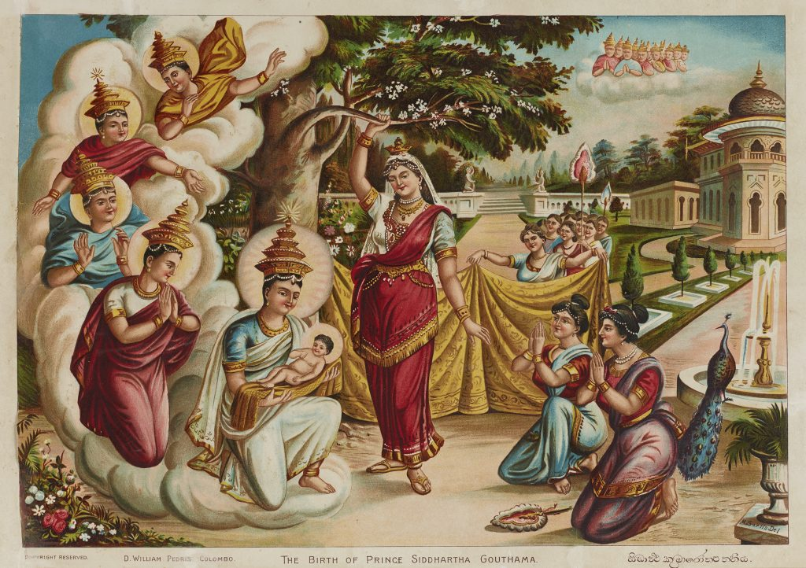
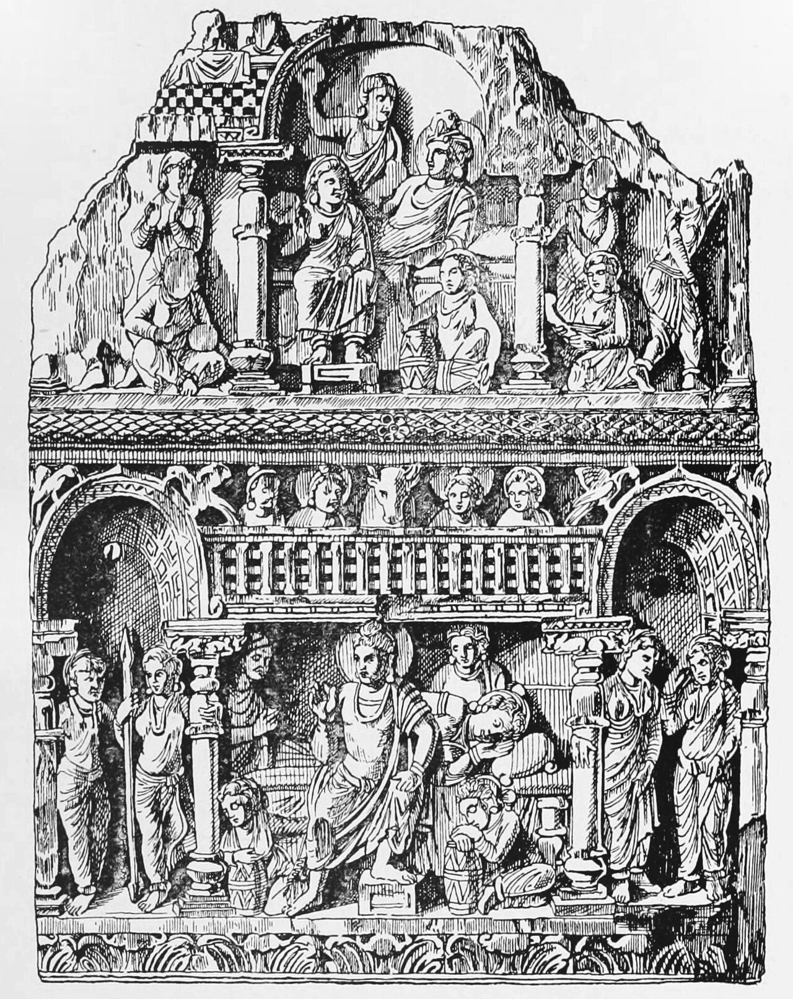

{width=85% fig-align="center"}

清晨的迦毗罗卫城，城门缓缓开启。

车轮驶过平整的道路，年轻的太子第一次认真望向王宫之外的世界。那里没有宫廷里的歌舞，也没有为他精心布置的花园。他看到一个白发苍苍、弯腰驼背的老人，步履迟缓，仿佛每向前迈出一步，都要用尽全身的力气。

太子问身边的人：“他为什么会变成这样？”

侍从回答：“因为他老了。”

太子又问：“只是他会老，还是所有人都会老？”

侍从说：“所有人都不能免。”

后来，他又看见病人、死者和出家修行的沙门。

这就是佛教史上著名的“四门出游”。

故事中的年轻人，后来被世人称为释迦牟尼佛。但在那一刻，他还不是佛，只是一个突然发现人生并不像王宫里看起来那样安稳的年轻人。

他第一次意识到：财富可以买来舒适，却买不来永远的青春；权力可以命令人群，却不能命令身体不衰老；亲情能够给人温暖，却无法保证彼此永不分离。

于是，一个问题在他心中生起：

**有没有一种道路，能使人从衰老、疾病与死亡的苦难中得到解脱？**

佛教，正是从这个问题开始的。

---

## 一、佛陀诞生在怎样的时代？

释迦牟尼生活的年代，学界一般推定在公元前五世纪前后。他出生于释迦族，活动区域大致位于今天印度与尼泊尔交界一带。佛教传统称他的父亲为净饭王，称他为“悉达多太子”；从现代历史研究来看，释迦族更可能是一个由贵族家族共同治理的小型部族政体，而不是拥有辽阔疆域的大帝国。因此，书中所说的“王子”，更接近部族首领或显贵家族之子。

不过，无论是宏伟王宫中的王子，还是小国贵族家庭中的青年，有一点大体可以确定：他出生于一个生活优裕、拥有一定社会地位的家庭。他并不是因为贫困而离家，也不是因为在人生竞争中失败才选择修行。恰恰相反，他所放下的，正是当时许多人梦寐以求的生活。

这使他的出走显得更加耐人寻味。

当时的印度，正处在思想活跃而剧烈变动的时代。

在传统的婆罗门文化中，《吠陀》被视为具有神圣权威，祭祀由婆罗门祭司主持，社会身份也常以出生的族类来划分。印顺法师曾将婆罗门传统的主要特征概括为“吠陀天启、婆罗门至上、祭祀万能”。但在恒河流域的东方地区，人们对这些传统权威并非全盘接受，新的政治力量、新的生活方式和新的思想不断出现。

在婆罗门传统之外，还有一群被称为“沙门”的修行者。

“沙门”并不是佛教僧人的专称。早期印度那些离开家庭、过着游行乞食生活、通过苦行、禅定或哲学思辨寻求解脱的人，都可以被称为沙门。佛教、耆那教以及许多后来消失的思想派别，都产生于这股沙门思潮之中。

有人认为命运由过去的行为决定，有人主张极端苦行可以洗净罪业；有人相信灵魂永恒，有人否认死后世界；也有人认为，人生既没有目的，善恶也没有真正的果报。

各种思想彼此争论，都试图回答同一个问题：

**人为什么受苦？人能不能从生老病死之中获得解脱？**

悉达多太子的出家，并不是在一个没有宗教思想的世界中突然发生的奇迹。他进入的，正是这个已经持续许久的求道传统。

不同之处在于，他后来既未归入婆罗门的祭祀传统，也未停留于当时盛行的极端苦行，而是另辟蹊径——在放纵与禁欲之间，在永恒灵魂与彻底虚无之间，走出了一条被后世称为"中道"的新路。

---

## 二、王宫为什么留不住他？

后世佛传把悉达多的青年生活描绘得十分优越。

相传，他的父亲净饭王担心儿子出家，便尽力为他营造一个没有忧愁的世界。宫殿中四季舒适，园林里花木繁盛，年轻的侍从环绕左右。凡是衰老、疾病、死亡以及贫困的景象，都被有意挡在王宫之外。

净饭王希望儿子相信：人生就是青春、享乐、家庭和权力。

然而，一个被精心保护的世界，并不等于真实的世界。

佛教早期经典保存了许多佛陀说法和修行的内容，却没有留下一部从出生到涅槃的完整传记。今天人们熟悉的许多佛传故事，是在后来不同经典和传记中逐渐形成的。“四门出游”的完整故事，主要见于《过去现在因果经》《佛所行赞》《佛本行集经》等佛传文献。因此，我们不必把故事中的每一个细节——从哪一道城门出去、遇见的人是否由天神变化而成——都当作可以逐日核对的历史记录。

但是，这并不意味着故事没有价值。

佛传并不只是要告诉读者“某年某月发生了什么”，更是借由一个具体场景，表现佛陀为什么走上求道之路。

王宫象征着人们为自己营造的安全感；四门之外，则是真实而无法回避的人生。

每个人或许都有自己的“王宫”。

它可能是财富，可能是年轻，可能是一份稳定的工作，也可能是一个看似不会改变的家庭。我们知道世间存在衰老、疾病和死亡，却常常觉得那是别人的事，是很久以后才需要面对的事。

直到某一天，我们亲眼看到亲人病倒，看到熟悉的人突然离世，或者在镜子中发现自己已经不再年轻，王宫的城门才真正打开。

---

## 三、第一道门：每个人都会老

太子第一次出游时，看见一位老人。

《过去现在因果经》中的太子没有仅仅问：“这个人怎么了？”他更关心的是：“唯此人老？一切皆然？”

侍从回答：“一切皆悉应当如此。”

太子于是感叹：“老至如电，身安足恃！”

真正震动他的，不只是老人衰弱的样子，而是他突然发现：老人和自己并不是两类人。

老人不是一种与青年无关的特殊人群，而是青年继续生活下去以后可能成为的样子。

人在年轻时，很容易把青春当成自己的属性，仿佛“年轻”就是“我”。可是青春并不是一个可以永久拥有的东西。它依赖身体、饮食、环境和时间等许多条件，只能暂时存在。

佛教把这种不断变化、不能永远保持原状的性质称为“无常”。

无常并不只是说，一个杯子会打碎，一朵花会凋谢。它所指向的是：凡由各种条件形成的事物，都处在变化过程中。

身体如此，情绪如此，关系如此，社会地位也是如此。

我们并不是有一天突然开始衰老。从出生的那一刻起，身体便一直在变化。儿童变成少年，少年变成青年，青年又在不知不觉中走向中年和老年。因为变化缓慢，人们便误以为自己始终没有改变；等到改变明显时，又常常感到惊讶和抗拒。

太子看见老人时，看见的不只是生命的终点，也看见了生命每时每刻都在发生的变化。

---

## 四、第二道门：疾病不分贵贱

第二次出游，太子看见一个病人。

那人身体消瘦，呼吸急促，无法自在地站立行走。太子再次问道：只有这个人才会生病，还是所有人都有可能如此？

侍从回答：“一切人民，无有贵贱，同有此病。”

王子的身份可以使他得到更好的饮食和照料，却不能使他彻底免于疾病。

这对一个从小生活在保护之中的人来说，是一种更深的冲击。

我们平时常把身体当作理所当然的工具。眼睛可以看，双腿可以走，夜晚能够入睡，吃下的食物可以消化，这一切似乎不值得特别注意。只有身体出现问题时，人们才发现，许多平凡的能力原来都依赖复杂而脆弱的条件。

疾病让人看见身体并不完全服从我们的意志。

我们可以努力锻炼、注意饮食、接受治疗，却不能命令身体永远健康。承认这一点，并不是否定医疗和努力，而是放下“只要我足够谨慎，就能完全控制一切”的幻想。

佛教所说的“苦”，也由此显现出来。

这里的苦，不只是身体疼痛。它还包括一种更普遍的不安稳：我们依赖许多事物生活，却无法保证这些事物永远按照自己的愿望存在。

健康的时候，担心失去健康；得到喜爱之物以后，又害怕它发生变化。越想牢牢控制，内心反而越容易焦虑。

这就是“苦”的一层含义。

---

## 五、第三道门：死亡不是别人的事情

第三次出游时，太子看见一队送葬的人。

亲属围绕着死者哭泣，那个曾经能够说话、行走、欢笑的人，此刻再也不能回应他们。

太子仍然问了同样的问题：只是这个人会死，还是所有人最终都会如此？

侍从回答：“一切世人，皆应如此，无有贵贱而得免脱。”

衰老和疾病有时还能被拖延，死亡却是生命无法绕开的界限。

人们知道自己终有一死，却很少真正按照这一事实生活。我们制订多年的计划，为许多细小的得失争执，仿佛时间可以无限延长。死亡似乎是一个遥远的概念，直到它突然出现在身边。

佛教谈死亡，并不是为了制造恐惧。

恰恰相反，只有正视生命有限，人才能知道什么真正重要。

如果生命没有终点，我们或许永远不会珍惜一次见面，也不会急于说出道歉和感谢。正因为时间有限，人与人的相遇才显得珍贵；也正因为所有占有最终都要放下，我们才需要思考：除了不断获得和占有，人生是否还有更值得追求的东西？

太子看见死亡以后，无法再像从前那样回到歌舞之中。

他开始明白，即使有一天继承权力，拥有更多土地和财富，也无法解决这个根本问题。

倘若生老病死是每一个生命无从绕开的归宿，那人所苦心经营的幸福，是否只是一种精巧的遗忘——用短暂的明亮，遮住那始终在场的黑暗？

---

## 六、第四道门：在无常之中，有没有出路？

如果故事只停在老、病、死，佛教确实容易显得灰暗。

但太子还看见了第四个人。

那是一位沙门。他衣着朴素，没有财产，也没有宫廷中的显贵身份，神情却安静而从容。

在《佛所行赞》中，这位沙门说自己因为看见众生受老病死逼迫，所以“出家求解脱”。

这一次，太子看到的不再只是人生的问题，也看到了一种可能的方向。

沙门的形象告诉他：一个人可以不再用享乐遮蔽无常，也不必只是被动等待衰老和死亡。他可以主动观察生命，训练自己的心，寻找痛苦产生的原因以及止息痛苦的方法。

《过去现在因果经》用一句话概括了太子的感受：

“我先见有老病死苦……今见比丘，示解脱路。”

前三次出游使他看见人生的困境，第四次出游则使他相信，困境也许并非没有答案。

这正是“四门出游”故事最重要的结构。

老人、病人和死者并不代表佛教的全部。沙门的出现说明，佛教并不满足于告诉人们“人生很苦”，而是进一步追问：

苦从哪里产生？

人为什么明知一切会变，仍然执着它永远不变？

当外在事物不能完全由我们控制时，内心是否可以获得某种自由？

这条道路是否能够被普通人学习和实践？

这些问题，后来成为佛陀一生教法的起点。

---

## 七、寂天菩萨的终极之问

公元八世纪，印度佛学家寂天菩萨在其所造《入菩萨行论》中写下这样两颂：

> 临终弥留际，众亲虽围绕，
> 命绝诸苦痛，唯吾一人受。
>
> 魔使来执时，亲朋有何益？
> 唯福能救护，然我未曾修。

这四句出自《入菩萨行论·忏悔罪业品》，在大乘修学传统中被视为警策世人的金言。

它所描绘的，是死亡来临那一刻最真实的景象：亲人的手可以握住你的手，却无法握住你的痛苦；爱你的人可以守在床边，却无法替你经历那场身心崩解。临终时四大分离之苦，是每一个人必须独自承担的。

寂天菩萨并非在渲染恐惧，而是在勘破一种幻觉：我们最依赖的那些东西，在最关键的关口，究竟能给予我们什么？

索达吉堪布在讲解这两颂时指出，此处"魔使"并非神话中的形象，而是业力成熟时死亡的自然显现。凡夫之所以在临终时感到极度怖畏，往往正是因为：一生之中，我们把精力尽数用于维护那些终将失去的事物——财富、地位、亲情的依傍——却疏于在内心建立真正堪能依靠的力量。"唯福能救护"，是说唯有平生所修的善业与正法，才是此刻真正能陪伴自己的东西。

观修死亡的目的，不是让人陷入绝望或虚无，而是借助对死亡的清醒认识，回过头来重新审视生命的轻重缓急。当一个人真正意识到"死时唯法有用"，他自然会减少对名利得失的执取，转而思考：在有限的时间里，什么样的生活才是值得过的？

---

## 八、佛教说"苦"，是不是盲目悲观？

有人听见佛教谈生老病死，便以为佛教只看到人生阴暗的一面。生活中明明有美食、爱情、亲情、艺术和成功，为什么佛教总是在说"苦"？

佛教并不否认快乐。

《杂阿含经》中，佛陀明确承认人生有三种感受：苦受、乐受、不苦不乐受。他从未说“世间没有快乐”，他所提醒的是：这些快乐都有条件，也都会变化。如果把暂时的快乐当作永远不会改变的保障，快乐本身便可能成为新的忧虑。

因此，“苦”并不是说人生每一秒都在疼痛，而是说：凡是依赖条件的事物，都不足以提供永远不变、完全由自己掌控的满足。

这更接近一种诊断，而不是一种情绪。

佛陀曾以医者自比。《增一阿含经》中有这样的表述：如来犹如良医，知病、知病因、知病愈、知治病之道。医生指出一个人患病，并不是因为医生悲观，而是因为只有看见病，才可能治疗。如果医生为了让病人开心，坚持说“一切都很好”，反而是不负责任。

同样，佛教谈苦，是为了寻找苦的原因和止息之道。

这正是四圣谛的内在逻辑：苦谛指出苦的存在，集谛追问苦的原因，灭谛确认苦是可以止息的，道谛则指出通往止息的道路。

> 此苦圣谛，当知；此苦集圣谛，当断；此苦灭圣谛，当证；此苦灭道圣谛，当修。
>
> ——《转法轮经》（佛陀初转法轮时的教导）

四圣谛的结构，不是一篇绝望宣言，而是一份完整的问题与解答：既诊断，也开方。

佛教不是从“人生有苦”得出“人生没有希望”，而是从“人生有苦”继续追问“苦能否止息”。

悲观的人看见黑暗，便认为没有出路；盲目乐观的人拒绝承认黑暗；佛教所采取的态度，是看清黑暗，同时寻找可以走出去的道路。

所以，佛教既不是悲观，也不是用美好想象掩盖现实。

它更接近一种清醒的希望。

---

## 九、一个王子为什么离开王宫？

现在，我们可以回到本章最初的问题。

悉达多为什么离开王宫？

不是因为王宫里没有快乐，也不是因为他憎恨自己的家人。

按照佛教传统的解释，他所面对的是一个无法由个人幸福解决的问题：即使自己能够暂时生活安乐，父母、妻子、孩子以及世间所有人，仍然无法避免老、病、死。

从现代人的家庭伦理来看，一个人在妻儿尚在时离家求道，难免令人感到不解，甚至不安。我们不必假装这种张力不存在。佛传对这一选择的解释是：悉达多并非为了逃避生活，而是试图寻找一种超越个人和家庭范围的解脱之道。后来佛教也把他的出家理解为从对少数亲人的爱，走向对一切众生的慈悲。

这种解释是否能够完全消除现代读者的疑问，可以继续讨论。

但至少有一点值得注意：悉达多并没有在离开以后寻找另一种享乐。他先后跟随老师学习禅定，又经历多年极端苦行，几乎付出了生命。直到后来，他才发现纵欲不能带来自由，自我折磨同样不能带来自由。

因此，他的离开不是故事的答案，只是求道的开始。

四门之外，他看见了人生的真相；王宫之内，他无法找到解决的方法。于是，他选择亲自去寻找。

当时的他并不知道，自己是否真的能够成功。

他只是无法再假装没有看见。

这也许正是释迦牟尼最初打动人的地方。他不是生来便坐在莲花座上的神明，而是一个看见人生困境以后，不愿继续逃避的人。

佛教从一个人的觉悟开始。

而觉悟的第一步，不是看见神迹，也不是获得某种神秘力量。

只是诚实地承认：

我会衰老。

我可能生病。

我终有一天会死。

我所爱的人，也不能永远陪伴我。

但在这一切之中，我是否能够学会不被恐惧支配？是否能够活得更加清醒、慈悲而自由？

带着这个问题，悉达多走出了王宫。

在下一章中，他将进入森林，拜访当时著名的修行者，尝试严酷的苦行，并最终发现：通向觉悟的道路，既不在纵情享乐的一端，也不在折磨身体的另一端。

那条道路，后来被称为“中道”。

---

## 佛教常识：悉达多、释迦牟尼和佛陀是同一个人吗？

传统上，这三个名称指向同一个人，但含义不同。

**悉达多**，是佛传中太子的名字，常被解释为“目的已经达成”或“一切义成”。

**乔达摩**，是他的族姓或氏族名称，因此也常称“乔达摩·悉达多”。

**释迦牟尼**，意思是“释迦族的圣者”。“牟尼”有沉默者、圣者之意。

**佛陀**不是姓名，而是称号，意思是“觉悟者”。悉达多在菩提树下成道以后，才被称为佛陀。

因此，在出家和成道以前，本书主要称他为“悉达多太子”；成道以后，则称“释迦牟尼佛”或“佛陀”。

---

## 经典原文选读

> “诸行无常，是生灭法；生灭灭已，寂灭为乐。”
> ——《大般涅槃经》

这里的“行”，泛指由各种条件形成、处在迁流变化中的事物。“诸行无常”并不是说一切都不存在，而是说一切有条件的存在都不能永远保持原状。

无常使人失去，也使新的可能得以发生。理解无常的目的，不是增加悲伤，而是不再把短暂之物误认为永恒。

{width=80% fig-align="center"}
