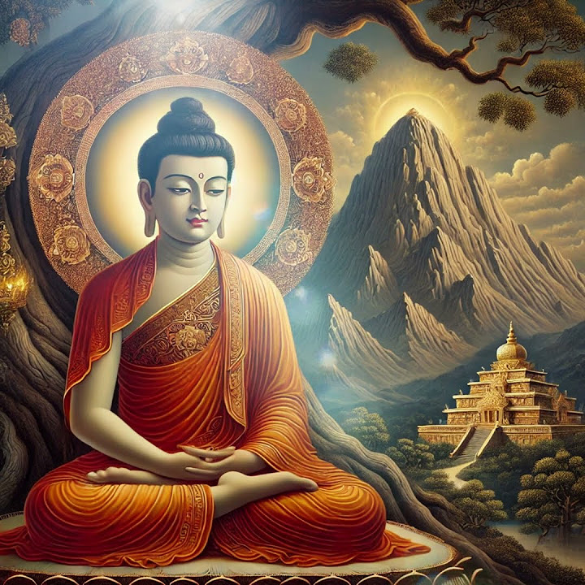

{width=85% fig-align="center"}

## 从苦行到觉悟

夜色沉入尼连禅河畔。

一棵枝叶舒展的毕钵罗树下，一个消瘦的修行者结跏而坐。远处的村落渐渐安静，河水在黑暗中缓缓流过。没有王宫里的乐声，没有侍从，也没有曾经追随他的五位苦行伙伴。此时的悉达多，只剩下一具刚刚从极度虚弱中恢复的身体，以及一个仍未得到答案的问题：

人为什么会老、会病、会死？为什么明知一切终将失去，人仍会执着、恐惧、彼此伤害？这一切痛苦，究竟从哪里生起？有没有可能真正止息？

佛教传统认为，悉达多就是在这棵树下彻底觉悟，从此被称为“佛陀”——觉悟的人。这个地方后来被称为菩提伽耶，今天的摩诃菩提寺便坐落于此；寺院旁的菩提树，相传由当年那棵树的枝条扦插重植而来。

然而，菩提树下的觉悟并不是凭空发生的。

在这一个夜晚之前，他已经走过一条漫长而几乎把自己逼到死亡边缘的道路。

## 一、苦行为什么没有带来答案？

离开王宫之后，悉达多曾先后向当时著名的修行者求学。

早期经典记载，他学习并进入了极深的禅定境界。当他的老师认为他已经达到与自己相同的成就，甚至邀请他共同教导弟子时，悉达多却没有留下。

因为他发现，即使进入非常宁静、非常微细的禅定，老病死的问题仍没有从根本上解决。禅定可以使心暂时平静，却不等于烦恼已经永远止息。一旦从定中出来，生命依旧受无常支配，贪爱与执着仍有可能重新生起。

于是，他转向当时另一条广受尊敬的道路——苦行。

在古印度的沙门传统中，不少修行者相信，人的精神被肉体和欲望束缚。只要严厉折磨身体，削弱感官，烧尽过去所造的业，就有可能使灵魂获得自由。悉达多将这种修行推到了极致。

经典中描述，他曾长时间屏住呼吸，忍受剧烈痛苦；又把食物减少到极少，身体因此瘦弱得几乎不成人形。腹部紧贴脊背，四肢如同枯藤，眼窝深陷，皮肤失去光泽。人们远远看见他，甚至分辨不出他究竟是活着还是已经死去。

可是，身体越虚弱，智慧并没有因此变得更加清明。

他终于意识到：如果享乐不能使人解脱，那么折磨自己同样不能。把身体看成敌人，用痛苦惩罚身体，并没有触及无明与贪爱的根源。极端苦行带来的，可能只是另一种执着——执着于“我比别人更能忍受”“我修得比别人更苦”，甚至把痛苦本身误认为清净。

早期经典以佛陀自述的方式保存了这一段经历：他尝试过当时最严厉的苦行，却发现这条路不能导向最终的觉悟，于是重新进食，使身体恢复力量，转向一种既不沉溺欲乐，也不摧残身心的修行道路。

这不是退缩，而是一次极其困难的承认：

曾经坚信的道路，可能是错的。

真正的求道者，不是无论如何都要证明自己正确，而是在发现错误时，有勇气放下已经付出的时间、名声和痛苦，重新开始。

## 二、一碗乳糜：放弃的不是修行，而是执着

后世佛传用一个温暖的故事，表现悉达多生命中的这一转折。

尼连禅河附近的一位女子，看见虚弱的悉达多，向他供养了一碗乳糜。不同佛传对供养者的姓名和具体经过记载略有差异，但“一位女子供养乳糜，菩1. **无明** (*Avidyā*)：对生命“无常、因缘、无我”真相的无知与执着，是一切烦恼的源头。在日常中，表现为对事物的本质产生误判，误以为外物能带给自己恒常的满足。
2. **行** (*Saṃskāra*)（缘于 **无明** 而产生）：基于无明而产生的意志行为与造作（业），形成潜在的行为惯性。在日常中，表现为带着“我要得到它”的意图，开始在心中谋划并付出行动。
3. **识** (*Vijñāna*)（缘于 **行** 而产生）：分别与认知的精神主体（业识），在生死流转中携带业力惯性。在日常中，表现为行为留下的印记形成了惯性认知，潜意识里产生了自我分别的意识。
4. **名色** (*Nāmarūpa*)（缘于 **识** 而产生）：精神（名，如受、想、行）与物质（色，如肉体）的身心结合体。在日常中，表现为身心初步发育，精神世界与生理结构开始结合。
5. **六入** (*Ṣaḍāyatana*)（缘于 **名色** 而产生）：眼、耳、鼻、舌、身、意六种认识世界、接收信息的感官与思维器官。在日常中，表现为视觉、听觉等感官及思维器官发育成熟。
6. **触** (*Sparśa*)（缘于 **六入** 而产生）：感官（根）、外界（境）与心识（识）三者结合的接触。在日常中，表现为眼睛看见花朵、耳朵听到音乐、身体接触外界等感官活动。
7. **受** (*Vedanā*)（缘于 **触** 而产生）：接触外境后产生的身心感受（如痛苦的苦受、快乐的乐受、或平淡的不苦不乐受）。在日常中，表现为听到表扬感到喜悦，听到批评感到难受。
8. **爱** (*Tṛṣṇā*)（缘于 **受** 而产生）：对乐受产生的强烈贪爱与渴望，或对苦受产生的嗔恨与抗拒。在日常中，表现为极力想留住喜悦，极力想摆脱被批评的难受。
9. **取** (*Upādāna*)（缘于 **爱** 而产生）：由强烈的渴爱付诸实际行动，去追求、执着与占有。在日常中，表现为认定“我必须每次都得第一”、“他必须听我的”，开始在言行上抓取和占有。
10. **有** (*Bhava*)（缘于 **取** 而产生）：因执取造作而形成的生命存在状态，积聚了决定未来走向的业力潜能。在日常中，表现为执念在心中生根，形成了一种牢固的人格特质和行为惯性。
11. **生** (*Jāti*)（缘于 **有** 而产生）：新的生命形态在特定的生存环境下开始诞生。在日常中，表现为因业力惯性的牵引，在新的时空或状态中重新开始了一段身心历程。
12. **老死** (*Jarāmaraṇa*)（缘于 **生** 而产生）：凡生者必将经历的衰老、病痛、死亡以及忧悲苦恼。在日常中，表现为随着时间推移，一切拥有的事物、身体状态以及关系不可避免地走向变化与坏灭。

这些名词初看十分艰深，其实所说的仍是每个人都在经历的生命过程。是以清醒而坚定的心，面对自己生命中最深的疑问。

## 三、菩提树下：魔王究竟是谁？

就在悉达多即将觉悟的时候，佛传中的魔王波旬出现了。

在传统叙事中，波旬担心悉达多成佛之后，众生将不再受欲望和死亡支配，于是率领魔军来到菩提树下。有的经典描述风暴、兵器和恐怖的魔众，有的佛传又说魔王派遣女儿，以美色和欲乐动摇他的心。

魔王质问悉达多：你凭什么坐在这里？谁能证明你有资格获得觉悟？

悉达多没有争辩，只是伸出右手，触摸大地。

大地于是为他过去无数的善行与修持作证。魔军溃散，波旬退去。这便是佛像中常见的“触地印”，也称“降魔印”。佛传典籍长期保存并发展了菩提树下降伏魔军的故事。

这个故事应当怎样理解？

从佛教传统的信仰世界来看，波旬是欲界之魔，是阻碍众生出离生死的力量。但从修行的角度看，魔王也可以被理解为人心中的贪欲、恐惧、怀疑、傲慢与自我执着。

魔军不一定总以可怕的面目出现。

它有时是一个诱人的念头：“只要得到更多，你就会安心。”

有时是一种恐惧：“放下这些，你将一无所有。”

有时是一种自我怀疑：“别人都做不到，你又凭什么能够做到？”

有时甚至是修行者自己的骄傲：“我已经比别人清净，我已经接近圣人。”

这些力量共同守护着我们熟悉的旧生活。即使那个生活充满烦恼，人也常常宁愿留在熟悉的痛苦里，而不愿走向未知的自由。

因此，降魔并不只是战胜外面的敌人。更深的降魔，是看清心中的欲望与恐惧，却不再跟随它们。

悉达多没有拿起武器与魔王搏斗，也没有请求更强大的神灵保护自己。他只是保持觉察，不逃避，也不被动摇。

魔境依旧出现，心却不再被魔境牵走。

## 四、佛陀“看见”的，是缘起

那么，在那个漫长的夜晚，悉达多究竟看见了什么？

经典对此有不同的表达。

《大萨遮迦经》等早期经典以“三明”说明成道的过程：他在初夜忆念过去的生命；中夜观察众生随自己的行为而流转；后夜则彻底明白烦恼如何生起，并断尽使生命继续流转的根本烦恼。

《阿含经》中的许多经文，则以“缘起”来说明佛陀所觉悟的真理。

所谓缘起，就是：

> 此有故彼有，此生故彼生；此无故彼无，此灭故彼灭。

这几句话看似简单，却是理解佛教的一把钥匙。

它的意思是：任何事物都不是孤立产生的。某些条件存在，某种现象便随之生起；当这些条件改变或消失，相应的现象也会改变或止息。《杂阿含经》以这组公式说明无明、行为、认识、贪爱、执取、生与老死之间的相互关系。

佛陀没有在菩提树下发现一位安排众生命运的主宰，也不是得到一句只能由他掌握的神秘咒语。他所觉悟的，是生命依条件而生起的规律。

《杂阿含经》甚至说，无论佛陀是否出现在世间，缘起的法则本来如此；如来只是自己觉悟了这一规律，再将它开示出来。

这就像在黑暗的房间里点亮一盏灯。

灯没有创造桌椅，也没有改变房间，只是让原本存在却看不清的事物显现出来。佛陀的觉悟，也不是创造一种新的宇宙秩序，而是如实看见生命本来的运行方式。

我们通常认为，自己的痛苦是某一个人、某一件事单独造成的。

考试失败，所以痛苦；失去工作，所以痛苦；别人不理解自己，所以痛苦；身体衰老，所以痛苦。

佛陀所看见的却更深一层。

同一件事情发生在不同的人身上，痛苦的程度并不相同。因为事情只是条件之一，在事情之外，还有我们的期待、记忆、判断、习惯、欲望和执着。外在事件与内在反应相互结合，才形成完整的苦。

一句批评传入耳中，只是“接触”；心里觉得不舒服，是“感受”；希望这种不舒服马上消失，或希望对方承认错误，是“爱”；认定“他在侮辱我”“我绝不能输”，是“取”。随着执取不断加深，愤怒、争吵与新的伤害便继续产生。

痛苦并不是无缘无故出现的。

它有形成的条件。

也正因为它由条件形成，所以它并非永远不能改变。

## 五、十二因缘：苦是怎样一环扣一环的？

佛教常用十二个环节说明生命流转与痛苦形成的过程，这就是“十二因缘”：

1. **无明** (*Avidya*, 无明)：对生命「无常、因缘、无我」真相的无知与执着，是一切烦恼的源头。在日常中，表现为对事物的本质产生误判，误以为外物能带给自己恒常的满足。
2. **行** (*Samskara*)（缘于**无明**而产生）：基于无明而产生的意志行为与造作（业），形成潜在的行为惯性。在日常中，表现为带着「我要得到它」的意图，开始在心中谋划并付出行动。
3. **识** (*Vijnana*)（缘于**行**而产生）：分别与认知的精神主体（业识），在生死流转中携带业力惯性。在日常中，表现为行为留下的印记形成了惯性认知，潜意识里产生了自我分别的意识。
4. **名色** (*Namarupa*)（缘于**识**而产生）：精神（名，如受、想、行）与物质（色，如肉体）的身心结合体。在日常中，表现为身心初步发育，精神世界与生理结构开始结合。
5. **六入** (*Sadayatana*)（缘于**名色**而产生）：眼、耳、鼻、舌、身、意六种认识世界、接收信息的感官与思维器官。在日常中，表现为视觉、听觉等感官及思维器官发育成熟。
6. **触** (*Sparsa*)（缘于**六入**而产生）：感官（根）、外界（境）与心识（识）三者结合的接触。在日常中，表现为眼睛看见花朵、耳朵听到音乐、身体接触外界等感官活动。
7. **受** (*Vedana*)（缘于**触**而产生）：接触外境后产生的身心感受（苦受、乐受或不苦不乐受）。在日常中，表现为听到表扬感到喜悦（乐受），听到批评感到难受（苦受）。
8. **爱** (*Trsna*)（缘于**受**而产生）：对乐受产生的强烈贪爱与渴望，或对苦受产生的嗔恨与抗拒。在日常中，表现为极力想留住喜悦，极力想摆脱被批评的难受。
9. **取** (*Upadana*)（缘于**爱**而产生）：由强烈的渴爱付诸实际行动，去追求、执着与占有。在日常中，表现为认定「我必须每次都得第一」、「他必须听我的」，开始在言行上抓取和占有。
10. **有** (*Bhava*)（缘于**取**而产生）：因执取造作而形成的生命存在状态，积聚了决定未来走向的业力潜能。在日常中，表现为执念在心中生根，形成了一种牢固的人格特质和行为惯性。
11. **生** (*Jati*)（缘于**有**而产生）：新的生命形态在特定的生存环境下开始诞生。在日常中，表现为因业力惯性的牵引，在新的时空或状态中重新开始了一段身心历程。
12. **老死** (*Jaramarana*)（缘于**生**而产生）：凡生者必将经历的衰老、病痛、死亡以及忧悲苦恼。在日常中，表现为随着时间推移，一切拥有的事物、身体状态以及关系不可避免地走向变化与坏灭。

十二因缘在传统佛教中常被用来说明过去、现在、未来三世的生命流转，也可以帮助我们观察当下一个烦恼如何形成。本书此处先从日常心念入手，并不是要取消因果轮回的传统解释，而是让普通读者先看见：缘起并非遥远的理论，它每一天都在我们的感受、欲望和选择中发生。

例如，一个人看到朋友取得成功。

最初只是眼睛看见一条消息，这是接触；心中产生不舒服的感觉，这是受；希望自己也得到同样的荣誉，这是爱；认定“我不能比他差”，这是取；接下来不断比较、嫉妒，甚至贬低对方，便形成新的言语与行为。

如果没有觉察，这条链条会迅速运转，我们便以为：“我就是很生气”“我天生爱嫉妒。”

但在觉察中，我们能够看见：愤怒和嫉妒不是一个固定不变的“我”，而是许多条件暂时组合的结果。

条件形成，它便生起；条件改变，它也能够止息。

这正是缘起教法最重要的希望。

缘起不是宿命论。

宿命论说，一切早已注定，人无能为力；缘起则说，一切依条件而形成，因此人的理解、选择和行动，本身也是能够改变结果的重要条件。

## 六、觉悟是不是一种神秘体验？

说到佛陀成道，人们很容易把“觉悟”想象成一种耀眼而神奇的体验。

仿佛在某个瞬间，天空放光，大地震动，修行者突然得到宇宙全部秘密，从此拥有无所不能的力量。

佛教经典中确实有光明、震动、天人赞叹等庄严描写。这些叙事表达了佛陀觉悟在宗教传统中的伟大意义，不必草率地将它们贬低为虚构。但如果只关注这些奇异景象，也可能错过觉悟最重要的内容。

觉悟之所以称为“觉”，就像一个人从梦中醒来。

梦里的人会把梦境当真，为得到而欢喜，为失去而恐惧；醒来之后，才发现自己过去一直被错误的认识支配。

佛陀所醒来的“大梦”，正是众生对自我和世界的执着。

我们把不断变化的身体看成永远属于“我”；把因缘聚合的关系看成绝不会改变；把暂时的快乐当成永久的依靠；又把一时的失败看成整个生命的结论。

觉悟并不是进入一个与现实隔绝的神秘世界，而是比过去更加清楚地看见现实。

看见无常，却不因此绝望；看见痛苦，却不再逃避；看见一切依条件生起，也就知道可以从条件入手，使痛苦逐渐止息。

印顺法师说：“佛法是理智的宗教，不仅是信仰的。”佛教当然重视亲身体验，但这种体验并不排斥观察、理解和检验。真正的智慧不是一阵令人陶醉的感觉，而是对生命产生持久的改变：贪欲是否减少，嗔恨是否减轻，面对得失时是否更加清醒，对其他生命是否生起更多慈悲。

有些特殊体验可能令人感动，却不一定代表觉悟。

看见光影、听到声音、感到身体消失，甚至进入极深的宁静，都可能只是禅修过程中的身心现象。悉达多自己早已达到很深的禅定，却没有把禅定境界当作最终解脱。

判断觉悟的标准，不在于体验有多奇异，而在于无明与执着是否真正被照破。

## 七、天亮以后，一个“佛陀”出现了

黎明将近，黑暗渐渐退去。

坐在树下的悉达多，仍然是那个出生于释迦族、曾经离开王宫、经历多年求道的人。但从这一刻起，他又不再只是从前的悉达多。

“佛陀”不是他的姓名，而是对觉悟者的称呼。

他已经看清：生命的痛苦并非来自某个不可改变的诅咒，而是由无明、贪爱和执取等条件不断推动；当这些条件止息，痛苦的相续也能够止息。

他找到了自己多年追寻的答案。

然而，一个新的问题随之出现。

如此深细的道理，人们能够听懂吗？

世人习惯追逐欲望，也习惯把自己相信的一切当成真实。缘起之法不顺从人的贪求，也不满足人对简单答案的期待。佛陀一度倾向于保持沉默，因为他所觉悟的法甚深、难见，不容易用语言表达。

但如果他始终坐在菩提树下，佛教便不会出现。

最终，他还是决定起身，走向人群。

他想起了曾经陪伴自己苦行的五个人。虽然他们误以为他已经放弃修行，但他们认真求道，也许最有可能理解这条新发现的道路。

于是，佛陀离开菩提树，向鹿野苑走去。

在那里，他将第一次公开讲说自己所觉悟的道理。

佛教的第一次法轮，即将转动。
