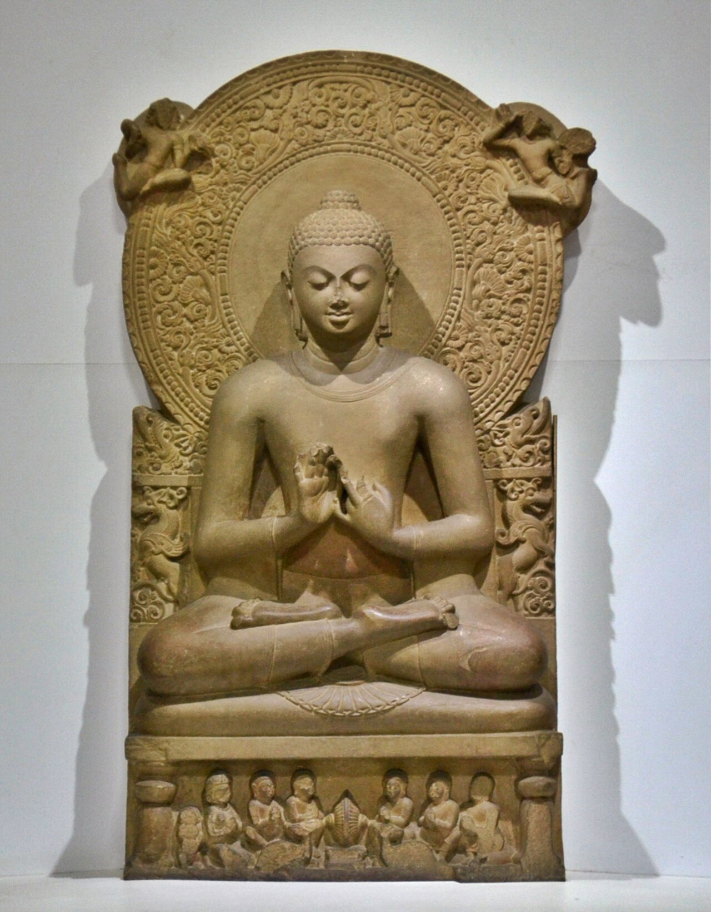
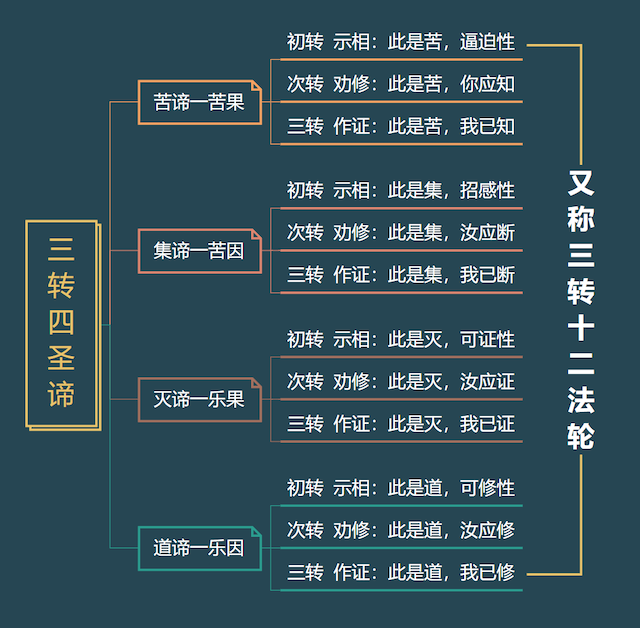

{width=80% fig-align="center"}

菩提树下的觉悟，最初只是一个人的觉悟。如果释迦牟尼佛选择沉默，那么世间或许只会多一位远离烦恼的圣者，却不会由此产生延续两千多年的佛教。佛法真正进入人间，是从佛陀离开菩提树，走向愿意倾听的人开始的。他首先想到的，是过去曾经教导过自己的两位禅定老师。然而依照佛教经典的记载，两人都已经去世。随后，他想起了曾陪伴自己苦行的五位修行者：憍陈如、跋提、跋波、摩诃男和阿说示。不同汉译中的人名写法略有差异，但基本对应同一组五人。他们当时住在波罗奈附近的鹿野苑。

于是，佛陀起身上路。这一次，他不再寻找老师，而是准备成为别人的老师；不再追问谁能告诉自己真理，而是准备把自己亲证的道路告诉世人。

## 一、五位旧友为什么不愿迎接佛陀？

鹿野苑位于古代波罗奈附近。波罗奈是当时印度北方的重要城市，而鹿野苑是一片较为清静的林地，鹿群在这里活动，也有许多出家修行者居住。后来佛教传统常把这里称作“仙人住处鹿野苑”或“仙人堕处鹿野苑”。五位修行者曾经陪伴悉达多太子修习苦行。他们亲眼见过他每日只吃极少食物，见过他的身体日渐消瘦，也相信只有把身体逼到极限，才能战胜欲望、获得解脱。可是后来，悉达多接受了食物，恢复体力，放弃了极端苦行。

在五人看来，这不是找到了新道路，而是退缩了。经典记载，当他们远远看见佛陀走来时，曾彼此约定：这个人已经放弃精进、重新贪图安逸，不必起身迎接，也不必替他接取衣钵。可是当佛陀真正走到面前时，他们原先的约定却没有完全坚持下去：有人起身，有人接过衣钵，有人为他安置座位。

这是一个很有意味的场景。五个人并不是第一次见到悉达多。他们熟悉他的声音、性格和过去，也正因为熟悉，才更加怀疑：一个曾经放弃苦行的人，凭什么宣称自己已经找到解脱之道？佛陀没有要求他们因为自己的身份而相信，也没有诉诸神迹迫使他们屈服。他只是告诉他们：自己并不是因为贪图享受才离开苦行，而是已经发现，极端苦行同样不能使人觉悟。

随后，他开始讲述自己所发现的道路。佛教传统把这次说法称为初转法轮。“转法轮”不是说真的有一个轮子在林中转动。轮，意味着一种具有力量、能够前进的事物；法轮转动，意味着觉悟不再只停留在佛陀心中，而是被说出、被听见，并开始在人间传播。经典称这是一种无人能够使之倒转的法轮。

## 二、佛陀说的第一件事：不要走向两个极端

佛陀面对五比丘，首先没有谈宇宙从哪里来，也没有解释世界由谁创造。他从修行者切身经历过的两个极端说起。一个极端，是沉迷欲望和感官享受，把快乐建立在不断获得、占有和刺激之上；另一个极端，是折磨身体，认为痛苦本身能够净化心灵。佛陀指出，这两条路都不能带来真正的解脱。

前者使人越来越依赖外在满足：得到时害怕失去，得不到时焦躁不安，即使暂时满足，也会迅速产生新的欲求。后者则误以为身体越痛苦，心就越清净，却可能使人衰弱、执著，甚至把忍受痛苦本身当成修行成就。**《佛说转法轮经》**用一句很简洁的话概括佛陀的发现：

“从两边度，自致泥洹。”也就是说，超越两个极端，才可能走向涅槃。这条既不纵欲、也不自我折磨的道路，就是中道。但中道不是在享乐与苦行之间取一个算术平均数，也不是凡事各退一步、谁也不得罪。它不是“稍微贪一点，也稍微苦一点”，而是看清两种极端为什么都不能解决问题，然后找到真正有效的道路。

佛陀紧接着说明：中道并不是一句抽象口号，它有非常明确的内容，就是八正道——正见、正思惟、正语、正业、正命、正精进、正念和正定。早期经典把它称为能够通向寂静、觉悟与涅槃的道路。由此可见，中道并不意味着漫无原则地折中。它是一条有方向、有方法、也需要实践的道路。

## 三、四圣谛：佛教最基本的问题结构

讲明中道以后，佛陀进一步说出了四圣谛：

苦、集、灭、道。在汉译**《杂阿含经》**《佛说转法轮经》《佛说三转法轮经》以及巴利语《转法轮经》中，都保存了这一说法的相近版本。各部经典的文字和叙事细节并不完全相同，但中道、八正道与四圣谛构成了初转法轮的稳定核心。“圣谛”的“谛”，是真实、真相的意思；“圣”，不是说它只属于少数神圣人物，而是说，这是觉悟者如实看见的真相，也是人可以通过修行亲自验证的真相。

四圣谛并不是四条彼此孤立的教义，而是一个完整的问题解决过程：

苦谛，说明问题是什么；
集谛，寻找问题从哪里产生；
灭谛，说明问题能不能真正止息；
道谛，指出止息问题的具体方法。古代佛教论典常用医生治病来说明四圣谛。**《瑜伽师地论》**说：

“譬如重病、病因、病愈、良药。”苦，如同病症；集，是致病的原因；灭，是疾病痊愈；道，则是治疗的方法。这也显示出佛陀说法的一个重要特点：他不是先要求人接受一套关于世界的信念，而是先请人观察自己的生命。你是否经历过不满、焦虑、衰老、失去与分离？

这些苦恼从哪里来？它们是否可能止息？如果能够止息，又该如何生活和训练自己的心？佛教就是从这些问题展开的。

## 四、苦谛：承认人生有不能回避的缺憾

四圣谛的第一项是苦谛。一听到“人生是苦”，很多人会立即觉得：佛教是不是把人生说得太灰暗了？生活中明明有亲情、有爱情、有成功、有美食，也有许多值得珍惜的快乐，为什么要说苦？这种疑问非常自然。佛教所说的“苦”，并不等于否认人生中一切快乐，也不是说人每时每刻都在疼痛。它所揭示的，是生命中存在一种无法依靠外在事物彻底消除的不圆满。

初转法轮的经典列举了生、老、病、死，也列举了怨憎会、爱别离、求不得，最后归结为“五取蕴苦”。生，并不是说婴儿出生本身有罪，而是有生便意味着进入一个会变化、会衰老、会受伤的生命过程。老，并不只是头发变白。它还意味着体力下降、记忆衰退，以及逐渐失去过去能够支配的身体。

病，使人突然发现，平日最熟悉的身体也并不完全听从自己。死，则把一切尚未完成的计划、关系和身份置于终结面前。除此之外，还有更日常的苦：

不喜欢的人偏偏经常遇到，是怨憎会；
所爱的人终究会分离，是爱别离；
付出许多却未必得到，是求不得。即使一切暂时顺利，人也常常无法真正安心。拥有财富，会担心失去财富；获得地位，会担心被人取代；得到感情，会担心关系改变。快乐并不是不存在，而是不能永远按照我们的愿望停留。

因此，佛教说苦，不是为了把人推向绝望，而是拒绝用短暂的快乐遮盖生命的真实处境。一个医生指出病情，并不是悲观；隐瞒病情，才可能使人失去治疗的机会。同样，佛陀谈苦，不是宣布人生毫无希望，而是说：只有承认苦，才有可能寻找苦的原因；只有看清问题，改变才真正开始。

## 五、集谛：真正束缚人的，是内心不断抓取

苦从哪里来？很多人首先想到外在条件：因为钱不够，因为别人不理解，因为环境不公平，因为身体不好。这些当然都可能成为痛苦的条件。佛教并不否认贫穷、疾病、暴力和不公会给人造成真实伤害。但佛陀进一步追问：为什么有些痛苦在事情结束以后，仍然长久地留在心中？为什么拥有很多的人仍然焦虑？为什么一个欲望满足以后，新的欲望又立刻出现？

在集谛中，佛陀指出，苦的重要根源是“爱”，更准确地说，是渴爱。这里的“爱”并不是通常所说的关怀、慈爱或亲情，而是一种强烈的抓取：

一定要得到；
一定不能失去；
事情必须照我的想法发生；
别人必须按照我的期待回应；
我必须永远维持某种身份和形象。经典把渴爱概括为欲爱、有爱和无有爱。欲爱，是对感官享受和外在满足的不断追逐。有爱，是执著于“我要成为怎样的人”“我要永远保持怎样的状态”，希望自我与拥有的一切固定不变。

无有爱，则是对不喜欢的经验产生强烈排斥，希望它彻底消失，甚至希望通过毁掉一切来逃离痛苦。渴爱的共同特点，是不能接受现实处在变化之中。我们希望喜欢的人永远不变，希望身体永远健康，希望拥有的东西永远属于自己，希望别人永远认可自己。然而一切因缘形成的事物都在变化。当变化发生时，执著便与现实发生冲突，苦也由此产生。

这并不是说人不能有愿望。想改善生活、照顾家人、完成事业，本身并不必然是烦恼。关键在于：愿望背后是否伴随着僵硬的抓取——如果事情没有如愿，我是否就彻底否定自己？如果别人离开，我是否认为人生从此失去全部意义？佛教不是要求人停止生活，而是帮助人看清：愿望可以引导行动，执著却可能把人捆绑在结果上。

## 六、灭谛：苦并不是不可改变的命运

如果佛教只讲苦和苦因，它确实可能成为一种悲观主义。但四圣谛并没有停在集谛。第三项是灭谛。佛陀说，渴爱可以被看见，也可以被放下；执著可以减弱，苦因可以止息。经典把苦灭描述为渴爱的离贪、止息、舍弃与解脱。这里的“灭”，不是把身体消灭，也不是让一个人变得麻木、冷漠、什么都不在乎。

真正止息的，是贪欲对人的奴役，是瞋恨对心的灼烧，是无明造成的颠倒认识。一个人仍然可以爱家人，但不再把家人当成自己的所有物；仍然可以努力工作，但不再把成败当作自我价值的全部；仍然会经历衰老与疾病，却不再因为“这一切不应该发生在我身上”而产生第二重折磨。

外在世界未必立刻改变，人与世界的关系却发生了根本变化。佛教把这种贪、瞋、痴止息后的自在称为涅槃。涅槃不是一个死后才能到达的神秘地方。至少从修行的意义上说，每一次不再被贪欲牵着走，每一次瞋恨升起而没有继续伤害别人，每一次在变化中放下控制，都是朝向苦灭迈出的一步。

灭谛的意义正在于：人并不注定永远成为情绪和欲望的囚徒。

## 七、道谛：知道方向以后，还要真正走路

知道有病，并不等于病已经痊愈；知道执著会带来痛苦，也不等于执著就会自动消失。因此，四圣谛的最后一项是道谛。道谛的内容，就是八正道：

> **正见、正思惟、正语、正业、正命、正精进、正念、正定**

这八项不是八条彼此无关的戒命，也不是完成一项以后才开始下一项。它们更像一个车轮的八根辐条，相互支撑，共同使生命朝着清醒与解脱的方向前进。印顺法师在**《成佛之道》**中指出，八正道可以归纳为戒、定、慧三学：正见与正思惟属于慧学；正语、正业、正命属于戒学；正念与正定属于定学；正精进则贯穿并推动整个修行过程。

### 1. 正见：先看清方向

正见不是固执地认为“只有我的观点正确”，而是对人生建立符合因果和四圣谛的认识。行为会产生结果；贪婪、伤害与欺骗会扰乱自己和他人的生命；一切事物都会变化；执著会带来苦，而苦也可以通过修行减轻和止息。没有正见，人越努力，可能离解脱越远。一个人如果认为幸福只等于占有，就会把全部精力用于争夺；如果认为发脾气才能显示力量，就会不断伤害关系；如果认为一切都是命中注定，就可能放弃改变。

正见，就是先校正人生的方向。

### 2. 正思惟：观察念头将把我们带向哪里

“思惟”在这里不只是思考知识，也包括内心的意向。一个念头升起时，可以问自己：

它来自贪欲，还是来自清醒？
它会增加敌意，还是减少敌意？
它会伤害自己和别人，还是带来理解？正思惟所培养的，是少欲、慈心与不伤害的倾向。它不是要求人永远不能出现负面念头，而是训练人在念头还没有转化为语言和行动以前，看见它、辨认它，不盲目跟随它。

### 3. 正语：语言也会制造因果

正语要求人远离虚假、挑拨、恶口和无意义的伤害性言论。一句谎言可能摧毁信任，一句挑拨可能破坏多年关系，一句在愤怒中说出的话，可能在别人心里停留很久。现代人的语言不仅发生在面对面的谈话中，也发生在短信、社交媒体和网络评论中。隔着屏幕，恶语似乎不必承担后果，但接收这些文字的仍然是真实的人。

修习正语，不只是“不说坏话”，还包括在开口以前问一句：这句话真实吗？有必要吗？适合在此刻说吗？能否用较少伤害的方式表达？

### 4. 正业：不要把自己的快乐建立在别人的痛苦上

正业主要规范身体行为，核心是减少杀害、掠夺和不正当的欲望行为。佛教并不把身体视为罪恶之源，而是强调：身体能够伤害，也能够保护；能够夺取，也能够布施；能够放纵欲望，也能够承担责任。正业的根本精神，是尊重生命、尊重他人的财物，也尊重关系中的信任与边界。

### 5. 正命：谋生方式也是修行的一部分

人必须生活，也往往必须通过工作获得收入。佛教并不反对财富，但会追问：财富是怎样获得的？一种职业是否建立在欺骗、伤害、剥削和他人的沉迷之上？正命提醒人，不能一边在寺庙里追求清净，一边在工作中肆意伤害别人。职业不只是赚钱的工具，也在日复一日地塑造一个人的习惯、价值和内心。

### 6. 正精进：不是逼迫自己，而是训练心的方向

正精进并不等于越疲惫越好，更不是重演佛陀已经放弃的极端苦行。它所强调的，是持续调整内心：

尚未生起的恶念，尽量不给它条件；
已经生起的恶念，学习使它减弱；
尚未生起的善法，创造条件使它生起；
已经生起的善法，努力使它保持和增长。这种精进并不激烈，却需要长久。改变一个习惯，往往不是靠一次强烈决心，而是在每一次选择中，少一点随顺烦恼，多一点清醒。

### 7. 正念：如实知道此刻正在发生什么

正念不是简单地放空大脑，也不只是让自己暂时放松。它是对身体、感受、心念和经验保持清楚的觉察。愤怒时，知道愤怒正在升起；焦虑时，知道身体正在紧绷；快乐时，也知道快乐正在变化。正念让人在经验与反应之间获得一点空间。没有正念，人往往在情绪出现以后立刻行动：一生气就攻击，一焦虑就逃避，一孤独就抓住某种刺激不放。有了觉察，人开始能够选择：我是否一定要跟随这个念头？

### 8. 正定：让散乱的心安定下来

正定，是培养稳定、集中而清明的心。日常的心常被各种声音牵引：过去的懊悔、未来的担忧、他人的评价、手机上的消息。心不停移动，看似想了很多，实际上很少真正看清一件事。禅定并不是逃离现实，而是使心获得足够的稳定，从而能够深入观察现实。水面不断摇动时，无法照见事物；水面渐渐平静，影像才会清楚。正定的作用，也正在于此。

## 八、四谛不是听懂一次就结束了

在初转法轮中，佛陀并不只是把苦、集、灭、道各说一遍。经典把佛陀对四圣谛的完整觉悟概括为三转十二行相。所谓三转，是对每一项圣谛有三个层次的认识：

第一，知道它是什么；
第二，知道应当怎样对待它；
第三，确认这项功课已经完成。以苦谛来说，不仅要知道“这是苦”，还要“如实遍知苦”，最后达到“苦已遍知”。对于集谛，是知道苦因、应当断除苦因，并且苦因已经断除。对于灭谛，是知道苦可以止息、应当亲自证得苦灭，并且已经证得。

{width=85% fig-align="center"}

正如知道药方与真正服药，是两件不同的事。

## 九、八正道是不是一种道德说教？

现代人对“正确地说话”“正确地行动”一类表达，容易产生警惕：这是否又是一套要求人服从的道德规范？八正道确实包含伦理要求，却不只是道德命令。它没有把人分成天生高贵者和天生有罪者，也不是某位神灵颁布的禁令。它所讨论的是行为与结果之间的关系。说谎为什么需要避免？因为说谎使信任破裂，也让说谎者长期生活在掩饰和恐惧中。

恶语为什么需要避免？因为恶语在伤害别人的同时，也不断强化自己心中的瞋恨。正念为什么需要培养？因为不能觉察内心的人，很容易被冲动支配。正定为什么重要？因为一颗持续散乱的心，很难看清苦及苦因。因此，八正道不是“你必须做一个听话的好人”，而是让人亲自观察：什么样的认识、语言、行动和心理习惯会增加苦，什么样的训练能够减少苦。

它不是为了迎合外在权威，而是为了获得内在自由。
自由也不是想做什么就做什么。一个完全被贪欲、愤怒和冲动支配的人，看起来可以随心所欲，实际上并不自由。他只是烦恼要他做什么，他便做什么。
佛教所说的自由，是在欲望升起时可以不被它拖走，在愤怒升起时可以不把它变成伤害，在环境变化时仍能保持清醒和选择。

> **看见了苦，是清醒的开始；  
> 了解苦因，是智慧的开始；  
> 相信苦可以止息，是希望的开始；  
> 真正走上八正道，则是修行的开始。**
