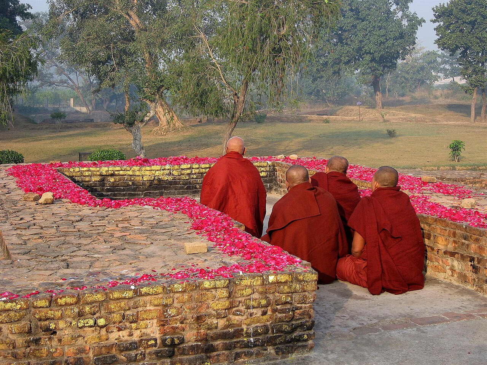

{width=80% fig-align="center"}

清晨的王舍城刚刚醒来。

城门打开，商贩开始摆放货物，行人往来于街巷。一位身披袈裟的比丘，手持钵器，安静地走在人群之中。他目不斜视，步履从容，既没有故作高深，也没有急于向人宣讲什么，只是依次乞食，然后静静前行。

路旁有一位名叫舍利弗的修行者，远远看见了他。

舍利弗当时还不是佛弟子。他与好友目犍连同在外道老师删阇耶门下学习，两人早已厌倦了空洞的争论，相约无论谁先找到真正的解脱之道，都要立刻告诉对方。

这一天，舍利弗注意到眼前这位比丘的神态与众不同。他走上前去，恭敬地问：

“你的老师是谁？他教导什么？”

这位比丘名叫阿说示，汉译佛典中也称马胜，是最早追随佛陀的五比丘之一。他谦逊地回答，自己出家不久，对老师的教法还不能作详细解释，只能说出其中最简要的意思。

随后，他诵出一首短偈：

> 诸法从缘起，如来说是因；
> 彼法因缘尽，是大沙门说。

不同部派的律典对这首偈的译文略有差异，但中心意思相同：一切事物都依条件而生，也会随着条件的消失而改变、止息。佛陀所教导的，正是看清这些因缘，并由此走向烦恼的止息。

据律典记载，舍利弗听到这里，心中顿时明白：既然痛苦是因缘所生，它便不是永恒不变的；只要找到它发生的原因，也就可能找到止息它的道路。

他立即回去寻找目犍连。

目犍连一见好友的神情，便知道他一定有了重大发现。舍利弗将那首短偈重新诵了一遍，目犍连也有所领悟。于是，两人带着追随自己的修行者前往竹林精舍，拜见佛陀，成为僧团中极为重要的两位弟子。后来，舍利弗以智慧著称，目犍连以深厚的禅定与神通著称，佛教传统常将他们并称为佛陀的“双贤弟子”。

这个故事真正重要的地方，不只是两位著名弟子的加入。

它告诉我们，佛教已经不再只是菩提树下一个人的觉悟。佛陀的觉悟开始被听见、被理解、被实践，又通过一个个真实的人继续传递。

佛教由此有了三种缺一不可的依靠：佛、法、僧。

这就是“三宝”。

---

## 一、从五比丘到僧团：觉悟如何成为共同的道路

鹿野苑初转法轮以后，最早的五比丘先后证悟，世间有了最初的佛教僧团。

此后，耶舍等人陆续出家，弟子渐渐增加。早期律典记载，当世间已有六十位获得解脱的弟子时，佛陀劝他们分头游行，不要都走在同一条路上，应当为了更多人的利益与安乐而传播佛法。

一个人明白了道理，还要把道路告诉其他人；一个人获得安定，也应当帮助更多人离开迷惑和痛苦。佛法因此从鹿野苑出发，逐渐传播到王舍城、舍卫城、毗舍离等恒河流域的重要地区。

最初的比丘并没有宏大的寺院。

他们常常游行各地，托钵为生，在树林、山洞或村落附近住宿。到了雨季，为避免行走时伤害草木虫蚁，也便于集中修学，僧众会在一处安居。后来，频婆娑罗王奉献竹林精舍，给孤独长者建立祇园精舍，僧团才逐渐拥有较稳定的居住和说法场所。

随着加入者越来越多，人与人之间的问题也随之出现。

有人生活散漫，有人言语失当，有人因利益发生争执，也有人做出不适合出家人的行为。佛陀便针对具体事件制定相应规范。换言之，完整的戒律并不是僧团成立第一天便一次公布的，而是在共同生活中逐渐形成的。

这也说明，佛教从未假设进入僧团的人会立刻变得完美。

僧团之所以需要戒律，正是因为修行者仍然是人，仍会有习气、欲望、冲突和错误。戒律不是为了证明僧众没有缺点，而是为了让有缺点的人能够共同修正自己，使僧团保持清净与和合。圣严法师也指出，早期僧团随着成员增多，才逐渐产生制戒的必要。

“僧”是“僧伽”的简称，本义是共同修行的大众。古代注疏常以“和合”说明僧团的基本精神：大家并非性格完全相同，也不必对所有事情都有相同看法，但应当在共同的戒律、见解和修行方向上彼此尊重、共同生活。印顺法师因此说，正法能否久住，有赖于“和乐清净”的僧团。

所以，僧团并不是一群离开社会、互不往来的人。

它是一种以觉悟为方向、以戒律为边界、以共同修行为生活方式的团体。

---

## 二、佛、法、僧为什么被称为“三宝”？

“宝”意味着珍贵，也意味着在迷失和困顿之中，可以成为可靠的依止。

佛教所说的三宝，是佛宝、法宝与僧宝。

### 1. 佛宝：已经走过这条路的人

“佛”意为觉者，即已经觉悟的人。

佛陀并不是创造世界、支配命运的神，也不是能够代替众生承担一切行为后果的万能存在。他的珍贵之处，在于亲自看清了苦及苦的原因，又找到了止息痛苦的道路。

因此，皈依佛，不只是崇拜一尊佛像，更是承认：觉悟是可能的，人不必永远被贪欲、愤怒和无明支配。

佛陀像一位走出森林的人。他不能替我们走路，却能告诉我们，哪里有陷阱，哪里是歧路，哪里通向开阔之地。

### 2. 法宝：佛陀指出的道路

“法”首先指佛陀所觉悟、所教导的真理与修行方法。

四圣谛是法，八正道是法，缘起、无常、无我也是法；戒、定、慧的实践同样是法。

所以，法宝不只是供奉在藏经楼里的经书。

经书记录和保存佛法，但只有当一个人真正听闻、思考并付诸行动时，文字中的法才会转化为生命中的道路。

如果一个人熟读许多经典，却仍旧任由自己的贪心、嗔恨与傲慢不断增长，那么他拥有的是佛教知识，还不能说真正走在法上。

皈依法，就是愿意让事实、因果和智慧成为判断的标准，而不只是跟随一时的情绪与欲望。

### 3. 僧宝：实践并传递这条道路的人

“僧”首先指依照佛法出家、受戒、共同修行的僧团。在更广的皈依意义上，也包含已经依佛法修行而获得圣道成果的佛弟子。

佛陀发现道路，佛法说明道路，僧团则实践、保存并传递这条道路。

如果只有佛陀而没有佛法，后人便不知道佛陀究竟觉悟了什么；如果只有佛法而没有僧团，教法便难以在漫长岁月中被学习、解释与实践；如果只有僧团而不依佛法，僧团又可能只剩下一种社会组织。

所以，三宝彼此关联，不能任意割裂。

圣严法师说，佛教虽以法宝为核心，但法由佛陀宣说，又由僧团结集和传承，因此三宝不能分开。

对于普通人来说，也可以把三宝理解为三种生命资源：

佛，是可以仰望的方向；

法，是可以行走的方法；

僧，是可以共同前行的同行者。

---

## 三、皈依：不是寻找保护伞，而是确定人生方向

“三皈依”就是皈依佛、皈依法、皈依僧。

“皈依”常被解释为归投、依靠。人在风雨中寻找屋舍，在黑暗中寻找灯火，在迷路时寻找方向，都有“皈依”的意味。

但佛教的皈依，并不是从此把自己的命运交给某种神秘力量。

真正的皈依，是经过理解和选择以后，愿意以佛为导师，以法为道路，以僧为修学共同体。它既有正式的仪式，也有内心方向的改变。

印顺法师说：

> 归依是回邪向正、回迷向悟的趋向。

因此，皈依不只是参加一次仪式、取得一个法名，或者在证书上留下姓名。仪式表达的是一个决定：从今天开始，我愿意学习觉悟，而不再完全顺从自己的无明；愿意依照正法生活，而不再只凭个人好恶判断一切。

汉传佛教日常课诵中，有一段广为人知的三皈依文：

> 自皈依佛，当愿众生，体解大道，发无上心。

这句话不只说“我”要皈依，还说“当愿众生”。一个人的信仰，不应变成把自己与他人隔开的围墙，而应使自己更能理解和关怀众生。

需要说明的是，东晋译《华严经·净行品》原文作“自归于佛……发无上意”；后来汉传佛教课诵逐渐通行“自皈依佛……发无上心”的形式。两种文字略有不同，所表达的都是愿自己与众生共同趋向觉悟。

具体来说：

皈依佛，是愿意以觉悟者为榜样，而不是把佛当成满足一切欲望的神灵。

皈依法，是愿意依照佛法观察和修正自己，而不是只选择听起来舒服的部分。

皈依僧，是愿意亲近正直的修行团体，从善知识处学习，但并不是把任何一位出家人都视为绝对不会犯错的权威。

皈依的是三宝，不是对某一个人的私人依附。

主持皈依仪式的法师，是引导人进入三宝之门的老师，却不是信徒所皈依的最终对象。如果某位老师的言行明显违背佛法与戒律，佛弟子应以法为准绳，而不是因为“皈依过他”便放弃判断。

---

## 四、皈依是不是出家？

不是。

这是许多初学者最常见的误解。

皈依以后，可以继续工作、结婚、照顾家庭，也可以拥有正常的社会生活。皈依者只是正式确认自己愿意成为佛弟子，依照佛法学习和生活。

出家则是另一种更为专门的生命选择。

出家者要离开原有的家庭生活方式，剃除须发，穿着袈裟，进入僧团，接受沙弥戒或比丘、比丘尼具足戒，按照僧团制度生活。汉传戒律文献也明确区分：三皈与五戒属于在家人的修学基础，出家还须进一步受持相应的出家戒。

佛教传统将佛弟子概括为“四众”：

出家的男性称比丘；

出家的女性称比丘尼；

在家的男性称优婆塞；

在家的女性称优婆夷。

比丘、比丘尼负责较为专门的修学、住持与弘传佛法；优婆塞、优婆夷则在家庭与社会生活中实践佛法，同时护持僧团。四众身份不同，却共同构成完整的佛教共同体。经典中也经常以“比丘、比丘尼、优婆塞、优婆夷”并称四众。

因此，佛教并不认为只有出家才能学习佛法。

出家是一条道路，在家也是一条道路。两者所受戒律和生活方式不同，但都可以学习慈悲、智慧与自我节制。

从这个意义上说，皈依不是离开生活，而是开始重新学习怎样生活。

---

## 五、五戒：给普通人的五条生活底线

皈依确定方向，戒律则把方向落实到日常行为。

在家佛弟子最基本的生活规范，称为五戒：

不杀生；

不偷盗；

不邪淫；

不妄语；

不饮酒。

在早期佛教的表达中，受戒常被称为受持“学处”。例如，“受持离杀生学处”，意思是愿意学习远离杀生。

“学处”这个词十分重要。它说明戒不是一位神向人类颁布的绝对命令，而是修行者自愿接受的训练。受戒不是宣布自己从此不会犯错，而是承认哪些行为会伤害自己和他人，并愿意不断学习远离它们。三皈五戒的传统文本，也把五戒视为在家佛弟子的基本修学。

### 第一，不杀生：学习尊重生命

不杀生，首先是不故意杀害有情生命。

它的积极意义，是培养慈悲与尊重。一个人如果习惯把其他生命只当成满足自己需要的工具，内心便容易变得冷漠；相反，当他意识到其他生命同样害怕痛苦、恐惧死亡，慈悲心便有可能生起。

这种对生命的体恤与恻隐之心，在东方传统文化中有着广泛的共鸣。例如《孟子·梁惠王上》中记载的经典名句：

> “君子之于禽兽也，见其生，不忍见其死；闻其声，不忍食其肉。是以君子远庖厨也。”

这句话所表达的，正是人心对生命苦难天然的恻隐与不忍。现实生活十分复杂，人不可能完全避免对任何微小生命造成影响。因此，持戒的重点不是陷入无休止的困扰，而是减少故意的伤害，不以残忍为乐，并在有选择时尽量选择较少伤害的方式。

### 第二，不偷盗：不拿取别人没有给予的东西

“不偷盗”在经典中常称“不与取”，即别人没有给予，自己不应擅自拿取。

它不只包括明显的偷窃，也提醒人不要利用欺骗、权力或信息差，非法占有他人的财物与劳动成果。

不偷盗所保护的，是人与人之间最基本的安全感。一个社会如果人人都担心自己的东西随时会被夺走，便不可能有真正的信任。

### 第三，不邪淫：不以欲望伤害他人

在佛教看来，爱欲是凡夫生命中最深刻的牵缠与动力。《四十二章经》有言：“爱欲莫甚于色。色之为欲，其大无外。”然而，炽烈而未经观照的欲望，亦如“执炬逆风行，必有烧手之患”。

对在家人而言，持“不邪淫戒”并非要求断绝正当的感情与婚姻生活，而是强调爱欲当有节制、有边界、有担当——不以私欲侵犯他人，不违背伦理与承诺，不让短暂的盲目冲动倾覆自己与伴侣、家庭的幸福。

《八大人觉经》提醒：“多欲为苦，生死疲劳，从贪欲起。”邪淫的本质，在于将有血有肉的他人降格为满足私欲的工具，在放逸与背叛中割裂尊严与信任。持守此戒，不仅是对欲望的清醒提防，更是对人际责任与家庭尊严的深沉守护，使情感得以在忠贞与尊重中归于宁静与清凉。

### 第四，不妄语：不以虚假言语欺骗他人

不妄语首先是不故意说谎。

更广泛的佛教语言训练，还包括减少挑拨离间、恶毒伤人的话，以及毫无意义、使人更加散乱的话。不过，在五戒中，核心首先是维护言语的真实与可信。

一句谎话有时看似解决了眼前的问题，却可能需要更多谎话来遮掩，最终使人失去他人的信任，也失去面对自己的勇气。

不妄语并不意味着在任何场合都不顾后果地说出伤人的话。佛教所重视的真实，应当与善意、时机和智慧结合。

### 第五，不饮酒：保护清醒与不放逸

传统五戒的第五条是不饮酒。在现代生活中，也可进一步理解为远离足以使人失去判断和自制能力的酒精、毒品及其他成瘾性物质。

佛教并不是因为酒本身具有某种神秘的不洁，而是因为人在醉酒或失去理智以后，往往更容易犯下杀生、偷盗、邪淫和妄语等行为。

因此，第五戒像一道保护其他戒律的门。

它所守护的，是清醒。

---

## 六、戒律是不是束缚：欲望的奴役与真正的自由？

乍看之下，戒律似乎总是在说“不可以”：不可以杀生，不可以偷盗，不可以妄语，不可以放纵欲望。现代人极其珍视自由，难免会提出疑问：这些规矩难道不会把人束缚起来吗？

问题的关键，在于我们究竟如何理解“自由”。

如果自由被简化为“想做什么就做什么”的放任，那么人往往并未获得真正自由，反而堕入了被本能操控的深渊：当愤怒升起就立即伤人，欲望升起就不顾后果，利益当前就背弃诚信，压力来临就依赖酒精麻醉……表面上似乎无人约束、随心所欲，实际上却是在被一时的情绪与习惯牵着走。古希腊斯多葛学派哲学家艾比克泰德曾一针见血地指出：

> “未曾战胜自我欲望的人，绝无自由可言。”

被盲目冲动与欲望支配的“自由”，本质上只是欲望的奴隶。戒律提供的，恰恰是打破这种奴役的清醒力量。它在冲动与行动之间，强行保留了一个清醒觉察的空间。戒不是一道把人关起来的围墙，更像一道提醒边界：不要让几分钟被欲望操控的冲动，决定自己几年甚至一生的代价。

中国传统智慧中常讲“七十而从心所欲，不逾矩”，这其中蕴含着极为深刻的辩证哲理。“不逾矩”即是持戒不破，“从心所欲”则是超越欲望奴役后获得的清净大乐与大自由。持戒并非消极的禁锢，而是通往真正自由的必由之路——当一个人不再被贪婪、嗔恨与放逸所绑架，他的内心才能迎来不逾规矩却又随处自在的解脱清凉。

《三归五戒慈心厌离功德经》中有一句很有意味的话：

> 受三归者，施一切众生无畏。

意思是说，一个真正持戒的人，不仅自己不再做欲望的奴隶，更会让身边的生命逐渐感到安全：不杀生，是给众生生命的安全；不偷盗，是给他人财物的安全；不邪淫，是给关系与家庭的安全；不妄语，是给彼此信任的安全；不饮酒，是给自己和他人一份清醒的安全。

戒律真正保护的，不只是某一种宗教身份，而是人心内在的安宁，以及人与人之间能够长久相处的尊严与自由。

---

## 七、僧团中的三种力量：舍利弗、目犍连与阿难

佛教僧团并不是由性格完全相同的人组成。

舍利弗善于分析义理，被称为“智慧第一”；目犍连禅定深厚，在佛教传统中被称为“神通第一”。两人不仅自己修行，也协助佛陀教导弟子、维护僧团秩序。

他们的故事说明，进入佛门并不意味着抹去每个人的特点。有人擅长思考，有人长于实践，有人善于组织，有人富有慈悲。只要共同依止佛法，不同才能都可以成为利益大众的力量。

另一位重要弟子是阿难。

阿难长期随侍佛陀，照料佛陀的日常起居，也帮助安排来访者与听法者。《中阿含经》记载，阿难曾说自己奉侍佛陀二十五年，极少受到佛陀责备。

阿难没有舍利弗那样突出的论辩形象，也不像目犍连那样以神通闻名。他最重要的特质，是细心、亲和与善于听闻记忆。

后来，正是由于阿难长期亲近佛陀、听闻教法，才在佛陀灭度后的经典结集中发挥了不可替代的作用。这将在后面的章节中详细讲述。

---

## 八、佛教如何成为一种生活方式？

到这里，我们可以重新理解“三宝、皈依与戒律”的关系：三宝回答的是“我们依靠什么”，皈依回答的是“我们决定走向哪里”，戒律回答的是“我们每天应当怎样生活”，而僧团回答的则是“这条路能否由一群人共同走下去”。

如果佛教只有高深的理论，它可能成为少数学者研究的哲学；如果只有寺院仪式，它可能变成节庆和习俗的一部分；如果只有个人内心的体验，它又可能随着个人生命的结束而消失。正因为有佛陀作为导师，有佛法作为道路，有僧团实践和传承，又有皈依与戒律把这些内容落实到个人生活中，佛教才从一次觉悟，逐渐成为一种能够延续的生活方式。

这种生活方式，并不要求普通人每天都远离家庭、坐在山林中禅定。它可以从一些十分平常的地方开始：生气时，先看见自己的愤怒，而不是立即伤人；面对利益时，守住不应逾越的界线；说话以前，想一想这句话是否真实、是否有益；享受生活时，不让享受变成成瘾；面对他人的痛苦时，不再把它看成与自己毫无关系。这些看似微小的选择，就是戒律进入生活的地方。

皈依不是逃离现实，而是在现实中确定方向；戒律不是压制生命，而是帮助生命不被欲望或嗔恨所奴役；僧团不是一群完美圣人的集合，而是一群愿意依照共同道路不断修正自己的人。

从舍利弗在街头看到马胜比丘的那一刻开始，佛法便在人与人的相遇中传递：一个人的威仪，引起另一个人的疑问；一句简短的教法，改变两个求道者的方向；两个求道者的加入，又使一个初生的僧团逐渐成熟。佛教就这样从佛陀一个人的觉悟，变成了许多人的共同生活。

然而，无论僧团如何扩大，佛弟子们当时仍有一个最可靠的中心——佛陀本人。当佛陀渐渐老去，当他的生命也将走到终点，弟子们不得不面对一个更为严肃的问题：如果佛陀不再亲自带领他们，佛法又应当依靠什么继续流传？下一章，佛陀将踏上他生命中的最后一段旅程。

---

## 常见困惑与大德解疑

### 1. 如何看待“酒肉穿肠过，佛祖心中留”？

**问：** 世人常拿这句话作为自己放逸、不持戒的借口，该如何看待？

**答：** 这句话后半句其实是“世人若学我，如同入魔道”。高僧圣者有大神通救度众生，凡夫若缺乏高深定力和觉照，以此为借口满足私欲放逸，不过是自欺欺人。

### 2. 害怕守不住戒，是不是干脆“不受戒”更好？

**问：** 现代人常担心“受戒后破戒罪加一等”，因而不敢受戒。

**答：** 弘一大师在《律学要略》中曾专门解疑。受戒会在内心形成“戒体”（清醒的防线），能随时警醒身心；即使偶有违犯，发心忏悔仍可恢复清净。若不受戒，终日随顺放逸却浑然不知，如无堤之水，其害更大。

### 3. 说“善意的谎言”（方便妄语）算犯妄语戒吗？

**问：** 例如猎人追杀猎物，为了救猎物而骗猎人“往左跑了”，算不算犯妄语戒？

**答：** 圣严法师等大德指出，大乘戒律极重“发心与慈悲”。若说谎完全出于无私救护生命的慈悲心，不仅不犯戒，反而具大功德。戒律所严防的，是出于嗔恨、贪婪与欺诈的伤人谎言。

---

## 经典原文选读

### 一、七佛通戒偈（兼记白居易问答）

> 诸恶莫作，众善奉行；
> 自净其意，是诸佛教。 ——《法句经》

这首偈被称为“七佛通戒偈”，将庞杂的戒律与修学浓缩为最平实的十二个字：止恶、行善、自净内心。

唐代大诗人白居易曾去请教鸟巢禅师：“如何是佛法大意？”禅师曰：“诸恶莫作，众善奉行。”白居易听后笑道：“这话三岁孩儿也说得！”禅师却严肃地答道：“三岁孩儿也解得，八十老翁行不得。”白居易大为叹服。持戒与修行的核心，从来不在于玄妙的言辞，而在于日复一日在言行中脚踏实地的践行。

### 二、推己及人慈悲偈

> 一切畏刀杖，一切皆惧死；
> 以己度他情，莫杀莫教杀。 ——《法句经·刀杖品》

这首偈揭示了“不杀生戒”最打动人心的起点。它没有任何说教，而是回归到人性最基础的同理与共情——因为体认到自己害怕痛苦与恐惧死亡，便能推己及人，不忍杀害或教唆伤害任何生命。

### 三、三自皈依文

> 自皈依佛，当愿众生，体解大道，发无上心。
> 自皈依法，深入经藏，智慧如海。
> 自皈依僧，统理大众，一切无碍。 ——《华严经·净行品》

这是汉传佛教中最广为流传的“三自皈依文”。它不仅明确了对佛、法、僧三宝的依止，更在每一句中融入了“当愿众生”，把个人的皈依与修学，升华为对世间一切生命的广大关怀。

---

## 本章主要依据

1. 《根本说一切有部毗奈耶出家事》卷二：舍利弗、目犍连闻缘起偈及归佛的故事。
2. 律藏《大犍度》相关记载：佛陀派遣最初弟子分头弘法，僧团逐渐形成。
3. 《中阿含经》卷八：阿难随侍佛陀二十五年的记载。
4. 《长阿含经》：三皈、五戒及阿难随侍佛陀的相关记载。
5. 《佛说三归五戒慈心厌离功德经》：三皈、五戒与“施众生无畏”的意义。
6. 《大方广佛华严经·净行品》及智顗《法华三昧忏仪》：汉传三皈依偈的早期文本与通行形式。
7. 印顺法师《佛法概论》《成佛之道》：三宝、皈依及和合僧团的解释。
8. 圣严法师《戒律学纲要》相关开示：皈依、五戒及在家与出家身份的区别。
