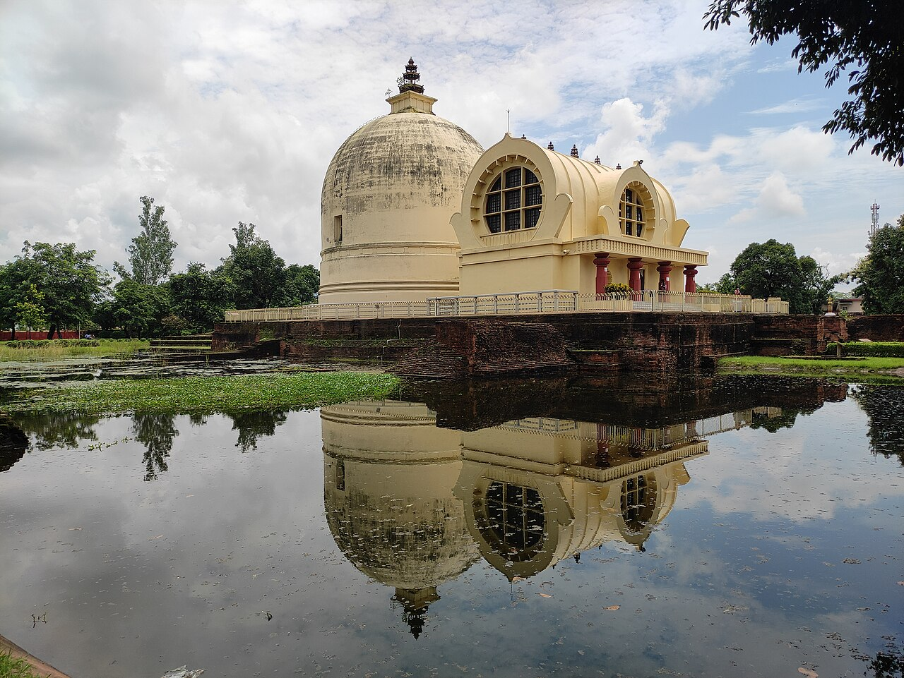
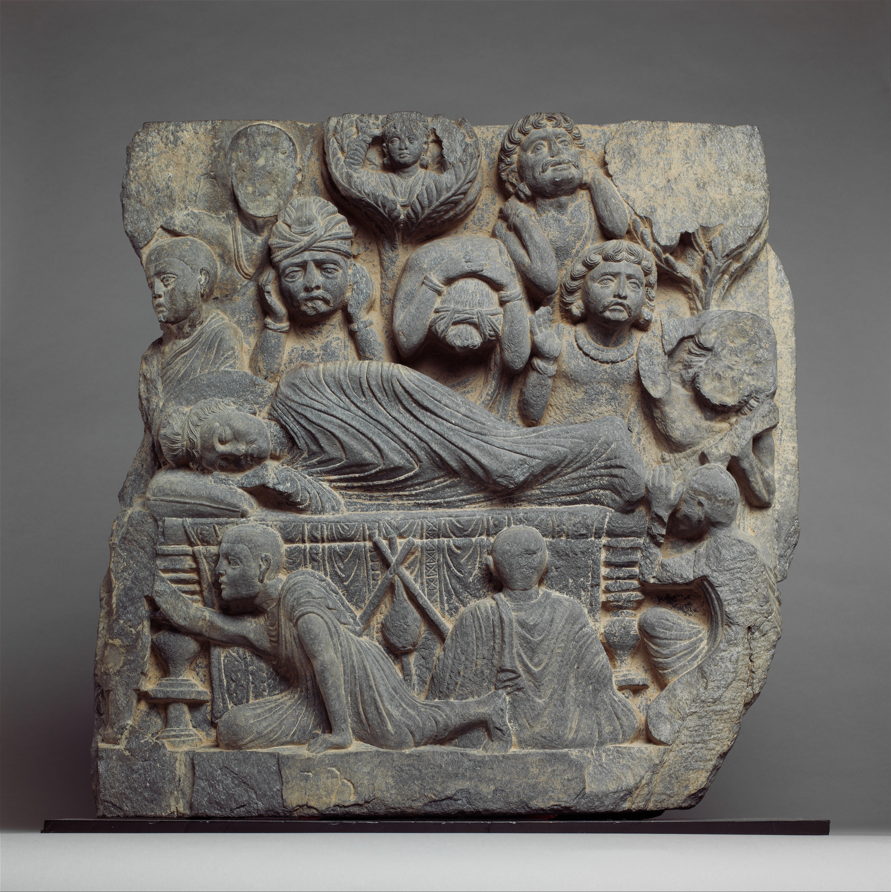
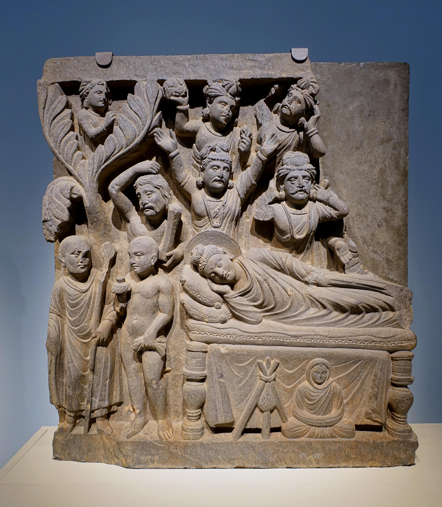

{width=80% fig-align="center"}

> 一切万物，无常存者，此是如来末后所说。
> ——《长阿含经·游行经》

那是一条缓慢的路。走在路上的，已经不再是当年那个离开迦毗罗卫王宫、独自寻找解脱之道的年轻太子，也不是菩提树下初成正觉、意气坚定的修行者，而是一位年近八十、身体衰老、疾病时常发作的老人。

只是，这位老人仍在行走。他从王舍城一带出发，经过那烂陀、波吒厘村，渡过恒河，前往毗舍离，又从毗舍离继续走向波婆，最后抵达拘尸那罗。一路上，他仍在说法，仍在回答弟子的疑问，仍在关心僧团的未来。

佛陀一生都在讲无常。到了生命最后的时刻，他没有用神通让自己永远年轻，也没有把衰老和死亡藏起来。他让弟子们亲眼看见：即使是佛陀的身体，也要经历疾病、衰败和消逝。

无常不再只是经文中的一句话，而是佛陀最后一次无声的说法。

---

## 一、一辆勉强修补的旧车

佛陀晚年，在毗舍离附近结夏安居时，曾经患上一场重病。经中说，病势十分剧烈，身体承受着强烈的痛苦。佛陀想到，如果不向弟子作最后的交代便入灭，并不适宜，于是以定力忍受病苦，使身体暂时恢复。

阿难看到佛陀病情稍有缓解，才松了一口气。他告诉佛陀，自己先前见到世尊病重时，身体仿佛也失去了力量，四周一片昏暗，心中唯一的安慰是：佛陀在对僧团作出最后教诫之前，应当不会就此入灭。

在他心中，佛陀不仅是老师，也是僧团的中心。只要佛陀还在，一切问题似乎都有最后的答案；如果佛陀不在了，弟子们该依靠谁？僧团又将由谁来领导？

《长阿含经·游行经》中，佛陀说：“我所说法，内外已讫。”意思是，他所应当宣说的法，已经毫无保留地宣说出来，没有把某些秘密教义藏在手中，只传给少数亲近弟子。佛法不是一套必须依赖神秘权威才能获得的秘密知识。佛陀教导弟子，不是为了使众人永远依附于他，而是为了让众人最终能够依照正法，亲自观察，亲自修行，亲自觉悟。

接着，佛陀平静地谈起自己的身体：“吾已老矣，年粗八十。譬如故车，方便修治，得有所至；吾身亦然。” 一辆年久失修的旧车，必须用绳索、木条勉强加固，才能继续前进。佛陀说，自己现在的身体也是如此。

佛陀没有把觉悟包装成肉身不坏，也没有因为自己的身体衰老而感到羞耻。觉悟并不意味着一个人从此不再生病、不再衰老；它意味着，即使疾病和衰老已经到来，内心也不再被恐惧、怨恨和执著所支配。

这正是佛教教理中极其深刻的辩证。

在佛教看来，血肉组成的肉身，是因缘和合而成的“有为法”。如《金刚经》所言：“一切有为法，如梦幻泡影，如露亦如电，应作如是观。”既是有为，就必然遵循生老病死的规律，像一辆终将损坏的旧车。

然而，肉身虽有坏灭，觉者的法身与觉性却是“无为法”，本自不生不灭、不垢不净。《大般涅槃经》中有一个生动的譬喻：正如夜空中的月亮，因云层遮蔽而呈现出盈亏出没，但月亮本身的体性从未真正增减损坏。佛陀示现肉身的衰老与坏灭，恰恰是为了破除弟子对“肉身神化”的执著。正如《金刚经》所警示：“若以色见我，以音声求我，是人行邪道，不能见如来。”

修行者究竟该如何超越这梦幻泡影般的有为肉身，去证悟那不生不灭的本性？

其关键在于：不再向外求索一个永恒不坏的肉身神迹，而是在有为的生灭变幻中，透过观照与正念，直下体认那不被生灭所动摇的清净觉性。如禅宗六祖惠能大师悟道时所叹：“何期自性本不生灭！”佛陀用自己衰老坏灭的肉身作最后教诫，正是要引导弟子从依赖外在有为的“生身肉躯”，回归并证悟自己内在不生不灭的“无为法身”。

---

## 二、自作洲渚，依法而住

面对即将失去老师的恐惧，阿难真正需要的，不是一位新的最高领袖，而是一种即使佛陀不在眼前，仍能继续修行的方法。

佛陀因此教导他说：

> “当作自洲而自依，当作法洲而法依。”

“洲”，是洪水之中可以立足的沙洲与岛屿。

人在顺境时，往往不觉得自己需要一座岛。等到疾病、失去、衰老和死亡如洪水般涌来，才发现自己过去依赖的许多东西都并不稳固：财富可能消散，关系可能改变，名声可能转瞬即逝，甚至一直被称为“我”的身体，也无法永远听从自己的命令。

佛陀没有告诉阿难，应当再去寻找另一个外在的权威。在这个无常泛滥的世界里，人不必寄希望于外在的神明或领袖来救赎自己，而是要在身心里建立起一座“绝不下沉的坚固岛屿（自作洲渚）”，把正法作为防洪的陆地（法作洲渚）。

究竟怎样才算“自作洲渚，法作洲渚”？佛陀明确指出，那就是修习**“四念处”**——在身心上建立四种清醒的观照：

* **观身不净**：观察身体只是因缘和合的生理现象，破除对色身的盲目执著与神化；
* **观受是苦**：看见一切苦乐感受皆是无常变幻的体验，不被一时的欲望与情绪拖走；
* **观心无常**：看见心念如水流般刹那生灭、无有常住，不被杂念与情绪所绑架；
* **观法无我**：观察一切现象皆由因缘聚合而成，没有独立固定的主宰，放下对世间的执取。

四念处，就是将正法落实在一吸一呼、一念一受中的禅修路径。正是通过这种如实观察，人才能在自己的身心里建造成一座风雨不摇的清净洲渚。

同时，针对弟子们关于“佛灭度后以谁为师”的悲顾，佛陀明确指出：“我成佛来所说经戒，即是汝护，是汝所恃。”佛陀没有指定任何个人作为继承人，而是要求后世弟子**“以戒为师，依法而住”**。

“戒”是防范放逸与倾覆的坚固堤坝，“法”是立足与安住的清净洲渚。“自依止、法依止、以戒为师”，构成了佛陀留给后世弟子最清晰的修行指引。

所以，“自依止”有两个不可分割的方面：

一方面，不把解脱的责任推给别人。老师可以指出道路，却不能代替任何人行走；佛可以说法，却不能替众生完成内心的觉察与转变。

另一方面，必须“法依止”与“以戒为师”。自己的想法仍要接受正法与戒律的检验，而不是把一时的情绪、习惯和欲望称为“我的真实”。

真正的自依止，不是任性，而是觉察；不是拒绝一切帮助，而是不把任何人当成可以替自己承担生命责任的救主。

佛陀将要离开，佛法却不因此失去作用。因为佛法的价值，从来不只建立在佛陀肉身的存在上，而在于它是否能够被理解、被实践、被亲自验证。

---

## 三、最后一餐

佛陀离开毗舍离后，继续向北行进，来到波婆城。当地有一位工匠之子，名叫周那（亦译纯陀），他听说佛陀到来便前往礼拜，邀请佛陀与僧团第二天到家中接受供养。

关于这次供养的食物，不同传本记载有所差异。《长阿含经》说周那烹煮了一种珍贵的“栴檀树耳”供养佛陀；巴利经典则称这种食物为“苏迦罗摩达瓦”，究竟是某种菌类、植物嫩芽还是其他食品，后世一直有不同解释。经典真正关心的重点，并不在于食材考证，而在于此后的故事：佛陀受食之后病情加重，出现剧烈的腹痛，但仍保持正念忍受痛苦，继续前往拘尸那罗。

阿难担心后人会把佛陀病重归咎于周那，认为是他的供养导致佛陀入灭，使这位怀着恭敬心的供养者承受终身的自责与指责。佛陀首先想到的，正是如何避免这种伤害。他嘱咐阿难日后一定要安慰周那：不要忧悔，这次供养不是罪过，而是有大功德；佛陀成道前接受乳糜供养，与临入涅槃前接受最后供养，这两次布施的功德“正等无异”。

佛陀自己正承受剧烈病痛，却没有寻找一个应当被责备的人，而是时刻关心善意的供养者是否会陷入内疚。一般人在痛苦中很容易追问“是谁害了我”，佛陀却在生命最后的旅途中用行动说明：痛苦发生之后，仍然可以不让怨恨继续生长。他没有把因果理解成简单的归罪，更没有把自己的病苦变成对他人的控诉。真正的慈悲，是自己已经十分痛苦时，仍然不愿把痛苦转移给别人。

---

## 四、佛陀入涅槃

{width=80% fig-align="center"}

佛陀终于来到拘尸那罗。这里并不是当时最繁华的都城，而是末罗族的一处城镇。佛陀让阿难在两株娑罗树之间铺设卧具，自己右胁而卧，安静地躺下。经典以充满宗教色彩的语言描绘这一幕：并非花期的娑罗树忽然开花落在佛陀身上，天上的花与香也纷纷降下表示供养。但佛陀告诉阿难，花香和音乐还不是对如来最殊胜的供养；真正尊敬佛陀的人，是那些依法而行、如法生活的人。

这句话重新界定了“供养”的意义。佛教当然不否定礼拜、鲜花和香灯，人需要以可见的仪式表达感恩与敬意；但如果供养只停留在外在形式，而言行与内心仍被贪欲、伤害与欺骗支配，那么再隆重的仪式也没有真正接近佛陀的教法。供养佛，不只是把花放到佛前，更是让慈悲出现在待人接物中，让正念出现在每一个容易冲动的时刻，让智慧进入每一次选择。

这时的阿难已经无法抑制悲伤，独自走到一旁倚着门框哭泣。他想到自己修行尚未完成，而长期慈悲教导、包容自己的老师却即将离去。
佛陀把阿难叫到身边，安慰他：“凡是自己所珍爱、所欢喜的人与事，都不能永远保持原样。只要由因缘聚合，就必然经历变化；既然有相遇，就可能有分离。”他接着肯定阿难长久以来的付出，称赞阿难以慈爱的身业、口业和意业侍奉如来，积累了广大善行，并勉励他继续精进，终将获得解脱。

真正的无常教育，不是否定感情，而是帮助一个人在悲伤中不被绝望吞没。因为无常，我们会失去所爱；也正因为无常，悲伤不会永远停留在最剧烈的时刻。感情可以被珍惜，却不必被执著变成占有；离别令人痛苦，却也提醒我们，在还能相见、还能善待彼此时，不要把一切当成理所当然。

---

## 五、涅槃究竟是什么？

佛陀最后的旅程中，最容易被误解的词就是“涅槃”。许多人听到“佛陀入涅槃”，便以为“涅槃”只是死亡的委婉说法，其实涅槃不能简单等同于死亡。“涅槃”（梵语 nirvāṇa / 巴利语 nibbāna）有火焰熄灭、烦恼止息的含义。所熄灭的，首先不是生命本身，而是燃烧在心中的贪欲、瞋恨与无明。

普通人死去并不等于证得涅槃。如果贪爱和无明尚未止息，推动生命流转的因缘仍然存在，死亡只是这一期生命的结束，并不是生死问题的彻底解决。佛陀在菩提树下觉悟时已经证得涅槃，那时他仍然活着、托钵说法，也会感到饥饿与疼痛，但贪嗔痴已经止息，不再制造新的生死系缚。

后来佛教用“有余依涅槃”说明这种状态（“余依”指过去因缘形成的身体，烦恼已断，生命仍在继续）；当觉悟者这一期身体寿命终结、不再受后有，则称为“无余依涅槃”（即般涅槃）。简单来说：死亡是身体生命过程的终止；涅槃是贪嗔痴及生死系缚彻底止息；般涅槃则是觉者在寿命结束后不再进入新的生死流转。

涅槃不是另一个可用世俗方位找到的天国，佛陀所破除的正是对固定永恒“自我”的执著。如果用生活化的语言来理解，涅槃意味着心中那些不断燃烧、驱使自己追逐、排斥与恐惧的火终于熄灭了。火熄灭后，不是陷入虚无，而是清凉、寂静与自在。

### 常见误解：涅槃是不是死亡？

不是。所有人都会死亡，但并非所有人都能证得涅槃。把涅槃等同于死亡，会让人误以为佛教追求生命消失。实际上，佛教要止息的不是慈悲、智慧和生命价值，而是制造痛苦的贪嗔痴。佛陀在世时证得涅槃并化导众生数十年，本身就说明涅槃是一种在现实生命中即可体现的清醒与自由。

---

## 六、佛陀不指定继承人

一个团体创立者即将离世时，人们通常会关心下一任领袖是谁。佛陀却没有指定某位弟子继承最高权威。舍利弗与目犍连此前已先去世，阿难长期随侍，摩诃迦叶德高望重，但佛陀并没有要求大家无条件服从某一个人。他对阿难说，自己宣说的“法”与制定的“律”，在灭度后应当成为大家的老师（《游行经》：“我成佛来所说经戒，即是汝护，是汝所恃”）。

这并不是说佛教不需要老师或否定善知识的作用，而是警惕把某人的身份、名望与魅力置于正法之上。真正的佛教老师不会要求弟子无条件盲从，而会引导弟子核对经教与戒律，观察其是否能减少贪嗔痴、增长慈悲与智慧。佛陀在《游行经》中提出判断教说的原则：日后若有人声称听到某种教法，不应立刻赞同或斥责，而应当逐句审察、与经律核对，相合者接受，不合者舍弃。

后来大乘《大般涅槃经》将这一精神概括为“四依”：“依法不依人，依义不依语，依智不依识，依了义经不依不了义经。”其中“依法不依人”提醒我们：人的身份可以尊敬，法的原则不能取消；老师可以引路，却不能代替真理本身；即使是有声望的人，其言行也必须接受经律与正见的检验。尊师而不造神，依教而不盲从，这正是佛陀留给后世的重要原则。

---

## 七、最后一个求法的人

佛陀已经十分疲惫，生命即将走到终点。这时，年长的游行者须跋陀罗来到娑罗林求法，阿难担心佛陀身体虚弱而连续三次拒绝。佛陀听见对话后嘱咐阿难不要阻止，因为须跋陀罗是真心求法。

在生命最后的时刻，佛陀接见了这位求法者，向他说明：凡是没有八正道的教法，就不可能真正成就清净解脱；凡有八正道之处，便有真正的修行与圣者。须跋陀罗听后生起信心请求出家，成为佛陀亲自度化的最后一位弟子。

从鹿野苑的五比丘，到娑罗双树下的须跋陀罗，佛陀一生的教化在这里形成一个完整的圆环。第一次说法讲的是中道、四圣谛与八正道；最后一次为新弟子说法，仍然回到八正道。佛陀没有在临终前揭示此前未说过的神秘真理，他最后确认的，仍然是那条需要亲自实践的道路。

---

## 八、诸行无常，慎勿放逸

最后，佛陀对众比丘作出简短教诫：“一切因缘和合而成的事物都具有坏灭的性质，应当以不放逸而成就修行。”汉译《游行经》凝练为八个字：**“诸行无常，慎勿放逸。”**

这八个字概括了佛陀一生的核心方向：“诸行无常”是对世界真相的观察，“慎勿放逸”是面对真相时的行动。只知道无常却不修行，容易变成消极感叹；只强调精进却不理解无常，也可能变成无止境的名利追逐。佛陀把两者连在一起：正因为一切会变、生命有限，所以更应把握当下，不把时间浪费在贪嗔和无意义的争斗中，趁身心尚能修学时培养正念与智慧。

“不放逸”是一种时刻记得行为后果、不自欺的清醒态度。它不是紧张地逼迫自己，而是明白生命不会无限延期，烦恼若不被观察就会继续支配自己。

---

## 九、寂静并不是虚无

说完最后的教诫后，佛陀进入禅定，依次进入不同层次深定，最后在第四禅中般涅槃。经典真实地保存了两种反应：尚未解脱的弟子举手放声哭泣，倒地哀叹“世尊入灭太早”；而离欲的比丘则保持正念，思惟“一切因缘和合之法皆是无常”。

有悲伤也有观照，有眼泪也有清醒。佛陀的入灭在悲伤之中再次显明他一生教导的事实：凡是生起的终将消逝，凡是聚合的终将离散。接受无常不等于认为一切毫无价值——一朵花会凋谢不妨碍它开放的美，一次相遇终将结束不否定其中真实的关怀。生命有限，反而使每一次善意、理解与觉察变得更加珍贵。正如灯可以点燃另一盏灯，觉者所发现的道路已经传给弟子；只要有人依照这条道路修行，慈悲与智慧的光便不会熄灭。

---

## 十、摩诃迦叶赶到以后

佛陀入灭时摩诃迦叶正带领比丘从波婆前往拘尸那罗，途中得知佛陀入灭，比丘们失声痛哭。人群中一位年老才出家的比丘（同名须跋陀罗）却说：“不必悲伤，大沙门在世时总是约束我们，现在他不在了，我们想做什么便可以做什么。”

这句轻率的话让摩诃迦叶意识到严峻的问题：佛陀刚刚入灭，已有人把他的离去理解为戒律约束的消失。如果教法与戒律不被及时整理和共同确认，不同记忆与个人欲望都可能冒充为佛陀的教说。摩诃迦叶赶到后礼敬佛陀遗体，承担起召集僧众、整理佛法的责任。

佛陀没有留下亲手书写的经典。阿难记忆说法，优波离熟悉戒律，摩诃迦叶组织结集。佛陀最后一次旅行结束了，弟子们将面对全新的问题：当说法的人不在眼前，他所说的法要怎样被保存下来？

---

{width=80% fig-align="center"}

---

## 本章经典与资料依据

1. 《长阿含经》卷二至卷四《游行经》，后秦佛陀耶舍共竺佛念译。
2. 巴利《长部》第十六经《大般涅槃经》。
3. 《杂阿含经》中“自洲自依、法洲法依”相关经文。
4. 《佛垂般涅槃略说教诫经》，亦称《佛遗教经》。
