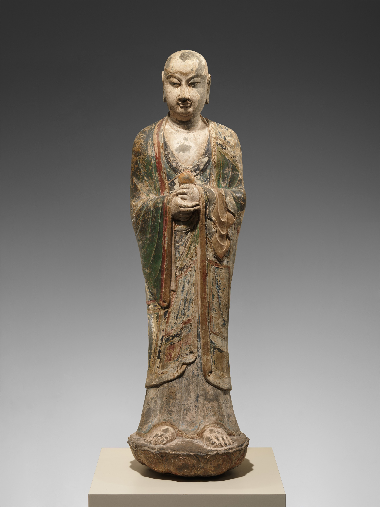

{width=80% fig-align="center"}

佛陀入灭之后，僧团第一次真正面对了一个根本问题：老师已经不在了，教法怎么办？

没有佛陀亲笔写下的著作，没有录音，也没有一部装订完成、可以交给弟子保管的“佛经”。过去遇到疑问可以直接请教佛陀，僧团争议也可由佛陀裁决；如今娑罗双树下已寂然无声，以后什么可以称为佛法，什么又不是佛法？佛陀制定的戒律，应当继续遵守，还是可以随意改变？这不只是一个保存知识的问题，更关系到佛教能否继续存在。

佛陀虽然没有指定继承人，却早已指出：他所宣说的法与制定的律，应当成为弟子们此后的依止。佛教因此没有出现一位代替佛陀、拥有最高神圣权威的“新教主”。佛陀离去以后，僧团依靠的不是某个人的个人意志，而是共同忆持、共同确认的“法”与“律”。后来流传两千多年的浩瀚佛典，正是从这样的忧虑与责任中逐渐形成的。

---

## 一、佛陀入灭后，谁来守护佛法？

佛陀入灭的消息传来时，有些尚未离欲的比丘悲痛哭泣，不能自已。但律藏中还记载了一段令人警醒的插曲：《四分律》说，有一位比丘听闻佛陀涅槃后，竟对众人表示：那位经常告诉我们什么应该做、什么不应该做的老人已经不在了，从今以后想做什么便可以做什么。

摩诃迦叶听到这番话，深感不安。他所忧虑的并不仅是个别比丘失去约束，而是佛陀在世时僧团以佛陀为共同导师；佛陀离去之后，如果每个人都按自己的记忆和喜好解释佛法，教法很快就可能变得面目全非——有人删去自己不喜欢的戒律，有人把个人见解说成佛陀的教导，甚至有人借佛法之名追逐名利，长此以往世人便无法分辨什么是佛说，什么只是后人的附会。

因此，摩诃迦叶提出应当召集熟悉佛陀教法与戒律的弟子，共同诵出佛陀遗教，使僧团有所遵循。《四分律》保存的理由很朴素：不能让外人讥讽说，沙门瞿昙在世时弟子们还共同学戒，世尊灭度以后便再也没有人认真遵守了。

这次集会后世称为“第一次结集”（亦称“王舍城结集”或“五百结集”）。这里的“结集”不是今天意义上的写作会议或编辑图书，其古印度语有“共同诵念”“合诵确认”的意思。众人通过一问一答、反复诵读和共同核对，将大家认可的教法确定下来。换句话说，最初的佛经不是“写”出来的，而是“诵”出来的。

---

## 二、王舍城里的第一次结集

依佛教传统记载，佛陀入灭后不久，摩诃迦叶召集众多比丘在王舍城附近举行结集。参加者通常称为五百位，因此又称“五百结集”。不同部派保存的律藏对参与人数、地点与具体程序的记载并不完全相同（如《大智度论》叙述以千人为数），但核心情节一致：摩诃迦叶主持结集，优波离诵出戒律，阿难诵出教法。在这三人中，摩诃迦叶代表僧团的威望与修行，优波离代表对戒律的精通，阿难则代表对佛陀说法的广博记忆。

### 摩诃迦叶：承担责任的人

摩诃迦叶是佛陀的大弟子之一，以少欲知足、严守头陀行著称。佛陀入灭后他没有沉溺于个人悲痛，而是立即思考怎样才能使佛法久住。在传统叙事中，他不是以“继承人”的身份发号施令，而是召集僧团，由大众共同确认佛陀的教条。这一点十分重要：早期僧团强调的不是把权力集中到某个人手里，而是在戒律规定的程序中共同议事。

### 优波离：最熟悉戒律的人

优波离出家前出身并不显赫，却因严谨持戒、善于辨析戒法被佛陀称赞为“持律第一”。戒律不是抽象的命令，往往有具体的制定因缘：在什么地方发生了什么事情，谁首先做出了不适当的行为，佛陀为什么制定相应规则。因此由优波离负责诵律并不是偶然。

### 阿难：听得最多、记得最深的人

阿难长期随侍佛陀，照料日常起居，也有机会听闻大量说法，传统称他“多闻第一”。许多弟子只在某个时期、某个地点听说法，阿难却长期在佛陀身边，熟悉各种说法的背景、听众与内容。

然而在结集开始前，阿难仍被认为尚未证得阿罗汉果。律藏叙事说他在集会前夜精进修行，直到身体疲惫准备躺下休息、头还没触到枕头时忽然断尽烦恼证得阿罗汉果，随后才正式进入结集会场。这个故事表达了佛教传统的一种态度：保存佛法不只是依靠聪明和记忆，也要求传法者具有清净、谨慎和不夹杂私欲的品格。

{width=65% fig-align="center"}

---

## 三、优波离诵律：戒律不是一张处罚清单

结集开始后，首先受到重视的是“律”。《四分律》记载，摩诃迦叶向优波离发问：某一条戒最初在什么地方制定？是谁首先违犯？因为什么事情而制定？优波离再一一回答。通过这样的问答，僧团将比丘戒、比丘尼戒，以及受戒、布萨、安居、自恣、衣药等僧团生活制度，分类汇集起来。

为什么要问得如此详细？因为佛教戒律并不是脱离生活、从天而降的一套法规，许多戒条都是在僧团生活中出现具体问题后，由佛陀根据起因、动机、后果及长远利益而制定。只记住“不能做什么”却不知道原因，戒律容易变成僵硬禁令；只谈背景却不遵规则，戒律又会失去作用。优波离的诵出将“规则”与“因缘”同时保留，使后人既知道戒条内容，也能理解制戒用意。

第一次结集中还出现了一个重要问题：佛陀临入灭前曾说僧团以后可以舍弃“小小戒”，但阿难当时因悲痛忙乱没有请问究竟哪些戒属于“小小戒”。结集时众人意见不一，由于无法取得确定结论，摩诃迦叶主张：佛陀没有制定的不应擅自增加，佛陀已经制定的也不应随意废除，应当依照原有戒法学习。

这项决定体现了早期僧团的谨慎。面对佛陀已经不在的现实，他们宁可暂时保守，也不愿以个人判断轻率改变佛制。但这并不意味着戒律从此完全停止发展，后来佛教传播到不同地区，僧团在气候、饮食、衣着和社会制度上遇到新情况时仍进行解释和调整，只是这种调整必须在尊重戒律精神和僧团程序的前提下进行。

---

## 四、阿难开口：“如是我闻”

律藏结集之后，轮到阿难诵出佛陀的教法。当阿难登上法座时，他没有说“这是我写的”或“以下是我的思想”，而是以一句极其克制的话开始：**“如是我闻。”** 意思是：我是这样听闻的。

汉译佛经大多保留着这种经典的开头规范。例如后世家喻户晓的《金刚经》，开头便是：

> “如是我闻：一时，佛在舍卫国祗树给孤独园，与大比丘众千二百五十人俱……”

这几句话看似只是交代时间、地点和人物，实际上包含了佛经最初的传承方式：“如是”表示所传述的是这样一番教法，“我闻”表示传诵者是从前人或佛陀处听闻，“一时”说明发生在某一因缘成熟之时，随后再说明说法者、地点与在场听众。汉地佛教注疏后来把这称为“六成就”（信、闻、时、主、处、众成就），用以说明说法并非无根无据。

《大智度论》还保存了一种传统解释：佛陀临入灭前阿难询问以后经典开头应当安置什么话，佛陀教他以“如是我闻，一时……”开始。因此“如是我闻”包含着一种罕见的谦逊，阿难没有把自己说成真理的创造者，他只是告诉听众：我依自己所听闻的如实传述。至于这番教法是否合理、是否能引导人离苦，听者还要在理解和实践中亲自验证。

### “我”是不是永远只指阿难？

普通读者容易产生一个疑问：所有佛经开头都有“如是我闻”，难道每一部经都是阿难亲耳听到的吗？

传统通常把第一次结集中的“我”理解为阿难，但事情不能简单地一概而论。例如佛陀在鹿野苑初转法轮时阿难尚未成为侍者，甚至可能尚未出家，《大智度论》叙述阿难诵出初转法轮时特意说自己当时并未亲见，而是“展转闻”（辗转听闻）。随着佛典不断传诵，“如是我闻”逐渐成为经典的固定开头格式，这里的“我”不必机械理解成阿难一人亲耳听到，也可以理解为传承者代表整个传法系统作出的声明：这不是我临时编造的，而是我从佛法传承中如此听闻、如此领受的。

因此，“如是我闻”既是一种见证，也是一种责任。说出这四个字，就意味着传诵者不能任意增减，不能把自己的想法混入佛说，更不能借佛陀之名为个人欲望背书。

---

## 五、没有书本，怎样记住那么多教法？

现代人习惯把重要内容记录在纸张、电脑和手机里，很难想象仅凭记忆怎么可能保存数量如此庞大的经典。事实上古印度虽然已出现文字，但早期佛教主要依靠口头传诵保存教法。直到数百年后，一些佛教传统才将长期口传的经典写在贝叶等材料上。

但“口传”不等于随口讲述，更不等于只靠某一个人的记忆，早期佛教发展出了一套相当严密的记忆与校验方法：

1. **反复诵读**：佛经中常有大段重复，古代传诵者借重复建立稳定的记忆节奏。重复也是一种保护机制，如果相同结构反复出现，诵者便容易发现某处缺失或错乱。
2. **使用数字和次第**：教义中常见“三法印”“四圣谛”“五蕴”“六根”“七觉支”“八正道”“十二因缘”等数字结构。知道应当有八项，诵到第七项便察觉遗漏；知道十二因缘有固定次第，便不会随意颠倒。
3. **使用固定句式**：“如是我闻，一时佛在……”“尔时世尊告诸比丘……”“欢喜奉行”等固定表达为经文建立了稳定框架，传诵者如同沿着铺好的道路前进。
4. **分工背诵与集体合诵**：早期僧团中出现专门忆持某一类经典的传诵者（有的熟习长篇，有的熟习短篇，有的持诵戒律），不同群体各自负责某部分并通过集体合诵相互校正。有人多说少说或次序颠倒，其他人会立即察觉。

佛教学者无著比丘的研究指出，早期经典大量使用重复、固定段落、声音相似和整齐排列的句式，这些特征都有助于记忆与诵读。集体诵经不仅保存文本，也体现僧团的和合与教法的传承。

---

## 六、经、律、论：三藏不是三本书

“三藏”（梵语 Tripiṭaka）不是三本具体的书，而是对庞大佛典的三大分类。“藏”就像大仓库或大容器，用来盛装与归类不同性质的文献：

* **经藏（言教）**：记录佛陀与大弟子的言论讲记。它回答“佛陀说了什么”，就像一部部生动的讲学实录，针对不同的人回答如何面对烦恼与生死。
* **律藏（戒条）**：记录出家众的行为规范与生活制度。它回答“僧团该怎样生活”，从戒律规则到集体议事、日常饮食无所不包，是保障僧团健康的基石。
* **论藏（阐释）**：后世弟子与高僧对佛陀言教的整理、说明与系统化分析。它回答“该怎样系统理解佛法”，把散见在各部经典里的思想梳理出清晰的理论框架。

简单来说：**经是言行讲记，律是行为规范，论是理论阐释。**

在第一次结集中，僧团主要确认的是“法（经）”与“律”；而系统化的“论藏”，则是后世弟子在漫长的传诵与研究中逐步丰富起来的。

---

## 七、第一次结集是完全确定的历史事实吗？

从佛教传统内部看，王舍城结集具有极其重要的意义，它说明佛法不是某个弟子私人的创造，而是僧团共同忆持、共同确认的遗教。从现代历史研究的角度看，现存多种律藏都保存了结集故事且核心结构相似，表明早期僧团很可能确实进行过某种形式的集会与教法确认。

但各种传本在人数、地点、诵出顺序与细节上存在差异，因此较为谨慎的态度是：承认这段传统保留了早期僧团共同诵持佛法的历史记忆，同时不把所有细节都当成可以逐项核实的会议记录。

这种谨慎并不会削弱佛经的价值。恰恰相反，它让我们看到佛经不是由一个人关在屋里独自写成，而是无数僧人用记忆、诵读、修行和生命代代传递下来的成果。不同地区、不同部派的传本虽然不完全相同，却仍保存了大量共同的核心教义（如四圣谛、八正道、缘起、无常、无我、戒定慧等），经过漫长时间与广阔地域后仍能彼此印证，本身就是早期佛教传承稳定性的有力证明。

---

## 八、常见误解：佛经是不是佛陀亲手写的？

不是。现有资料没有表明释迦牟尼佛亲自撰写过一部佛经，佛经最初来自口头教导，由僧团背诵传承，后来才写成文字。但“不是佛陀亲手写的”不等于“后人随意编造的”，这里需要区分“亲笔著作”和“教法传承”。

老师在课堂上讲授内容，学生根据亲闻整理代代传授，虽非老师亲笔，却仍能真实保存思想。佛经中的“佛说”，首先表示一项教法被佛教传统视为符合佛陀教导、具有传承权威。真正稳妥的态度，是既不把佛经想象成佛陀亲笔完成、两千多年一字未变的书稿，也不因为它经历了口传与编集便断言其中毫无可信内容。

---

## 九、“如是我闻”留给今天的人什么？

今天我们打开一本佛经，首先看到的往往不是惊天动地的神迹，而是四个平静的字：“如是我闻。”这四个字提醒我们，佛法来自倾听——阿难之所以成为“多闻第一”，是因为他善于听闻、记忆和受持，暂时放下成见去理解说法者真正回答的问题。

“如是我闻”也提醒我们保持谦逊与承担传递的责任：我们所知道的许多事情都来自他人的教导与前人的经验，诚实地说明“我是这样听闻、这样理解的”，反而更接近求真的态度。阿难在结集中说出“如是我闻”，等于公开承诺不把自己的欲望伪装成佛陀的教导，只把所领受的法如实传下去。

两千多年前，王舍城中的僧众共同诵念佛陀的遗教；两千多年后，我们仍能读到“诸行无常”“此有故彼有”“苦集灭道”等教法。这并不是因为佛法被封存在一块永不变化的石头里，而是因为一代又一代的人愿意听闻、记忆、校正、翻译与实践。佛陀没有亲手写下一部书，却留下了一群愿意认真倾听的人。而佛经，正是从他们的“如是我闻”开始的。

---

## 本章主要依据

1. 《四分律》卷五十四“集法毗尼五百人”：保存摩诃迦叶召集僧众、优波离诵律、阿难诵法及三藏分类等传统叙事。
2. 《大智度论》卷二：解释“如是我闻”的传统含义，并详细叙述王舍城结集与阿难诵法。
3. 无著比丘《巴利经藏的口传维度》：分析重复、固定段落、音韵和集体诵读在佛典口传中的作用。
4. Mark Allon等关于早期佛典形成与口传的研究：说明早期经典的程式化结构、背诵方式以及传承中可能产生的变化。
5. 关于阿含、尼柯耶及早期经典形成的佛教学研究：指出经典曾经历长期口传与逐步编集，而非一次性完成。
