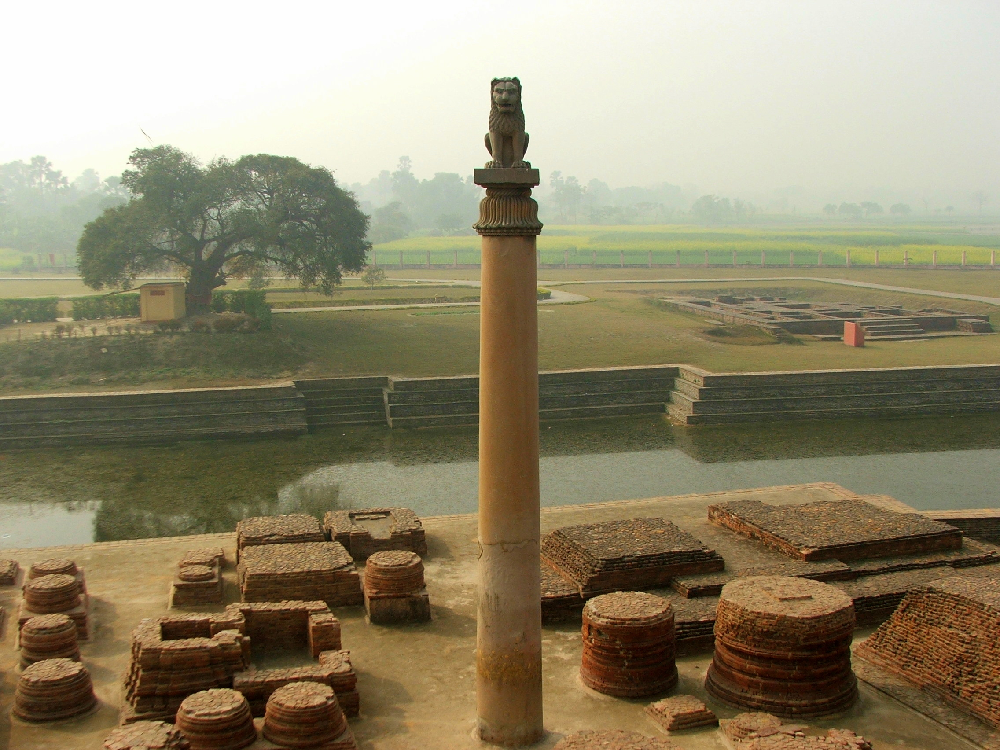

{width=65% fig-align="center"}

羯陵伽的战鼓终于停了。原野上留下的并不只是折断的兵器、焚毁的村落和来不及掩埋的尸体，成千上万的人被迫离开家园，活着的人寻找失散的亲人，战胜者押送俘虏，失败者在废墟中哭泣。站在这一切面前的，是当时印度最有权势的君王之一——孔雀王朝的阿育王。他赢得了战争，却第一次如此清楚地看见：所谓胜利，原来可以由无数人的死亡、离散和恐惧堆成。

在后世佛教徒的记忆中，阿育王的一生常被概括为一个极具戏剧性的故事：他早年残酷好战被称作“恶阿育”，后来因战争惨状而深生悔悟，皈依佛教、广建佛塔、供养僧团并派遣使者传播佛法，从此成为“法阿育”。这个故事的基本方向并非毫无根据，但真实的历史比“暴君忽然变成圣王”更加复杂。

阿育王的转变并不是一夜发生的，他对佛教的亲近、对战争的反省以及对“法”的理解是一个逐渐加深的过程。也正是在这个过程中，原本主要流传于恒河中下游一带的佛教，第一次获得了跨越广大地域的传播条件。阿育王并没有创造佛教，却让佛法第一次拥有了通往远方的道路、石柱、驿站、佛塔与公共语言。从这时起，佛教不再只是恒河岸边几个僧团所传承的教法，它开始越过山岭、河流与国界，成为一种能够影响整个南亚、并最终走向亚洲各地的文明力量。

---

## 一、佛陀灭度以后，佛教还只是一个地方性的教团

佛陀在世时，他和弟子们活动的主要区域大致集中在恒河中下游。王舍城、舍卫城、毗舍离、迦毗罗卫、鹿野苑、拘尸那罗，这些后来被佛教徒反复称颂的地名构成了早期佛教最重要的活动范围。佛陀没有建立帝国也没有掌握军队，他带领弟子在城镇与村落之间步行托钵、说法、安居。佛法的传播依靠人与人之间的相遇：一个人听闻教法后传给另一个人，一位弟子在某地建立僧团，又有新弟子从那里出发。

佛陀灭度以后，僧团通过结集、诵持经律、建立寺院等方式保存教法。商人、城镇居民以及部分国王贵族也为僧团提供布施与保护。然而这时的佛教仍然主要是古印度众多沙门传统中的一支，它虽然已有相当规模，却远没有遍布整个印度，更谈不上成为亚洲普遍熟悉的宗教。

这是理解阿育王历史作用的关键前提：**阿育王并没有创造佛教，却极大地改变了佛教传播的范围和方式。** 在他以前，佛法主要靠僧人游行、口耳相传和地方信众护持；在他以后，佛教开始借助一个横跨广大地区的政治与交通网络，获得寺院、佛塔、刻石、巡礼路线以及跨区域交往的支持。一种原本依靠行脚僧传播的教法，开始拥有一种可以被看见、被纪念、被长久保存的公共形态。

---

## 二、阿育王是谁？

阿育王生活在公元前三世纪，是孔雀王朝的第三代重要君主。孔雀王朝由旃陀罗笈多建立，至阿育王时统治范围已覆盖印度次大陆的大部分地区。阿育王在自己的诏令中通常不直接使用“阿育”这个名字，而自称“天爱喜见王”，意思大致是“诸神所爱、以慈目观视之王”。

与许多古代帝王不同，阿育王留下了大量刻在岩壁和石柱上的诏令。这些诏令分布在今天的印度、尼泊尔、巴基斯坦和阿富汗等地，所使用的文字和语言也因地区而异（有的使用婆罗米字母，有的使用佉卢文，在西北地区还发现了希腊文和阿拉米文诏令）。这些石刻之所以重要，是因为它们不是几百年后由信徒写成的传记，而是阿育王统治时期留下的直接材料。

后世的《阿育王传》《阿育王经》《大史》等典籍保存了佛教徒心目中的阿育王形象，石刻诏令则让我们听见阿育王本人希望向臣民表达的思想。把两类材料结合起来，我们可以看到两个彼此相关又有所不同的阿育王：一个是佛教传说中的“恶王转法王”，另一个是在战争、治理、信仰与现实之间不断反省的古代君主。

佛教典籍喜欢用鲜明的对照来叙述他的前半生与后半生（早年为暴恶的“旃陀阿育”，信佛后为奉法的“达磨阿育”）。这种写法不只是记录经历，也是在表达一个佛教主题：**再深重的习气也并非不能转变，再强大的人也必须面对自己行为造成的苦。** 不过从阿育王自己的诏令来看，他与佛教的关系并非某一天突然开始：他在一篇小岩诏中说自己成为在家信徒已两年多，最初并不十分精进，后来更加亲近僧团才逐渐变得热诚；在另一篇给僧团的诏令中，他明确表达了对佛法僧的敬信并列举希望大家经常诵持的教法。这说明他的信仰转变是一个渐进过程——先是接近佛教成为优婆塞，继而在现实经验中重新理解佛法，最后才把这种理解落实到政治与生活中。真正改变他的，是他开始用佛法审视自己所拥有的权力。

---

## 三、羯陵伽之战：一场胜利怎样变成悔恨

阿育王即位后的第八年，孔雀王朝征服了东部的羯陵伽。羯陵伽大致位于今天印度奥迪沙一带，临近海岸，经济与交通地位十分重要。对于一个试图扩大和巩固疆域的帝王来说，征服这里似乎是一场理所当然的胜利。

然而，阿育王在第十三岩诏中留下了一段在古代帝王文告中极为少见的话。诏令记载，羯陵伽战争造成了大批量的杀戮、死亡和人口迁徙。阿育王说，征服一个原本独立的地方必然带来屠杀与亲人离散，想到这些他感到深切的悲痛与悔恨。他尤其提到战争伤害的不只是士兵，那些恭敬父母的人、修行的沙门婆罗门、普通居士、亲友仆役以及善良生活的人，也会在战争中被杀害、流放或与所爱者分离。这使他认识到一个命令从王宫发出，最后可能变成千百个家庭的悲剧，战争造成的痛苦远远超出了战场。

过去的帝王往往只把“征服了多少土地”刻在石头上，阿育王却把自己对战争的悔恨也刻在石头上。这并不意味着他从此废除了军队或刑罚，他仍然是一位维持行政与边疆秩序的现实帝王，但他提出了一个新的理想：与其依靠兵刃征服，不如追求“法的胜利”。所谓“法的胜利”，不是让所有人都臣服于自己的宗教，而是希望通过善行、仁慈、克制与教化使人心发生改变。他在第十三岩诏中告诫子孙不要轻易追求武力征服，即使不得不施行惩罚也应尽可能宽和节制。

这个转变之所以震撼，是因为他开始承认：**权力不能免除一个人的因果责任。** 普通人伤害一个人需要面对后果，帝王影响千万人更不能把痛苦从自己的责任中排除。佛教所说的“业”不只存在于私人生活中，一项政策、一道军令、一次扩张同样由动机、行为与结果构成。拥有越大力量的人，所能造成的利益和伤害也越大，因此更需要节制与觉察。阿育王最重要的变化，是他终于开始看见自己拥有的权力也必须接受道德的审视。

---

## 四、阿育王所说的“法”，是不是等于佛教？

阿育王的诏令中反复出现“法”（古印度语称“达摩”）。既然阿育王是一位佛教徒，人们很容易把诏令中的“法”直接理解为四圣谛、八正道等完整的佛教教义。但仔细阅读诏令就会发现，阿育王向全国臣民讲述的“法”，更多是一套不同信仰者都可以实践的公共伦理。

他所强调的内容包括：尊敬父母长者，善待亲属朋友与仆役，尊重沙门与婆罗门，减少杀害生命，诚实、清净、慈爱、慷慨，节制浪费，反省过失，以及不同宗教之间彼此倾听、避免恶意攻击。在柱诏中他直接解释：“法”就是少作恶、多行善，具有慈爱、布施、真实与清净。这与佛教伦理高度一致，但并不是一份要求所有臣民必须皈依佛教的命令。

阿育王对僧团有明确的个人信仰，但当他面对一个包含多种信仰的庞大帝国时，他倡导的是一种让不同群体都能接受的道德生活。第十二岩诏尤其强调不能为了抬高自己的宗教而随意贬低其他宗教，狂热地赞扬自己、攻击他人表面上在维护信仰，实际上反而伤害了信仰；真正有益的做法是克制言语，倾听并了解其他传统中的善法。

因此把阿育王说成“以国家力量强迫全民信佛”并不准确，他大力护持佛教，却没有把护持理解为消灭其他信仰。这也提醒我们：真正的护法首先是让法在自己身上活出来，而不是借护法之名宣泄傲慢与攻击欲。

---

## 五、从“游猎”到“法巡”：把信仰落实到治理中

阿育王并没有把悔恨停留在情绪里。过去的君王常以游猎和享乐作为巡行的重要内容，阿育王则开始进行“法巡”：探望年长者，布施修行者，接触乡村百姓，与人讨论道德生活。他还设置“法大官”关注不同宗教群体、边远地区、贫困者与受刑者的处境。

诏令中记载的措施还包括：为人和动物设置医疗条件，在缺少药草的地方移植药用植物，在道路沿线栽种树木与开凿水井，减少宫廷中宰杀动物的数量，限制某些时日与动物的屠杀，要求官员巡视听取民情，以及对司法刑罚采取更审慎的态度。

这些措施说明阿育王对信仰的理解不只是建寺、礼拜和供养，还意味着重新思考：人民怎样少受苦？动物是否也应得到保护？权力怎样由征服的工具转变为照顾众生的责任？他在诏令中把人民比作自己的孩子，希望他们在今生来世都获得安乐。虽然带有古代君王以父母自居的色彩，但他至少开始用照顾而不是单纯占有的方式理解统治。

**一个相信慈悲与因果的人，应当怎样使用自己手中的力量？** 这个问题不只属于帝王。父母对子女、教师对学生、管理者对下属、掌握财富或话语权的人，都拥有影响他人命运的能力。佛法不只要求弱者忍耐，也要求强者节制。

---

## 六、佛塔是什么？为什么要供养舍利？

在阿育王与佛教传播之间，还有一个极其重要的载体：佛塔。今天的人走进寺院往往首先注意到佛殿和佛像，但在佛教发展早期，佛像尚未成为普遍的礼拜中心，佛塔（“窣堵波”）却很早占据了重要地位。

“塔”原本具有坟冢、纪念冢的含义。佛陀涅槃火化后，早期经典记载有多个国家请求分得佛陀舍利，最后分得的舍利被各地建塔供养。对佛教徒而言，供养舍利并不是把佛陀当成施展神力的神明，而是借由具体的遗物表达对觉者生命的敬仰与追思。当人们来到舍利塔前绕塔而行、献上花香时，那位离世的老师仿佛仍以另一种方式提醒他们：这里曾经有一个真实的人觉悟了苦的根源，他所发现的道路并没有随着肉身消失。

因此佛塔具有多重意义：它是安奉舍利的处所，也是纪念佛陀的标志；它是信众礼拜的中心，也是僧俗聚集的公共空间；它使看不见的信仰成为可以抵达的地点，把佛陀的生平教条与地方历史联系起来。人们可以不识字却能看见佛塔，可以通过礼敬与听闻故事逐渐接近佛法。佛塔不仅是一座建筑，也是一种传播佛法的媒介。

---

## 七、“八万四千塔”：历史事实还是佛教传说？

关于阿育王最著名的传说之一，是他打开早期安奉佛舍利的佛塔，重新分配舍利并在天下建立八万四千座佛塔。汉译《阿育王经》与《杂阿含经》均记载了他从暴恶转向敬信三宝、广建佛塔的事迹。

“八万四千”在佛教文献中常用来表示数量极多、法门广大，不宜当作现代统计的精确数字。今天没有考古证据证明阿育王在同一时间内建成了八万四千座塔，因此稳妥的理解是：**阿育王广建扩建佛塔有历史与考古依据；“八万四千塔”则属于佛教传统对其护法功德的宏大表达。**

桑奇大塔就是最著名的例子之一：其早期砖塔可追溯至阿育王时代，后来人们又增建了石栏、塔门与雕刻。传说与历史在这里并不排斥——历史研究关心遗迹的真实年代与范围，宗教叙事则关心一个曾以武力征服天下的王转而把巨大的组织能力用于安奉舍利与护持佛法，这种转变意味着什么。“八万四千塔”真正表达的是一种方向的改变：从修筑战争堡垒转向建立纪念觉者的佛塔，从以恐惧统一疆域转向以共同敬仰连接人心。

---

## 八、石柱、佛塔与圣地：佛法开始拥有一张“看得见的地图”

佛陀在世时佛法随着人的脚步流动；阿育王时代，佛法开始被刻在石头上，也被安置在具体的地理空间中。阿育王在交通要道与人口聚集地刻写诏令，并前往与佛陀生平有关的圣地巡礼。在蓝毗尼发现的石柱铭文中，记载了阿育王即位二十年后亲自来到佛陀诞生之地礼敬并减轻当地赋税。

这段铭文意义非凡：在此之前“佛陀出生于蓝毗尼”主要靠口头记忆流传，石柱建立后这段记忆被固定在地景之中。从此人们不仅听说佛陀来过世间，还可以踏上一条道路，前往他出生（蓝毗尼）、成道（菩提伽耶）、初转法轮（鹿野苑）和涅槃（拘尸那罗）的地方。

佛教由此形成了圣地网络，佛塔、石柱、寺院与道路把这些地点连接起来，把抽象的佛教历史变成可以行走的空间。僧人可以携带经法远行，商人可以在旅途中供养，信众可以朝礼圣地，不同地方的人通过佛塔知道遥远的另一座城市也有人礼敬同一位佛陀。佛教因此不再只由分散的小型僧团组成，而逐渐形成一个跨越地区的精神共同体。

---

## 九、佛法怎样越过恒河流域？

阿育王对佛教传播的推动并不只有建塔。后世南传佛教文献《大史》记载，在阿育王时代，僧团曾向迦湿弥罗、犍陀罗、南印度及兰卡岛等地派遣长老弘法。斯里兰卡传统尤其重视摩哂陀长老（阿育王之子）前往兰卡弘法、以及僧伽蜜多（阿育王之女）带菩提树分枝建立比丘尼僧团的故事。

这些叙述反映了一个历史事实：公元前三世纪后，佛教确实加速向印度次大陆南部、西北部及斯里兰卡传播。阿育王的岩诏也提到南印度的朱罗、般荼地区以及西方希腊化世界的君主，宣称“法”的影响已到达这些区域。

两类材料结合起来，展示了阿育王时代佛教传播的几条并行道路：
1. **僧人的道路**：比丘携带经法和戒律前往新地区建立僧团；
2. **商旅的道路**：商人往来于城市港口，把信仰带到贸易网络沿线；
3. **行政与交通的道路**：连通的交通与官方交往使跨地域旅行更加可能；
4. **佛塔与圣迹的道路**：佛塔提供共同礼敬中心，舍利让不同地区的人与佛陀相连；
5. **伦理语言的道路**：“不杀生、敬父母、行布施、说真实语、尊重其他信仰”等朴素原则比复杂理论更易跨越文化边界。

佛教能走出恒河流域，是因为它同时具有深刻的思想、可实践的伦理、稳定的僧团、可见的圣迹以及愿意长途跋涉的传播者。一种思想要走得远，既需要智慧，也需要道路。

---

## 十、护法是不是用权力让所有人都信佛？

人们容易产生误解：佛教是不是依靠帝王权力才兴盛起来的？阿育王的护持确实十分重要，但佛法不能只靠权力维持——权力可以修建寺院却不能命令人觉悟，可以召集僧众却不能保证僧团清净，可以把经文刻在石头上却不能把慈悲刻进心里。

阿育王在晚年柱诏中指出：通过禁令与制度促使人行善作用有限，相较之下劝导与内心的认同更加重要。这非常接近佛教修行的本质：真正的持戒不只是害怕惩罚，而是理解伤害众生会染污自己的心，而诚实、节制与慈悲能减少苦。同样，佛教可以受国家保护，却不能成为强迫他人服从的工具。一旦完全依附权力，它可能随权力兴衰而起伏；一旦只剩宏大仪式而失去内在修行，表面繁荣反而掩盖空虚。

阿育王留给后世最宝贵的启示在于：**拥有巨大权力的人也可以承认错误；一种信仰进入公共生活后，应表现为减少伤害，而不是扩大压迫。**

---

## 十一、诸行无常，慎勿放逸：自净其意的力量

本章选取的经典名句是：

> 诸恶莫作，众善奉行，自净其意，是诸佛教。

这首偈在《增一阿含经》与《法句经》中均有相近表达，能很好地概括阿育王时代“法”的核心精神。“诸恶莫作”是停止伤害（战争、杀戮、残酷与傲慢不会因权力而变善）；“众善奉行”是主动利益众生（布施、护生、照顾弱者）；而“自净其意”则是最深的一层——不仅问“做了什么”，还要问“为什么这样做”。

一个人可能外表行善内心却追求名声，可能建塔却为了证明伟大。因此佛法要求反观内心：你的心是出于慈悲还是出于恐惧？是为了减少苦还是为了扩张自我？止恶是底线，行善是实践，净心是根本。

---

## 十二、常见误解：佛教是不是一开始就广泛流行？

不是。佛教在佛陀时代主要流行于恒河流域城邦，灭度后仍需与许多沙门流派与婆罗门传统共存。阿育王时代是传播史上的转折点，但佛教能持续扩大，还依靠僧团讲授、信众布施、商贸延伸、圣地记忆以及代代译解释义。

阿育王的贡献是把分散的力量大幅连接起来，使佛教获得广阔空间。但他没有替代僧人的修行，也没有保证佛法永不衰微。真正让佛法延续的，始终是有人愿意听闻、理解、实践并传给下一代。

---

## 结语：当战鼓变成法鼓

阿育王的一生在佛教史上像一道分界线：在他以前，佛法依靠行脚僧与地方僧团口耳相传；在他以后，佛塔、石柱、圣地与使团使佛法有了广阔清晰的网络。

他不是没有缺点的圣人，曾发动残酷战争，也始终掌握军队与权力。但他的珍贵之处正在于他不是天生完美：他让后人看到一个造成巨大伤害的人仍可能反省，一个习惯武力的统治者也能意识到长久的胜利不是让人恐惧而是减少世间的苦。后世讲述“恶阿育”到“法阿育”的转变，也是告诉每个人：过去做错的事不能假装没发生，真正的忏悔必须落实为将来行为的改变。

一座座佛塔沉默立在大地上，人们来到塔前合掌绕行，忆念觉者也忆念那位学习慈悲的国王。然而阿育王终会死去，孔雀王朝也会衰落。当护法的帝王不再存在，佛法会不会随时间衰微？后人还能不能像佛陀在世时那样修行证悟？所谓正法、像法和末法又是怎样形成的？这将是下一章要讨论的问题。

---

## 本章主要依据

1. 阿育王石刻诏令（大岩诏、小岩诏、石柱诏）：保存阿育王关于羯陵伽之战的悔恨、信仰转变、“法”的含义、宗教宽容及社会关怀的直接记录。
2. 汉译《阿育王传》《阿育王经》及《杂阿含经》卷二十三：保存佛教传统关于阿育王转变、广建八万四千塔及护持三宝的经典叙述。
3. 巴利《大史》（Mahāvaṃsa）及《岛史》（Dīpavaṃsa）：记载阿育王时代僧团派遣长老前往各方弘法及摩哂陀赴斯里兰卡的故事。
4. 桑奇（Sanchi）与蓝毗尼（Lumbini）考古报告及研究：提供阿育王时代佛塔建构与蓝毗尼石柱巡礼的实物依据。
