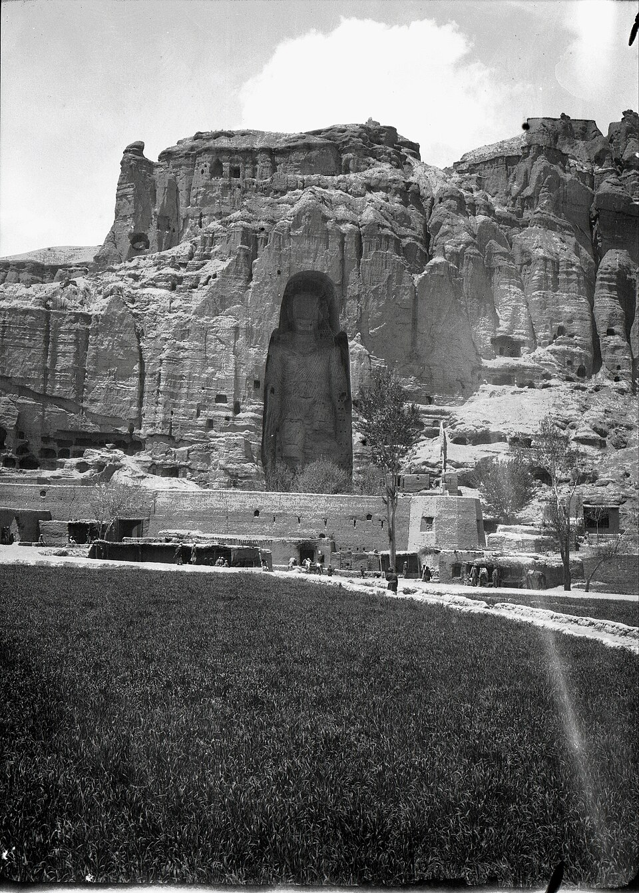

{width=75% fig-align="center"}

阿育王时代以后，佛教逐渐走出恒河流域，向印度各地乃至更遥远的地区传播。佛塔建立起来了，经典被不断传诵，僧团的规模也越来越大。然而，佛教徒心中始终有一个无法回避的问题：**佛陀已经不在人间，佛法还能流传多久？**佛陀在世时弟子遇到疑惑可以直接请教，僧团发生争议也可以请求裁决；佛陀涅槃之后，弟子只能依靠经教、戒律和代代相传的修行经验。随着年代久远，语言、社会、人的根性与生活方式都会改变，人们是否还能准确理解佛法？修行是否会逐渐流于形式？佛教会不会有一天只剩下寺庙、佛像和经书，却失去真正改变人心的力量？

正是在这种忧虑中，佛教逐渐形成了关于**正法、像法与末法**的传统说法。它并不是简单地预言世界末日或宣告佛法失效，更准确地说，这是佛教对自身历史的一种反省：当佛陀离人间越来越遥远时，后世弟子应当怎样理解、实践和保存佛法？

---

## 一、佛陀不在世以后，佛法靠什么延续？

佛陀临近涅槃时并没有指定某一位弟子成为拥有最高权威的继承者，而是教导弟子以佛法和戒律为依止。佛法能否继续住世，最终不能只依靠某一个人，而要依靠经教的保存、戒律的奉行以及一代又一代人的真实修行。在佛教传统中，通常用“教、行、证”三个字概括佛法流传的三个层面：“教”是佛陀留下的教法（经、律、论及义理）；“行”是依照教法实际修行（持戒、禅定、布施、念佛、观照、修慈悲）；“证”是修行之后真正断除烦恼、体悟真理、获得解脱。唐代窥基大师在《大乘法苑义林章》中用“教、行、证”解释佛法流传的三个阶段，后世据此做出最常见的概括：

| 时期 | 教法 | 修行 | 证悟 |
| :---: | :---: | :---: | :---: |
| 正法 | 有   | 有   | 有   |
| 像法 | 有   | 有   | 渐少 |
| 末法 | 有   | 衰微 | 极难 |

* **正法时代**：教法被准确传承，有人如法修行，也有人由修行而证得圣果。
* **像法时代**：“像”指佛法仍保留着类似正法的形态（经典、戒律、寺院与仪式仍在），但真正获得深刻证悟的人被认为越来越少。
* **末法时代**：经典与佛法名称仍在流传，但众生烦恼深重、理解力减弱，修行容易停留在表面，教法与人的生命之间出现距离。

因此，所谓正法、像法与末法，首先不是在给佛法本身分等级。佛法所揭示的缘起、无常、苦与解脱之道不会因年代久远而改变，发生变化的是人们对佛法的理解、接受和实践能力。佛法并没有衰老，衰弱的是人对佛法的信受与奉行。

---

## 二、正法、像法和末法各有多少年？

关于三个时期究竟持续多少年，佛教典籍和历代祖师并没有完全一致的说法。有的传统认为“正法五百年、像法一千年、末法一万年”；也有传统主张“正法一千年、像法一千年、末法一万年”；另一些经论则只谈正法与像法。例如吉藏大师在《中观论疏》中讨论过不同分期，窥基大师在《金刚般若经赞述》中采用“正五百、像一千、末一万”说。南北朝时期南岳慧思大师在《立誓愿文》中写道“正法住世，迳五百岁”，随后说像法一千年、末法一万年，并根据当时推算的佛灭年代认为自己生在末法初期。由于佛陀涅槃的具体年代在不同传统中本有差异，三时各自年限也有不同说法，因此“末法从哪一年正式开始”并不存在统一答案。

理解三时思想的重点不应是计算自己生活在末法第多少年，而是看见它提出的警告：**年代越久，佛法越容易从生命实践变成名词、知识和仪式。**

---

## 三、《大集经》中的“五个五百年”

与正法、像法、末法密切相关的，是《大方等大集经·月藏分》所说的“五个五百年”（五五百岁），把佛陀灭度后的两千五百年分成五个阶段：

1. **第一个五百年（解脱坚固）**：距离佛陀较近，亲闻佛法或承接早期传承的人较多，戒律与修行传统相对完整，因此修行者证得解脱较多。
2. **第二个五百年（禅定坚固）**：直接证果者减少，佛教徒仍然重视禅定与三昧，以摄心、止观和内在修行为主要方向。
3. **第三个五百年（读诵多闻坚固）**：广泛研习、讲说和读诵经典，义理阐释与注解兴盛。但若知识不能转化为实践，佛法便可能停留在文字概念中（如能熟练解释无常却无法接受失去，能谈论无我却处处维护自尊）。
4. **第四个五百年（多造塔寺坚固）**：佛塔、寺院、佛像和庄严仪式大量出现。建寺造塔本身能保存经典与维系信仰，但若过于重视外在建筑而忽视内在修行，佛教便可能变得宏伟而空洞。
5. **第五个五百年（斗诤坚固）**：“至后五百年，坚住于斗诤。”人们忙于宗派高下、法门优劣、传承正统与寺院利益的争论，清净善法反而被遮蔽。每个人都说自己在护持正法，却在争论中增长了傲慢、愤怒与偏见。

这段经文最令人警醒之处在于：**佛法未必只会被外来力量破坏，也可能在佛教徒彼此斗争时从内部衰败。**

---

## 四、末法思想为什么在中国受到重视？

末法思想传入中国后并不是立刻成为所有佛教徒的关注中心。南北朝时期政权更替频繁、战争不断且多次遭遇毁佛事件，身处动荡中的人们很容易产生强烈感受：佛陀离人间越来越远，众生烦恼越来越重。慧思大师在《立誓愿文》中把自己定位为末法众生，但他并没有因此放弃修行；相反，正因为感到时代艰难，他更加迫切地发愿护持佛法、修行菩萨道。这说明早期中国佛教中的末法意识不仅是悲观，也包含着强烈的责任感：正因为佛法可能衰微，所以更要有人发愿守护；正因为众生难度，所以更不能舍弃众生。

到了隋唐时期，末法思想又推动佛教各宗派思考：什么样的法门更适合烦恼深重、时间有限、能力普通的后世众生？有人强调忏悔，有人提倡持戒，有人重视禅定，也有人认为应当依靠佛菩萨的愿力，这些思考成为了中国佛教宗派形成的重要思想背景。

---

## 五、道绰大师与净土法门

在末法思想的发展中，净土宗道绰大师（南北朝末至唐初）是一个关键人物。他看到佛陀离世久远、众生烦恼深重，若仅凭自力断惑证真极为困难，因此在《安乐集》中把修行概括为两条道路：一是依靠自力戒定慧断惑证真的“圣道门”，二是信受阿弥陀佛本愿往生净土继续修行的“净土门”。

道绰引《大集月藏经》意指出：“末法时代，亿亿众生起行修道，未有一人得者；唯有净土一门，可通入路。”他的意思并不是否定其他法门，而是强调“时”与“机”必须相应——法门虽然高深，如果普通人无法实践就很难成为现实中的解脱道路；净土法门依靠佛力愿力，门槛较平易，更适合后世众生。这一思想后来被善导大师进一步继承发展，对中国净土宗产生了深远影响。

---

## 六、末法是不是意味着修行已经没有用了？

这是理解末法思想时最容易产生的误解。如果末法时代没人能修行，历代祖师为何还要讲经持戒、参禅念佛？事实恰恰相反，经典在谈到后世衰微时，常常鼓励后世仍有人护持佛法。《金刚经》中须菩提询问后世是否还有人能信受般若深义，佛陀回答后世仍会有“持戒修福者”能生真实信心。这说明末法并不等于善法彻底消失，也不等于再没有真诚的修行人。越是在混乱与怀疑盛行的时代，能持戒修福、闻法反省的人越显得难能可贵。

“难以证悟”和“绝对不能修行”并不是一回事。普通人也许无法短时间断尽烦恼，但仍然可以少一些贪嗔、少说伤人的话、多做利益他人的事；仍然可以观察无常、练习放下执著。只要一个人愿意依照佛法调整言行与心念，佛法就还没有离开人间。

---

## 七、末法也可能成为一种危险的借口

末法思想能提醒人谦卑，也可能被误用：
1. **把问题归咎于时代**：“现在是末法，大家都做不到，所以我做不到也很正常。”懒惰被解释为根器浅薄，不愿改变却被包装成清醒认识。
2. **借末法制造恐惧**：宣称世界即将毁灭，只有加入特定团体或供养个人才能得救，把佛法变成控制他人的工具。
3. **以护法之名进行斗争**：坚信自己掌握唯一正法，把不同意见者视为外道，在争论中增长仇恨。

这正是末法思想最深刻的反讽：**人越急于证明别人处在末法，越可能没有看见自己心中的末法。** 真正的护法不是保卫宗派名声，而是保护戒律、慈悲、智慧与不伤害众生的精神。

---

## 八、末法不是宇宙的判决，而是一面照心的镜子

正法、像法与末法更像是佛教为自己设置的一套警报系统：当佛法能帮助人减少烦恼增长慈悲，教法就在生命中发挥作用；当人只会讨论佛法却不依教奉行，便开始进入“像”的状态；当佛教只剩身份、仪式与争执而失去改变人心的力量，末法就是此刻正在发生的现实。这三个状态甚至可能同时存在：同一个时代、同一座寺院甚至同一个人的生命中，都可能一时真心修行，一时流于形式，一时陷入争执。每当我们远离慈悲、戒律与智慧时，末法就在心中发生；每当我们重新反省自己、止恶行善时，正法也就在这一念中重新出现。

---

## 九、普通人应当怎样面对末法时代？

面对末法，佛教给出的答案不是绝望，而是从自己能做到的地方开始：不必先判断别人对不对，可以先少说一句刻薄的话；不必先争论哪种法门最高，可以先诚实面对自己的烦恼；不必等到通晓经典才开始行善持戒。我们距离佛陀已经遥远，更需要珍惜听闻佛法的机会；外界诱惑繁多，更需要守护自己的心；人与人容易争斗，更需要学习慈悲与忍耐。慧思大师与道绰大师面对末法时代并没有放弃，而是重新寻找切合时机的修行起点。

---

## 结语：佛法会不会消失？

佛法是否住世，不只取决于寺院还有多少、佛像是否庄严，更取决于是否还有人愿意把佛法落实在生命中。只要还有人在愤怒中学习克制，在痛苦中观察无常，在利益面前守住良知，正法就仍然以某种方式活在人间。相反，若经典被高供却无人实践，寺院金碧辉煌却彼此争夺，那么即使外在形式繁荣，也只是“像法”的壳子。正法、像法与末法不仅是在谈论历史，更是在追问每一个修行者：你所理解的佛法，究竟只是一个名称、一种形式，还是已经成为你对待世界的方式？

佛陀虽然已经涅槃，但佛法是否仍在人间，并不完全由年代决定，它也取决于今天的我们。

---

## 本章主要依据

1. 《大方等大集经》卷五十五《月藏分》：保存“五个五百年”（解脱、禅定、读诵多闻、多造塔寺、斗诤坚固）的传统分期与末法衰微叙事。
2. 唐·窥基《大乘法苑义林章》卷六《三时章》：以“教、行、证”三要素系统解释正法、像法与末法的区别及判定标准。
3. 唐·道绰《安乐集》卷上：引《大集经》意说明末法时代众生修道之难，并据此提出“圣道门”与“净土门”的分判。
4. 南朝·慧思《立誓愿文》：反映中国早期佛教徒的末法危机意识与护法发愿。
5. 《金刚般若波罗蜜经》：佛陀关于后世“持戒修福者”能生真实信心的教诫。
