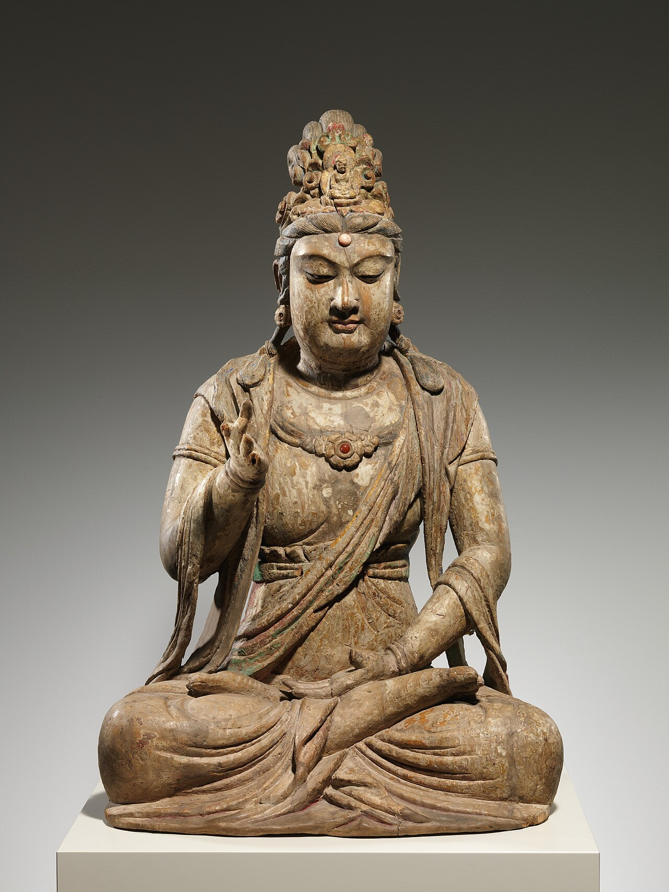
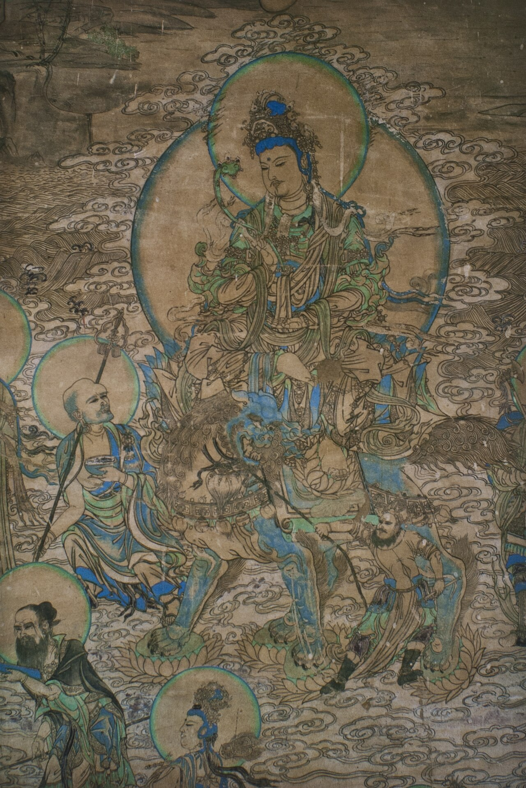
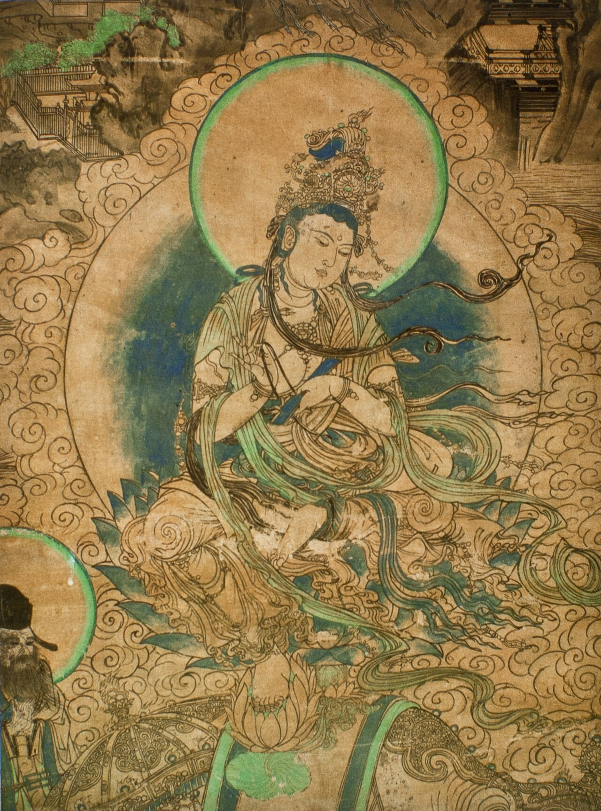
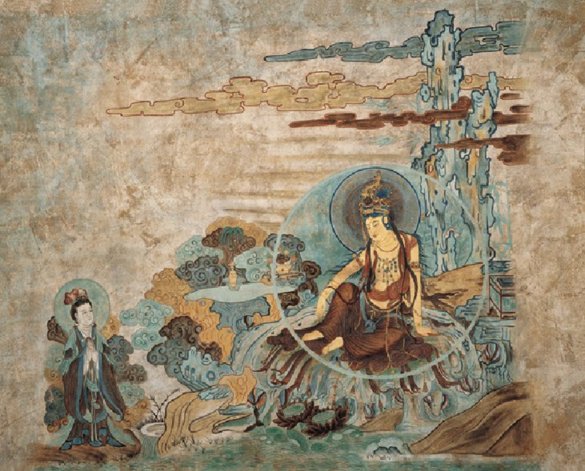
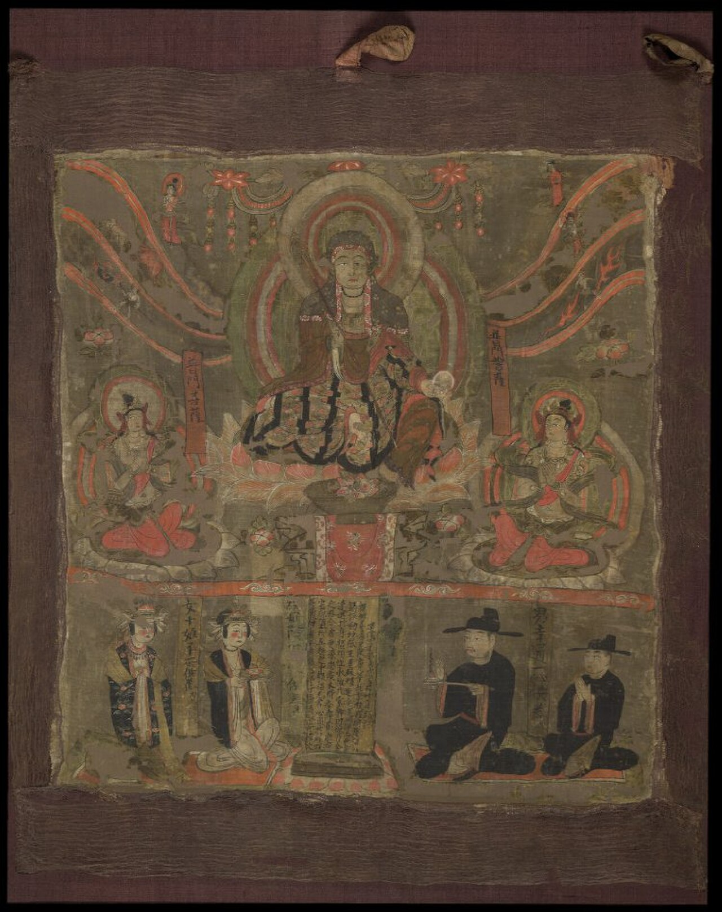
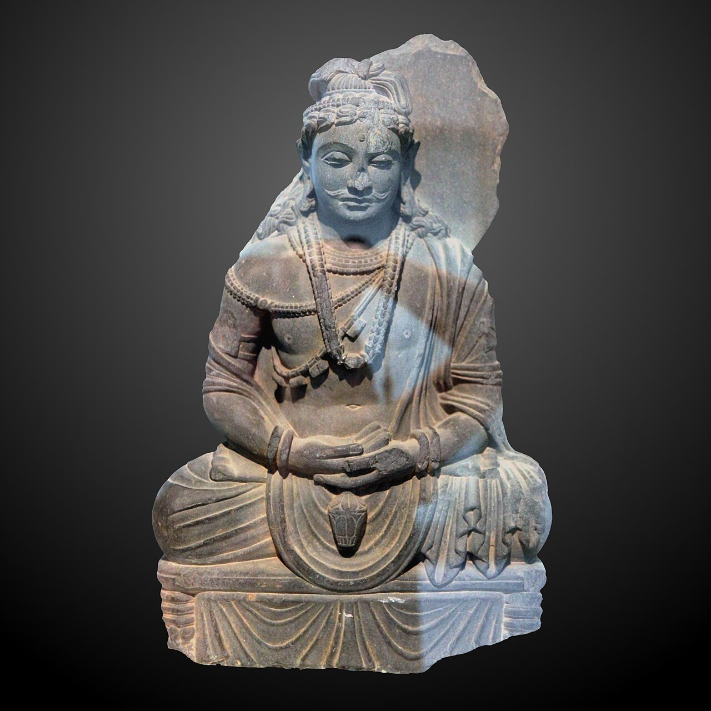

{width=70% fig-align="center"}

在中国寺院里，人们最熟悉的往往不是佛教史上的某次结集，也不是某一部深奥论典，而是一张张慈悲庄严的面容。有人在观音菩萨像前倾诉苦恼，有人在地藏菩萨像前追思亲人，有人仰望文殊菩萨，祈愿增长智慧；普贤菩萨骑着白象，象征愿行广大；弥勒菩萨笑口常开，仿佛在提醒世人：未来仍然值得期待。

这些菩萨为什么会出现在佛教中？佛陀不是已经讲过四圣谛、八正道和涅槃了吗？为什么在佛陀灭度数百年后，佛教又逐渐出现了般若、菩萨道、六度、净土以及众多佛菩萨信仰？所谓“大乘”，是不是另外创立了一种与早期佛教完全不同的宗教？要理解这些问题，需要从一个人面对众生苦难时产生的愿望说起。这个愿望是：**我不仅希望自己离苦，也希望一切众生都能离苦；我不仅追求个人的解脱，还愿意学习佛陀，走完通往圆满觉悟的道路。** 这就是菩萨心的开始。

---

## 一、大乘佛教不是在某一天突然诞生的

佛教史上并没有一个确切的日子，可以被称为“大乘佛教成立日”。大乘也不是由某位祖师召集众人，另立教团、重新制定戒律后创立的。现代学术研究对于大乘佛教究竟起源于什么地区、什么群体，仍有不同意见。比较稳妥的说法是：在公元前后数百年间，印度不同地区的佛教修行者，围绕成佛理想、菩萨实践和新的经典传统，逐渐形成了多条相互联系而又不完全相同的发展路线。

早期大乘修行者也未必与其他佛教僧人截然分开。他们可能生活在同一座寺院，遵守相同或相近的部派戒律，只是在所诵持的经典、所发的誓愿和所追求的修行目标上有所不同。因此，与其把大乘想象成一次突然的“宗派分裂”，不如把它理解为佛教内部逐渐兴起的一种新愿景。现代研究也越来越倾向于使用“大乘运动”或“多种大乘传统”这样的说法，而不是把它看作一个从一开始便组织严密、教义完全统一的宗派。

东汉时期，来自西域的译经僧支娄迦谶已经在洛阳翻译《道行般若经》《般舟三昧经》等大乘经典。这说明到公元二世纪，大乘经典及其修行传统已经形成，并开始向中国传播。但这些经典在印度的酝酿和流传，显然还要更早。

印顺法师在研究初期大乘佛教时，曾作出一个简明而重要的判断：
> “菩萨行人的出现，就是大乘佛法的兴起。”

也就是说，大乘佛教最根本的标志，不是寺院里多供奉了几尊菩萨，也不是经典中出现了多少神奇世界，而是现实中出现了一批愿意发心成佛、长期实践菩萨道的人。

---

## 二、“大乘”的“大”，大在哪里？

“乘”，原意是车乘，可以把人从一个地方运送到另一个地方。佛教借用这个比喻，把教法称为“乘”：众生依教修行，如同乘车渡过生死苦海，到达解脱彼岸。

“大乘”的“大”，首先体现在愿心广大。修行者不只问：“我怎样才能从烦恼中解脱？”还会进一步追问：“既然我知道烦恼与生死是苦，其他众生也同样在苦中，我能不能在自己修行的同时，也帮助他们离苦？”

其次，大乘所追求的目标是圆满成佛。在大乘经典中，菩萨不仅希望断除个人烦恼，还希望像释迦牟尼佛一样，圆满智慧与慈悲，具备教化众生的能力。因此，菩萨所追求的不只是“我获得安宁”，而是“我应当成就足以利益众生的智慧和德行”。

不过，这并不意味着早期佛教或声闻修行缺少慈悲，更不意味着追求个人解脱就是自私。佛陀时代的教法本来就包含慈、悲、喜、舍，也强调布施、持戒与利益他人。大乘真正改变的，是对最高修行理想的强调：佛陀过去所走过的成佛之路，不再只是释迦牟尼佛个人遥远的往事，而被进一步理解为所有人都可以发愿学习的道路。从这个意义上说，大乘不是简单地否定原有佛法，而是在四圣谛、缘起、无常、无我和八正道的基础上，把佛陀因地修行的菩萨精神进一步展开。

---

## 三、从佛陀的过去生，到人人可以走的菩萨道

在早期佛教中，“菩萨”主要指释迦牟尼佛尚未成佛以前的身份。悉达多太子在菩提树下成道以前是菩萨；佛陀在久远过去世中修行布施、忍辱、慈悲时，也被称为菩萨。各种本生故事讲述的，正是佛陀在过去生中如何积累福德与智慧。

随着大乘佛教兴起，“菩萨”这个名称的范围发生了重要变化。它不再只属于成佛以前的释迦牟尼，也不再只是遥远传说中的圣者。任何人，只要真正发起求成佛道、利益众生之心，并开始依此修行，就可以称为菩萨道的学习者。

这是一种极为深刻的转变。过去，人们仰望佛陀，可能会觉得佛陀伟大而遥远；大乘佛教则进一步告诉人们：佛陀所走过的路虽然漫长艰难，却并非完全不可学习。菩萨不是天生的神灵，而是从发心开始，在一次次选择中逐渐成长的人。

当然，初发心的普通人与文殊、观音等大菩萨，在智慧和修行境界上相差极远。但他们所朝向的方向是一致的：上求佛道，下化众生。因此，“菩萨”既可以指已经具有高深智慧和广大功德的大菩萨，也可以指刚刚发起菩提心、开始学习菩萨行的人。它首先是一个修行身份，而不是神仙世界中的固定官阶。

---

## 四、菩提心：菩萨道的第一步

一个人为什么要成佛？如果只是为了自己比别人更高、更有能力，甚至为了得到神通、名望和供养，这仍然没有离开贪著。大乘佛教所说的成佛之心，是为了使自己具备真正利益众生的智慧与能力。这样的心被称为“菩提心”。

“菩提”就是觉悟。菩提心可以简要理解为：**愿成就无上觉悟，以利益一切众生。**

它同时包含两个方向：一是向上求取佛陀的智慧；二是向下关怀仍在苦难中的众生。只有慈悲而没有智慧，可能因为不了解因缘而好心办坏事；只有智慧而缺少慈悲，又可能把佛法变成冷漠的哲学。菩提心把二者结合起来：因为看见众生之苦，所以愿意成佛；因为知道自己仍有烦恼和无明，所以必须不断修学。

中国佛教常用“四弘誓愿”表达这种精神：
> 众生无边誓愿度，  
> 烦恼无尽誓愿断，  
> 法门无量誓愿学，  
> 佛道无上誓愿成。

这一完整而固定的汉语表达，是中国佛教在长期修行仪轨中逐渐形成的。天台智者大师的著作已将四弘誓愿与苦、集、灭、道四圣谛联系起来：因为看见众生之苦，所以发愿度众生；因为知道烦恼是苦的根源，所以发愿断烦恼；因为离苦需要道路，所以发愿学法门；因为究竟解脱即是圆满觉悟，所以发愿成佛道。这里的“度”，不是把众生当作没有能力的人，强行拖到彼岸；而是帮助众生认识苦因、增长智慧，最终获得自主离苦的能力。

发愿也不是一句豪言壮语。真正的愿，必须落实到行为中。一个人每天诵念“众生无边誓愿度”，却对家人的痛苦毫不关心，对同事的困难冷眼旁观，这个愿就仍然停留在声音里。菩提心虽然广大，却总要从眼前的一人一事开始。

---

## 五、六度：菩萨怎样把愿望变成道路？

只有慈悲的愿望，还不能完成菩萨道。看见别人受苦时，我们可能会一时感动；但真正帮助众生，需要品格、耐心、判断力和长期训练。大乘佛教把菩萨修行的主要内容概括为“六波罗蜜”，汉语通常称为“六度”。“波罗蜜”有到彼岸、成就、圆满之意。六度就是六类帮助修行者越过烦恼、趋向觉悟的实践：**布施、持戒、忍辱、精进、禅定、般若。** 这一体系在般若类经典、《大智度论》及众多大乘经论中被反复阐释。

### 1. 布施：松开紧抓不放的手
布施不仅是捐钱。给予食物、药品和财物，是财布施；把知识、经验和正确方法分享给别人，是法布施；在他人恐惧无助时给予安慰和保护，是无畏施。
布施首先对治的是悭贪。人总想把财富、时间、名声乃至感情紧紧抓住，仿佛拥有得越多，自己便越安全。但抓得越紧，害怕失去的心也越强。布施不是轻视财富，而是学习不被财富占有。现代人的布施，可以是一笔善款，也可以是认真听一个孤独的人说话；可以是把专业知识教给年轻人，也可以是在公共空间中给别人多留一点方便。

### 2. 持戒：不让自己的自由成为别人的灾难
戒律常被误解为外在约束。但从菩萨道看，持戒首先是对他人负责。因为自己的贪欲、愤怒和冲动可能伤害别人，所以愿意约束身口意，不杀害、不欺骗、不侵占、不滥用关系，也不让一时情绪破坏长期信任。
真正的自由不是“想做什么就做什么”，而是有能力不被欲望牵着走。菩萨持戒，也不是为了证明自己比别人清净，而是为了使他人能够安心接近自己。一个诚实、稳重、不伤害他人的人，本身就是他人安全感的来源。

### 3. 忍辱：有力量承受，却不让仇恨继续扩散
忍辱不是软弱，更不是要求受害者默默接受伤害。佛教所说的忍，包括面对误解与冒犯时不立即被愤怒控制，面对疾病与挫折时不轻易崩溃，以及面对深奥佛法时愿意耐心思考。
忍辱不是没有立场，而是在维护正义时，尽量不让仇恨占领自己的心。愤怒有时能提醒我们不公正在发生，但若完全被愤怒支配，人便容易复制自己所反对的伤害。忍辱使人能够在行动之前看清：什么是真正有效的回应，什么只是情绪的报复。

### 4. 精进：把一时感动变成长久行动
许多人在听闻佛法或经历重大事件时，会短暂生起善心。但热情退去以后，旧习惯又会回来。
精进就是不断使善法增长，使已经生起的善心不轻易退失。它不是焦虑地逼迫自己，也不是与别人比较修行进度，而是知道方向以后，持续前行。今天少说一句伤人的话，明天多完成一件应尽的责任，后天再改掉一个长期习惯——这也是精进。

### 5. 禅定：让散乱的心重新获得安住能力
现代人的心常被消息、声音、欲望和担忧不断拉扯。心若始终散乱，即使想帮助别人，也容易被情绪带走；即使懂得很多道理，遇到事情时仍然无法运用。
禅定不是把头脑变成空白，而是训练心保持清明、稳定和专注。能够看见情绪生起而不立即跟随，能够把注意力带回当下，才能在复杂处境中作出较为明智的判断。

### 6. 般若：看见事物真实的因缘关系
般若常被译为智慧，但它不只是知识丰富或头脑聪明。世间的聪明可以帮助人赢得竞争，也可能被用来欺骗和控制他人。般若所要看见的，是无常、无我、缘起与空性：世间没有任何事物可以脱离因缘而独立存在，也没有一个永恒不变、完全由自己控制的“我”。

六度并不是六件彼此分开的善事。没有布施，慈悲容易停留在口头；没有持戒，善意可能伴随伤害；没有忍辱，遇到阻力便会退转；没有精进，修行难以持续；没有禅定，内心无法稳定；没有般若，前五度又可能变成对功德、名声和自我形象的执著。《大乘本生心地观经》强调，修行若能导向无上菩提，才可称为真实的波罗蜜。换句话说，同样一次布施，若只是为了炫耀财富，虽然也可能帮助别人，却还不是圆满的菩萨行；若以清净愿心利益众生，又能减少对“我做了好事”的执著，才逐渐具有波罗蜜的意义。

---

## 六、慈悲与智慧：菩萨道的两只翅膀

大乘佛教最常被提及的两个词，是慈悲与智慧。

慈，是希望众生获得安乐；悲，是看见众生受苦而愿意帮助其离苦。慈悲不是居高临下的怜悯，而是承认自己与众生同样受到无常、欲望、恐惧和死亡的逼迫。

智慧则使人看见：众生所受的苦不是无缘无故出现的，它由许多条件共同形成。真正解除痛苦，不能只处理表面，还要认识背后的因缘。

印顺法师曾把智慧与慈悲称为佛法的根本，并指出二者都建立在缘起的觉悟上。因为一切众生相互依存，所以他人的痛苦不可能与我毫无关系；也因为一切事物依因缘而生，所以痛苦并非永恒固定，仍有改变的可能。

慈悲告诉我们不能抛下众生，智慧则告诉我们怎样帮助才不至于制造新的执著。因此，菩萨道既不是只有热情的善行，也不是远离人间的抽象思辨。它要求修行者一面走入众生的苦难，一面不被贪爱、愤怒和偏见淹没。

---

## 七、“色即是空”：空不是什么都没有

在大乘佛教中，最容易被误解的概念是“空”。《心经》说：“色即是空，空即是色。”许多人据此认为，佛教是在说世界不存在，人生没有意义，善恶也都无所谓。这种理解恰好与般若思想相反。

“空”所否定的，不是事物的现象和作用，而是事物具有一种不依条件、永远固定不变的自性。

一只杯子由泥土、工匠、火候、运输、购买和使用等条件共同成就。离开这些条件，并不存在一个独立永恒的“杯子本体”。但正因为杯子是因缘所成，它才能被制造、使用、打碎和重新利用。

人也是如此。我们的性格、观念和情绪由身体、家庭、教育、社会经验及当下环境共同形成。它们不是毫无作用，却也不是永远无法改变的实体。一个人若认定“我天生就是这样，永远不可能改变”，便把暂时形成的状态误认为固定自性。

龙树菩萨在《中论》中把缘起与空直接联系起来：“众因缘生法，我说即是空。”因为一切依因缘而生，所以没有独立不变的自性；因为没有固定自性，所以新的因缘可以带来新的变化。空不是虚无，反而是转变得以发生的条件。

因此，“色即是空”不是让人否定现实，而是让人不再把眼前的得失、身份和情绪看成不可改变的绝对存在。“空即是色”则提醒人们，空性并不在现实世界之外。真正理解空，不是逃到一个什么都没有的地方，而是在每一种具体事物中，看见它由因缘和合而成。

空性使智慧不再执著，慈悲使空性不落冷漠。若只说众生皆空，于是对他们的痛苦漠不关心，那并不是真正的般若；若执著众生和自我都是永恒实体，又很容易在帮助中产生控制、占有和疲惫。菩萨以空性放下执著，却以慈悲承担责任。

---

## 八、佛菩萨群像：五种照亮人心的力量

随着大乘佛教发展，经典中出现了众多菩萨形象。这些菩萨并不是把印度原有的神祇简单搬进佛教，也不能只被理解为分管智慧、健康、财富和亡灵的“神仙部门”。他们首先体现菩萨道的不同面向，使抽象的慈悲、智慧和愿力，转化为可以被人理解、礼敬和学习的具体形象。

### 1. 文殊菩萨：智慧不是聪明，而是不被成见遮蔽

{width=80% fig-align="center"}

文殊师利，又称文殊菩萨、妙吉祥菩萨，在大乘佛教中常被视为般若智慧的象征。在《维摩诘经》中，文殊菩萨与维摩诘居士展开了一场著名问答。文殊问：“菩萨云何观于众生？”维摩诘以幻人、水中月、镜中像等譬喻作答，说明菩萨既要知道众生与诸法没有固定自性，又不能因此舍弃慈悲。

文殊所象征的智慧，不是处处争赢，也不是懂得许多艰深名词。真正的智慧首先愿意承认：“我的看法可能并不完整。”
人与人发生冲突时，双方往往都把自己的角度当作唯一事实。文殊的智慧提醒人们，先放下坚固成见，重新观察事情由哪些条件造成。能够看见因缘，才可能找到超越对立的出路。

佛教造像中的文殊常持智慧剑。这把剑不是用来伤害众生，而是斩断无明与执著。它所斩断的，正是“我一定正确”“事情只能如此”“这个人永远不会改变”等僵硬判断。

### 2. 普贤菩萨：再宏大的愿，也要落实为行动

{width=80% fig-align="center"}

如果说文殊象征智慧，普贤菩萨则特别象征实践与行愿。“普”是普遍，“贤”是善德。普贤行意味着所行善法不只针对少数亲近之人，而要逐渐扩展到一切众生。

《华严经·普贤行愿品》提出“十种广大行愿”，从礼敬诸佛、称赞如来、广修供养开始，进一步包括忏悔、随喜、请法、请佛住世、随学佛行、恒顺众生和普皆回向。这些愿看似宏大，其实都可以在日常中开始。

礼敬诸佛，可以从尊重每个人觉悟的可能开始；称赞如来，可以转化为学习看见他人的善意与长处；忏悔业障，不只是仪式中的自责，而是承认过失并认真改正；随喜功德，则是看见别人成功时，不让嫉妒吞没自己的心。

“恒顺众生”也不是无原则地迎合所有欲望。真正的顺，是理解众生的处境和根器，以对方能够接受的方式给予帮助，同时不违背正法。普贤菩萨提醒人们：愿望若不进入行动，就仍然只是想象；行动若没有广大愿心，又容易局限于个人得失。

### 3. 观音菩萨：听见世间的声音

{width=70% fig-align="center"}

观世音菩萨是汉传佛教中最广为人知的菩萨之一。“观世音”可以理解为观察世间众生的音声。《法华经·观世音菩萨普门品》说，众生若在苦恼中忆念观世音菩萨，菩萨即观其音声，使其得到解脱。

无论人们如何理解经典中的感应，观音信仰所表现的核心精神都非常明确：**众生发出的痛苦声音，应当被听见。**
很多时候，人并非完全没有解决问题的能力，只是从来没有人真正听他说话。听见，并不等于立即评价；慈悲，也不等于匆忙说教。一个人遭遇失去和创伤时，最先需要的往往不是“你应该想开一点”，而是有人愿意陪伴他，不逃避他的眼泪。

观音菩萨有三十三应、千手千眼等不同形象。千眼象征看见众生不同的苦，千手象征用不同方法给予帮助。慈悲不是只有一种固定形式：面对饥饿者，应先给予食物；面对无知者，可以给予教育；面对恐惧者，需要给予保护；面对执迷者，有时则需要坚定而善巧的劝诫。

《心经》的开头也是“观自在菩萨”修行甚深般若，照见五蕴皆空。由此可见，观音所代表的慈悲并不离开般若智慧；真正自在，也不是离开众生，而是在帮助众生时不被执著束缚。

### 4. 地藏菩萨：最幽暗的地方，也不轻易舍弃

{width=65% fig-align="center"}

地藏菩萨常出现在墓园、超荐法会和追思亡者的场合，因此很多人以为地藏菩萨只与死亡和地狱有关。事实上，地藏信仰的核心不是死亡，而是**对最苦难众生的不舍弃**。

《地藏菩萨本愿经》中，地藏菩萨在过去世发愿，要为受苦众生广设方便：“尽令解脱，而我自身，方成佛道。”后世广为流传的“地狱不空，誓不成佛；众生度尽，方证菩提”，正是对这类本愿精神的凝练概括，但并非《地藏菩萨本愿经》中逐字出现的完整原句。

这一区分很重要。尊重传统，不等于把所有流行语都说成佛经原文。流行语虽然准确表达了地藏菩萨的广大愿力，引用时仍应说明它是后世概括。

“地藏”二字，也富有象征意义。大地承载万物，不因污秽而拒绝；宝藏深埋地下，等待被发现。《地藏十轮经》传统以“安忍不动，犹如大地”形容地藏菩萨的德行。

地藏菩萨的愿，尤其面向容易被世人放弃的众生：造下重业者、堕入恶趣者、身处幽暗痛苦者。其精神不是纵容恶行，而是认为即使一个人犯过严重错误，也不应被永远判定为毫无改变可能。

《地藏菩萨本愿经》中又有女子为救母亲而发愿修行的故事，使地藏信仰与中国重视孝亲、追荐亡者的文化紧密结合。但若只把地藏菩萨理解为“管理亡者的菩萨”，便缩小了地藏愿力。凡是被遗忘、被排斥、被认为无可救药的地方，都是地藏精神所面对的地方。

### 5. 弥勒菩萨：未来仍有成佛与改善的可能

{width=75% fig-align="center"}

弥勒菩萨是佛教传统中的未来佛。依弥勒经典的说法，弥勒菩萨现在居于兜率天，将在遥远未来降生人间、修行成佛，并再次宣说佛法。因此，弥勒信仰包含着鲜明的未来希望：释迦牟尼佛虽然已经入灭，佛法与觉悟的可能并未永远终止。

但中国寺院天王殿里那尊袒胸露腹、笑口常开的“弥勒佛”，与印度早期头戴宝冠、庄严端坐的弥勒菩萨形象很不相同。

这尊笑佛的直接原型，是中国五代时期的布袋和尚契此。布袋和尚体态丰满，常背布袋游行民间。后世相传他是弥勒菩萨的化身，布袋和尚的形象便逐渐与弥勒信仰融合，形成中国佛教特有的笑弥勒形象。日本国立文化财机构所藏南宋至元代《布袋图》，也明确说明布袋和尚被视为弥勒佛化身而受到信众爱戴。

因此，笑呵呵的弥勒并不是说修行只要乐观开怀，更不是鼓励对一切问题一笑置之。他的笑容包含的是宽容与希望：能够容纳人与事的不圆满，不因眼前黑暗便断定未来没有光明。

弥勒代表的未来，也不能只是被动等待。真正期待未来佛的人，应当从现在开始种下未来的因。今天少一点仇恨，多一点善意；少一点欺骗，多一点诚信，便是在为较好的未来准备条件。

---

## 九、菩萨是不是“比佛低一级的神仙”？

这是大众理解佛教时最常见的误区之一。

从成佛过程来看，佛是已经圆满觉悟者，菩萨是发愿成佛并修行菩萨道者。因此，若只从修行是否圆满而言，尚未成佛的菩萨当然仍在道路上。但这不等于佛教中存在一个类似世俗官僚体系的固定神仙等级：佛最高，菩萨次之，罗汉再次之，然后各自管理不同事务。

首先，“菩萨”所涵盖的范围很广。刚刚发心的普通修行者可以称为初发心菩萨；文殊、普贤、观音、地藏等，则是在大乘经典中具有不可思议功德的大菩萨。

其次，佛菩萨受到礼敬，不只是因为他们“权力很大”，而是因为他们体现了值得学习的觉悟与德行。礼拜文殊，是提醒自己学习智慧；礼拜观音，是训练自己听见苦难；礼拜地藏，是不轻易舍弃幽暗处的众生；礼拜普贤，是让愿望成为行动；礼拜弥勒，是保持对未来的信心。若只求菩萨替自己消灾，却不愿学习菩萨的慈悲与行为，便容易把佛教信仰变成单方面索取。

---

## 十、菩萨为什么还要成佛？

有人会问：菩萨既然已经如此慈悲，为什么还要追求成佛？留在人间帮助别人不就可以了吗？
这个问题背后，常有一种流行说法：菩萨为了救度众生，故意“推迟成佛”或“拒绝涅槃”。

这种表达虽然容易理解，却不够准确。菩萨发愿成佛，正是因为只有圆满断除无明、具足智慧与方便，才能最充分地利益众生。成佛不是离开众生的私人奖赏，而是菩萨道的圆满。

菩萨不急于只求个人寂静，也不执著某种与世界完全隔绝的安乐；但这并不意味着菩萨拒绝觉悟。相反，菩萨必须不断增长智慧，因为没有智慧的帮助十分有限；也必须不断净化烦恼，因为一个仍被贪嗔痴完全控制的人，很难长久利益别人。

因此，菩萨道不是在“自我修行”和“帮助别人”之间二选一。修正自己，是为了不把自己的烦恼传给别人；利益别人，也使自己的修行不落入自我中心。二者相互成就。

---

## 十一、普通人怎样开始学习菩萨道？

面对“众生无边誓愿度”这样的宏愿，普通人很容易感到遥远。我们连自己的情绪都未必能够处理，又怎么可能度尽众生？

其实，菩萨道从来不是要求初学者在一天之内完成无量功德。它只是要求我们改变人生的基本方向：不再只围绕“我得到什么、我失去什么”生活，而开始把他人的安乐也纳入自己的选择。

当你准备说一句伤人的话时，愿意先停一下，这是持戒。
当别人取得成就时，能够放下嫉妒，真心随喜，这是普贤行。
当亲友痛苦时，不急着指责，而是认真倾听，这是观音行。
当遇见被排斥的人，不立刻把他判定为无可救药，这是地藏行。
当固有观念受到挑战时，愿意重新观察因缘，这是文殊行。
当现实不如人意，却仍愿意为更好的未来播种，这是弥勒行。
当自己有能力时，愿意分享时间、财富与知识，这是布施。
当善意受到误解，仍然不让仇恨占领内心，这是忍辱。

菩萨不一定站在云端。菩萨道常常开始于一个极普通的瞬间：一个人本可以只顾自己，却愿意为另一个生命多想一步。

---

## 十二、大乘真正扩大的，是人的心量

大乘佛教的兴起，为佛教世界带来了大量经典、哲学体系、佛菩萨形象和修行方法。《般若经》深入讨论空性与智慧；《心经》用极短篇幅凝聚般若精义；《金刚经》教人不住于相而行布施；《法华经》赞叹一切众生成佛的可能，并展开观世音菩萨的慈悲救度；《华严经》呈现广大菩萨行与普贤愿海；《地藏菩萨本愿经》和《大乘大集地藏十轮经》彰显不舍恶趣众生的深愿。

这些经典内容丰富，思想也并不完全相同，但它们共同指向一种精神：**觉悟不能只停留在个人内心，智慧必须转化为慈悲，慈悲必须落实为行动。**

大乘的“大”，并不是自称比别人优越，也不只是寺院规模大、经典数量多、佛菩萨形象丰富。它真正要扩大的，是人的心量。当一个人只看见自己的得失，世界便狭窄得只剩下一个“我”；当他开始看见众生与自己一样渴望安乐、畏惧痛苦，生命的边界便逐渐打开。

大乘佛教并不要求每个人一开始就成为伟大的圣者。它只是把一个问题放在我们面前：**在这个充满无常与苦难的世界里，我愿意只求自己脱身，还是愿意在走向光明时，也为别人留下一盏灯？** 菩萨道，便从这盏灯开始。

---

## 本章经典辨析

### 一、“众生无边誓愿度”
这是中国佛教“四弘誓愿”的第一愿，集中表达菩萨普度众生的愿心。其固定汉语形式见于中国佛教祖师的教义整理和修行仪轨，不宜简单说成某一部早期印度经典中的单独原句。

### 二、“地狱不空，誓不成佛”
这句话准确概括了地藏菩萨不舍恶趣众生的本愿精神，但并非现行《地藏菩萨本愿经》的逐字原文。经中相近原文为：“尽令解脱，而我自身，方成佛道。”
正式出版时宜写作“后世常以‘地狱不空，誓不成佛’概括地藏菩萨的本愿”，以避免把流行概括误作经文原句。

### 三、“色即是空，空即是色”
“空”不是不存在，而是没有脱离因缘、固定不变的自性。正因为一切法缘起性空，现实中的改变、修行与解脱才有可能。

---

## 本章主要参考经典与著作

本章历史部分主要参考印顺法师《初期大乘佛教之起源与开展》《印度佛教思想史》，并综合现代学界关于早期大乘具有多中心、多路线特征的研究。

菩萨道、六度与空性部分，主要依据《般若波罗蜜多心经》《摩诃般若波罗蜜经》《大智度论》《中论》《法界次第初门》及印顺法师《中观今论》。

佛菩萨群像部分，主要依据《维摩诘所说经》《妙法莲华经·观世音菩萨普门品》《大方广佛华严经·普贤行愿品》《地藏菩萨本愿经》《大乘大集地藏十轮经》及《佛说弥勒下生经》。

**排印说明：本章佛典引文为便于普通读者阅读，统一按现代简体字和通行标点排印。**
