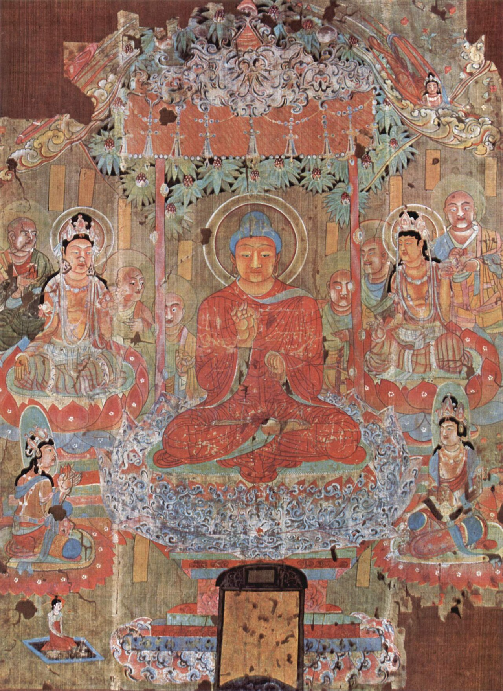

{width=85% fig-align="center"}

暮色降临，寺院的晚钟缓缓响起。大殿里，僧众合掌念诵；山门外，一位老人一边走路，一边低声念着：“南无阿弥陀佛。”这句佛号，中国人实在太熟悉了。在寺院的早晚课中，在乡村老人的念珠间，在临终者的床前，在亲人送别亡者的诵念声里，人们都可能听见它。即使从未系统接触过佛教，许多人也知道“阿弥陀佛”四个字。它有时是问候，有时是祝愿，有时是面对无常时的一声安慰，有时又成为一个人终身坚持的修行。

可是，阿弥陀佛究竟是谁？极乐世界是不是佛教所说的天堂？念一句佛号，真的就能解决生死问题吗？如果净土法门只教人等待来世，它是不是一种逃避现实的信仰？为什么这样一个看似简单的法门，能够跨越地域、阶层与时代，流传一千多年，成为汉传佛教中影响最广泛的修行方式之一？

要理解这一切，必须先回到一个关于愿心的故事。

---

## 一、从法藏比丘的四十八愿说起

净土经典中的阿弥陀佛，并不是一开始就以佛的身份出现的。按照《无量寿经》的叙述，在极其久远的过去，有一位国王听闻世自在王佛说法，心中生起了强烈的出离心与菩提心。他舍弃王位，出家修行，法名“法藏”。法藏比丘并不只想自己得到解脱。他看到众生在生死中流转：有人贫穷困苦，有人身体残缺，有人长期被贪欲、愤怒和恐惧控制；有人虽然想修行，却生在缺少佛法的地方；有人稍有进步，又因环境恶劣、烦恼深重而退转。于是，他产生了一个宏大的愿望：建立一个清净安稳的国土，使来到那里的人不再被恶劣环境逼迫，能够亲近佛法，继续修行，直至觉悟。

为了知道什么样的国土最适合众生修行，法藏比丘观察、思惟无数佛国的优点与不足，经过长久修学，最终在世自在王佛面前发下四十八大愿。这些愿望涉及的内容十分广泛：国中没有恶道，没有贫富贵贱造成的歧视；众生具有良好的身心条件，能够听闻佛法；来到这个国土的人不再轻易退失修行之心；十方众生若真诚相信、愿意往生，并忆念佛名，便能得到接引。

其中最受后世重视的是第十八愿。经文说：

> “十方众生，至心信乐，欲生我国，乃至十念。”

完整愿文以一种近乎誓约的语气表达：如果十方众生真诚信受，愿生彼国，乃至十念而不能往生，法藏便不取正觉。《无量寿经》因此把法藏的成佛与众生能否获得救度联系在一起：他不是先成佛，然后偶尔帮助众生；他的佛果本身，就是由救度众生的愿行所成就的。经过不可思议的长期修行，法藏比丘圆满大愿，成就佛道，号“阿弥陀佛”，他所成就的清净国土，称为“极乐世界”或“安乐国”。

这里需要提醒读者：法藏比丘发愿，是佛教经典中的宗教叙事，不是现代历史学意义上能够考证年月、地点的传记。它的意义不在于提供一份古代人物档案，而在于表达大乘佛教的一个核心理想：

**真正的觉悟，不是独自逃离苦海，而是发愿创造条件，使更多众生都能走向觉悟。**四十八愿，说到底，是一位菩萨对苦难众生作出的四十八种承诺。

---

## 二、“阿弥陀”是什么意思？

“阿弥陀”是古代译经家对印度语言的音译。佛教文献中常见两个相关名称：Amitābha，意为“无量光”；Amitāyus，意为“无量寿”。因此，阿弥陀佛又被称为“无量光佛”或“无量寿佛”。所谓“无量光”，并不是说阿弥陀佛像一颗发出物理光线的巨大星体。佛教常以光明象征智慧：智慧能够照破无明，使人看清烦恼的来源，也能平等照见一切众生，不因贫富、身份、聪明或愚钝而有所遗漏。

所谓“无量寿”，也不仅是寿命无限延长。它象征佛的觉悟与慈悲不受普通生命期限的限制，不会因为一位教主的肉身死亡而消失。众生无尽，救度众生的愿心也无尽。因此，“阿弥陀佛”这个名字，本身便包含了两个重要意象：

**以无量智慧照见众生，以无量慈悲摄受众生。**人们念诵“阿弥陀佛”，不仅是在呼唤一尊遥远的佛，也是在不断提醒自己：不要让内心完全被狭隘、怨恨和恐惧占据，应当向光明、长远和慈悲的方向转变。“南无阿弥陀佛”比“阿弥陀佛”多了“南无”二字。“南无”也是音译，含有归命、归依、礼敬之意。因此，六字佛号大体可以理解为：

**我归依、礼敬无量光明与无量寿命的阿弥陀佛。**它不是一句用来命令神灵的咒语，而是一种归向：把散乱的生命重新安放在一个明确的方向上。

---

## 三、极乐世界究竟是什么地方？

《阿弥陀经》说，从我们这个世界向西方，经过十万亿佛土，有一个世界名叫极乐，其中有佛，号阿弥陀。经中描绘，那里的土地清净，池水澄澈，莲花盛开，微风吹动宝树，发出和雅之音；众生没有恶道之苦，能够经常听闻佛法，与许多善人共同修行。现代读者读到这里，很容易产生两种完全相反的反应。

一种反应是把极乐世界想象成某个可以用宇宙飞船抵达的星球，甚至试图用现代天文学为它寻找坐标。另一种反应则认为，极乐世界不过是一种心理安慰，所谓“西方”与“往生”全部只是比喻，并不存在任何超越个人意识的意义。这两种解释都过于简单。在传统净土信仰中，极乐世界首先被理解为阿弥陀佛愿力所成就的清净佛国，是众生可以发愿往生的真实归趣。佛教经典以“西方”为它指定方向，使修行者的心有所归向，而不是在无边无际的想象中漂浮。

与此同时，中国佛教也发展出“唯心净土”“自性弥陀”等解释，强调净土不能完全离开人的心。一个人的内心若充满贪婪、仇恨与伤害，即使嘴上谈论净土，他所生活的世界仍会不断被烦恼染污；当人的心逐渐清净，现实中的人际关系与生活环境也会随之改变。因此，汉传佛教中常同时保留两种理解：

一方面，极乐世界是阿弥陀佛愿力成就的佛国，不能被简单取消为心理幻象；另一方面，求生净土也必须从净化当下的身口意开始，不能把净土与现实生活完全割裂。更重要的是，极乐世界并不是供人永远享乐的终点。佛教所说的“极乐”，并非纵情享受感官刺激，而是远离严重障碍，能够安心学佛。在极乐世界往生的目的，不是住进一座永不散场的快乐宫殿，而是亲近阿弥陀佛与诸大菩萨，听闻正法，不再退转，最终成佛。

所以，净土不同于一般意义上的天堂。天堂通常被理解为善人死后获得永久奖赏的地方；净土则更像一所条件完善的修行道场。往生不是毕业，而是进入一个更适合学习的环境；不是结束菩萨道，而是为了更有能力继续菩萨道。《阿弥陀经》说，往生彼国者能够与“诸上善人俱会一处”，而且多能达到不退转。由此可见，极乐世界最重要的庄严，不是黄金铺地，也不是楼阁珠宝，而是那里具备了使人持续向善、向觉悟前进的条件。

---

## 四、西方三圣：慈悲与智慧共同接引众生

在汉传佛教寺院中，人们常看到三尊并列的佛菩萨像：中间是阿弥陀佛，一侧是观世音菩萨，另一侧是大势至菩萨，合称“西方三圣”。阿弥陀佛代表无量光明、无量寿命与摄受众生的本愿。观世音菩萨代表慈悲。所谓“观世音”，就是观察、听闻世间众生的苦难，并随缘给予帮助。观音的慈悲，使净土信仰不只是个人寻求安宁，也包含了对他人痛苦的关怀。

大势至菩萨代表智慧与精进的力量。“大势至”意味着以强大的智慧之势，使众生远离迷惑，趋向觉悟。在后世汉传佛教中，大势至菩萨尤其与念佛修行联系在一起，象征专注、忆念与不间断的道心。《观无量寿佛经》不仅教人观想极乐国土和阿弥陀佛，也分别讲述观世音、大势至二菩萨；经末还把全经称为观极乐国土、无量寿佛、观世音菩萨和大势至菩萨之经。因此，后来寺院以三尊并列的形式表现净土信仰，并非偶然。

三圣的组合，也可以看成一幅完整的修行图景：

只有愿望而没有慈悲，修行可能变得只顾自己；只有慈悲而缺少智慧，善意有时会失去方向；只有智慧而缺少持久愿力，又容易在困难面前退缩。阿弥陀佛的愿、观音菩萨的悲、大势至菩萨的智，共同构成了净土法门的精神结构。

---

## 五、净土三经分别讲了什么？

汉传佛教通常把《无量寿经》《观无量寿佛经》《佛说阿弥陀经》合称“净土三经”。三部经典的侧重点各不相同，合在一起，构成了净土信仰的基本轮廓。现存译本及相关经典传统，后来也深刻影响了中国、日本、朝鲜半岛与越南等地的佛教实践。

### 1.《无量寿经》：阿弥陀佛为什么建立净土？

《无量寿经》篇幅较长，核心是法藏比丘发愿、修行、成佛以及极乐世界的庄严。如果说净土法门是一座建筑，《无量寿经》讲的是它的地基：阿弥陀佛为什么发愿？极乐世界为何建立？众生依靠什么因缘往生？往生之后又将走向何处？四十八愿中，有些愿解决众生身体与环境的缺陷，有些愿保证众生能够闻法，有些愿强调不退转，有些愿则与闻名、发愿和往生有关。

这说明净土并不是阿弥陀佛凭空赠送给众生的一处享乐世界，而是菩萨长期观察众生困境之后，为众生修道所设计的一套完整条件。

### 2.《观无量寿佛经》：在苦难中怎样找到出路？

《观无量寿佛经》以一场王室悲剧开始。摩揭陀国的王子阿阇世为了夺取王位，囚禁父王频婆娑罗。母亲韦提希夫人设法送食物给丈夫，也遭到儿子的怨恨与幽禁。在家庭背叛、政治暴力和巨大痛苦中，韦提希向佛陀求助，希望知道是否有一个远离恶浊、适合修行的清净国土。

佛陀于是为她显示诸佛国土，并教她选择往生阿弥陀佛的极乐世界，随后宣说十六种观法。这部经的重要性在于：净土法门不是从生活顺遂中产生的幻想，而是在现实苦难最深重之处提出的问题——当一个人无力立刻改变外部环境时，他的心还能朝向哪里？十六观包括观落日、观水、观地、观宝树、观宝池、观阿弥陀佛与二大菩萨等。经中又以九品往生说明众生根机与修行程度有所不同，甚至没有能力完成复杂观想的人，也可以通过称念佛名与发愿获得救度。

善导后来概括说，《观经》既以观佛三昧为宗，也以念佛三昧为宗。换言之，这部经既包含精细的禅观，也为称名念佛留下了广阔空间。

### 3.《佛说阿弥陀经》：怎样把净土法门带进日常生活？

《阿弥陀经》篇幅很短，却是汉传寺院中最常诵念的经典之一。它简要介绍极乐世界与阿弥陀佛的功德，劝人发愿往生，并提出持名念佛的方法。经中说：

> “不可以少善根福德因缘，得生彼国。”

接着又说：

> “若有善男子、善女人，闻说阿弥陀佛，执持名号，若一日，若二日，若三日，若四日，若五日，若六日，若七日，一心不乱。”

这段经文成为持名念佛最直接的经典依据。不过，“一心不乱”不宜被理解为：念佛时只要出现一个杂念，所有修行便全部失效。历代祖师对“一心不乱”有不同层次的解释。有的强调禅定功夫，有的强调信愿坚固，有的强调长期专念，不被其他方向动摇。共同点在于，它不是要求修行者在一开始就拥有完全无念的圣者境界，而是教人使散乱的心逐渐集中，让佛号从偶尔想起，变成稳定的生命方向。

---

## 六、净土法门怎样在中国扎根？

净土思想并不是在某一天突然成为一个完整宗派的。佛教传入中国后，关于阿弥陀佛、念佛三昧和清净佛国的经典逐渐被翻译。东汉时期译出的《般舟三昧经》等经典，已经介绍了专念佛陀、在禅定中见佛的修行。后来，《无量寿经》《观无量寿佛经》《阿弥陀经》等相继流传，净土信仰才逐渐形成更清晰的轮廓。

### 慧远：庐山上的念佛之约

东晋高僧慧远长期住在庐山东林寺。约在公元402年，他与一批僧人与在家信众共同发愿，修习念佛三昧，期望往生西方。慧远在《念佛三昧诗集序》中称赞念佛法门：

> “功高易进，念佛为先。”

他所说的“念佛”，主要带有禅观和念佛三昧的意味，与后来普遍流行的口称佛名并不完全相同。慧远重视专注观佛，希望在三昧中见佛，并以此坚定修行。后世常把慧远的团体称为“白莲社”，并尊他为中国净土宗初祖。但从历史文献来看，慧远及其同修者当时未必已经使用“白莲社”这一名称；这一形象是在唐宋以后逐渐丰富、定型的。因此，更谨慎的说法是：慧远在庐山组织了早期具有重要影响的念佛结社，后世净土传统据此尊奉他为初祖。

这种区分并不会降低慧远的地位，反而使我们更清楚地看到：中国净土法门不是由一位祖师一次创立完成的，而是在数百年间，由许多僧人与信众不断实践、解释和发展出来的。

### 昙鸾：仅靠自己，为什么如此困难？

南北朝时期的昙鸾，对中国净土思想产生了重要影响。他特别强调，普通众生烦恼深重、寿命短促，仅靠自己的禅定与智慧，想在一生中彻底断除烦恼，十分困难。阿弥陀佛的本愿，为众生提供了另一种可能：修行者并非孤立地依靠自己，而是在自己的信愿与修行中，接受佛愿力的摄持。

这就是净土思想中常说的“他力”。“他力”并不是说自己什么都不用做，更不是把责任全部推给佛。一个人要相信、发愿、念佛、止恶行善，这些都属于自身的选择与实践；但他不再认为成败完全依靠有限的个人能力，而是承认自己需要佛法、善知识和清净愿力的帮助。

就像一个人渡海，仍然需要登船、辨认方向、遵守航行规则，但不必靠自己的双手游过大海。

### 道绰：为普通人寻找可行之路

隋唐之际的道绰进一步说明，在佛法衰微、众生根机薄弱的时代，艰深的修行不容易普遍实行，念佛求生净土却能够成为多数人可以承担的道路。道绰的意义，不在于否定其他法门，而在于不断追问：

**一个没有高深学问、没有长期闭关条件、还要工作和照顾家庭的普通人，能不能修行？**净土法门给出的回答是：可以。

### 善导：让一句佛号走入千家万户

唐代善导是中国净土教发展中极为关键的人物。他继承道绰的思想，系统解释《观无量寿佛经》，尤其强调凡夫也可以依阿弥陀佛本愿求生净土。现代研究也普遍把善导视为中国净土思想定型过程中的核心人物。善导没有把净土修行只留给能够完成复杂观想的少数禅修者。他特别重视称名念佛，认为这是普通人最容易持续实行的正行。他在《观无量寿佛经疏》中说：

> “一心专念弥陀名号，行住坐卧，不问时节久近，念念不舍者，是名正定之业，顺彼佛愿故。”

这句话把念佛从特定仪式带入了整个生活：行走时可以念，坐下时可以念；独处时可以念，忙碌间隙也可以念；不在于一时激动念了多少，而在于方向确定之后，长久不舍。善导的贡献，是让净土法门从少数人的观想三昧，进一步成为普通人可以实践的日常道路。此后，念佛不再局限于某一宗派。天台、华严、禅宗、律宗的许多僧人，也兼修或提倡净土。中国净土传统不像某些宗派那样始终具有严格单一的师承与寺院体系，它更像一条逐渐汇入整个汉传佛教的河流。

人们可以参禅而念佛，可以研习经教而念佛，也可以持戒、行善、礼佛、诵经，并把功德回向净土。这正是净土法门流传广泛的重要原因：它有自己的经典与祖师，却又不必把自己封闭在一道宗派围墙之内。

---

## 七、信、愿、行：一句佛号背后的三重结构

后世中国净土宗常用“信、愿、行”三个字概括净土法门。这三个字看似简单，实际上缺一不可。

### 1.信：不是停止思考，而是建立信任

净土法门所说的“信”，首先是相信佛陀的觉悟与教法，相信阿弥陀佛的愿心，也相信烦恼深重的普通人仍有改变和觉悟的可能。这种信并不意味着拒绝提问。盲信是因为害怕怀疑而不敢思考；佛教意义上的信，则应当在听闻、理解和实践中逐渐稳固。一个人可以从“不确定但愿意了解”开始，不必强迫自己立刻产生毫无疑问的宗教体验。

更深一层说，净土之信还包括承认自己的有限。现代人习惯把独立理解为“凡事只能靠自己”。一旦失败，便把所有责任变成自我责备。净土法门则提醒人：生命本来就在相互依存中成长。我们需要父母、朋友、老师、社会，也需要佛法和善知识。接受帮助，不一定是软弱；承认有限，也可以成为真正修行的起点。

### 2.愿：为生命选择一个最终方向

“愿”是愿生极乐世界，也是在当下决定：我的生命不再只追逐眼前得失，而要朝向清净、觉悟和利他的方向前进。愿不同于幻想。幻想只是在头脑中期待一个美好结果，却不愿改变自己的行为；愿则具有方向感，它会重新排列一个人的选择。当一个人真正愿意趋向净土，他便会开始反省：现在的生活方式，是使内心越来越清净，还是越来越混乱？说出的话，是增加理解，还是制造伤害？获得财富之后，是更加贪婪，还是愿意帮助别人？

所以，愿生净土不是等到临终才突然产生的念头，而是从现在开始，为生命确定方向。

### 3.行：把方向落实为持续实践

“行”最常见的形式是持名念佛，也包括礼佛、诵经、忏悔、持戒、行善与回向。念佛看似只是重复几个字，但真正的念佛并非嘴唇的机械运动。“念”这个字，本来就有忆念、不忘的意思。口中称名，是借助声音帮助心念集中；耳朵听见自己的佛号，又把散乱的心收回来。

明末蕅益智旭在《阿弥陀经要解》中把净土修行概括为“信愿持名”，并说：

> “得生与否，全由信愿之有无；品位高下，全由持名之深浅。”

这句话在后世影响极大。它强调的重点是：念佛不能与信愿分离。没有方向的重复，只是声音；有了信愿，佛号才成为整个生命的归向。信而无愿，容易停留在知识上；愿而无行，容易停留在想象中；行而无信愿，则容易变成机械习惯。三者结合，才构成完整的净土实践。

---

## 八、“一心不乱”是不是要求完全没有杂念？

许多人开始念佛后，很快便感到沮丧。念了几声，脑中就想起工作；再念几声，又想起昨天与人争吵的情景；有时嘴里念佛，心里却已经安排完明天的所有事情。于是有人认为：“我的杂念这么多，念佛一定没有用。”其实，发现自己散乱，本身已经是一种进步。在没有念佛或静坐之前，人往往意识不到心中有多少念头。佛号像一面镜子，使散乱显现出来。修行并不是一开始就没有杂念，而是每当发现心已跑远，便再回到佛号上。

所谓“一心”，可以先从不同时做许多事开始。念这一声“阿弥陀佛”时，清楚地念；声音从口中发出，耳朵再清楚地听进去。妄念出现，不必愤怒，也不必与它争斗，只需重新听下一声佛号。如此反复，散乱可能仍然存在，但人不再完全被散乱牵走。因此，对普通人而言，“一心不乱”首先不是一种用来恐吓自己的合格标准，而是一条逐渐训练的道路：由散乱走向专注，由偶尔忆念走向相续忆念，由临时求助走向稳定归依。

---

## 九、念佛是不是逃避现实？

这是净土法门最常遭遇的质疑。如果一个人在现实生活中遭遇困难，不去行动，只说“将来往生极乐世界”，这当然可能成为逃避。可是，这不是净土经典本来的全部教导。《观无量寿佛经》在讲观想与往生之前，先提出“净业三福”。其中第一部分便包括孝养父母、奉事师长、慈心不杀、修十善业；后面又包括受持三皈、遵守戒律、发菩提心、深信因果等内容。

这说明，求生净土不是绕过现实伦理的捷径。一个人若一边念佛，一边欺骗、伤害、压迫别人，却认为只要临终再念几声佛号便可解决一切，这不是信仰深厚，而是误解了因果。净土法门真正要改变的，首先是人面对现实的方式。念佛不能代替应该承担的责任。生病仍然要看医生，负债仍然要努力处理，伤害别人仍然需要道歉和补救，社会中的不公仍然需要有人以智慧和慈悲面对。

佛号的作用，不是让问题凭空消失，而是帮助人在恐惧、愤怒和混乱中保持方向，不至于被烦恼完全吞没。韦提希夫人的故事正说明了这一点。她不是因为生活太幸福才求生净土，而是在家庭与政治悲剧中寻找不被仇恨摧毁的道路。从这个意义上说，净土不是逃离现实的借口，而是面对现实之后，不让现实中的恶决定自己最终成为怎样的人。

---

## 十、净土法门是不是只适合老人？

很多人把念佛与老年、疾病和死亡联系在一起，仿佛年轻人一念佛，就显得暮气沉沉。这种印象的形成并不难理解。念佛简单易行，不需要识字，也不要求复杂仪式，因此特别适合年老体弱者；同时，净土法门直接面对死亡问题，也常被用于临终关怀和丧葬佛事。但“适合老人”不等于“只适合老人”。

无常从来不按年龄出现。年轻人也会经历焦虑、失恋、疾病、事业失败和亲人离世。一个人在二十岁时不思考生命方向，并不代表死亡与失去就不存在，只是暂时没有看见。净土修行所处理的问题——注意力散乱、欲望无止境、对失去的恐惧、对未来的不安——恰恰也是现代年轻人的普遍问题。

而且，从历史上看，净土信仰的参与者既有僧人，也有官员、文人和普通百姓；既有临终念佛，也有长期禅观、结社共修和日常行善。它并不是专门为人生最后几年准备的宗教服务。越早知道生命有限，人越可能认真选择如何生活。念佛不是催促人走向死亡，而是提醒人：不要等到死亡临近时，才第一次思考自己究竟要把心安放在哪里。

---

## 十一、念佛是不是只要嘴上念就行？

口称佛名，是净土法门最显著的修行形式，但“开口发声”不等于完成了全部修行。佛教重视身、口、意三业。口中念佛，能够影响内心；内心忆佛，也应逐渐影响行为。如果一个人念佛之后，仍然毫不反省自己的贪婪、愤怒和伤害，那么佛号还没有真正进入他的生命。反过来说，也不能因为自己暂时杂念很多，就断言所有口念都毫无意义。

口念是入口，不是终点。开始时，心可能跟不上口；长期练习后，声音会帮助收摄心念。心念逐渐稳定，又会反过来改变语言和行为。一个经常忆念慈悲与光明的人，应当逐渐减少恶口、欺骗和伤害。善导强调“念念不舍”，重点正在持续，而不是表演某一次完美状态。佛号也不是与行善相互排斥的“密码”。《阿弥陀经》说“不可以少善根福德因缘得生彼国”，提醒修行者：往生不是对现实因果的否定。持名念佛本身被历代祖师视为重要善根，同时，念佛者也应在现实中培植慈悲、诚实、忍让与责任。

真正的念佛，不只是口中有佛，也应当使心中逐渐有光，使行为逐渐少一些伤害。

---

## 十二、普通人怎样开始念佛？

了解净土法门，并不等于必须立刻成为净土宗信徒。不过，即使把念佛当作一种佛教文化与修心方法，普通人也可以从很简单的方式开始体验。每天选择一段相对安静的时间，不必太长。端身坐好或缓慢行走，清楚地念“南无阿弥陀佛”。速度不必追求快，声音也不必很大，以自己能够清楚听见为准。

念的时候，注意三件事：

口中念得清楚，耳中听得清楚，心中知道自己正在念。走神之后，不责备自己，只回到下一声佛号。念诵结束时，可以把心愿从自己扩展到他人：愿自己少一些烦恼，也愿正在受苦的人得到安稳；愿自己走向清净，也愿一切众生终能离苦。这种练习的重点不在计数竞赛，也不在追求神秘感受，而在于培养一种可以反复回归的内在方向。

当人愤怒时，佛号提醒他暂缓伤人的语言；当人焦虑时，佛号帮助他把注意力带回当下；当人得意时，佛号提醒他世事无常；当人面对死亡时，佛号使他知道生命并不只能在恐惧中结束。一句佛号之所以能够流传千年，正是因为它足够简单，可以进入任何人的生活；同时又足够深广，能够承载一个人对生死、慈悲与觉悟的全部追问。

---

## 十三、自力与他力：不是互相排斥的两条路

净土法门经常被称为“他力法门”。有些人因此认为，净土宗不重视个人努力；也有人反过来认为，只要依靠阿弥陀佛，便不需要修正自己的行为。这两种看法都把自力与他力截然分开了。事实上，没有绝对孤立的自力。我们今天能够读书，是因为有人创造文字、保存经典、建立学校；能够生活，是因为无数人在生产食物、维护交通、提供医疗。一个人所谓“靠自己”，本来就包含了许多他人的帮助。

佛教所说的他力，更不是外在神灵任意改变人的命运，而是阿弥陀佛已经成就的愿力，为众生提供了一种可以信受和进入的修行条件。修行者发信心、立愿、念佛，是自己的选择；阿弥陀佛的本愿与净土庄严，是支持这种选择的力量。如果借用一个比喻，自力像是一个人愿意抬脚上船，他力像是船能够载人渡河。没有船，仅凭个人力量渡过惊涛骇浪极其困难；有船却拒绝登船，也无法抵达彼岸。

因此，净土法门既反对傲慢地认为“我完全不需要任何帮助”，也反对懒惰地认为“我什么都不必改变”。承认自己的有限，同时仍愿意努力，这正是净土信仰中谦卑而积极的一面。

---

## 十四、为什么一句佛号能够流传千年？

现在，我们可以回答本章开头的问题了。一句“阿弥陀佛”能够流传千年，并不只是因为它容易念。它背后至少包含了四层力量。第一，它直接面对生死。很多思想可以帮助人获得知识，却回避死亡。净土法门则从不掩饰生命会衰老、会失去、会终结。它告诉普通人：死亡不是不吉利的话题，而是每个人都必须准备的功课。

第二，它为普通人保留希望。佛教修行体系十分广大，其中有深奥的哲学、精细的禅定和严格的戒律。普通人面对这些内容时，容易觉得觉悟遥不可及。净土法门却不断强调：即使能力有限、烦恼深重，只要愿意转身，仍有道路可走。第三，它能够进入日常生活。念佛不依赖特殊场所。行住坐卧、工作休息之间，都可以忆念。它把修行从少数人的山林禅房带到千家万户，使没有学问、没有财富、没有大量空闲时间的人，也能拥有自己的修行。

第四，它把个人安顿与众生救度联系在一起。求生净土不是为了永远离开众生。按照大乘佛教的理想，往生者在净土继续修学，最终仍要回到众生之中。真正的净土愿，不是“只要我平安”，而是希望自己具备更大的智慧与能力，帮助更多生命离苦。因此，净土法门的核心，不只是一个地方，也不只是一种临终安排，而是一种愿的教育。

法藏比丘以四十八愿建立极乐世界；修行者则在念佛中学习发愿。佛的愿是摄受众生，人的愿是归向觉悟。两种愿在一句佛号中相遇。

---

## 结语：给漂泊的心一个方向

人的一生，常常在许多声音中度过。有人催促我们成功，有人要求我们比较，有人不断制造恐惧，也有人告诉我们必须拥有更多，才配得到幸福。我们的心被这些声音拉扯，走得越来越快，却未必知道自己究竟要去哪里。“南无阿弥陀佛”则是另一种声音。它不许诺世间永远顺利，也不否认人生必有痛苦。它只是一次又一次提醒人：在无常中仍可选择方向，在烦恼中仍可忆念光明，在孤独中仍可相信慈悲，在面对死亡时，生命仍有超越恐惧的可能。

念佛不是把自己交给幻想，而是承认自己的有限之后，仍愿意朝向无限的智慧与慈悲。从法藏比丘的四十八愿，到慧远庐山的念佛之约；从善导所说的“行住坐卧，念念不舍”，到千百年来普通人的一声声佛号，净土法门真正延续下来的，是一种不肯舍弃众生的愿心。也许，这正是“阿弥陀佛”四个字最深的意义：

在一个充满无常的世界里，仍然相信每一个生命都不应被轻易放弃。

---

## 常见误解小结

### 1.念佛是不是逃避现实？

念佛若被用来逃避责任，当然会成为消极行为；但经典要求修习十善、孝养父母、慈心不杀。真正的念佛应使人更有力量面对现实，而不是拒绝现实。

### 2.净土是不是佛教的天堂？

极乐世界不是永久享乐的终点，而是远离重大修行障碍、能够闻法并达到不退转的清净佛国。往生的最终目标仍是觉悟与度众生。

### 3.念佛是不是只适合老人？

念佛适合老人，但并不专属于老人。无常、焦虑、欲望和生命方向，是所有年龄的人都会面对的问题。

### 4.是不是只要嘴上念就可以？

口念是重要入口，但完整的净土修行还包括信、愿、持戒、行善、忏悔与回向。佛号应逐渐进入内心，并影响现实行为。

### 5.念佛有杂念是不是没有用？

杂念是普通人的常态。修行不是强迫自己立刻没有念头，而是在每次走神之后，重新回到佛号。能够觉察散乱并一次次回来，本身就是训练。

---

## 本章主要依据与延伸阅读

一、《佛说无量寿经》，《大正新修大藏经》第十二册，第360号。法藏比丘、四十八愿及极乐国土的主要经典依据。二、《佛说观无量寿佛经》，《大正新修大藏经》第十二册，第365号。韦提希夫人的故事、十六观、九品往生及西方三圣的主要依据。三、《佛说阿弥陀经》，《大正新修大藏经》第十二册，第366号。持名念佛、“一心不乱”及劝愿往生的主要依据。

四、慧远《念佛三昧诗集序》，收于《广弘明集》，《大正新修大藏经》第五十二册，第2103号。五、善导《观无量寿佛经疏》，《大正新修大藏经》第三十七册，第1753号。善导关于观佛、念佛及正定之业的主要著作。六、蕅益智旭《阿弥陀经要解》，《大正新修大藏经》第三十七册，第1762号。后世以信、愿、持名解释净土法门的重要著作。

七、Charles B. Jones, *Chinese Pure Land Buddhism: Understanding a Tradition of Practice*, University of Hawai‘i Press, 2019。该书综合讨论中国净土传统的历史、修行形态及内部多样性。
