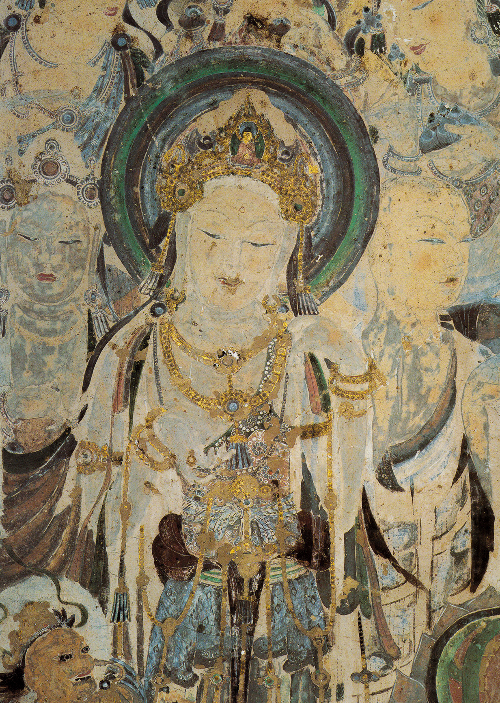

{width=80% fig-align="center"}

洛阳城外，晨雾尚未散去。几匹马从西方缓缓而来。马背上没有金银珠宝，也没有进献皇帝的奇禽异兽，而是驮着一卷卷陌生的经书和佛像。随行的僧人深目高鼻，身披异域衣服，说着中原人听不懂的语言。传说中，驮经的马是白色的。后来，人们在洛阳城外建起一座寺院，为纪念白马驮经，取名“白马寺”。寺里的钟声从汉代一直传到今天，这匹白马也由此成为佛教东来的象征。

然而，历史上的佛教并不是在某一天突然越过国境，也不是仅靠一匹白马便进入中国。早在汉明帝派人西行以前，商队、使者、僧侣和居士已经沿着漫长的交通网络，把关于佛陀的故事、佛教的名词和零散的修行方法带到了中原。白马驮经，是一段美丽的传统记忆。在这段记忆背后，则是一场持续数百年、横跨万里的文明相遇。

---

## 一、白马到来以前，道路已经打开

佛教诞生于古印度。若要从印度到达中国，在两千年前并不是一件容易的事。旅人要穿过高山、荒漠和绿洲，经过大月氏、安息、龟兹、于阗、疏勒、敦煌等许多国家和地区，再从玉门关或阳关进入汉地。一路上不仅有风沙、寒暑和盗匪，还要面对语言、饮食和政治局势的不断变化。

但这条路虽然艰险，却从未真正封闭。汉武帝时，张骞出使西域，使汉朝逐渐了解到中亚各国的情况。此后，丝绸、香料、宝石、良马和药材在东西方之间流通，商人、使者、工匠和宗教人士也随着商路往来。我们今天习惯把这些陆路交通网络统称为“丝绸之路”，但它并不是一条笔直的大路，而是由许多绿洲城市、山口、驿站和贸易路线组成的巨大网络。

商品沿路传播，思想也会沿路传播。商人出售丝绸时，也会讲述自己家乡的神灵；僧人跟随商队旅行，也可能在途中为人说法；外国使者进入汉地时，会带来本国的礼仪、画像和传说。佛教最初进入中国，很可能正是通过这些零散而持续的接触发生的，而不是等待某一次朝廷正式宣布之后才开始。

关于佛教早期传入，古书中有一条著名记录：西汉哀帝元寿元年，即公元前二年，大月氏使者伊存曾向汉朝的“博士弟子”口授《浮屠经》。这件事原载于三国时鱼豢所著《魏略》，原书后来散失，相关文字由其他古籍转引保存下来。由于记录形成时间晚于事件本身，具体人物姓名和传授地点也存在异文，现代学者对它仍有讨论。因此，我们不能把“伊存授经”当作毫无疑问的精确日期，却可以把它视为一个重要线索：早在西汉末年，中国人便可能已经接触到关于“浮屠”的知识。

“浮屠”“浮图”或“佛陀”，都是外来语音译后的不同写法。它们的声音，都来自印度语言中的 Buddha，也就是“觉悟者”。一个陌生的名字，就这样沿着商路，穿越沙漠与关塞，进入了汉语世界。

---

## 二、真正可靠的早期身影：楚王刘英

如果说伊存授经仍带有若干疑问，那么东汉楚王刘英信奉佛教的记载，则清楚得多。楚王刘英是汉光武帝刘秀之子、汉明帝的异母弟，被封在彭城一带。根据《后汉书》记载，他年轻时喜欢结交游侠，后来转而爱好黄老之学，并开始学习“浮屠斋戒祭祀”。汉明帝永平八年，即公元六十五年，朝廷允许犯死罪者交纳缣帛赎罪。楚王刘英认为自己也有过失，便献上三十匹黄缣白纨，希望赎罪。汉明帝却没有收取，反而在诏书中称刘英“诵黄老之微言，尚浮屠之仁祠”，并命人把这些丝帛退还，用来供养“伊蒲塞、桑门”。

“伊蒲塞”是“优婆塞”的早期译音，指在家信奉佛教的男子；“桑门”就是“沙门”，指离家修道的人。这段简短的诏书非常重要。它说明最迟在公元六十五年前后，汉地已经出现了佛教斋戒、祭祀或供养活动，也出现了出家沙门和在家信徒。楚王刘英并不是独自在王宫中阅读一本陌生经书，他的周围已经形成了一个小规模的信仰群体。

更值得注意的是，刘英并没有把佛教看成与中国传统完全分离的宗教。他同时喜好黄老之学，又供奉浮屠。在当时许多人的理解中，佛陀可能被视为一种来自西方的神仙、得道者或长生圣人，佛教也常常与黄老方术、斋戒祭祀混合在一起。这并不奇怪。任何外来思想进入新的文化环境，都不可能立即被准确理解。人们总会先用自己熟悉的概念解释陌生事物。中国人第一次听到“佛”，很自然地会问：他是不是像老子一样的圣人？是不是修炼成仙的真人？他能不能保佑国家、延长寿命、消除灾祸？

早期佛教在中国的面貌，远没有后来寺院中的佛教那么清晰。佛、神仙、方士、黄老、斋戒和祭祀，常常交织在一起。但正是《后汉书》中这些略显混杂的词语，使我们看到了佛教刚刚落地时最真实的状态。

---

## 三、汉明帝梦见了谁？

关于佛教东来，最广为人知的故事发生在汉明帝身上。相传有一天夜里，汉明帝梦见一个金色的人。他身形高大，头顶或颈后放出光明，在宫殿上空飞行。第二天，明帝召集群臣询问梦的含义。有大臣回答说，西方有一位圣者，名叫“佛”，全身金色，或许皇帝梦见的正是他。

于是，汉明帝派遣使者前往西域寻求佛法。《后汉书·西域传》记载：“世传明帝梦见金人，长大，顶有光明。”随后又说，明帝派人前往天竺询问佛法，并在中国绘制佛像。这段文字的开头是“世传”。“世传”二字很值得留意。它不是“皇帝本纪记载”，也不是“当时诏书说”，而是“社会上世代流传”。这说明范晔编写《后汉书》时，明帝梦见金人的故事已经流传很广，但它带有传统传说的性质。

后来形成的故事更加完整。南朝梁代慧皎所著《高僧传》记载，汉明帝派郎中蔡愔、博士弟子秦景等人前往天竺寻访佛法。他们在西域遇见中天竺僧人摄摩腾，邀请他来到汉地。竺法兰也随后来到洛阳，与摄摩腾同住。到了北魏杨衒之所著《洛阳伽蓝记》中，白马驮经的画面已经十分鲜明：

汉明帝梦见金神，派使者向西域求法，得到佛经和佛像，由白马驮回洛阳，寺院也因此得名“白马寺”。书中称白马寺为“佛入中国之始”。由此可以看出，明帝梦金人、遣使求法、僧人东来、白马驮经和建立白马寺，并不是一次性完整记录在同一部东汉史书中的。这个故事经历了长期积累：

最早的史书保存了“梦见金人、遣使问法”的传说；后来的僧传补充了蔡愔、秦景、摄摩腾和竺法兰；再往后的文献则把白马驮经和寺名来源连接起来。这并不意味着故事毫无价值。传说未必等于虚构。它可能保存了历史事件的核心记忆，只是在数百年的讲述中不断被整理、补充和象征化。也许汉明帝确实曾对西域佛教产生兴趣，也许朝廷确实接待过来自西域的僧人、佛像和经书。只是在缺乏东汉同时期资料的情况下，我们无法确认故事中的每一个姓名、年份和细节。

对于普通读者来说，最稳妥的理解是：

佛教在汉明帝以前已经零星进入中国；汉明帝求法的传统，则象征着佛教第一次获得东汉朝廷的公开注意和接纳。白马不是佛教进入中国的第一步，却成为历史记忆中最醒目的一步。

---

## 四、摄摩腾与竺法兰：最早被记住的东来僧人

传统记载中的摄摩腾，又被称为迦叶摩腾，是中天竺僧人。《高僧传》说他通晓佛教经典，长期游方弘法。蔡愔等人在西域遇见他后，邀请他进入汉地。摄摩腾不畏流沙和道路艰险，最终抵达洛阳。汉明帝对他表示礼遇，在洛阳城西门外建造精舍，让他居住。《高僧传》用八个字形容当时的处境：“大法初传，未有归信。”

佛法刚刚传来，还没有多少人理解和信奉。这可能比各种神奇故事更接近一位早期来华僧人的真实生活。摄摩腾来到洛阳后，面对的是完全陌生的世界。语言不同，饮食不同，衣着不同，人们对出家制度也缺乏概念。印度僧侣以乞食为生，中国社会却可能把沿街乞食视为贫困或无业；印度佛教称赞离家修道，中国伦理则把侍奉父母、延续家族看作重要责任。

即使有人愿意听法，摄摩腾又该用什么汉字解释“涅槃”“因缘”“业”“比丘”？仅仅把声音翻译出来，人们未必明白；若完全采用中国固有词语，又可能误解佛教的原意。竺法兰面临的困难也是如此。《高僧传》说，竺法兰也是中天竺人，能够背诵大量经论，是当地学者之师。他到洛阳后与摄摩腾同住，不久便开始掌握汉语。传统上认为，他参与翻译了《十地断结》《佛本生》《法海藏》《佛本行》和《四十二章经》等经典，其中只有《四十二章经》流传下来。慧皎因此说：“汉地见存诸经，唯此为始也。”

不过，从现代学术研究的角度看，摄摩腾、竺法兰与《四十二章经》之间的具体关系仍有争议。现存《四十二章经》的文字风格相当成熟，很难想象一位刚学汉语不久的外国僧人能够独立完成。更可能的情形是，外国僧人讲述或诵出经义，熟悉西域语言的人负责传译，中国文士再把内容写成汉文。经文也可能在后来的流传过程中经过整理和润色。

因此，早期译经从来不是一个人的工作，而是一群人的合作。有人背诵原文，有人用另一种西域语言转述，有人解释佛教术语，有人执笔记录，有人校正文句。一次翻译，可能要跨越梵语、犍陀罗语、中亚语言和汉语等多重语言屏障。一卷经书从印度来到中国，不只是被马驮过一段路。

它还必须跨越语言的荒漠。

---

## 五、《四十二章经》为什么只有四十二章？

《四十二章经》篇幅不长，全文只有两千余字。它不像《法华经》那样有完整宏大的故事，也不像《华严经》那样展示重重无尽的世界，而是由四十二段简短教言组成。其中谈到出家、持戒、布施、忍辱、禅定、无常和欲望，也反复提醒修行者调伏内心。从形式上看，它更像一部佛教入门摘编：从不同经典和教法中选择若干要点，整理成便于阅读的短章。

为什么最早进入中国的经典，会是这样一本简短的小书？原因并不难理解。当时的中国人对佛教几乎一无所知。如果一开始便翻译极其庞大、概念复杂的经论，不仅翻译困难，读者也无法理解。《四十二章经》篇幅短、段落清楚，能够大致回答几个最基本的问题：

佛是什么人？沙门怎样生活？佛教劝人做什么？修行者为什么要节制欲望？人生为什么无常？怎样才能使内心清净？从这个角度看，《四十二章经》很像一本两千年前的“佛教入门读本”。不过，它的真正形成时间、译者和文本来源，历来存在不同意见。有学者认为它与汉明帝求法有关，也有人认为现存文本经过后代加工，甚至可能是从不同佛经中摘录编成。

面对这些争议，我们不必急于选定一个绝对答案。无论现存文本是否完全保持东汉初译时的原貌，《四十二章经》都真实反映了佛教进入中国以后所面对的第一个任务：先用中国人能够接受的语言，把最基本的佛法讲清楚。这一任务看似简单，实际上极其艰难。“佛陀”可以音译为“佛”，“沙门”可以保留声音，可是“涅槃”如何解释？“空”会不会被理解为虚无？“无我”会不会被看成否定人的存在？“出家”又如何面对中国人重视孝道和宗族的传统？

翻译从来不只是换几个词。翻译意味着在两个文明之间寻找可以相互理解的道路。

---

## 六、为什么叫“寺”？

今天提到“寺”，人们首先想到佛寺。但在佛教传入以前，“寺”原本并不专指宗教场所，而是汉代官署的名称。大理寺、鸿胪寺中的“寺”，都有官署、办事机构之意。传统说法认为，摄摩腾、竺法兰到达洛阳以后，最初由负责接待外国使者的官署安置。后来他们长期居住和译经的地方逐渐成为僧人修行、供奉佛像和保存经书的场所，“寺”也就慢慢具有了佛教寺院的含义。

这种说法的具体细节未必都能由同时代史料证实，但它揭示了一个重要变化：

佛教寺院在中国并不是简单照搬印度建筑，而是在中国原有制度和语言中逐渐形成的。印度佛教僧团居住的场所，常被称为“精舍”“僧伽蓝”或“阿兰若”。进入中国以后，人们用“寺”称呼这些场所。后来，“寺院”“寺庙”逐渐成为汉语中最常见的宗教建筑名称。白马寺因此不只是一栋建筑。

它意味着来自异国的沙门在中原拥有了一处可以长期居住的空间；佛像有了安置之处；经书有了收藏之地；译经、讲法和供养活动有了固定场所。一座寺院建立以后，佛教便不再只是商旅口中的故事，也不再只是宫廷收藏的一幅异域画像。它开始在中国土地上扎根。

---

## 七、白马寺是不是“中国第一寺”？

白马寺常被称为“中国第一古刹”或“中国第一寺”。这种说法需要稍作说明。从传统佛教史的角度看，白马寺被视为汉明帝建立的第一座官办佛寺，也是最早专门安置来华僧人、佛像和经书的重要寺院。《洛阳伽蓝记》直接称它为“佛入中国之始”，足见它在后世佛教记忆中的地位。

但是，如果把“第一寺”理解成“中国境内此前绝对没有任何佛教祭祀场所”，就未必准确。楚王刘英在公元六十五年前后已经供奉“浮屠之仁祠”，并供养沙门和在家信徒。这说明在白马寺传统建立年代之前，彭城等地可能已经存在某种佛教活动场所。只是这些场所规模如何、建筑形态怎样、能否称为后来意义上的佛寺，史料并未说明。

因此，更准确的说法是：

白马寺是传统上公认的中国第一座由朝廷建立的重要佛教寺院，是佛教获得官方容纳的标志性场所；但它不一定是中国土地上最早出现的所有佛教活动地点。这种区分并不会降低白马寺的意义。一个文化现象的“起点”往往很难精确到某一天。河流在成为大河以前，已经有许多细小泉水和支流。白马寺的意义，不在于排除所有更早的可能，而在于它把原本零散、隐约的佛教接触，汇聚成一个后世可以清楚看见的历史标志。

从此以后，凡是讲述佛教东来，人们便会想起洛阳、白马和经书。

---

## 八、佛教刚到中国时，人们怎样看待它？

今天的人走进寺院，看见佛像、菩萨像、罗汉像，听到晨钟暮鼓，很容易把这一切视为完整成熟的佛教传统。但东汉人第一次接触佛教时，并没有这样的知识背景。他们不知道释迦牟尼与老子有什么区别，不清楚佛与神仙是否相同，也未必理解出家人为什么剃发、不婚、乞食。佛教所说的前世、来世、业力和轮回，对许多中国人来说也十分陌生。

于是，人们只能借助熟悉的思想解释佛教。佛陀常被视为“西方神人”或得道神仙；佛教修行被理解为清净无为、养生守一；涅槃有时被误解为长生不死；佛教也常与黄老之学、方术和祭祀并列。《后汉书》记载，楚王刘英同时喜好黄老与浮屠；后来汉桓帝也曾把浮屠与老子一同祭祀。这说明在东汉人的观念中，佛教一开始并没有成为边界清晰、独立完整的宗教，而是被放进了原有的神仙方术和黄老信仰框架中。

这种误解既是障碍，也是入口。如果佛教完全拒绝使用中国人熟悉的语言，它可能根本无法传播；但若过度依附黄老和方术，它的本来教义又可能被遮蔽。此后数百年，中国僧人与来华译师一直在处理这个问题：

怎样借助中国文化解释佛教，又不把佛教完全变成中国固有思想？怎样说明“空”与道家的“无”并不完全相同？怎样解释出家修行并不是逃避父母？怎样让重视家族伦理的中国人理解僧团制度？怎样把印度的轮回解脱思想，转化为汉语能够表达的概念？佛教中国化，正是从这些看似细小的语言问题开始的。

---

## 九、佛教不是一部经书传进来的

白马驮经的故事容易让人产生一种印象：佛教经书被带到洛阳以后，中国便有了佛教。事实远比这复杂。即使一部佛经已经翻译出来，也不等于人们真正理解它。经书需要有人讲解，戒律需要有人实践，僧团需要建立制度，佛教名词需要不断校正，出家人与国家、家庭和社会之间的关系也需要重新安排。

到了东汉桓帝、灵帝时期，佛经翻译才逐渐形成规模。来自安息国的安世高来到洛阳，翻译禅法和阿毗昙类经典。《高僧传》称他的译文义理清楚、文字质朴，被后世视为早期译经的重要人物。来自大月氏的支娄迦谶则翻译《道行般若经》《般舟三昧经》等大乘经典，把般若、菩萨和净土等思想带入汉语世界。

有些翻译需要多人合作。外国僧人诵出原文，通晓西域语言的人负责口译，汉人居士或文士记录，再由众人讨论、校订。早期译经史中常见“口译”“传言”“笔受”等词，正说明一部汉文佛经的形成，是跨语言团队共同工作的结果。根据佛教史研究，二世纪中叶以后，安世高、支娄迦谶等人在洛阳持续译经，才使佛教经典逐渐形成可以阅读、学习和传授的汉文体系。

所以，佛教不是随着某一卷经书一次性“运进”中国的。它经历了漫长的过程：

先是听说佛的名字；然后看见佛像；再接触零散教言；接着翻译短篇经典；随后建立寺院和信徒群体；最后才逐渐形成完整的经、律、论传统。白马驮来的不是一套已经完成的“中国佛教”。它驮来的是一粒种子。

---

## 十、佛教是不是中国本土宗教？

佛教并不是起源于中国的宗教。佛陀出生、修行、成道和说法的地点都在古印度。四圣谛、八正道、缘起、涅槃和僧团制度，也首先形成于印度文化环境中。佛教后来经过中亚、西域和海上交通进入中国，属于外来宗教。但“外来”并不意味着它永远与中国无关。佛教进入中国以后，经历了长达数百年的翻译、争论、选择与改造。中国僧人学习印度经典，同时也用汉语重新表达佛法；中国建筑、绘画、文学、伦理和哲学不断吸收佛教影响，佛教自身也逐渐形成具有中国文化特点的宗派和修行方式。

禅宗、天台宗、华严宗和中国净土教，都不是简单复制印度佛教的产物。观音菩萨在中国形成广泛的慈悲信仰，地藏菩萨与孝道文化相结合，佛教寺院也逐渐具有中国式的山门、天王殿、大雄宝殿和钟鼓楼。因此，佛教的来源在印度，汉传佛教的成熟却发生在中国。它既不能被说成中国自古固有的宗教，也不能被看成始终没有改变的异域文化。

更恰当的说法是：

佛教来自印度，在中国扎根，经过长期本土化，成为中华文化的重要组成部分。这正如一棵树。种子来自远方，但它吸收的是中国土地上的水分，经历的是中国历史中的风雨，最终长出的枝叶，也带有这片土地的形状。

---

## 十一、历史与传说，哪一个更重要？

有人可能会问：

既然汉明帝梦金人、蔡愔西行、摄摩腾与竺法兰东来、白马驮经等细节并不都能由东汉同时代史料证明，我们是不是应该把整个故事都当成虚构？没有必要。历史研究要求我们辨别史料形成的年代和可信程度，不能把后世传说中的每一个细节都当成确定事实。但理解一种文化传统，也不能只留下冷冰冰的年代和考证。

明帝梦金人的故事，表达了中国人对佛教东来的理解：

佛法来自西方，却不是以战争和征服的方式进入中国；它由一场梦开始，由使者主动寻求，由僧人带着经书和平而来。白马驮经的故事则把漫长复杂的文明交流，凝聚成一个简单而有力量的画面：

一匹马，驮着经书，从西方走向东方。白马没有军队护送，也没有强迫任何人接受信仰。经书抵达洛阳以后，还要等待翻译、理解、讨论和选择。佛教能否在中国留下来，并不取决于马走了多远，而取决于它能否回答中国人的人生问题。历史告诉我们，佛教的传入是一个复杂过程。

传说告诉我们，后人怎样记住这个过程。二者并不必然冲突。我们可以尊重白马驮经的文化象征，同时承认佛教早在白马寺以前便可能零星进入汉地；可以敬仰摄摩腾、竺法兰的弘法精神，同时承认他们的生平主要保存在数百年后的僧传中；也可以称白马寺为“中国第一寺”，同时说明它更准确地代表第一座重要官办佛寺，而不是排除所有更早的佛教活动。

尊重传统，不等于停止辨析。进行辨析，也不等于消解信仰与文化记忆。

---

## 十二、从白马寺到长安城

佛教初入中国时，只是洛阳和彭城等地少数人接触的异域信仰。经书很少，译文生涩，僧人不多，社会影响也十分有限。许多人甚至分不清佛陀与神仙，不理解出家人为何离开家庭。但这场相遇已经无法逆转。此后的几个世纪里，一批又一批西域和印度僧人来到中国，一卷又一卷佛经被翻译成汉文。中国僧人也开始西行求法，学习戒律，搜寻经典。

佛教不再只是宫廷里的一幅金人画像，也不再只是楚王府中的斋戒祭祀。它进入城市，进入山林，进入士人的书房，也进入普通人的生老病死。后来，洛阳会出现规模宏大的译经事业；鸠摩罗什会进入长安，把深奥的般若和中观思想译成流畅汉文；玄奘会越过沙漠与雪山，重新走上佛法西来的道路；禅宗、净土宗、天台宗和华严宗也将在中国相继形成。

这一切，在后人的记忆中，都可以从一匹白马开始。黄昏时分，洛阳城外的道路渐渐隐入暮色。白马停在寺门前。僧人卸下经函，拂去一路风沙。没有人知道，这些陌生文字将在未来改变中国人的语言、艺术、哲学与生死观。一座寺院的门缓缓打开。佛法由此走入中国，也开始了被中国重新理解的漫长旅程。

---

## 小栏目：白马寺真的是中国第一座寺院吗？

白马寺被传统佛教史称为“中国第一古刹”，主要因为它被认为是汉明帝为安置西域僧人、佛经和佛像而建立的第一座重要官办佛寺。但《后汉书》记载，在白马寺传统建立年代以前，楚王刘英已经供奉“浮屠之仁祠”，并供养沙门和在家信徒。因此，中国境内可能更早已有规模较小的佛教活动场所。

所以，“第一寺”最适合解释为：

白马寺是传统上公认的第一座由朝廷正式建立、在后世佛教史中具有明确传承地位的汉地佛寺，而不一定是中国境内绝对最早的一处佛教祭祀场所。

---

## 小栏目：摄摩腾和竺法兰真的存在吗？

摄摩腾、竺法兰的故事主要见于南朝梁代慧皎的《高僧传》等后世佛教文献，与东汉相距数百年。现存东汉官方记录没有完整记载他们的姓名和生平，因此现代研究不能确认所有细节。不过，这些僧传可能保存了早期西域僧人来华的历史记忆。东汉中后期确有安世高、支娄迦谶等外国译经师在洛阳活动，也说明西域僧人沿商路进入汉地，是当时真实存在的现象。

因此，对摄摩腾、竺法兰最稳妥的态度是：

尊重他们在佛教传统中的开创者地位，同时承认有关生平带有后世传说和整理的成分。

---

## 常见误解：佛教是从白马寺那一天才传入中国的吗？

不是。宗教和思想的传播通常没有唯一而精确的起点。佛教可能早在西汉末年便通过商人、使者和西域居民零星进入汉地。公元六十五年的楚王刘英记载，已经明确出现沙门、在家信徒和佛教供养活动。汉明帝求法和白马寺的意义，在于佛教开始受到朝廷关注，获得相对固定的传播场所，并在后世形成清晰而完整的文化记忆。

因此，白马寺不是佛教与中国发生接触的绝对第一刻，却是佛教正式在中国历史舞台上显现的重要标志。

---

## 本章经典与史料摘录

《后汉书·楚王英传》：

“楚王诵黄老之微言，尚浮屠之仁祠。”这句话反映了东汉初年佛教与黄老信仰并行、混合的情形，也证明当时已有佛教活动和信徒群体。《后汉书·西域传》：

“世传明帝梦见金人，长大，顶有光明。”“世传”表明这是当时或后世广泛流传的故事，而不是完整的宫廷实录。《高僧传·摄摩腾传》：

“大法初传，未有归信。”佛法初到中国，真正的困难并不是经书能否被带来，而是有没有人能够理解。《洛阳伽蓝记》：

“白马寺，汉明帝所立也。佛入中国之始。”它所表达的不是严格意义上的唯一传入日期，而是白马寺在中国佛教传统中的象征性起点。

---

## 主要参考资料

1. 范晔：《后汉书·光武十王列传·楚王英传》。其中关于楚王刘英“学为浮屠斋戒祭祀”及供养“伊蒲塞、桑门”的记录，是研究东汉早期佛教的重要史料。2. 范晔：《后汉书·西域传》。记载天竺佛教习俗，以及“世传明帝梦见金人”的传统。3. 慧皎：《高僧传》卷一《摄摩腾传》《竺法兰传》《安世高传》《支娄迦谶传》。4. 杨衒之：《洛阳伽蓝记》卷四“白马寺”条。5. 刘屹、刘菊林：《悬泉汉简与伊存授经》，讨论西汉末年伊存口授《浮屠经》记载及其历史背景。6. 傅惠生：《论〈四十二章经〉译文的历史经典性》，讨论经文译者、翻译方式及中外人员合作的可能。7. 有关汉代佛教传播及早期译经史的研究，可参见复旦大学相关佛教史研究资料，其中强调东汉桓、灵帝时期安世高、支娄迦谶译经活动对汉传佛教形成的重要性。
