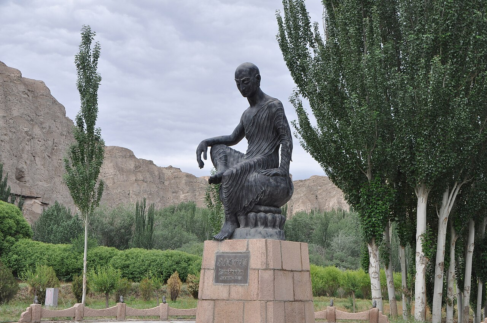

{width=65% fig-align="center"}

公元五世纪初的一个冬日，一支从河西走廊而来的队伍进入长安。

队伍中有一位来自西域的僧人。他已经不再年轻，身上带着长途跋涉的风尘，也带着十多年羁留凉州的沉默岁月。他出生在龟兹，少年时代游学罽宾、沙勒等地，通晓西域语言，熟悉佛教不同部派的经论，又能够使用汉语讲说佛法。

他的名字叫鸠摩罗什。

在他进入长安以前，佛教已经传入中国数百年。佛像、寺院和经书早已出现在洛阳、建康、襄阳等地，许多西域僧人与汉地学者也已经为译经付出巨大努力。然而，佛教真正进入中国人的思想世界，并不只是把一卷卷经书从西域运来，更重要的是：那些诞生于印度的概念，能否被准确而自然地说成中国话。

什么是“空”？什么是“般若”？什么是“中道”？佛经中的“无我”，与老庄所说的“无”是不是一回事？菩萨所修的“方便”，是否只是做事灵活？如果词语相似，背后的思想却完全不同，那么翻译得越顺口，反而可能离佛法越远。

鸠摩罗什来到长安，改变的正是这一切。

他的工作不只是把一些经文译成汉语，而是帮助中国佛教逐渐形成了一套能够准确表达大乘佛法、又符合汉语习惯的语言。此后千百年间，人们诵读《金刚经》《法华经》《维摩诘经》，研究《中论》《百论》《十二门论》，其中许多最熟悉、最优美的句子，都出自他所主持的译场。

有时，一个文明的命运，会因为一场战争而转折；有时，也会因为一句话终于被翻译得恰到好处而改变。

## 一、佛经已经来了，佛法是否真正被读懂？

佛教早期传入中国时，译经是一件极为艰难的事。

首先，两种语言的结构完全不同。印度与西域佛典常有复杂的长句、重复的修辞和严密的名相体系，而汉语讲求简练、含蓄和节奏。如果逐字照搬，译文可能生硬难读；如果过度润色，又可能改变原意。

其次，许多佛教概念在中国传统思想中找不到完全对应的词语。早期学者为了帮助读者理解，常借用老庄、玄学中的词汇来解释佛教，这种方法后来被称为“格义”。

格义在佛教初传时期有其历史作用。面对一种完全陌生的思想，人们总要借助熟悉的概念来理解它。然而，相似并不等于相同。“空”并不只是“什么都没有”，“涅槃”也不等于道家的自然无为。如果长期依赖固有概念，佛教便可能被理解成另一种玄学。

《高僧传》在记述鸠摩罗什进入长安后的译经事业时，特别提到早期部分译本存在文辞阻滞、以格义解释佛理而未能完全契合原本的问题。这并不是否定前代译师的贡献，而是说明佛经翻译需要随着语言能力、原典积累和佛学理解的加深不断改进。

在鸠摩罗什以前，中国佛教已经完成了最初的播种；到了鸠摩罗什时代，人们开始更加迫切地追问：经文究竟在说什么？那些看似相近的名词，背后是否隐藏着完全不同的世界观？

鸠摩罗什的意义，正在于他既懂西域佛教，也逐渐懂得中国人的语言与思维习惯。他站在两个文化世界之间，知道原典要表达什么，也知道汉语怎样说才不会失去它的精神。

## 二、从龟兹走出的少年僧人

鸠摩罗什的出生年代，古代记载并不完全一致，现代通常采用公元344年至413年的说法。他出生于龟兹，也就是今天新疆库车一带。龟兹位于古代丝绸之路要冲，是一个商业繁荣、文化多元、佛教兴盛的西域王国。

“鸠摩罗什”是音译，意译为“童寿”，有“年少而有长者之德”的含义。

他的父亲鸠摩炎出身天竺贵族家庭，后来越过葱岭来到龟兹；母亲耆婆是龟兹王族女子，聪敏好学，后来出家修行。鸠摩罗什七岁随母亲出家，少年时期便随师游学，学习《阿含经》、阿毗达磨等传统佛教经论。

早年的鸠摩罗什主要接受说一切有部的教法。这一传统重视对身心现象的细密分析，讨论色、受、想、行、识以及各种心理活动怎样生起、变化和消灭。这样的训练，使他具有极为扎实的佛学基础。

后来，他在沙勒遇见大乘法师须利耶苏摩，开始接触般若与中观思想。最初，他对“一切法空”的说法感到疑惑。他已经习惯把世界分析为一个个真实存在的法，现在却有人告诉他：这些法同样依赖因缘而成立，并没有固定不变的自性。

经过反复辩论与思考，他逐渐理解了大乘佛法所说的“空”。《高僧传》记载他回顾过去的学习时感叹：

“吾昔学小乘，如人不识金，以鍮石为妙。”

这句话带有古代宗派判教的色彩，并不意味着部派佛教没有价值，而是表现了鸠摩罗什个人思想转变时的强烈感受：他过去所掌握的分析方法并未被完全否定，却在般若与中观的视野中获得了新的解释。

此后，他深入学习《中论》《百论》《十二门论》等大乘论典，在龟兹讲说经法，声名传遍西域。也正因为他的名声，远在中原的君主与高僧开始注意到这位西域法师。

## 三、一位法师为何成为战争的目标？

今天的人很难想象，一位翻译家竟会成为军队远征的重要目标。

前秦皇帝苻坚听说西域有一位精通佛法的鸠摩罗什，希望将他迎到长安，便派将军吕光率军西征。公元384年前后，吕光攻破龟兹，鸠摩罗什被带往东方。

然而，吕光返回途中，前秦已经瓦解。吕光于是占据凉州，建立后凉。鸠摩罗什没有立即到达长安，而是在凉州度过了漫长的羁留岁月。

这段经历并不浪漫。他不是自由远游的求法者，而是战乱中的俘虏。传统传记中还记载，吕光曾以种种方式逼迫和侮辱他。对这些带有宗教传记色彩的细节，现代读者不必全部作实录理解，但有一点可以确定：从龟兹到长安的道路，并不是一条平静的文化交流之路，而是伴随着战争、政权更替和个人苦难。

鸠摩罗什在凉州停留十多年。吕光父子并不重视译经，他虽然具有深厚学问，却长期无法展开大规模的佛典翻译。

直到后秦君主姚兴击败后凉，鸠摩罗什才终于得以东行。《高僧传》记载，后秦弘始三年，即公元401年，鸠摩罗什进入长安。姚兴以国师之礼相待，经常与他讨论佛法，并在西明阁、逍遥园等处组织译经。

从龟兹被俘到进入长安，已经过去大约十七年。

如果只看结果，人们容易说这是“佛法东来的因缘”；但从一个人的生命来看，这十七年意味着青春消逝、故国远去，也意味着长期身不由己。鸠摩罗什没有选择自己来到中原的方式，却仍然选择了怎样使用余下的生命。

他无法改变已经发生的战争，却可以让自己所学的佛法不因战争而沉没。

## 四、逍遥园里，佛经是怎样翻译出来的？

人们提起鸠摩罗什，常说“他翻译了《金刚经》”。这句话并没有错，却容易使人产生一种误解：仿佛鸠摩罗什独自坐在书桌前，摊开梵文经卷，一字一句写成中文。

真实的译经场面更像一所规模庞大的研究院，也像一场持续多年的公开讲学。

姚兴为鸠摩罗什组织了由众多僧人参加的译场。僧叡、僧肇、道恒、道标等学僧参与其中。《高僧传》说，当时有八百余人咨询、听受并协助译经。这个数字可能带有古代传记常见的概数意味，但可以确定的是，鸠摩罗什的译经绝不是孤立的个人工作，而是一次集体性的知识工程。

古代经序用一句简练的话描述译场的核心过程：

“手执胡本，口宣秦言。”

鸠摩罗什手持西域原本，先诵读经文，再用当时的汉语口头解释。参与译经的僧人记录译文，对词义提出疑问，将新译本与旧译本相互比较。遇到一词多义、句法不明或者教义难点，众人便反复讨论。经序又称其间“交辩文旨”，说明译文并不是一次口授便立即定稿，而是在问答、辩论、记录和修订中逐渐形成。

一次较完整的译经，大致可能经过以下环节：

鸠摩罗什先解释原文的语言和整体意义；熟悉汉语的僧人将其记录下来；义学僧针对经义提出问题；众人比较旧译、核对上下文；负责文字的人调整句式；最后再由鸠摩罗什审定。

其中最重要的，并不是把每一个外来词换成一个汉字，而是确定：这句话在整部经中究竟是什么意思？这个词在不同章节是否应保持一致？如果直译会造成误解，怎样调整才能既不背离原意，又让中国读者读得明白？

因此，译经场同时也是讲经场、辩论场和培养佛教学者的学校。

鸠摩罗什主持译出的经论数量，历代目录记载并不一致。有的记为三十余部、近三百卷，有的记载更多。《高僧传》概称三百余卷。与其执着于某一个数字，不如看到这些译典涵盖了般若、法华、净土、禅法、戒律与中观论典等多个领域，而且其中许多译本一直流传至今。

## 五、好的翻译，是忠实还是优美？

关于鸠摩罗什，人们常说他的翻译“意译为主，文辞优美”。

这句话大体不错，却容易被理解为：鸠摩罗什为了文章好看，可以自由删改原文。

事实上，鸠摩罗什所追求的并不是脱离原典的文学创作，而是在准确理解经义之后，寻找最适合汉语的表达。他的“达意”，首先建立在通晓佛理之上。只有真正知道原文在说什么，才有可能判断哪些地方应当直译，哪些地方需要调整语序，哪些词应当音译保留，哪些词可以译出意义。

翻译佛经至少面对三重困难。

第一重是语言。一个词在原文中可能同时具有多种含义，汉语中却没有完全对应的表达。

第二重是思想。译者不仅要知道字面意思，还要知道它在整个佛教教义体系中的位置。若把“空”简单译成“无”，便可能让读者以为佛教否定一切存在；若把“涅槃”理解为死亡，又会失去烦恼止息与解脱的意义。

第三重是文体。印度佛典中有大量偈颂、反复、音韵和修辞，原有的节奏很难完整移入汉语。鸠摩罗什曾感叹，梵文偈颂一经翻译，往往会失去原有声韵，如同“嚼饭与人”：意思也许还能传达，原来的滋味却已经改变。

正因为知道翻译必然有所损失，他才格外重视译文的整体神韵。

鸠摩罗什译经的文字通常简洁、流畅而富有节奏，但这种简洁并不只是文学风格，也是一种思想上的取舍。他常常去除不符合汉语习惯的重复，使句子更凝练，同时努力保留教义结构。

例如《金刚经》结尾的偈颂：

“一切有为法，如梦幻泡影，如露亦如电，应作如是观。”

短短数句，梦、幻、泡、影、露、电六种譬喻依次展开。它没有说世界完全不存在，而是提醒人们：一切由条件聚合而成的现象，都在变化，都不能被当作永恒不变之物执取。译文既保存了般若思想，又形成了汉语诗歌般的节奏，因此能够穿越寺院讲堂，进入诗词、书法和普通人的语言。

好的翻译，不是在“忠实”和“优美”之间任选其一，而是让文字的清楚、准确和可诵读彼此成全。

## 六、《金刚经》：把“空”译成可以实践的智慧

鸠摩罗什所译《金刚般若波罗蜜经》，后来成为汉地流传最广的佛经之一。

《金刚经》所说的“空”，并不是要求人拒绝现实，也不是让人宣布善恶、责任和生命都没有意义。它所要破除的，是人对固定自我和固定事物的执著。

人总以为自己的身份、成就、关系和处境具有某种不变的本质：成功了，便希望永远保持；失去了，便觉得人生从此完全破碎。般若智慧告诉我们，一切现象都是因缘所生。既然依赖条件，就会随着条件变化；既然不断变化，就不应把它抓住当成永恒的“我”和“我的”。

因此，《金刚经》一面说不应执著于相，一面又反复教导菩萨度化众生。正因为没有一个固定不变的“我”，人才可能放下自我中心；正因为众生与世界处在相互依存之中，慈悲才不只是道德命令，而是对缘起事实的回应。

鸠摩罗什的译文，把深奥的般若思想化为凝练而有力量的汉语。后来六祖慧能听闻《金刚经》而发心求法，禅宗又反复引用其中关于“无住”的教诲。由此可见，翻译不仅决定一部经书是否易读，也可能影响后来宗派如何理解修行。

一句译文，可能成为另一个时代的入口。

## 七、《法华经》：让“一乘”成为中国佛教的重要理想

鸠摩罗什译出的《妙法莲华经》，对中国佛教产生了极为深远的影响。

《法华经》面对的是一个重要问题：佛陀为什么说出许多看似不同的教法？声闻、缘觉和菩萨所走的道路是否彼此隔绝？普通人是否也有可能成佛？

经中说：

“唯有一乘法，无二亦无三，除佛方便说。”

这里的“一乘”，不是说所有修行方法必须变得完全一样，而是说佛陀施设不同教法，最终都以引导众生成佛为目标。众生根机不同，佛陀便采用不同的语言和方法，这就是“方便”。

“方便”不是欺骗，也不是为了达到目的可以不择手段。真正的方便必须以智慧观察众生的处境，以慈悲选择对方能够接受的方式，并且始终指向离苦与觉悟。

《法华经》的这一思想，为中国佛教后来面对众多经典、众多法门时提供了一种整合方式：不同教法不必彼此排斥，可以根据对象和阶段发挥作用。

后来天台宗以《法华经》为根本经典，智者大师据此建立系统的判教与修行理论。《观世音菩萨普门品》也从《法华经》中单独流传，使观音信仰深入中国社会。

如果没有一部清楚、流畅、适合讲说和诵读的译本，这些思想便很难产生如此广泛的影响。

鸠摩罗什翻译的，不只是字句，也是佛教在中国继续生长的可能。

## 八、《维摩诘经》：在家人也能走菩萨道

《维摩诘所说经》是鸠摩罗什译本中极具文学魅力的一部。

经中的主人公维摩诘并不是出家僧人，而是一位生活在城市中的在家居士。他有家庭和社会身份，出入市井，却能以智慧和慈悲教化众生。许多大弟子面对他的诘问都难以应对，文殊菩萨则与他展开一场关于“不二法门”的著名对话。

这部经给中国读者留下了一个重要启示：佛法并不只存在于远离人群的山林中，菩萨道也不只是出家人的道路。

人在家庭中可以修忍辱，在职业中可以守正命，在关系中可以学习慈悲，在疾病与挫折中可以观察无常。修行并不是逃离生活之后才开始，而是在生活的每一个接触点上学习不被贪、嗔、痴牵引。

《维摩诘经》还以大量机锋、譬喻和戏剧性场面表达般若智慧。它后来深刻影响了中国士大夫文化、文学艺术以及禅宗语言。王维的名与字——名“维”，字“摩诘”——便取自维摩诘。

佛法进入中国，不只是增加了一批宗教术语，也改变了中国人谈论疾病、沉默、智慧、出世与入世的方式。

## 九、《中论》：空不是虚无，而是缘起

如果说《金刚经》和《法华经》使大乘佛法广泛进入信仰与修行生活，那么鸠摩罗什所译《中论》《百论》《十二门论》，则为中国佛教提供了严密的哲学基础。

《中论》由龙树菩萨所造，以缘起为中心，破除人们对一切固定自性的执著。后来中国形成三论学派，便以《中论》《百论》《十二门论》为主要依据。

《中论》中有一首极为重要的偈颂：

“众因缘生法，我说即是无，亦为是假名，亦是中道义。”

这里的“无”，应结合全论理解为无自性，而不是说什么都不存在。一个事物既然由众多条件共同形成，就不具有独立、永恒、不依赖其他条件的本体。但它仍然能够在因缘关系中发挥作用，所以又称“假名”。

例如，一辆车由车轮、车架、动力系统以及人的命名共同成立。离开这些部分与条件，找不到一个独立存在的“车”；但这并不妨碍人在日常生活中使用它。佛教所说的空，不是否定现象，而是否定现象背后存在一个固定不变的自性。

因此，缘起与空不是两套相反的理论。正因为一切法空无自性，才可能依因缘而生起；正因为事物依因缘而生，才必然没有固定自性。

这就是中道：既不把事物执为永恒实有，也不落入一切皆无的虚无主义。

鸠摩罗什及其弟子对中观经典的翻译和讲解，使中国佛教学者能够更准确地区分“空”与玄学之“无”。他的弟子僧肇进一步以中国人熟悉的语言阐发般若与中道，写成《肇论》，成为中国佛教思想史上的重要著作。

翻译到了这里，已经不再是文字技术，而是在重新塑造一个文明思考世界的方式。

## 十、鸠摩罗什不是一个人在翻译

鸠摩罗什的成就，不能只归于个人天才。

他的译场中有精通汉语文辞的人，有擅长佛教义理的人，有负责记录、校订和比较旧译的人。僧叡善于整理经义与撰写经序；僧肇深研般若和中观，后来成为重要思想家；道生进入长安参学后，又从《法华经》《涅槃经》等思想中发展出众生皆有成佛可能的主张。

一部译经的诞生，是跨语言、跨地域和跨世代的合作。

原典来自印度或中亚，译师来自龟兹，译场设在长安，参与者包括西域僧人与汉地学僧，支持者则是后秦政权。此后这些译本又传入朝鲜半岛、日本和越南，成为整个东亚佛教共同的经典语言。

因此，鸠摩罗什并不是简单地把印度佛教“搬运”到中国。他与译场僧众共同完成了一次创造性的文化转化：原有教义得到保存，却不再以陌生生硬的面目出现；汉语被赋予新的思想能力，佛教也获得了在中国继续发展的语言身体。

现代研究者仍将鸠摩罗什视为汉译佛典史上最重要的译师之一。他所主持的许多译本，即使后来出现了更完整或在名相上更精密的新译，仍长期用于诵读、讲解和宗派义学之中。

## 十一、鸠摩罗什与玄奘：谁翻译得更好？

后人常把鸠摩罗什与唐代玄奘比较。

鸠摩罗什的译本通常被称为“旧译”的重要代表，玄奘译本则被称为“新译”。鸠摩罗什重视整体意义与汉语流畅，玄奘则更强调名相对应和原文结构的精确。

于是，有人简单地说：鸠摩罗什译得优美，玄奘译得准确。

这种说法过于绝对。

首先，两人所依据的原本不一定完全相同。佛经在印度与西域长期传抄，本来就可能存在不同版本。后来译本篇幅较长或用词不同，并不能直接证明早期译者任意删节。

其次，两人的翻译目标和时代条件不同。鸠摩罗什面对的是佛教概念尚未完全定型的汉语世界，首要任务是让经义能够被理解、讲说和接受；玄奘生活在佛教义学高度发展的唐代，需要建立更严密统一的术语系统，以支持唯识等复杂理论的研究。

最后，佛经也有不同用途。用于宗派哲学研究时，精确稳定的术语十分重要；用于诵读、讲说和日常修持时，流畅清楚的文字同样不可缺少。

两位译师不是简单的高下关系，而是代表了汉译佛典在不同阶段的成熟。鸠摩罗什使佛经能够自然地说汉语，玄奘则使许多佛教名相获得更加系统严密的表达。

他们共同拓宽了汉语能够承载的思想边界。

## 十二、传说中的“不烂之舌”

关于鸠摩罗什，最著名的故事之一是“火焚之后，舌头不坏”。

《高僧传》记载，鸠摩罗什临终前对僧众说，自己主持翻译了众多经论，如果所译没有严重错误，希望火化之后舌头不被烧坏。传记随后说，他火化后身体化为灰烬，舌头却没有烧毁。

从佛教信仰传统看，这个故事象征着“舌根清净”和译经真实，表达后人对鸠摩罗什的敬仰。

从现代历史研究看，我们无法用这一故事证明某一译本在语言学上绝对无误。古代高僧传记常以神异故事彰显人物德行，这类内容应当放在宗教文学与信仰表达的背景中理解。

尊重传统，并不等于必须把所有传说当作可验证的历史事实；保持理性，也不意味着要嘲笑古人的信仰。

比“不烂之舌”更能够经受历史检验的，是他的译本本身。

一千六百多年过去，《金刚经》仍被诵读，《法华经》仍被讲说，《维摩诘经》仍启发人们思考出世与入世，《中论》仍帮助读者理解缘起与空。无数人在并不知道鸠摩罗什生平的情况下，仍然通过他的语言接近佛法。

这或许才是“不烂之舌”最深刻的含义：一个人的身体终会消失，但他所说出的真实而有益的语言，可以继续在人间流传。

## 十三、常见误解：佛经翻译是不是只要懂外语？

不是。

懂得两种语言，只是译经的起点。

佛经译者首先要理解语言，包括词义、语法、文体和历史语境；还要理解佛教教义，知道一个词在经、律、论中的不同用法；还要理解两种文化，预见某种译法可能引起的联想和误解。

更重要的是，译者必须对自己的理解保持谨慎。

一个人若只懂语言而不懂佛法，可能译出字面通顺、义理却错误的经文；只懂佛法而汉语表达不佳，译文又可能艰涩难读；只追求优美而随意改变原意，佛经便会变成译者自己的作品。

鸠摩罗什译经的成功，来自语言能力、佛学修养、文化理解和集体校勘的结合。

翻译也不是透明的搬运。每当译者选择一个词，便同时选择了一种理解。用“觉悟”还是“觉醒”，用“空”还是“无”，用音译保留陌生感，还是用意译帮助理解，都会影响后来读者怎样认识佛教。

所以，佛教进入中国，并不是在某一天越过边境便自动完成。它需要一次又一次讲解，一次又一次核对，一次又一次在“准确”与“可懂”之间寻找平衡。

鸠摩罗什最大的贡献，不只是翻译得多，而是让佛法获得了一种能够在中国人的口中诵读、在头脑中思考、在生活中实践的语言。

## 十四、语言，也是佛法东来的道路

长安的译场早已消失，逍遥园也只存在于历史记载中。

但是，鸠摩罗什留下的声音并没有消失。

今天，当一个人翻开《金刚经》，读到世间如梦幻泡影；当一个人在困境中思考“不应执著于相”；当一个普通居士从维摩诘的故事中明白，修行不必离开家庭与社会；当一个学佛者终于知道“空”不是虚无，而是因缘和合、没有固定自性——鸠摩罗什的翻译仍在发挥作用。

佛法从印度来到中国，要经过沙漠、雪山和战争，也要经过词语与词语之间那条更加隐秘的道路。

一边是原典所承载的思想，一边是中国人熟悉的语言。译者站在两者之间，既不能丢失来处，也不能拒绝抵达。

鸠摩罗什用自己辗转而坎坷的一生，完成了这样的抵达。

他没有建立一个帝国，没有统领一支军队，也没有留下宏伟的宫殿。他留下的是一批句子。

然而，有些句子比城池更加长久。

长安城一次次毁于战火，又一次次重建；王朝兴亡，宫阙荒废。只有那些经过反复思考、讨论和斟酌的文字，被一代代人抄写、刻印和诵读，穿过了漫长时间。

翻译并不是佛教传播之后附带发生的工作。

翻译本身，就是佛法东来。

---

### 本章经典原文

一切有为法，如梦幻泡影，如露亦如电，应作如是观。

——鸠摩罗什译《金刚般若波罗蜜经》

### 本章核心知识

鸠摩罗什：出生于龟兹的西域高僧、佛教学者和译经家，后在长安主持大规模译经。

译场：由译师、义学僧、记录者和校订者共同参与的佛经翻译机构，也兼具讲经、讨论与人才培养功能。

旧译：玄奘以前汉译佛典的传统称呼，鸠摩罗什是其中最重要的代表之一。

新译：主要指唐代玄奘等人所形成的翻译体系，特点是名相严密、对应较为统一。

格义：借用中国固有思想和名词解释佛教概念的方法，在佛教初传时有帮助，也可能造成误解。

中观：以缘起、性空和中道为核心的大乘佛教思想，龙树《中论》是其代表论典。

### 本章主要参考典籍

梁·慧皎：《高僧传》卷二〈鸠摩罗什传〉。

梁·僧祐：《出三藏记集》。

鸠摩罗什译：《金刚般若波罗蜜经》。

鸠摩罗什译：《妙法莲华经》。

鸠摩罗什译：《维摩诘所说经》。

龙树造、鸠摩罗什译：《中论》。

提婆造、鸠摩罗什译：《百论》。

龙树造、鸠摩罗什译：《十二门论》。