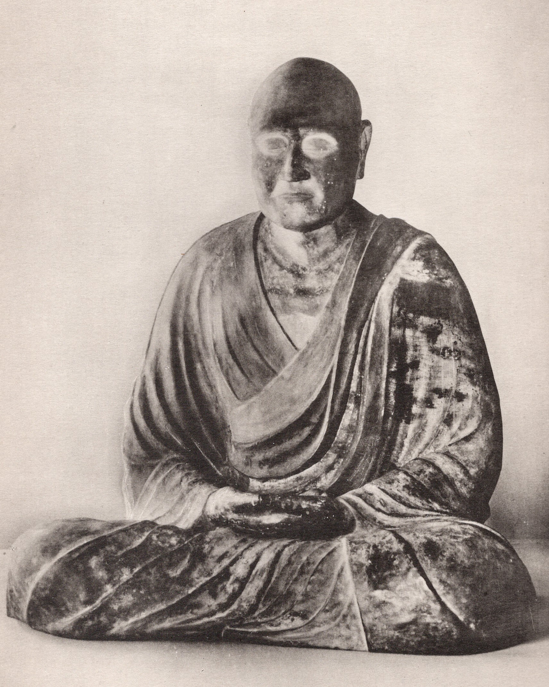

{width=80% fig-align="center"}

公元753年深秋，扬州江边，夜色已经沉了下来。一位年过花甲、双目失明的老僧，悄然走出自己住了多年的龙兴寺。他没有车马仪仗，也没有公开送行，因为唐朝对于人员出境有严格限制，地方僧俗又担心他渡海遇险，处处设法挽留。江边已有船只等候，他将在这里登船，前往一个从未踏足的遥远国度。

消息还是走漏了。二十四名年轻沙弥哭着追到江边，对他说：

“大和尚今日远赴海东，我们今生恐怕再也见不到您了。临别之前，恳请和尚为我们授戒，让我们与您结下法缘。”老僧没有催促开船，而是在江岸为他们举行了授戒仪式。仪式结束后，他才登船离去。这位老僧就是鉴真。这已经是他第六次尝试东渡日本。此前十余年间，他遭遇过告发、拘押、风暴、沉船和长途漂流；弟子有人病逝，有人退却，他自己也因炎热、疾病和误治而失去了视力。但这一次，他仍然没有回头。

《唐大和上东征传》记载，鉴真第一次答应东渡时，曾说：

> “是为法事也，何惜身命？诸人不去，我即去耳。”

意思是：这是为了佛法的事业，何必吝惜自己的身命？别人不去，我便自己去。这句话并不是一时激动的豪言。此后十二年的经历证明，鉴真确实把它变成了自己一生的行动。

---

## 一、日本已经有佛教，为什么还要请鉴真东渡？

说到鉴真东渡，人们常会产生一种误解：鉴真是不是把佛教第一次带到了日本？并不是。在鉴真到来以前，佛教传入日本已经有近两百年的历史。佛像、佛经、寺院建筑以及僧尼制度，先后由朝鲜半岛和中国传入日本。到了奈良时代，日本已经有法隆寺、兴福寺、东大寺等著名寺院，朝廷也把佛教视为护国安民的重要力量。

问题不在于“有没有佛教”，而在于僧团制度是否完备。佛教不是只有经文和佛像。一个完整的佛教僧团，还需要依照戒律剃度、受戒、安居、诵戒，处理僧团内部的各种事务。尤其是一个人要成为正式的比丘，不能只靠自己在佛前发誓，还须由具备资格的僧团依照律藏规定，举行羯磨和授戒仪式。

按照当时中国佛教通行的制度，正式授予具足戒，一般需要“三师七证”：

* **戒和尚**，负责传授戒法；

* **羯磨阿阇梨**，主持僧团议事和仪式程序；

* **教授阿阇梨**，询问受戒者是否具备受戒资格；

* 另有七位尊证师，共同证明授戒如法完成。

这不是为了把仪式变得繁琐，而是为了说明：出家不是一个人的私人决定，而是正式进入僧团、接受僧团教育和约束的一件大事。当时日本虽然已经有律藏，也有僧尼，但能够按照完整程序主持传戒的高僧不足。《东大寺要录》用一句非常简洁的话概括了日本佛教面临的困境：

> “我国中虽有律本，阙传戒人。”

有戒律的经典，却缺少能够依律传戒的人。因此，日本朝廷派遣荣叡、普照等僧人随遣唐使入唐，任务之一就是寻找通晓戒律、具备传戒资格的高僧。他们不是来寻找一个普通的讲经法师，而是希望请回一位能够建立僧团规范的“传戒之师”。这也提醒我们：佛教的传承不能只有书本。

佛经可以抄写，佛像可以雕刻，寺院可以建造；但怎样修行、怎样生活、怎样授戒、怎样形成一个清净和合的僧团，还需要一代代真实的人亲自示范和传授。鉴真东渡所要传递的，正是这种“活着的佛法”。

---

## 二、鉴真是谁？

鉴真出生于公元688年，俗姓淳于，是扬州江阳县人。扬州位于长江与大运河交会之地，是唐代重要的商业城市和国际港口。来自波斯、阿拉伯、东南亚和日本的商人与僧侣在这里往来，各地的货物、宗教和文化也在这里交汇。鉴真十四岁时，随父亲到扬州大云寺。他见到佛像，心中深受触动，便请求父亲允许自己出家。此后，他先后在洛阳、长安学习佛法，在实际寺登坛受具足戒，又从道岸、弘景等律师学习戒律。

当时长安和洛阳汇集了全国最优秀的佛教学者。鉴真不仅学习律藏，也广泛研习经、律、论三藏。学成之后，他回到江淮地区讲授戒律，逐渐成为当地最受尊敬的传戒大师之一。《唐大和上东征传》说，鉴真前后讲授大律及其注疏数十遍，度人授戒“略计过四万有余”。这一数字带有高僧传记常见的赞颂色彩，却足以说明：接受日本僧人邀请时，鉴真并不是一位默默无闻、希望到海外寻找机会的普通僧人。

恰恰相反，他已经拥有崇高的声望、众多的弟子和稳定的寺院生活。他没有任何世俗理由必须离开中国。也正因为如此，他决定东渡才格外令人震动。

---

## 三、“山川异域，风月同天”

公元742年，日本僧人荣叡、普照来到扬州大明寺。那一天，鉴真正在为大众讲授戒律。荣叡和普照向他顶礼，说明来意：

佛法虽然已经传到日本，但日本缺少能够如法传戒的高僧，希望鉴真能够东渡，成为日本僧众的导师。鉴真没有立刻回答。他先向自己的弟子们询问：

“在我们这些同修之中，有谁愿意接受这份遥远的邀请，前往日本传法？”众人沉默不语。一位名叫祥彦的弟子解释说，日本路途遥远，海上风浪无常，渡海者百不存一。人身难得，佛法难闻，大家修行尚未成就，所以不敢轻易舍身远行。这种担忧并非怯懦。在没有现代航海技术的时代，从中国渡海前往日本，往往意味着把生命交给风向、海流和一艘木船。遣唐使船遇到风暴、迷失航线乃至全船覆没，并不是罕见的事情。

鉴真听完，却说出了那句后来流传千年的话：

> “是为法事也，何惜身命？诸人不去，我即去耳。”

祥彦随即回答：

“如果大和尚去，我也跟随大和尚去。”于是，二十余名僧人表示愿意同行。《唐大和上东征传》还记载，鉴真此前已经听说过日本长屋王向唐朝僧人布施千件袈裟的故事。袈裟边缘绣着四句话：

> “山川异域，风月同天。

> 寄诸佛子，共结来缘。”

山河把人们分隔在不同的国度，同一轮明月、同一阵清风，却照临着彼此。愿把这些袈裟送给佛门弟子，共同结下来日的法缘。这几句话是否完全出自长屋王本人，后世尚有讨论，但它准确表达了当时东亚佛教交流的一种精神：地域可以不同，众生求法向善的心却可以相通。

鉴真认为，日本是一个“佛法兴隆有缘之国”。因此，他的东渡并不是为了扩张领土，也不是为了传播某种民族优越感，而是回应远方求法者的请求，把自己所学的戒律传给需要它的人。

---

## 四、六次东渡：并不是六次都顺利出海

后世常用“六次东渡，五次失败”概括鉴真的经历。实际上，这六次尝试的情况各不相同。有的尚未出海，便因内部矛盾和官府干预而中止；有的船只出发后遭遇风暴；有的被地方僧俗告发拦截；最远的一次，则被海风吹到了海南岛。

### 第一次：事情败露

鉴真答应东渡后，弟子们开始秘密准备船只、粮食、经卷、佛像和药物。但同行僧人之间发生争执，有人向官府告发，说队伍中藏有海盗，东渡计划因此败露。船只和物资被官府查扣，荣叡等人也受到拘押。第一次尝试尚未真正进入大海，便宣告失败。

### 风浪与阻拦

此后几次，鉴真一行或者因为船只受损，或者因为风暴被迫返航，或者因弟子和地方官员担心他的安危而被强行留下。有一次，船只遭遇恶风，巨浪将船击破。众人登岸时，海水已经没到腰间。那时正值寒冬，风急水冷，粮食和淡水很快耗尽。一行人在饥渴中苦熬数日，才得到当地渔民救助。

又有一次，地方僧众得知鉴真打算离开，担心失去这位德高望重的老师，便向官府报告。鉴真一行被追赶、拦截，送回原来的寺院。从普通人的感情来看，这些挽留并不都是恶意。鉴真的弟子舍不得老师，当地信众也不愿让一位年长高僧冒险渡海。但对鉴真来说，越是受到尊敬，越意味着他必须放下已经拥有的一切。

真正难以跨越的，有时并不是海上的风浪，而是熟悉生活的牵绊。

### 漂流海南

公元748年，鉴真再次出海。这次航行成为六次东渡中最危险的一次。船只在大海中连续漂流，风浪翻涌，海水黑如浓墨，船时而像被推上高山，时而仿佛跌入深谷。船上的人晕眩呕吐，只能不断称念观世音菩萨。淡水很快用尽。众人只能嚼食生米，却因为口渴而难以下咽；饮用海水，又导致腹部胀痛。

《东征传》记载，一行人在海上漂流十四天，最后没有抵达日本，反而被风吹到了遥远的海南岛。此后，他们从海南出发，经过广东、广西、江西、江苏，辗转数千里，才重新回到扬州。这趟失败的航程，前后持续数年。在返回途中，日本僧人荣叡病逝于端州。荣叡为求传戒之师，在中国奔走近二十年，最终未能亲眼看到鉴真抵达日本。

鉴真悲痛万分。不久，他又因长期在炎热地区跋涉而患上眼病。有胡人自称能够医治，诊治之后，鉴真的双眼却彻底失去了光明。他失去了弟子，失去了视力，绕行大半个中国，最后又回到了出发之地。从世俗的角度看，此时已经有足够充分的理由放弃。然而，鉴真并没有认为自己的愿心已经结束。

---

## 五、看不见海的人，再次登上了船

公元753年，日本遣唐使藤原清河、大伴古麻吕、吉备真备等人准备返回日本。他们早已听说鉴真多次渡海未成，于是前往寺中拜见，希望设法帮助他同行。鉴真的名字原本曾被列入随行名单，但唐玄宗要求日本使节带道士回国，日本朝廷一向不崇奉道教，使节没有接受，因此相关名单也被撤回。加上扬州僧俗严密看守，鉴真仍然难以公开离境。

最后，大伴古麻吕将鉴真和弟子秘密接上自己的船。这时的鉴真已经六十六岁，又双目失明。一个完全看不见海的人，再次登上了远洋船只。与鉴真同行的，不只是几名僧人。《东征传》详细列出了他们携带的物品，其中包括：

* 佛舍利；

* 阿弥陀佛、观世音菩萨、药师佛、弥勒菩萨等佛像；

* 《华严经》《涅槃经》《四分律》等佛典；

* 天台宗的止观、法华玄义等著作；

* 道宣律师的戒律注疏；

* 《大唐西域记》；

* 王羲之、王献之等人的书法；

* 菩提子、香药、器物以及各种工艺品。

这份清单十分重要。它告诉我们，鉴真所乘坐的船，并不是只载着一个人，也不只是载着几箱经书。船上承载的是一整套唐代佛教文化：戒律、教理、造像、书法、仪式、工艺和生活知识。佛教的传播从来不是一个抽象观念单独旅行，而是由具体的人，带着具体的经典、技艺和生活方式，一起跨越山海。

公元753年十一月，船队从苏州黄泗浦起航。途中经过海岛和屋久岛，十二月二十日，鉴真所乘船只抵达日本萨摩国阿多郡。随后，一行人经太宰府、难波，于第二年二月进入平城京。鉴真终于踏上了日本国土。从第一次答应东渡算起，已经过去了十二年。

---

## 六、东大寺授戒：一座戒坛意味着什么？

鉴真抵达平城京后，被安置在东大寺。日本朝廷派人传达诏令，大意是：

大和尚远渡沧海来到我国，正合朕心。建造东大寺十余年来，朕一直希望设立戒坛，传授戒律，日夜不忘。今后传戒授律之事，全都委任大和尚主持。公元754年四月，东大寺大佛殿前筑起戒坛。圣武太上皇首先登坛受菩萨戒，随后光明皇太后、孝谦天皇等也登坛受戒。此后，鉴真又为四百余名沙弥授戒，并为一批已有声望的日本僧人重新授戒。

后来，东大寺大佛殿西侧建成常设的戒坛院。从此，越来越多日本僧人在这里依照完整仪式受戒。东大寺至今仍把鉴真来日和戒坛院的建立，视为日本正规授戒制度形成的重要开端。

### 小栏目：戒、律、戒坛分别是什么？

**戒**，主要是个人自愿接受的行为准则。例如不杀生、不偷盗、不妄语，是在家佛教徒也可以受持的戒。出家僧尼则有更为完整的具足戒。**律**，不仅包括个人应当遵守的戒条，也包括僧团共同生活和处理事务的制度。例如怎样受戒、怎样安居、怎样诵戒、怎样处理争议、怎样照顾病人，都属于律的范围。

**戒坛**，是举行正式授戒仪式的特定场所。它的重要性并不在于建筑是否高大，而在于这里划定了一个清净、庄严的僧团空间。受戒者在僧团见证下承诺遵守戒法，并被正式接纳为僧团成员。因此，鉴真建立戒坛，不只是修建了一处宗教建筑，更是在帮助日本佛教建立一种可以持续传承的人才培养制度。

---

## 七、戒律是不是对人的束缚？

现代人听到“戒律”，很容易想到禁止、惩罚和压抑。但从佛教的角度说，戒律的目的并不是让人失去自由，而是帮助人摆脱烦恼和欲望的控制。一个人想做什么就立刻去做，看似自由，实际上可能只是被贪欲、愤怒和习惯牵着走。真正的自由，是在欲望出现时，仍然能够看清后果，作出不伤害自己和他人的选择。

《佛遗教经》把戒比喻为通往解脱的根本：

> “戒是正顺解脱之本。”

又说：

> “因依此戒，得生诸禅定及灭苦智慧。”

戒能够使人的行为安定，行为安定之后，内心才容易安定；内心安定，才可能生起观察自己和世界的智慧。这就是佛教常说的“戒、定、慧”三学：

* 以戒约束身口，使行为清净；

* 由戒生定，使内心安住；

* 由定发慧，看清烦恼和痛苦的根源。

因此，鉴真传到日本的并不是一部冷冰冰的规章，而是一条完整的修行道路。当然，历史上的戒律制度也曾与国家管理结合，僧人资格有时受到朝廷控制。我们不必把古代制度全部理想化。但从佛教本身来看，戒律最根本的意义仍然是自愿止恶行善，而不是外在权力对人的强迫。

---

## 八、唐招提寺：让戒律真正扎根

在东大寺居住数年后，鉴真希望建立一处专门学习戒律、培养僧才的道场。公元759年，日本朝廷把新田部亲王的旧宅赐给鉴真。鉴真与普照、思托等弟子在这里建立寺院，最初称为“唐律招提”，后来成为唐招提寺。“招提”一词原本与“四方僧”有关，后来逐渐成为寺院的别称。“唐律招提”，可以理解为一座传承唐代戒律、供十方僧众修学的道场。

《唐大和上东征传》记载，鉴真和弟子在这里讲授《四分律》及其注疏。随着师徒相承，日本的律仪“渐渐严整”，戒律之学也从一位外来高僧的个人教导，逐渐转化为能够代代传承的制度。书中用一个非常美的比喻形容这种传承：

> “亦如一灯燃百千灯，冥者皆明，明终不绝。”

一盏灯点燃百千盏灯，黑暗之处因此得到光明，而最初的灯火并不会因为分给别人而减少。这正是佛法传播最理想的状态。老师不是让弟子永远依附自己，而是点亮弟子的灯，使弟子也能够照亮后来的人。唐招提寺后来成为日本律宗的重要道场。寺内现存的金堂、讲堂、经藏、宝藏以及鉴真和上坐像，成为奈良时代佛教文化的重要遗产。唐招提寺官方资料记载，该寺由鉴真于759年创建，目的正是为学习戒律者提供修行道场。

---

## 九、闭着双眼的鉴真像

公元763年，鉴真的弟子忍基梦见讲堂栋梁折断，感到老师即将离世，于是带领弟子为鉴真塑造坐像。同年农历五月初六，鉴真结跏趺坐，面向西方圆寂，世寿七十六岁。今天，唐招提寺仍保存着这尊鉴真和上坐像。坐像中的鉴真身披袈裟，双手安放膝前，眼睛安静地闭着。脸上没有经历苦难后的愤怒，也没有完成伟业后的骄傲，只有一种经历一切之后的沉静。

唐招提寺介绍，这尊像高约八十厘米，采用脱活乾漆工艺制成，是日本现存最早的肖像雕塑之一，也是奈良时代肖像艺术的代表作品。人们站在这尊像前，很容易想到鉴真已经失明的双眼。但真正值得记住的，不是他“看不见”了什么，而是他在双眼失明之后，仍然知道自己应该去往哪里。

有些人眼睛明亮，却一生不知道方向；有些人失去了视力，内心的愿却从未动摇。鉴真的方向，并不是地图上的东方，而是远方众生对佛法的需要。

---

## 十、鉴真带去的，不只有戒律

在后世叙述中，鉴真常被称为中日文化交流的使者。有些说法把日本医药、建筑、雕塑、书法等领域的许多发展都归功于鉴真一人，这未免过于简单。奈良时代的日本长期派遣使节和留学生到唐朝，唐代文化的传入是许多僧人、使节、工匠和学者共同努力的结果。但鉴真及其弟子的确是其中极具代表性的一群人。

他们带去大量佛典、佛像、舍利和书迹，也带去了戒坛制度、讲律传统、寺院管理方式和唐代佛教的审美经验。鉴真不是独自一人完成这一切，同行的法进、思托、法载、义静等僧人，以及工匠和在家弟子，都参与了传播和建设。唐招提寺的建筑、佛像和文物，至今仍保留着奈良时代吸收唐代文化后形成的独特风貌。联合国教科文组织在评价古奈良历史遗迹时指出，这些建筑和艺术见证了日本在与中国、朝鲜半岛文化联系中发生的深刻发展。

这说明文化传播从来不是简单复制。日本没有原样照搬唐朝佛教，而是在自己的社会、语言和历史条件中重新理解它。中国佛教传到日本以后，逐渐形成日本的律宗、天台宗、真言宗、净土诸宗与禅宗传统；寺院建筑、佛像风格和僧团制度，也在漫长历史中发生变化。真正有生命力的文化传播，既需要忠实传承，也需要本土创造。

---

## 十一、佛教是怎样从中国走向东亚的？

佛教起源于印度，但它并没有沿着一条单一、笔直的路线传播。从印度出发的佛教，通过陆上丝绸之路和海上航路，传播到中亚、中国、朝鲜半岛、日本、越南以及东南亚各地。不同地区接触佛教的时间、接受的经典和形成的宗派都不完全相同。中国在这一过程中发挥了十分重要的中转和再创造作用。

佛经进入中国后，经过数百年的翻译和解释，逐渐形成了以汉语为载体的庞大佛教典籍。中国僧人又在印度佛教的基础上，建立天台、华严、禅、净土和律宗等具有鲜明中国特点的传统。这些汉译佛经、宗派思想和寺院制度，后来继续向朝鲜半岛、日本和越南传播，由此形成了通常所说的汉传佛教文化圈。

这个文化圈有几个明显特征：

第一，共同使用大量汉译佛典。即使各国的日常语言不同，许多僧人仍以汉文佛典作为学习和交流的共同基础。第二，寺院制度和僧团礼仪相互影响。受戒、讲经、法会、寺院建筑和佛像造型，都能看到中国佛教的深刻影响。第三，交流并不是单向的。日本和朝鲜半岛的僧人来到中国求法，也保存、整理了不少后来在中国散失的佛教典籍。中国僧人前往海外传法，各国僧人又把自己的理解带回中国。佛教在东亚的传播，更像一张不断往来的网络，而不是一条只向一个方向流动的河流。

玄奘的故事，是中国僧人向西求法；鉴真的故事，则是中国僧人向东传法。一位把印度佛法带回长安，一位把已经中国化的佛教带向奈良。他们行走的方向不同，所做的却是同一件事：为了求法与传法，跨越语言、国界和文化的隔阂。

---

## 十二、常见误解：佛教只是从印度传入中国吗？

佛教的确起源于印度，中国最初也是佛教的接受者。但历史并没有停在“印度传入中国”这一步。佛教进入中国后，经历了长期的翻译、解释和本土化。中国僧人不仅学习佛教，也重新组织佛教的思想体系，发展出具有中国特色的宗派、修行方法和寺院文化。当这些成果继续传入朝鲜半岛、日本和越南时，中国便从佛教的接受地之一，转变为东亚佛教的重要传播中心。

因此，更准确的说法是：

> 佛教从印度出发，在亚洲不同文明之间不断被翻译、理解、实践和再创造。

它不是某一个国家永远独占的文化财产，也不是从一个中心复制到各地的固定模板。鉴真东渡所代表的，正是文明之间的接力。印度僧人和中亚僧人曾冒险来到中国；中国僧人又冒险前往日本；日本僧人此后继续来到中国学习。每一代人都是接受者，也是传递者。佛法在这种往来中得以延续。

---

## 十三、“何惜身命”是不是鼓励人不顾生命？

鉴真的名言“是为法事也，何惜身命”，很容易被理解成一种不计后果的牺牲精神。但鉴真的行动并不是冲动冒险。每次东渡之前，他都会准备船只、粮食、药物、经卷和同行人员；航行失败后，他也会返回寺院，重新讲经授戒，等待新的机会。他重视生命，也关心弟子，并不是为了证明自己勇敢而轻率赴死。

“不惜身命”真正表达的是：当个人安逸与利益众生的愿心发生冲突时，他不愿因为害怕困难而放弃责任。佛教并不鼓励无意义地伤害自己。佛教戒律以不杀生为根本，也包括爱护自己的身心。菩萨行中的舍身故事，重点不是制造痛苦，而是说明慈悲心能够超越狭隘的自我中心。

因此，鉴真精神不应被简单理解为“不要命”，而应理解为：

* 认清自己所承担的责任；

* 不因一时挫折便放弃长期愿心；

* 在困难中仍然保持理智和准备；

* 愿意为了比个人得失更重要的事情，坚持走下去。

对现代人来说，我们未必需要跨越风暴中的大海，但每个人都会遇到自己的“第五次失败”。真正值得学习的，不是鉴真吃过多少苦，而是他在失败之后，依然没有让挫折决定自己的方向。

---

## 十四、佛法的传播，不靠征服

鉴真抵达日本时，没有带军队，也没有携带要求别人服从的权力。他带去的是戒律、经典、佛像、书法和一群愿意教学的弟子。他在日本获得尊敬，不是因为强迫别人接受佛法，而是因为有人主动邀请他，而他又用自己的学问、人格和行动回应了这种邀请。佛教在东亚最深远的传播，大多不是依靠战争和征服，而是依靠译经、讲学、求法、造寺和师徒之间的传承。

一位僧人翻译一部经，一位弟子抄写一份注疏，一位工匠建造一座佛殿，一位普通人供养远行者的食物——许多看似微小的行动，最终共同改变了一个地区的文化。这也是鉴真故事最动人的地方。他没有把自己的名字刻在征服的疆界上，却把一盏戒灯留在了海的另一边。《唐大和上东征传》说：

> “一灯燃百千灯，冥者皆明，明终不绝。”

佛法之灯点燃另一盏灯，光明并不会因此减少。从扬州大明寺到奈良唐招提寺，从长江边的一次夜航，到延续千年的东亚佛教文化，鉴真所传递的正是这样一束光。

---

## 本章小结

鉴真东渡并不是佛教第一次传入日本。鉴真到来以前，日本已经有佛经、佛像、寺院和僧尼，但缺少能够得到广泛承认的完整传戒制度。鉴真是唐代著名律学高僧。面对日本僧人的请求，他说：“是为法事也，何惜身命？诸人不去，我即去耳。”此后十二年间，他多次遭遇告发、阻拦、风暴和漂流，又经历弟子病逝与双目失明，最终在第六次航行中抵达日本。

鉴真在东大寺设立戒坛、主持授戒，又创建唐招提寺，培养学习戒律的僧人。他带到日本的不只是戒律，还有大量佛典、佛像、书迹、工艺和唐代佛教文化。鉴真的故事说明，佛教传播不是从印度到中国便告结束。中国在接受、翻译和发展佛教之后，又成为佛教走向朝鲜半岛、日本和越南的重要枢纽。佛教文明正是在不断的求法、翻译、传授和本土化中延续下来。

佛教的传播不是一场征服，而是一盏灯点燃另一盏灯。

---

## 本章经典名句

> **是为法事也，何惜身命？诸人不去，我即去耳。**

> ——《唐大和上东征传》

为了佛法与众生的事业，何必只顾惜个人的安逸与得失？别人不去，我便先走出这一步。

> **山川异域，风月同天。寄诸佛子，共结来缘。**

> ——《唐大和上东征传》所载袈裟题句

虽然身处不同国度，却共在同一片天地之中；愿以佛法结缘，使彼此超越地域的阻隔。

> **一灯燃百千灯，冥者皆明，明终不绝。**

> ——《唐大和上东征传》

一盏灯可以点燃百千盏灯，使黑暗之处都得到光明，而光明也因此代代相续，永不断绝。

---

## 主要史料与参考依据

1. 真人元开即淡海三船撰《唐大和上东征传》。该书写成于公元779年，主要依据鉴真随行弟子思托所撰传记，是研究鉴真生平和东渡经历最重要的基本史料。日本文化遗产数据库所藏高山寺本，是现存重要古写本之一。2. 《东大寺要录》，有关日本派遣荣叡、普照入唐迎请传戒师的记载。3. 唐招提寺官方资料，有关鉴真生平、唐招提寺创建及鉴真和上坐像的介绍。4. 东大寺官方资料，有关鉴真授戒与戒坛院建立的记载。5. 联合国教科文组织“古奈良历史遗迹”资料，有关中国、朝鲜半岛文化交流对日本建筑和艺术发展的影响。
