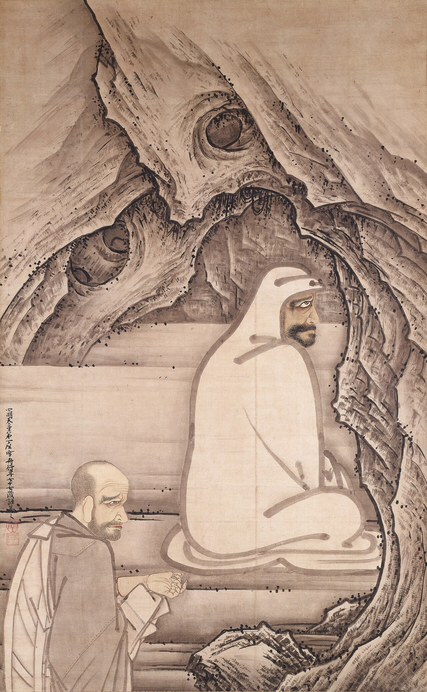

{width=65% fig-align="center"}

深山入冬，夜雪无声。

一位来自异域的僧人独坐石室，身披旧袈裟，面向冰冷的墙壁，终日沉默。石室之外，一个中国僧人立在雪中，请求大师开示佛法。雪越下越深，渐渐没过他的膝盖。为了表明求法的决心，他甚至挥刀断臂，鲜血染红了白雪。

这是中国禅宗历史上最著名的画面之一：达摩面壁，慧可断臂。

在后世的绘画中，达摩常被画成浓眉大眼、满脸虬髯的异域僧人。他不诵经，不讲论，只是面对石壁静坐。慧可则站在一旁，捧着断臂，以生命求取一句安心之法。

故事充满传奇色彩，但它所要追问的问题，却与每一个普通人有关：

当内心被忧虑、恐惧、得失和烦恼搅动时，人究竟怎样才能安定下来？

文字、道理和知识，为什么有时仍不能解除人的痛苦？

禅宗所说的“不立文字”，是不是意味着不读佛经、不学教理，只要闭目静坐就可以成佛？

要回答这些问题，我们必须从那位被后世尊为“中国禅宗初祖”的异域僧人说起。

---

## 一、达摩到来以前，中国已经有“禅”

“禅”并不是达摩发明的。

“禅”是“禅那”的简称，来自印度语“dhyāna”，大意是通过专注、观察和修习，使散乱的心逐渐安定、明净。佛陀时代的戒、定、慧三学中，“定”便与禅修密切相关。早在达摩来到中国以前，安世高、鸠摩罗什等译经家已经译出许多有关禅定、念处和观心的经典，中国僧人也早已在修习各种禅法。

因此，达摩并不是第一个把坐禅带到中国的人。

他真正带来的，是一种鲜明的修行态度：佛法不能只停留在文字解释和概念辨析上，必须回到自己的身心，在当下亲自体会、亲自验证。

从历史上看，达摩的生平并不十分清楚。较早提到他的文献，是北魏杨衒之所著的《洛阳伽蓝记》；稍后的昙林序文和唐代道宣《续高僧传》，才逐渐勾勒出一位由西方来到中土、在洛阳一带传授大乘禅法的僧人形象。至于达摩与梁武帝问答、一苇渡江、少林面壁九年、只履西归等故事，大多是在后来的禅宗史书中逐步形成的。因而，我们今天所认识的达摩，一部分属于可以考察的历史人物，一部分属于禅门世代传诵的祖师形象。

这并不意味着所有传说都毫无价值。

历史研究关心的是：“事情是否确曾这样发生？”

宗教故事还关心另一个问题：“后人为什么要这样讲述？”

达摩面壁、慧可断臂，即使包含后世的文学塑造，仍然凝聚了禅宗对修行的理解：真正的佛法，不只是听来的知识，而是一个人用全部生命去面对自己、转化自己的过程。

严格地说，达摩在世时，还没有后来宗派制度意义上的“禅宗”。禅宗经过慧可、僧璨、道信、弘忍等人的传承，到道信、弘忍的“东山法门”时期才逐渐形成规模。达摩被尊为“东土初祖”，是后来禅宗在回溯自身源流时确立的地位。

因此，“达摩东来”并不是说一个已经完整成熟的宗派从印度搬到了中国，而是说一颗种子落入了中国文化的土壤，经过数代人的培育，最后长成了具有鲜明中国气质的禅宗。

---

## 二、一个从海上而来的异域僧人

依照道宣《续高僧传》的记载，菩提达摩出身南天竺婆罗门种，通达大乘佛法，渡海来到南方，后来北上进入北魏境内，在洛阳、嵩山一带传授禅法。

“菩提达摩”是音译。“菩提”意为觉悟，“达摩”意为法，合起来可以理解为“觉法”。

后世最流行的故事，说达摩到达南朝以后，曾受到梁武帝接见。梁武帝笃信佛教，一生建寺、写经、供养僧众，于是问达摩：

“朕即位以来，造寺、写经、度僧无数，有何功德？”

达摩回答：

“并无功德。”

梁武帝不解，又问：

“如何是圣谛第一义？”

达摩回答：

“廓然无圣。”

梁武帝再问：

“对朕者谁？”

达摩说：

“不识。”

两人话不投机，达摩便离开南方，渡江北上。

这段对话见于后出的禅宗灯录，并不见于较早的达摩史料，不能简单当作确定的历史事实。但它非常生动地表达了禅宗对“功德”的反省：建寺、布施、护持佛法当然是善行，却不能因此产生“我做了多少功德”的骄傲，更不能用外在善行代替内心的觉察。

梁武帝所计算的是“我做了什么”；达摩所追问的却是：“这个不断计算功德的‘我’，究竟是什么？”

善行若被贪求名声、福报和自我满足的心所支配，便仍然没有触及烦恼的根本。禅宗并不否定行善，而是要求人在行善时，也看见自己内心的执著。

达摩后来被传说为渡过长江，来到嵩山少林寺，在石洞中面壁九年。人们无法理解他的修行，便称他为“壁观婆罗门”。

“婆罗门”说明他来自印度；“壁观”则成为达摩禅法最鲜明的标志。

---

## 三、面壁九年：墙壁究竟意味着什么？

说到达摩，人们首先想到的往往是“面壁九年”。

有人把它理解为：达摩真的在山洞中面对墙壁，一坐就是九年。

也有人认为，“壁观”不只是身体面对一面墙，更是一种修心的譬喻。

达摩禅法的重要文献《二入四行论》中说，修行人应当“舍妄归真，凝住壁观”，使心不再随外境漂动。《中国禅宗史》中，印顺法师将“壁观”解释为凝心、安心、住心的譬喻：心如墙壁，并不是内心变得麻木僵硬，而是不轻易被分别、爱憎和得失所穿透。

一面坚实的墙壁，不会因为有人赞美它就欢喜，也不会因为有人辱骂它就愤怒；不会因为风吹雨打便失去自己的位置。

“心如墙壁”，不是让人没有感情，而是让人不再被每一次情绪冲动立即带走。

别人说一句好话，我们便心花怒放；说一句难听的话，我们便辗转难眠。工作顺利时，觉得自己无所不能；遇到挫折时，又觉得人生毫无希望。我们的心就像一片轻薄的树叶，外界吹来什么风，便向什么方向飘去。

壁观所训练的，是在情绪与行动之间留出一点空间。

愤怒升起时，先看见愤怒，而不是立刻说出伤人的话。

焦虑升起时，先知道“此刻有焦虑”，而不是马上认定“我的人生完了”。

欲望升起时，先观察它从哪里来、如何变化，而不是立刻跟随它。

所以，达摩面壁并不是逃避世界。恰恰相反，它要求一个人不再只盯着外面的世界，而是转身看见：外境之所以能够扰动自己，是因为内心早已有了贪求、排斥和执取。

墙壁没有告诉达摩任何道理。

但在长久的沉默中，人可以逐渐听见自己的心。

---

## 四、入道的两扇门：理入与行入

达摩禅法最重要的概括，是“二入四行”。

《二入四行论》开篇说：

> “夫入道多途，要而言之，不出二种：一是理入，二是行入。”

入道的方法虽然很多，概括起来，不外乎两个方面：一是从道理上明白，二是在生活中实践。

### 1. 理入：借助经典，明白宗旨

所谓“理入”，原文首先说的是“藉教悟宗”。

“藉教”，就是借助佛陀的教法和经典；“悟宗”，就是由文字所指引，明白文字背后的根本宗旨。

这四个字非常重要。

它说明达摩禅法并不是反对经典，而是反对把经典只当作知识来积累。经典是一条道路，而不是终点；是一根指向月亮的手指，而不是月亮本身。

一个人可以熟读“诸行无常”，却在失去某件东西时无法接受变化；可以天天讲“无我”，却处处维护自尊；可以解释“缘起性空”，却仍被一句批评困扰数日。

这便是只记住了文字，还没有“悟宗”。

《二入四行论》说，一切众生虽有迷悟不同，却“同一真性”，只是被客尘妄想覆盖，不能显现。所谓“客尘”，就像暂时落在镜面上的灰尘。灰尘虽然遮蔽镜子，却不是镜子的本质；烦恼虽然覆盖心性，也不是不可改变的命运。

理入，不是相信自己已经成佛，而是深信烦恼并非永恒不变，觉悟具有可能。

但仅仅明白这个道理还不够。

知道镜子可以擦亮，不等于镜子已经干净；知道心可以安定，也不等于烦恼已经止息。因此，理入之后，还必须有“行入”。

### 2. 行入：在生活中修四种行

行入包括四种实践：报冤行、随缘行、无所求行、称法行。

这四种修行没有离开日常生活。它们所面对的，正是每个人都会遇到的苦乐、荣辱、得失和欲求。

#### 第一，报冤行：遇到痛苦时，不让怨恨继续制造痛苦

“报冤”并不是说，一个人遭受不幸时，只能认命，更不是说受欺凌者必须忍受伤害。

它所强调的是：当苦难已经发生时，不要让怨恨、报复和自我折磨继续扩大苦难。

人遇到挫折，常会不断追问：

“为什么偏偏是我？”

“他凭什么这样对我？”

“如果当初没有发生那件事就好了。”

这些念头看似是在寻找答案，实际上往往是在反复撕开伤口。

报冤行提醒人：已经成熟的因缘，必须如实面对。我们可以制止不公，可以保护自己，可以寻求帮助，也可以纠正造成痛苦的原因；但在行动时，不必再用怨恨烧灼自己的心。

接受事实，不等于赞同伤害。

不怀怨恨，也不等于放弃原则。

真正的忍，不是软弱地忍受一切，而是不让自己的心变成另一个伤害的源头。

#### 第二，随缘行：得到时不狂喜，失去时不崩溃

世间的荣誉、地位、财富和关系，都由许多条件共同形成。条件聚合时，事物出现；条件变化时，事物也随之改变。

今天获得的成功，并不完全属于“我”的能力，其中还有时代、环境、他人帮助和许多偶然因缘。明天遭遇失败，也不意味着自己从此一无是处。

随缘不是随便，更不是随波逐流。

它是尽力而为，却不要求世界必须按照自己的愿望运行；珍惜所得，却知道所得不会永远停留；面对失去，也不把一次得失看成对整个人生的最后判决。

顺境中不骄慢，逆境中不绝望，这便是“随缘”。

#### 第三，无所求行：做事，但不把幸福押在结果上

“无所求”并不是没有理想、没有计划、什么都不做。

人可以认真工作，可以改善生活，可以追求学问，也可以努力帮助他人。问题不在于有没有目标，而在于是否把内心的安稳完全押在某个结果上。

“只有升职，我才有价值。”

“只有别人认可我，我才能快乐。”

“只要念佛、坐禅，佛就应该保佑我事事顺利。”

这种带着交易心的追求，即使一时得到满足，也会立刻产生新的不安，因为得到之后害怕失去，没有得到时又感到怨恨。

无所求行，是认真做应做之事，却不把修行变成与佛菩萨交换利益的条件。

努力，但不被结果绑架。

发愿，但不以愿望控制世界。

#### 第四，称法行：让行为与佛法相应

“称法”，就是与法相称、依照正法而行。

既然一切事物都因缘和合，没有一个孤立不变的“我”，那么布施、帮助和善行，就不应成为炫耀自我的工具。

帮助别人时，不总想着“是我帮助了你”；受到赞美时，不把功劳牢牢据为己有；付出没有得到回报时，也不立刻后悔。

称法行使禅不再只是静坐时的内心体验，而成为待人接物的方式。

若一个人坐禅时十分安静，离开蒲团后却傲慢、自私、易怒，他所修的便只是暂时的安静，还没有真正进入佛法。

二入四行所表达的，是一种完整的修行：

以道理指明方向，以实践改变生命；

由经典明白佛法，再在日常生活中验证经典。

---

## 五、雪夜求法：慧可为什么要断臂？

在达摩的弟子中，最著名的是慧可。

据《续高僧传》记载，慧可俗姓姬，早年既读儒家典籍，也通佛教经论。大约四十岁时，他遇见正在嵩洛一带传法的达摩，一见便知其非凡，随从学习六年。达摩后来将四卷本《楞伽经》授予慧可，说汉地修行人依此经而行，可以得到解脱。

《续高僧传》还记载，慧可后来“遭贼斫臂”，被盗贼砍去一臂。他以佛法调伏其心，处理伤口以后，仍如常乞食，没有到处诉说自己的痛苦。

然而，稍后的禅宗文献《传法宝纪》提出了另一种说法：慧可并非被盗贼砍断手臂，而是为了向达摩表明求法的诚意，主动断臂。《传法宝纪》甚至特别说，所谓被贼斫臂，是误传。

到了宋代《景德传灯录》，这个故事被描述得更加完整。

神光——也就是后来的慧可——听说达摩住在少林，便前往参学。达摩终日面壁，不加开示。寒冬腊月，神光彻夜站立于雪中。天明时，积雪已经没过膝盖。

达摩问他：“你久立雪中，求什么？”

神光流泪说：“愿和尚慈悲，开甘露门，广度众生。”

达摩告诉他，无上佛道必须经过长久精勤，不是凭轻慢之心便能获得。

神光听后，取刀断去左臂，放在达摩面前。

达摩见他求法心切，便为他改名“慧可”。

从现代历史研究的角度看，“立雪断臂”很可能是后世逐渐定型的祖师传说。但从禅宗自身的叙事来看，断去的并不只是一条手臂，更是求法者的骄傲、自满和犹豫。

慧可早已读过许多书，也懂得许多道理。他缺少的不是知识，而是把全部身心投入修行的决心。

当然，今天的读者绝不能模仿断臂这样的行为。佛教以不伤害生命为基本原则，也不鼓励用伤害身体来证明虔诚。故事真正要表达的是“断疑”，而不是“断臂”；是斩断敷衍、退缩和自欺，而不是伤害自己。

修行不要求人轻视身体。

它要求人不再轻率地浪费生命。

---

## 六、“把你的心拿来，我替你安”

慧可被达摩接纳后，提出了一个最根本的问题：

“我心未宁，乞师与安。”

我的心不能安定，请老师替我安心。

达摩没有告诉他一种神秘咒语，也没有列出十种消除焦虑的方法，只说：

“将心来，与汝安。”

把你的心拿来，我替你安。

慧可沉默良久，回头寻找自己的心。他寻找那个不安的主体，寻找那个被忧虑抓住的固定之物，最后说：

“觅心了不可得。”

我寻找这颗心，却找不到一个固定不变的实体。

达摩回答：

“我与汝安心竟。”

我已经替你把心安好了。

这则著名公案见于后出的《景德传灯录》，体现了成熟禅宗惯用的问答方式。

它并不是说，人的痛苦都是假的，所以不必理会；也不是说，只要找不到心，焦虑就会自动消失。

达摩要求慧可寻找的，是那个被他认定为固定、真实、无法改变的“不安之心”。

仔细观察时，我们会发现，所谓“不安”其实由许多条件组成：脑中反复出现的念头、胸口的紧张、对未来的想象、过去的记忆、对失败的恐惧，以及“我绝不能失败”的执著。

这些现象都真实地出现，却没有一个永远不变、独立存在的“不安实体”。

念头生起，又会消失；身体感受不断变化；恐惧随着环境和注意力而增减。既然不安由因缘形成，它便也可以随着因缘改变。

“觅心了不可得”，不是把心彻底否定，而是发现：我们平日紧紧抓住的那个“我”，并不像想象中那么固定。

看见这一点，心便出现了转动的余地。

焦虑仍可能出现，但不必再说“我就是一个焦虑的人”。

愤怒仍可能出现，但不必把愤怒当成必须服从的命令。

悲伤仍可能出现，却可以被看见、被理解，也会在因缘变化中逐渐改变。

安心不是从此没有任何波动。

安心是知道波动并不是心的全部。

---

## 七、“不立文字”是不是不需要经典？

禅宗最著名的四句话是：

> 教外别传，

> 不立文字，

> 直指人心，

> 见性成佛。

许多人因此以为，禅宗不需要读经，也不需要学习佛教教理，只要坐在那里等待开悟就可以了。

这是一种误解。

这四句口号是在禅宗长期发展过程中逐步形成并定型的，不能简单看作达摩本人留下的原话。有关“见性”“不立文字”等观念，经过唐宋禅宗不断阐发，最后才被组合为概括禅宗特色的完整表达。

更重要的是，达摩禅法的重要文本《二入四行论》明明说“藉教悟宗”——要借助教法，明白宗旨。

《续高僧传》也记载，达摩曾把四卷本《楞伽经》授予慧可；慧可一系的禅者随身携带此经，以它作为修行心要。早期达摩禅并不是离开经典另立一种神秘宗教，而是在经典教法的基础上，强调亲身实践和内在证悟。

因此，“不立文字”不是“不用文字”，而是“不把佛法仅仅建立在文字上”。

药方写得再清楚，也不能代替服药。

食谱研究得再透彻，也不能代替吃饭。

地图画得再详细，也不能代替亲自走路。

佛经告诉我们无常、无我、缘起和慈悲，但只有在自己的生命中观察无常、松动我执、理解缘起、实践慈悲，这些文字才真正变成佛法。

### “教外别传”是什么意思？

它不是说，在佛陀教法之外，另外秘密传授一套与经典无关的真理。

这里的“教外”，更适合理解为：佛法的真实体验，不能被语言和概念完全穷尽。

老师可以解释什么是游泳，却不能只靠讲解让学生学会游泳；可以描述蜜糖的滋味，却不能让从未吃过蜜的人仅凭文字真正知道甜味。

佛法的语言能够引导人，却不能代替人的觉察。

所谓“别传”，不是另传一种内容，而是强调由心地实践而亲自印证。

### “直指人心”是什么意思？

人遇到痛苦时，习惯把原因全部归到外面：

只要换一份工作，我就不会烦恼；

只要他改变，我就能幸福；

只要得到更多财富，我就会安心。

禅宗并不否定改善环境的必要，却进一步追问：即使外境改变，这颗不断攀缘、比较和恐惧的心，是否真的改变了？

“直指人心”，就是不再绕着外界寻找最后的答案，而是直接观察苦乐怎样在自己的心中形成。

### “见性成佛”是什么意思？

“见性”不是看见一个隐藏在身体里的神秘灵魂，也不是发现一个永恒不变的“真我”。

它是看见自己的心并非只能被贪嗔痴支配；看见念头、情绪和执著皆由因缘生起，没有固定不变的实体；也看见众生具有觉察、慈悲和智慧的可能。

“成佛”在这里首先不是获得一种神奇身份，而是使原本被无明遮蔽的觉悟能力显现出来。

因此，禅门后来也说：

> “不执文字，不离文字，而为道用。”

不被文字束缚，也不抛弃文字，而是善用文字来帮助修道。

这才是“不立文字”的完整含义。

---

## 八、禅宗不是拒绝知识，而是拒绝“只剩知识”

学习佛法大致会遇到两种偏差。

一种是只重文字，不重实践。

这样的人可以熟练讲解空性，却不能容忍不同意见；可以讨论慈悲，却对身边人的痛苦漠不关心；可以背诵许多经典，却从不观察自己的贪心和傲慢。

另一种是以“不立文字”为借口，拒绝学习。

这样的人把自己的直觉当作觉悟，把情绪冲动当作“率真”，把不了解经典说成“不被文字束缚”。没有正见的指引，所谓自由很容易变成任性，所谓见性也可能只是自我想象。

真正的禅，处在两者之间。

需要经典，却不被概念困住；

需要老师，却不把老师当成偶像；

需要坐禅，却不把安静的感受当作终点；

重视当下，却不逃避因果和责任；

强调自心，却不否定众生的痛苦。

“不立文字”不是少读几本书，而是读完以后，愿意回到自己身上。

读到“无常”，便观察自己怎样抓住不肯放手。

读到“慈悲”，便看看自己是否愿意理解一个不喜欢的人。

读到“无我”，便发现许多争执只是为了维护“我一定是对的”。

读到“放下”，便在现实生活中少一次报复，少一次攀比，少一次无止境的索求。

文字到了这里，才不再只是文字。

---

## 九、把“壁观”带回现代生活

现代人很少有机会进入山洞面壁九年，但每个人都可以在生活中练习片刻的“壁观”。

当一件事情突然激怒你时，不必立即回复信息，也不必立刻作出决定。先停下来，安静地呼吸几次，看看身体哪里紧张，脑中正在重复什么念头。

然后问自己：

“现在真正发生的是什么？”

“这是事实，还是我对事实的解释？”

“我正在保护什么？”

“如果不被愤怒推着走，我可以怎样处理？”

例如，别人没有及时回复消息。

事实只是“消息暂时没有回复”。

心却可能马上编出许多故事：

“他不尊重我。”

“他一定讨厌我。”

“所有人最终都会离开我。”

壁观不是禁止这些念头出现，而是像看云一样，看见它们出现，也看见它们并不等同于事实。

再如，一次工作失败以后，心中出现：

“我什么都做不好。”

仔细观察便会发现，一件事情没有成功，被扩大成了对整个人生的判决。若能看见这个过程，我们便可以把它重新还原为：

“这一次没有做好，我需要分析原因，再作调整。”

事情没有立刻变好，心却不再被一句绝对化的判断封死。

这便是现代生活中的“心如墙壁”。

不是把自己变成一堵冷漠的墙，而是让心拥有一点稳定，不被每一阵风吹走。

---

## 十、禅的起点：从寻找答案，到看见提问的人

达摩东来以后，中国佛教中逐渐生长出一种独特的声音。

它不满足于问：

佛经里怎样解释烦恼？

而要进一步问：

此刻正在烦恼的是谁？

它不满足于问：

怎样才能得到安心？

而会追问：

那个不安的心，究竟在哪里？

它不满足于积累更多关于觉悟的知识，而要求修行者转过身来，亲自观察自己的念头、欲望、恐惧和执著。

这不是否定经典，而是使经典回到生命。

不是轻视语言，而是知道语言有它的边界。

不是追求神秘体验，而是直面当下这一颗不断生灭、不断攀缘、也能够觉察和转化的心。

达摩留给中国佛教最深刻的影响，或许并不是某一种固定的坐禅姿势，而是一个始终无法由别人代答的问题：

当所有关于佛法的道理都已经听过以后，你是否真正看见了自己的心？

后来，达摩所播下的这颗种子，经过慧可、僧璨、道信、弘忍的传承，终于在岭南一个不识字的砍柴人身上开出了一朵震动中国佛教的花。

他的名字叫慧能。

下一章，我们将走近这位六祖，看看一个没有显赫出身、没有深厚经学背景的普通人，为什么仅仅听到《金刚经》中的一句话，便由此改变了中国禅宗的方向。

---

## 小栏目：禅宗是不是不用读书、不用修行？

不是。

“不立文字”是说佛法不能停留在文字上，不是说佛法不需要文字。

达摩禅法讲“藉教悟宗”，达摩又被记载为将《楞伽经》传给慧可，可见早期禅法并未排斥经典。禅宗留下的《六祖坛经》《景德传灯录》《碧岩录》《临济录》等著作数量极多，本身也说明禅宗从未真正离开文字。

禅宗反对的，不是读书，而是把读书误认为修行；不是思考，而是把概念误认为觉悟。

经典告诉人道路，修行使人亲自走上道路。

没有经典和正见，容易误入歧途；只有经典而没有实践，也只能站在路旁谈论远方。

---

## 本章经典名句

> 直指人心，见性成佛。

这句话并不是要人抛弃一切知识，而是提醒我们：佛法最终必须落实在对自心的认识和转化上。

所谓“直指”，是少一些逃避和绕行。

所谓“人心”，是当下正在爱憎、取舍、恐惧和觉察的心。

所谓“见性”，是看见烦恼并非永恒，看见我执并无固定实体，也看见觉悟和慈悲的可能。

所谓“成佛”，是使这种觉察、智慧与慈悲不断成熟。

---

## 主要依据与延伸阅读

1. 唐·道宣：《续高僧传》卷十六〈菩提达摩传〉、〈慧可传〉。其中记载达摩的南天竺出身、壁观禅法、二入四行、慧可从学以及传授四卷《楞伽经》等内容。2. 《菩提达磨大师略辨大乘入道四行观》，即通常所说的《二入四行论》，为认识早期达摩禅法的核心资料。3. 唐·杜朏：《传法宝纪》。其中已有慧可断臂以表诚恳的记载，并对《续高僧传》“遭贼斫臂”之说提出不同意见。4. 宋·道原：《景德传灯录》卷三。达摩面壁、慧可立雪断臂、“将心来与汝安”等故事在此形成了后世最熟悉的叙述。5. 印顺法师：《中国禅宗史》。书中对早期达摩禅、壁观、楞伽禅以及禅宗形成过程作了系统考察。6. 陈平坤：〈慧可所传达摩的安心禅法〉，从《二入四行论》、慧可思想与四卷本《楞伽经》出发，讨论达摩禅法中的安心与缘起思想。