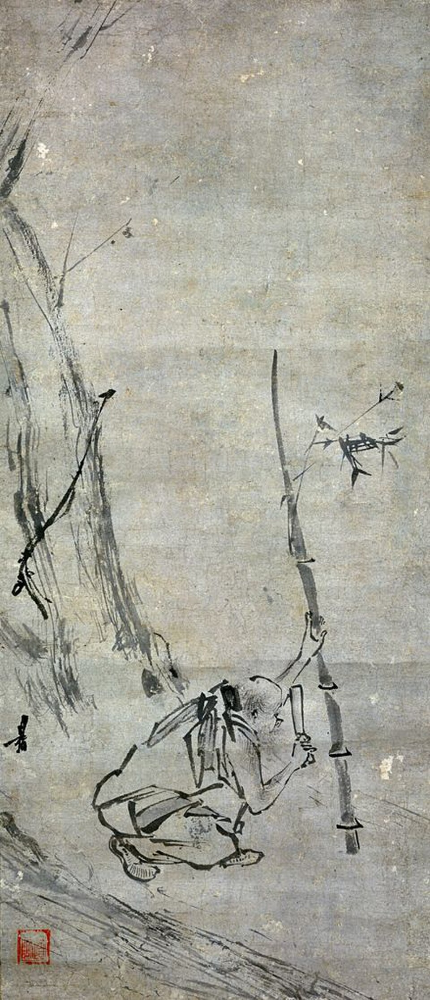

{width=60% fig-align="center"}

岭南的山路上，一个年轻人挑着柴走在前往集市的路上。

他没有显赫的家世，靠卖柴奉养老母，是唐代社会里再普通不过的樵夫。然而，就在他停下脚步听人诵读《金刚经》名句的那一刻，他的命运，以及整个中国佛教的命运，都被彻底改变了。

那句经文是：**“应无所住而生其心。”**

这个砍柴的人，就是后来的六祖慧能（惠能）。在佛教史上，他被尊为禅宗的实际建立者与最重要的大师之一。

他的故事展示了一个令人震撼的道理：觉悟不取决于身份、财富或文字知识。无论贫富贵贱、识字与否，每个人心中都本具觉悟的可能。

---

## 一、当佛教走进盛唐：觉悟面向普通人

唐代的中国，佛教已经极其繁荣。玄奘法师西行归来，译场盛况空前；长安和洛阳的寺院宏伟壮观；宗派理论日益精深。

但在繁荣的背后，也隐伏着一种危机：佛法似乎越来越属于博学的僧侣和崇信佛教的贵族。复杂的名相概念、庞大的翻译工程，让普通人感到遥不可及。

慧能的出现，打破了这种壁垒。

他一生少识文字，甚至被称为“獦獠”（当时对北方人对南方少数民族的贬称）。但他对人心的洞察，却直指佛法的核心。

慧能的故事告诉世人：觉悟不在遥远的梵文经典里，也不在繁复的仪式里。它就在每个人此刻的这一颗心里。

---

## 二、黄梅求法与墙上的两首偈

慧能听闻《金刚经》后，心生顿悟，决定前往黄梅（今湖北黄梅）参见五祖弘忍。

弘忍见他，问：“汝何方人？欲求何物？”

慧能答：“弟子是岭南新州百姓，远来礼师，惟求作佛，不求余物。”

弘忍故意考验他：“汝是岭南人，又是獦獠，若为堪作佛？”

慧能回答了一句名垂青史的话：
> “人即有南北，佛性即无南北。獦獠身与和尚不同，佛性有何差别？”

这一句话，道出了大乘佛教最根本的平等观：外在的身份、地域、文化水平有差别，但生命的本具觉性没有任何差别。

弘忍深知此人根器非凡，为免嫉妒，安排他到碓房舂米破柴。慧能一干就是八个多月。

后来，弘忍为了检验弟子的修持，命大众各作一偈，以传衣钵。

当时深受大众推崇的神秀上座，在廊壁上写下了著名的偈颂：
> 身是菩提树，心如明镜台。  
> 时时勤拂拭，勿使惹尘埃。

神秀的偈颂代表了渐修的道路：身体是修行的道场，心像一面易蒙尘埃的镜子。修行需要时刻反省、不断擦拭，不让贪嗔痴的烦恼尘埃沾染清净的心。这是一种非常稳妥、扎实的修行态度。

慧能听闻此偈后，请人在墙上另写下一偈（宗宝本）：
> 菩提本无树，明镜亦非台。  
> 本来无一物，何处惹尘埃？

慧能的偈颂代表了顿悟的智慧：菩提与明镜，不过是借用的比喻；心的本质本来就是空寂清净的，没有任何固定的实体。既然“本来无一物”，又哪里有需要擦拭的“尘埃”？

神秀强调的是“怎样拂拭尘埃”，慧能则直指“不要把尘埃和拂拭当作实体”。神秀是从修行的过程说，慧能是从心的本质说。两者在不同的修行阶段，其实各有其深刻的价值。

---

## 三、三更受法与“风动、幡动、心动”

五祖弘忍看到慧能的偈颂后，知道他已明心见性。

夜半三更，弘忍召慧能入室，用袈裟遮围，为他讲解《金刚经》。当讲到“应无所住而生其心”时，慧能言下大悟，体会到一切万法不离自性。

他连声赞叹：
> “何期自性本自清净！何期自性本不生灭！何期自性本自具足！何期自性本无动摇！何期自性能生万法！”

弘忍遂将代表禅宗传承的衣钵传给慧能，并嘱咐他连夜南下，隐居避祸。

多年后，慧能来到广州法性寺（今光孝寺）。当时印宗法师正在讲《涅槃经》，时有风吹幡动，一僧说是“风动”，一僧说是“幡动”，二人争论不休。

慧能进前说道：
> “不是风动，不是幡动，仁者心动。”

大家听了大为惊炭。风在吹，幡在动，这是外在的物理现象；但人之所以为此争吵、产生烦恼，是因为自己的心被外境牵动了。

这句话道破了禅宗的核心：外在环境的变化不可避免，但我们可以决定自己的心是否跟随它起伏翻腾。

---

## 四、“顿悟”与“无念、无相、无住”

慧能创立的南宗禅，以“顿悟”为特色。

所谓“顿悟”，不是说人不需要修行，而是指在某一瞬间，深刻看见自己内心的本真状态。这就像在黑暗的房间里，突然点亮了一盏灯。房里的东西并没有改变，但你终于看清了它们的真实面貌。

慧能将他的修持心法概括为：**“无念为宗，无相为体，无住为本。”**

* **无念**：不是头脑里没有任何念头，像石头一样；而是念头生起时，不被念头勾走，不让贪嗔痴在念头上生根。
* **无相**：不是否定外在现象，而是看见现象时不被外在的标签、名相所束缚。
* **无住**：心不在任何事物上死死停留。得到时不狂喜，失去时不绝望，让心像流水一样自然流动。

慧能还特别强调“定慧一体”。

有人以为禅定就是关起门来静坐，智慧就是看书思考。慧能说：定与慧就像灯与光。有了灯就有光，有了光就是灯。平静的心（定）与清醒的看见（慧），是一体的两面。

最重要的是，慧能把修行从寺院拉回了日常生活。

他在《六祖坛经》中写道：
> “佛法在世间，不离世间觉。离世觅菩提，恰如求兔角。”

觉悟不需要离开现实生活。在挑水、砍柴、吃饭、待人接物中，在面对工作压力、家庭矛盾、个人得失时，随时保持觉察，这就是修行。

---

## 本章小结

慧能从一个识字不多的岭南樵夫，最终成为影响中国文化的巨人。

他的教导被弟子整理成《六祖坛经》，这是中国本土佛教著作中唯一一部被称为“经”的典籍。

慧能的伟大，在于他把佛教从复杂的名相、繁复的仪式和高深的哲学中解放出来，重新送还给每一个普通人。

他告诉人们：觉悟不在远方，也不在文字里。它就在你此刻的这一颗心里。当你看清了自己的执著，并在每一个当下学会放下，你就已经走在了觉悟的道路上。
