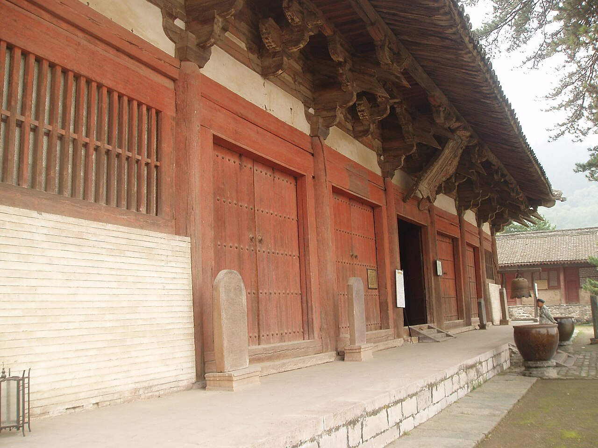

{width=80% fig-align="center"}

清晨，城市还没有完全醒来。

山门外的石阶上留着昨夜的雨水，树叶被洗得发亮。几位老人缓缓走上台阶，有人手里捧着鲜花，有人只是空着手。山门以内，钟声从重重殿宇之间传来，低沉而悠长。香炉中升起几缕淡烟，扫地的僧人没有抬头，游客也不由自主地放轻了脚步。

一个第一次走进寺院的人，往往会有许多疑问：

进门时应该先迈哪只脚？佛像那么多，应该拜哪一尊？香是不是烧得越多越灵？佛前供水果，是不是希望佛菩萨“收下礼物”之后保佑自己？钟鼓为什么早晚都要敲？身穿僧衣的人都叫“和尚”吗？不信佛的人，能不能进寺院？

这些看似琐碎的问题，背后其实都指向一个更根本的问题：

**寺院究竟是什么地方？**

有人把寺院当作旅游景点，有人把它当作祈求好运的许愿场所，也有人把它想象成远离现实世界的清静之地。但从佛教传统来看，寺院首先是一处住持佛法的道场：有人在这里学习经典，有人在这里持戒修行，有人在这里礼佛、禅坐、忏悔、听法，也有人只是在忙乱的人生中，暂时停下脚步，重新看一看自己的内心。

《华严经·净行品》写道：

> “入僧伽蓝，当愿众生：演说种种，无乖诤法。”

“僧伽蓝”是梵语“僧伽蓝摩”的略称，原意是僧众共同居住、修行的园林。进入寺院，不只是跨过一道门槛，也意味着暂时离开外界的争竞喧闹，学习一种不争、和合、清净的生活方式。

寺院之所以让人安静，不只是因为那里有古树、佛像和钟声，更因为它保存了一套帮助人收摄身心的空间、礼仪与生活秩序。

## 一、从印度精舍到中国寺院

佛陀在世时，僧团最初没有固定寺院。出家弟子常在林间、树下、山洞或空地修行。后来，频婆娑罗王、给孤独长者等人布施园林，竹林精舍、祇园精舍等固定道场才逐渐出现。

这些早期精舍的主要功能，是供僧人居住、听法、禅修和结夏安居。佛陀并没有要求弟子建造宏伟宫殿，也没有把寺院规定为神明接受祭祀的住所。寺院的核心从来不是建筑本身，而是其中有没有清净的僧团、正确的教法和真实的修行。

佛教传入中国以后，寺院的形态逐渐发生变化。

早期佛寺常以佛塔为中心，周围建造佛殿、讲堂和回廊。南北朝以后，许多王侯宅第被改建为佛寺，中国传统住宅和宫殿的院落格局由此进入佛教建筑。隋唐以后，山门、天王殿、大雄宝殿、法堂、藏经楼等建筑渐次排列，纵向中轴线越来越清晰，佛寺也逐渐形成我们今天熟悉的汉式格局。

然而，寺院的格局并没有一部适用于所有地方的统一“建筑经”。不同宗派、时代、地域和山川地形，都会影响寺院的安排。有的寺院坐北朝南，有的依山而建；有的以大雄宝殿为中心，有的以观音殿、弥陀殿或禅堂为主要道场；有的规模宏大，有的只是一座小庵。

因此，第一次进入一座寺院，不必急着套用固定模式。殿堂上的匾额，往往比导游口中的传说更可靠；寺院的介绍牌和常住僧人的说明，也比网络上流传的“拜佛秘诀”更值得相信。

## 二、穿过山门：从喧闹走向清净

寺院的大门通常称为“山门”。

这并不意味着寺院一定建在深山。古代佛寺多择清静之处修建，久而久之，即使城市中的寺院，其正门也沿称山门。有些山门建成三门并列的形式，后世常以佛教的“空、无相、无作”三解脱门解释其象征意义，所以山门也称“三门”。

但进入山门，并不是从“凡间”突然进入一个可以改变命运的神秘世界。真正需要跨越的，是心中的那一道门。

在门外，人可能还在想着工作成败、家庭矛盾、利益得失；走进门内，钟声和寂静提醒他：能不能先把这些念头放一放？能不能暂时不与别人比较？能不能让脚步慢下来，让言语少一点，让心清楚一点？

这正是寺院礼仪的第一层意义：**通过外在行为，帮助内心完成转变。**

传统礼仪中，有人进入山门时合掌问讯，有人从侧门进入，有人避免踩踏门槛。这些做法主要表达恭敬，并不是决定福祸的神秘规则。不同寺院的实际规定也不完全相同。对于普通参访者而言，衣着整洁、举止安静、遵守指示，远比纠结先迈左脚还是右脚重要。

一个人即使不懂复杂仪轨，只要怀着尊重之心走进寺院，也不算失礼。

《法华经》中甚至说：

> “若人散乱心，入于塔庙中，一称南无佛，皆已成佛道。”

这句话并不是说，一个人随口念一句佛号，立刻就圆满成佛；它所强调的是，即使最初的心并不专一，只要与佛法结下一点善缘，这颗种子也可能在未来成熟。

寺院的大门，因此不是用来拒绝“外行人”的。它是向所有愿意停下来的人敞开的。

## 三、钟楼与鼓楼：寺院也有自己的时间

走过山门，许多寺院两侧可以看到钟楼和鼓楼。

现代人听到寺院钟声，常觉得它古雅、空灵，适合营造远离尘世的意境。但在传统僧团中，钟鼓首先是生活秩序的一部分。

什么时候起床，什么时候上殿，什么时候用斋，什么时候集众，钟鼓都有相应信号。它们既是法器，也是寺院中的“公共时钟”。北京市文物部门对大觉寺的介绍便指出，寺院诵经、斋粥、升堂和聚众等活动，都要依钟鼓号令进行。

钟声的宗教意义，也由此自然产生。

钟一响，所有人都要放下手中私事，回到大众之中。它提醒人：时间正在过去，生命不会停留，修行不可放逸。

中国佛教协会在解释寺院钟声时指出，钟既有报时集众的实际功能，也有警醒大众、破除烦恼、增长智慧的象征意义。寺院法器通常依照固定时间和仪轨使用，参访者不应因为好奇而随意敲击。

所以，寺院里的钟并不是满足游客愿望的“幸运钟”。

真正值得听见的，不只是铜钟的声音，而是它在问：

**一天又过去了，你是否清醒地生活过？**

## 四、天王殿：威严与欢喜为什么同在？

许多汉传佛教寺院进入山门后的第一重大殿，是天王殿。

殿内正面常供奉笑容满面、大腹宽怀的弥勒形象，两侧是四大天王，弥勒像背后常见韦驮菩萨或韦驮护法。不同寺院会有差异，但这种配置在汉地非常常见。

第一次参观的人也许会觉得奇怪：为什么一边是笑容可掬的弥勒，一边却是威武严肃的天王？

因为佛教所说的慈悲，并不是没有原则；所谓护法，也不是依靠暴力惩罚异己。

弥勒的笑容提醒人宽容、欢喜、包容，四大天王和韦驮的威严则象征守护正法、止恶护善。一个真正慈悲的人，并不是对一切行为都纵容；他既要有柔软的心，也要有不随烦恼动摇的力量。

中国人后来又把四大天王所持的剑、琵琶、伞和龙等器物，解释为“风调雨顺”的象征。这种解释带有明显的中国民间文化色彩，反映了佛教进入中国以后与社会愿望、艺术想象不断融合的过程。

在佛教教义中，护法神并不是独立于因果之外、可以随意降福降祸的万能神明。他们所“护”的首先是法，是人的善念、正见与修行。

若一个人一边祈求护法保佑，一边欺骗伤害他人，便已经背离了“护法”的真正含义。

## 五、大雄宝殿：佛像在向谁说法？

继续向前，通常便来到寺院最重要的殿堂——大雄宝殿。

“大雄”是对释迦牟尼佛的尊称，赞叹佛陀以智慧和勇气降伏烦恼。大雄宝殿通常是寺院举行早晚课诵、讲经说法和重大法会的重要场所。

殿内供奉的佛像并不完全相同。

有的供一尊释迦牟尼佛，两侧是迦叶、阿难；有的以文殊、普贤为胁侍；有的供横三世佛或竖三世佛；净土道场可能突出阿弥陀佛、观音菩萨和大势至菩萨；药师道场则可能供奉药师佛。

因此，不能只凭佛像的大小、颜色或手势随意判断身份。最稳妥的办法，是看佛像前的名号、殿堂匾额和寺院说明。

### 佛像是不是“偶像”？

这是理解寺院佛教的关键问题。

佛教徒为什么要塑造佛像、礼拜佛像？

首先，佛像是一种纪念。

释迦牟尼佛已经入灭，后人无法亲眼见到佛陀，便以雕塑、绘画和造塔等方式纪念他的觉悟、教法与人格。面对佛像，如同面对一位已经远去的老师，使人想起他曾经说过什么、走过怎样的道路。

其次，佛像是一种象征。

佛像的安详，象征不被贪嗔痴扰乱的心；垂目内观，象征觉察自己；莲花座象征从烦恼污泥中生起清净智慧；手印与持物，也常用来表达说法、禅定、无畏、慈悲和愿力。

再次，佛像是一面镜子。

礼拜佛像，不只是赞叹外在的佛，也是在提醒自己：觉悟并不是永远与我无关。佛陀曾经也是在人间修行的人，众生也具有走向觉悟的可能。

但佛教同时警惕人们执著佛像，把有形的形象误认为佛的全部。

《金刚经》说：

> “若以色见我，以音声求我，是人行邪道，不能见如来。”

意思是，若只在外在形色和声音中寻找佛，就不能真正理解如来。佛像可以帮助人忆念佛、学习佛，却不能代替智慧、慈悲和修行。

因此，佛教对佛像的态度既不是简单否定，也不是把佛像当作拥有脾气和欲望的神灵。

可以借像表法，却不可执像为佛。

## 六、佛、菩萨、罗汉与护法分别代表什么？

进入一座大寺，常会看到许多形象：佛、菩萨、罗汉、祖师以及护法诸天。若不了解它们的意义，很容易误以为寺院供奉的是一套等级复杂的“神仙体系”。

事实上，它们所表达的是不同的觉悟境界、修行道路和精神品格。

### 1. 佛：已经圆满觉悟者

“佛”意为觉者。寺院中的佛像，主要代表圆满的智慧与慈悲。

释迦牟尼佛是我们这个世界佛教的创立者；阿弥陀佛象征无量光明与寿命；药师佛的愿力与众生身心病苦相关。诸佛名号和愿力虽有不同，所指向的都是离开无明、圆满觉悟。

### 2. 菩萨：走在觉悟道路上，并愿帮助众生的人

菩萨并不是“比佛低一级的神仙”，而是以成佛为目标、同时不舍众生的修行者。

文殊象征智慧，普贤象征实践与行愿，观音象征慈悲，地藏象征深重愿力，大势至象征念佛摄心。

面对菩萨像，不只是求菩萨替自己解决问题，更要问：我能否学习他的精神？

拜观音之后，能不能少说一句伤人的话？

拜地藏之后，能不能对父母和弱者多一分承担？

拜文殊之后，能不能不再固执己见，愿意分辨事实与偏见？

### 3. 罗汉：佛陀教法的实践者与传承者

罗汉主要指依佛陀教法断除烦恼、证得解脱的圣者。汉地寺院常见十八罗汉或五百罗汉像，其形象有老有少、有喜有怒，姿态各不相同。

罗汉不像佛像那样往往具有高度理想化的庄严相貌。他们更接近现实中的人，仿佛提醒参访者：修行者的性格、经历和外貌可以各不相同，解脱之道却向所有人开放。

### 4. 护法诸天：守护善法与道场秩序

四大天王、韦驮、伽蓝等护法形象，象征守护佛法和修行环境。

所谓护法，既包括保护寺院，也包括保护人心中的善念。若一个人能够在诱惑面前守住戒律，在愤怒时不伤害别人，在利益冲突中不欺骗，这同样是在护法。

佛像不只是供人观看的艺术品。每一尊形象，都在用无声的方式向人提问。

## 七、礼佛：弯下身体，是为了放下傲慢

在佛殿中，人们通常双手合掌，向佛像问讯或礼拜。

合掌，是把散乱的双手合在一起，也象征把散乱的心收回来。礼拜时，人的额头、双手与双膝接近地面，在佛教中常称“五体投地”。

有人觉得礼拜是一种自我贬低，仿佛人在高高在上的神灵面前承认卑微。其实，佛教礼拜的重点不在讨好佛，而在调伏自己。

人最难放下的，往往不是财物，而是“我对”“我重要”“我不能向别人低头”的傲慢。身体愿意弯下去，内心才有机会柔软下来。

礼佛也并不意味着把判断权交给佛像。

一个人可以在佛前诉说烦恼，但最后仍要依照因果和正见作出选择；可以祈愿身体健康，但仍要规律生活、接受治疗；可以祈愿事业顺利，但仍要勤奋、诚信；可以祈愿家庭和睦，但仍要学习倾听、克制脾气。

佛教的礼拜，是愿心与行动的开始，不是以仪式取代行动。

至于礼拜一次还是三次，并不是衡量虔诚的标准。三拜常用来表达礼敬佛、法、僧三宝，也有寺院依自身仪轨安排礼数。普通参访者不熟悉礼仪时，合掌问讯即可，不必紧张地模仿每一个动作。

## 八、烧香：不是向佛菩萨递交礼物

在大众印象中，烧香几乎成了佛教最醒目的标志。

有人一进寺院便购买大把香烛，认为香越高、越粗、越多，所求之事越容易实现；有人争烧“头香”，仿佛只有第一个把香插入香炉的人，才能得到更多保佑。

这些观念并不符合佛教本义。

香最初是古印度常见的供养物，也有清洁环境、表达敬意的作用。佛教后来赋予香更深的象征：真正能够感召人心的，不是木料燃烧产生的气味，而是戒律、禅定、智慧与解脱所散发的“德香”。

《六祖坛经》解释“五分法身香”时，把“戒香”说成：

> “无恶、无嫉妒、无贪嗔、无劫害，名戒香。”

换言之，一个人即使点燃了名贵香木，若内心充满嫉妒、贪欲和伤害，便没有真正供上戒香。反过来，即使没有烧香，只要愿意止恶行善、调伏内心，也已经在实践香供的真实意义。

汉地寺院中常见一炷香或三炷香。三炷香可用来象征佛、法、僧三宝，也常被解释为戒、定、慧三学，但这属于汉传佛教中形成的象征性礼俗，并不是“多一炷就多一分灵验”的计算规则。

中国佛教协会曾明确指出，“头香”“头钟”并非佛教本身的内容，供养功德不取决于时间先后和物品贵贱，而在于是否具有至诚、恭敬乃至无我利他的发心。

烧香因此不是向佛菩萨行贿。

佛陀已经断除贪欲，不会因为谁送的香更贵便偏爱谁；菩萨以平等慈悲对待众生，也不会因供品多少决定是否救度。

所谓“心诚”，也不是心里强烈地想要某样东西，而是愿望之中有多少善意、责任和行动。

求平安的人，应当先不伤害别人。

求财富的人，应当守信用、勤劳并懂得布施。

求孩子成才的人，应当给予陪伴和正确教育。

求家庭和睦的人，应当从少一些指责开始。

香烟终会散去，行为产生的因果却会留下。

## 九、供花、供果、供灯：佛需要这些东西吗？

佛前常见鲜花、水果、净水、灯烛和食物。

佛菩萨是否真的需要这些东西？

若从物质需要来说，当然不需要。已经觉悟的佛陀，不会因为少了一盘水果而饥饿，也不会因为没有鲜花而不悦。

供养首先是在训练布施和感恩。

普通人的习惯是把最好的东西留给自己。供养则是有意识地把珍爱之物放到三宝之前，提醒自己：生命中所得到的一切，都不是理所当然。

不同供品也常被赋予象征意义：

花朵美丽却会凋谢，提醒人观照无常；

果实象征行为终将结成果报；

灯火象征智慧破除无明；

净水象征清净、平等与柔和；

香象征戒定慧与德行。

这些解释不是把供物神秘化，而是借日常物品帮助人忆念佛法。

但是，外在供养终究只是起点。

《普贤行愿品》说：

> “诸供养中，法供养最。”

所谓法供养，包括依照教法修行、利益众生、摄受众生、勤修善根、不舍菩萨事业。

因此，给佛前供一束花，不如同时善待身边的人；给寺院点一盏灯，也应当努力减少自己内心的偏见；捐献财物固然可以护持道场，但若能同时诚实工作、照顾家人、帮助困苦者，才是把供养带回生活。

佛教并不反对财物供养。寺院需要修缮殿堂、培养僧才、印经弘法，也可能开展慈善救助。但捐款不是购买“功德额度”，更不能成为与佛菩萨交换利益的筹码。

供养真正改变的，不是佛，而是供养者自己。

## 十、法会：不是一场神秘表演

寺院举行法会时，常有梵呗、钟磬、诵经、礼拜、绕佛、持咒和回向等仪式。不了解佛教的人站在殿外，可能只听见整齐而陌生的唱诵，觉得其中充满神秘色彩。

“法会”最朴素的意思，是大众因佛法而相会。

广义而言，讲经说法、诵经礼佛、斋僧布施和集体共修，都可称为法会。狭义的法会则有特定仪轨，常包括庄严道场、供养三宝、礼佛、忏悔、诵经、绕行、禅观与回向等内容。

法会的作用，首先是帮助人集中身心。

一个人在家诵经，容易被电话、家务和杂念打断；在大众共同修行的环境中，钟磬、唱诵和统一动作形成稳定节奏，使散乱的心逐渐安定。

其次，法会具有教育功能。

诵经不是把不懂的文字念给佛听，而是反复把佛法念给自己听。礼忏也不是请求佛菩萨取消因果，而是承认自己的过失，发愿不再重犯。回向则是把修行的善愿从自己扩大到亲友乃至一切众生。

再者，法会保存了汉传佛教独特的音乐、文学和礼仪传统。梵呗、法器、偈颂与仪轨经过历代祖师整理，既是宗教修行，也是中国文化的一部分。

不过，形式越庄严，越要避免忘记内容。

若参加完忏悔法会，回家仍旧伤害别人；诵完慈悲经典，仍旧傲慢刻薄；口中回向众生，心里只想着自己得福，那么法会便只剩下声音和动作。

真正的法会，应当在仪式结束后继续。

## 十一、僧人与居士：寺院里不只有“和尚”

很多人把所有出家人都称为“和尚”。

严格来说，“和尚”原是对亲教师、依止师的尊称，后来在汉语日常使用中，才逐渐成为男性出家人的泛称。现代进入寺院，对出家人一般尊称“法师”或“师父”即可；女性出家人可以称“比丘尼法师”或直接称“法师”，不宜以轻慢、戏谑的称呼相待。

佛教传统中的僧团，包括比丘和比丘尼。梵语“僧伽”意为和合众，并非单指某一个出家人，而是依戒律共同修学、共同生活的团体。汉译律疏常解释：“僧者，具云僧伽，此翻和合众。”

出家人主要承担住持正法、持守戒律、修行、教学和管理道场等责任。但出家并不意味着自动成为圣人。僧人同样处在修行过程中，也会有性格、能力和修学程度的差别。尊重僧宝，是尊重清净僧团和佛法传承，并不等于放弃理性判断，更不意味着任何穿僧衣者所说的话都绝对正确。

与出家众相对的，是在家佛教徒。

传统上，男性在家弟子称优婆塞，女性称优婆夷；与比丘、比丘尼合称佛教“四众”。经典中常并列“比丘、比丘尼、优婆塞、优婆夷”，说明佛法的传承并不只是出家人的责任。

“居士”也不是出钱供养寺院的人，更不是拥有某种宗教身份便自然高于他人。通常而言，皈依三宝、在家庭和社会生活中学习佛法的人，可称在家居士。法鼓山对居士的解释强调，在家佛教徒生活在现实社会之中，以三皈五戒为方向，在家庭、人际和工作中实践戒定慧与菩萨道。

寺院因此不是由僧人表演、居士围观的场所。

僧人住持教法，居士护持道场；僧人可以教授佛法，居士也应当在社会中实践佛法。两者各有生活方式，却共同构成佛教的生命。

## 十二、第一次进寺院，应该怎么做？

第一次进入寺院，不必先背诵一整套复杂规矩。掌握几项基本原则，已经足够表达尊重。

### 1. 衣着整洁，不过分暴露

寺院是宗教活动和僧众生活的场所。衣着不必昂贵正式，但应当整洁得体。参加禅修、诵经或正式法会时，可事先了解寺院是否有特别要求。

### 2. 放低声音，放慢脚步

佛殿、禅堂和法会现场应避免大声谈笑、奔跑追逐或长时间接打电话。静音不是因为佛菩萨怕吵，而是为了不妨碍正在修行的人。

### 3. 不随意触摸佛像和法器

佛像、经书、钟鼓、木鱼、磬和供具都有特定用途。未经允许，不宜触摸、敲击或移动。

### 4. 拍照前先看规定

有些寺院允许在庭院拍摄，却禁止在佛殿内拍照；有些法会不宜拍摄僧众和参加者。即使允许拍照，也应避免使用闪光灯、挡住礼佛者或把宗教仪式当作猎奇素材。

### 5. 不烧大把香，不追逐“头香”

遵守寺院的敬香规定即可。有些寺院出于消防和环保考虑不允许自带香烛，有些提倡殿外集中敬香。不上香也完全可以礼佛。

### 6. 不懂仪轨时，合掌即可

不必因为怕“拜错”而不敢进入佛殿。合掌、低头、保持安静，便是最简单的恭敬。复杂礼仪可观察大众，或请教寺院义工和法师。

### 7. 不要把每一尊佛像都当作不同的“办事部门”

民间常把佛菩萨分配成求财、求子、求学业、求健康的不同对象。这种理解容易把佛教变成神灵职能表。可以向任何佛菩萨表达愿望，但更重要的是理解其所代表的智慧、慈悲和愿行。

礼仪的目的，是培养觉察和尊重。若只记住了脚步、手势和香的数量，却对周围的人粗暴无礼，便失去了礼仪的根本。

## 十三、常见误解：烧香是不是“贿赂”佛菩萨？

从佛教教义看，烧香不是贿赂。

但现实中，人们确实可能带着交易心理烧香：

“我给佛供一炷香，佛要让我生意成功。”

“我捐了钱，菩萨就应该保佑全家无灾。”

“我连续参加七天法会，这次考试一定要让我通过。”

这种心理不是佛教所说的信仰，而是把人间的利益交换投射到佛菩萨身上。

贿赂之所以可能，是因为接受者有私欲，可以被利益打动。佛之所以称为佛，正因为已经断除贪欲与偏私。若佛也会因为礼物多少而改变因果，因为香火贵贱而偏爱某些人，他便不再是觉悟者。

佛教所说的感应，也不是取消因果，而是心与法相应。

一个人在观音菩萨前发愿学习慈悲，离开寺院后真的减少伤害、帮助他人，这便是与观音相应。

一个人在地藏菩萨前忏悔不孝，回家后开始照顾父母、改变言语，这便是与地藏相应。

一个人在佛前祈求智慧，之后愿意学习、反省、承认错误，这便是与文殊相应。

相应不是佛菩萨替人完成任务，而是人的心行逐渐接近佛菩萨的心行。

佛教并不禁止人祈愿。人在病痛、失业、考试、亲人离世时走进寺院，向佛菩萨倾诉，是很自然的事。问题不在“求”，而在把佛菩萨当成满足欲望的工具。

可以求健康，但也愿众生离病苦。

可以求事业顺利，但不以损害别人为代价。

可以求家人平安，也愿意帮助陌生的苦难者。

当愿望从只顾自己，慢慢扩大到理解别人、利益别人，祈愿便开始具有佛法的方向。

## 十四、经典名句辨析：“一花一世界，一叶一如来”

“一花一世界，一叶一如来”常被题写在寺院、茶室和书画作品中，也常被说成出自《华严经》。

这句话意境优美，也确实接近华严思想：微小事物与广大世界并非彼此隔绝，一尘一法之中，都可以显现重重无尽的因缘。

但从现存通行的汉译佛典看，很难找到“一花一世界，一叶一如来”完全相同的经文。它更像后世根据华严意境凝练而成的佛教文化用语，不宜直接加上引号，称为佛陀在某部经典中的逐字原话。

《华严经·普贤行愿品》中更接近的原文是：

> “一尘中有尘数刹，一一刹有难思佛。”

意思是，在一粒微尘之中，可以观见如微尘数的世界；每一个世界中，又有不可思议诸佛说法。这是华严宗重重无尽、圆融无碍境界的诗性表达。

普通读者仍然可以使用“一花一世界，一叶一如来”来表达对生命和世界的感悟，但应当知道：它是流行的佛教文化名句，不是可以轻率断定出处的经典直引。

一朵花能够让人看到什么？

有人只看到颜色，有人想到花价，有人想到占有，也有人在花开花落之间看见无常，在花朵依赖阳光、泥土、雨水和无数条件而生时，看见缘起。

世界并不藏在花瓣里面。

世界显现在我们如何观看这一朵花。

## 十五、走出山门：把寺院带回生活

那个第一次进入寺院的人，终于走到了藏经楼前。

他没有记住每一尊佛像的名字，也没有学会复杂的礼拜仪轨。他只是跟着人群合掌，安静地站了一会儿。

离开时，钟声再次响起。

山门之外，车辆仍旧拥挤，手机里仍有未回复的信息，工作和家庭的问题也没有因为一次礼佛便自动消失。寺院没有替他改变世界。

但他似乎比来时慢了一点。

他开始明白，寺院的安静不是为了让人永远逃离生活，而是让人在重新进入生活之前，看清自己。

佛像提醒人觉察；

菩萨提醒人慈悲；

罗汉提醒人修行可以落实于真实人生；

钟声提醒人生命无常；

香提醒人修戒、定、慧；

礼拜提醒人放下傲慢；

供养提醒人学习给予；

法会提醒人不只为自己祈愿；

僧团提醒人和合共住；

山门则提醒人，每一次回头，都可以是重新开始。

真正的寺院，并不只存在于高墙、殿宇和古树之间。

当一个人在愤怒升起时愿意停一下，在利益面前守住诚实，在别人受苦时生起关怀，在拥有时懂得布施，在失去时理解无常——佛教便已经从寺院回到了生活。

烧过的香终会熄灭，钟声也会渐渐远去。

唯有被唤醒的心，可以继续前行。