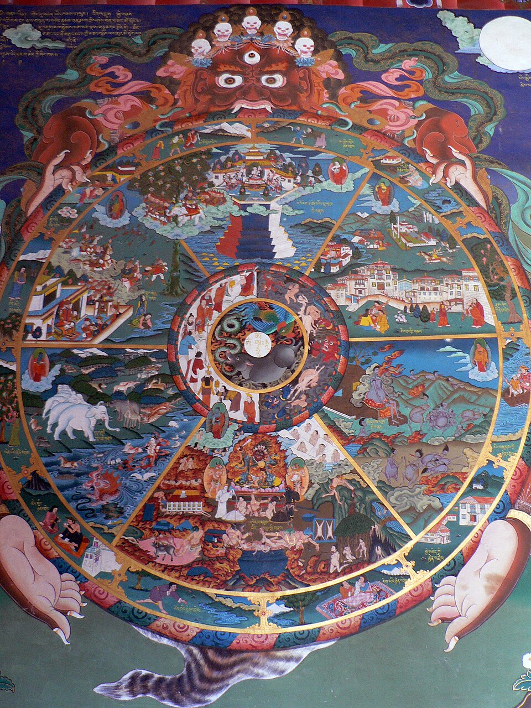

{width=75% fig-align="center"}

中国人日常生活中，有许多话听起来并不像佛经，却带着浓厚的佛教色彩。

看见有人做了亏心事，人们会说：“善恶到头终有报。”劝人不要欺骗伤害别人，会说：“人在做，天在看。”遭遇一时难以解释的得失，又会想到“因果”“业报”“前世今生”。在清明、中元、盂兰盆等节日里，人们祭奠祖先、超荐亡者；在寺院中，常能看到地藏菩萨像，听到《地藏经》和《盂兰盆经》的诵读声。

这些观念经过漫长的传播，已经与中国原有的祖先崇拜、孝道伦理和善恶报应思想交织在一起，以至于许多人很难分清：哪些是佛教的本义，哪些是中国民间文化的发展，哪些又只是后世为了劝善而形成的通俗说法。

例如，有人把因果理解为一套看不见的奖惩制度：做好事，佛菩萨就会赐福；做坏事，冥冥之中便会受到惩罚。也有人把业力当成无法改变的命运，遇到疾病、贫困和不幸，便说：“这都是前世造的业。”甚至有人以因果之名责怪受苦者，仿佛每一个遭遇苦难的人都一定“罪有应得”。

这些理解看似敬畏因果，实际上却可能偏离佛法。

佛教所说的因果，并不是一位神明在天上记账，也不是一张简单的善恶兑换表。它首先要回答的，是一个极其朴素而严肃的问题：

**一个人反复作出的选择，会把自己变成怎样的人？**

---

## 一、业不是神秘力量，而是我们的造作

“业”是梵文“羯磨”的意译，本义是行为、行动和造作。

在日常汉语里，我们常把“业”理解成“罪业”或“业障”，仿佛业一定是不好的。其实佛教所说的业有善、有恶，也有不善不恶之分。帮助别人是业，伤害别人是业；诚实说话是业，欺骗也是业；嫉妒、怨恨、慈悲和宽容，同样会在内心形成相应的力量。

佛教通常把人的行为分为三类：

* 身体所作，称为“身业”；

* 语言所说，称为“语业”或“口业”；

* 内心的意图、判断与选择，称为“意业”。

其中，真正使行为具有善恶意义的，是行为背后的动机和意向。一个人无意踩死小虫，与故意以折磨生命为乐，外在结果或许相似，内在性质却并不相同。《阿毗达磨俱舍论》说：“思即是意业，所作谓身语。”意思是，内心的“思”推动身体和语言采取行动，因此意向是业的重要根本。

这并不是说只要“心是好的”，行为造成的后果便可以忽略。佛教判断一件事，既看动机，也看手段和结果。善意需要智慧，否则也可能好心办坏事；错误已经造成，也不能只用一句“我不是故意的”推卸责任。

因此，业并不是一种从外面降临到人身上的神秘能量，而是身、口、意不断活动所形成的生命倾向。

一次愤怒，也许只是一时情绪；反复用愤怒解决问题，便逐渐形成暴躁的习惯。一次谎言，可能出于恐惧；不断以谎言保护自己，最终会使人失去信用，也使自己越来越难以面对真实。相反，一个人每一次克制伤害的冲动，每一次选择诚实，每一次体谅他人的处境，也都在塑造自己的性格与未来。

从这个意义上说，所谓业力，就是行为经过反复累积后，对自己、他人和周围世界产生的持续影响。

《十善业道经》说：“一切众生心想异故，造业亦异。”不同的心念，引出不同的行为；不同的行为，又使生命呈现出不同的方向。

---

## 二、因果不是“做一件好事，立刻得到一个好结果”

佛教讲“因果”，其实常常连着另一个字：缘。

一颗种子是因，但种子不一定立刻发芽。它还需要土壤、水分、阳光、温度等条件，这些条件就是缘。因缘具足，果实才会成熟；条件不足，种子可能长期潜伏，也可能枯坏。

人的行为也是如此。

一个人今天帮助了别人，明天未必马上升职发财；一个人欺骗了别人，也未必立刻遭遇灾祸。因为现实中的每一个结果，往往都是许多原因和条件共同作用的结果。个人习惯、家庭环境、社会制度、他人的选择、身体状况以及偶然事件，都可能参与其中。

因此，因果不能被理解成机械的一对一关系：

> 做一件善事，便兑换一件好事；

> 做一件恶事，便马上遭遇一件坏事。

这样的理解过于简单，也容易让信仰变成交易：我布施了多少，就应该得到多少回报；我念了多少佛，灾难就不应该发生。若结果不如预期，便怀疑佛法“不灵”。

佛教所说的善果，首先不一定是外在利益，也可能表现为内心的改变。一个常常布施的人，未必因此变得富有，却可能逐渐减轻吝啬与占有；一个愿意宽恕的人，未必立即得到别人道歉，却可能不再被怨恨长久折磨。善行的第一个受益者，往往就是那个正在行善的人。

同样，恶业的果报也不只是未来遭受某种惩罚。一个习惯欺骗的人，即使暂时得利，也会生活在害怕暴露的焦虑中；一个习惯仇恨的人，即使没有受到法律制裁，仇恨本身也已经在灼伤他的内心。

佛教经典虽然强调“因业得报”，却并不主张世间一切苦乐全部由过去世的业决定。《杂阿含经论会编》所引阿含教义，明确批评“一切所受皆是宿因所作”的观点，称这种把所有遭遇都归因于宿业的说法“不应道理”。

这点十分重要。

一个人生病，可能与遗传、饮食、环境、感染和医疗条件有关；一个人遭遇贫困，可能与教育机会、社会结构和时代环境有关；一个人受到暴力伤害，责任首先在施暴者，而不能用一句“这是受害者的业报”加以搪塞。

**相信因果，不等于把一切现实问题都推给前世。**

若因果观使人冷漠，使人面对他人的苦难只会说“他自作自受”，那便不是慈悲的佛法，而是披着佛教语言的无情。

---

## 三、不是天罚，也没有一位神明替人结算

在许多宗教传统中，善恶报应由至高神裁决。但佛教并不以一位创造世界、赏善罚恶的神作为因果法则的主宰。

《中阿含经·鹦鹉经》中，佛陀说众生“因自行业，因业得报”。生命的差别与自己的行为有关，并不是由某位神灵任意安排。

这是一种强调责任的思想。

人不能把自己的贪婪归咎于魔鬼，也不能只靠祈求神明便抹去行为的后果。已经伤害了别人，需要道歉、补偿和改正；已经形成的恶习，需要一次次觉察和停止。礼佛、诵经和忏悔可以帮助人反省，但真正的忏悔必须包含“不再重犯”的努力。

印顺法师把佛教的善恶业果概括为“自力创造非他力”。这里的“自力”并不是说一个人可以脱离社会独自决定一切，而是说：自己的思想和行为，不能由别人代替负责。

不过，佛教同时又说“无我”。既然没有一个永恒不变的灵魂，那么究竟是谁造业，又是谁受报？

《杂阿含经》提出一句很深的话：

> “有业报而无作者，此阴灭已，异阴相续。”

它不是否认行为和结果，而是否认在行为背后存在一个永远不变、独立自主的“我”。前一刻的身心消逝，后一刻的身心继续生起；二者不是完全相同，却也不是毫无关系，如河流不断变化，却仍有前后相续。

昨天愤怒的“我”与今天后悔的“我”，并不是一个丝毫不变的实体，却有清楚的因果联系。童年时养成的习惯，会影响成年后的选择；前一念滋长的欲望，会推动后一念的行动。

所以佛教的业报观处在两个极端之间：

* 不是说存在一个永恒灵魂，背着业债从一生走向另一生；

* 也不是说人死之后一切断灭，过去行为再无任何意义。

佛教用“缘起相续”解释责任：没有不变的主体，却有前后相连的因果过程。

---

## 四、轮回：不是同一个“我”反复搬家

在汉传佛教中，人们常说六道轮回：天、人、阿修罗、畜生、饿鬼、地狱。

按照传统佛教的理解，众生由于无明、欲望和业力，在不同生命形态中不断生死流转。善业成熟，可能趋向较为安乐的生命状态；贪、瞋、痴等恶业增长，则可能趋向痛苦的生命状态。轮回并不是某位神对人的永久判决，而是烦恼与行为不断延续的结果。印顺法师在面向青年的佛教读物中，将一生又一生随善恶业力延续的过程称为轮回，并以六道说明其传统分类。

许多人听到轮回，马上想到一个灵魂离开旧身体，又钻进新身体，好像一个人脱下旧衣服，再换上一件新衣服。

这种说法容易理解，却并不完全符合佛教的“无我”思想。

佛教否认一个永恒不变的灵魂实体，但承认身心活动的因果相续。可以借用烛火作一个并不完全精确的比喻：一支蜡烛点燃另一支蜡烛，后面的火焰不能说就是前面的火焰，却也不能说与前面的火焰毫无关系。前一火焰成为后一火焰生起的条件，既非完全相同，也非完全不同。

同样，轮回中的生命并不是一个固定自我原封不动地迁移，而是欲望、执著、行为和认识方式不断相续。

对现代读者来说，六道也可以帮助观察当下的精神状态：

盛怒之时，内心如在烈火地狱；欲望永远得不到满足，便像饿鬼饥渴不休；只凭本能追逐食色而缺乏反省，近似畜生状态；处处争胜、嫉妒斗争，具有阿修罗的特征；能够守护理性、道德与慈悲，才真正活出“人”的可贵。

但这种心理解释只是帮助理解，不能完全取代佛教传统关于生死流转的教义。佛教谈轮回，最终不是为了满足人们对前世身份的好奇，而是为了指出：只要贪、瞋、痴仍在推动生命，痛苦的循环便会以不同形式继续。

因此，比“我前世是谁”更重要的问题是：

**我今天正在培养什么？这样的心念与行为，将把生命带向哪里？**

---

## 五、目连救母：一个人的孝心为什么还不够？

在佛教进入中国之后，因果轮回最深入人心的故事之一，是目连救母。

《佛说盂兰盆经》记载，佛弟子大目犍连得到神通后，想报答父母养育之恩。他观察亡母所在之处，发现母亲堕入饿鬼道，饥饿憔悴。目连悲痛不已，便盛饭送给母亲。

母亲得到食物，一手遮掩饭钵，唯恐其他饿鬼看见，另一手急忙取食。然而食物还未入口，便化为火炭，无法食用。

目连虽有神通，也救不了母亲，只得向佛陀求助。佛陀告诉他，母亲的业力深重，不能仅凭一人之力解除；应在僧众结夏安居圆满之日，以饮食和生活用品供养十方僧众，借大众清净修行的功德，使现世父母乃至过去父母得到利益。

这个故事进入中国后，与孝道传统结合，逐渐形成盂兰盆会等仪式。它最感人的地方，并不只是神通和饿鬼世界，而是目连在成就之后仍然没有忘记母亲。

可是故事还有更深一层意义：目连最初只想把一碗饭直接交给母亲，却没有成功。个人的感情固然真挚，但仅凭占有式的爱和神通式的拯救，并不足以解除深重的苦。佛陀引导他把个人孝心扩大为供养僧团、帮助大众的善行。

换句话说，真正的报恩不能只停留在悲伤和怀念，也不能只靠烧纸、祭品或祈求。它应转化为现实中的善行：照顾仍然在世的父母，尊重老人，帮助饥饿贫困者，把亲情化为更广泛的慈悲。

目连救母的故事因而完成了一次转变：

**从“我怎样救我的母亲”，走向“我怎样减少世间众多母亲和众生的苦”。**

---

## 六、地藏菩萨：从救度母亲到救度一切众生

与目连故事相呼应的，是地藏菩萨的愿力。

汉传佛教流通的《地藏菩萨本愿经》中，讲述了婆罗门女和光目女救母的故事。她们得知母亲因生前恶业而受苦，便以供养、念佛和发愿等方式为母亲修福。更重要的是，她们没有在母亲得救之后便停止，而是由个人的悲痛生起广大誓愿，希望救度一切受苦众生。

于是，孝心不再只指向一个家庭。

看见母亲受苦，便想到其他人的母亲也在受苦；希望自己的亲人离苦，也希望一切众生离苦。这正是大乘佛教把亲情扩展为菩萨愿力的方式。《地藏经》以“恶习结业，善习结果”说明众生随习惯造业、随业流转，也反复强调地藏菩萨以大愿救拔受苦众生。

因此，地藏菩萨并不只是“管理亡者的菩萨”，也不只是出现在葬礼和墓园中的形象。他所象征的，是面对最深重的痛苦仍不放弃任何人的愿力。

一个人犯过错误，是否就永远没有希望？

地藏信仰给出的回答是：只要仍有觉悟和改变的可能，就不应轻易舍弃。承认业果，是承认行为有后果；发愿救度，则是相信众生不必永远被过去定义。

这里也需要作一点文献说明：《地藏菩萨本愿经》传统题为唐代实叉难陀译，但现代学术界对于其成书过程和译者问题仍有讨论。无论文献来源如何研究，这部经典在汉传佛教孝道、地藏信仰和民间善恶观念中的巨大影响，都是不可忽视的。CBETA也说明，《地藏经》在早期大藏经中的收录情况及传统作译者问题，存在值得研究之处。

---

## 七、五戒：不是神的命令，而是五种保护

佛教在家弟子最基本的行为准则，是五戒：

一、不杀生；二、不偷盗；三、不邪淫；四、不妄语；五、不饮酒。

这五条表面上都以“不”开头，似乎只是禁止。若从积极面理解，它们其实保护了人类生活中五种重要的安全：

不杀生，是保护生命安全；不偷盗，是保护财产与劳动成果；不邪淫，是保护家庭、感情与彼此信任；不妄语，是保护真实与社会信用；不饮酒，是保护清醒、理性与自我控制。

五戒不是因为佛陀不允许人做什么，而是因为某些行为会伤害自己和他人。

例如，饮酒戒并不是说酒本身具有某种宗教上的污秽，而是因为醉酒容易使人失去觉察，进而破坏其他戒律。《优婆塞五戒相经》用饮酒后失去自制的故事说明，即使平时具有能力和威仪的人，醉后也可能无法控制自己的行为。

戒律也不是一次受持之后便自动变成完人。它更像训练边界：当愤怒升起时，提醒自己不要伤害；当利益诱惑出现时，提醒自己不要侵占；当欲望使人想背叛承诺时，提醒自己尊重关系；当谎言即将出口时，提醒自己承担真实。

因此，“戒”不是束缚善良生活的枷锁，而是防止人被冲动和欲望奴役的护栏。

---

## 八、十善：把善恶落实到身体、语言和心念

五戒主要是为在家佛教徒建立底线，十善则把行为规范进一步扩展到身、口、意三个方面。

### 身体方面的三善

**第一，不杀生。**

不仅是不故意夺取生命，也应培养尊重生命、减少伤害的慈悲心。现代生活中的虐待动物、校园欺凌、家庭暴力和战争，同样属于杀害与伤害精神的延伸。

**第二，不偷盗。**

不拿取别人没有给予的东西。除了明显的盗窃，也包括侵占公物、贪污、诈骗、剽窃成果、盗用数据和利用权力夺取不当利益。

**第三，不邪淫。**

不以欲望伤害他人，不破坏他人的家庭和承诺，不利用欺骗、权势或胁迫获得关系。它要求人对亲密关系承担尊重与责任。

### 语言方面的四善

**第四，不妄语。**

不故意说假话欺骗别人。诚实并不等于不顾场合地伤人，而是既不歪曲事实，也尽量以合适的方式表达真实。

**第五，不两舌。**

不挑拨离间，不在两边搬弄是非。它的积极面，是帮助双方沟通、化解矛盾。

**第六，不恶口。**

不以侮辱、羞辱和恶毒语言伤害别人。语言看似没有形体，却可能在人心中留下长久伤痕。

**第七，不绮语。**

不说虚浮、无益、诱惑人走向错误的话。绮语并不是禁止幽默和文学，而是提醒人不要用漂亮言辞包装欺骗，也不要为了取悦和流量传播毫无责任的言论。

### 内心方面的三善

**第八，不贪欲。**

不是要求人没有任何愿望，而是不让占有欲无限膨胀，不把别人的东西、地位和生活都据为己有。积极面是知足、布施和随喜。

**第九，不瞋恚。**

不是强迫自己永远不能生气，而是不让愤怒发展为伤害和报复。积极面是慈悲、忍耐和理解。

**第十，不邪见。**

邪见在这里主要指否定行为责任，认为善恶毫无意义，或者只要没有被发现，做什么都没有关系。正见则是明白行为会形成后果，生命彼此关联，应为自己的选择负责。

十善由三种身体行为、四种语言行为和三种内心倾向组成。传统佛教文献将其概括为不杀生、不偷盗、不邪淫，不妄语、不两舌、不恶口、不绮语，以及不贪欲、不瞋恚、不邪见。

《十善业道经》不只要求停止十恶，还分别说明远离伤害、偷盗、妄语和瞋恚等行为所能成就的安稳、信任与和合。它的重点并不是用恐惧威胁人，而是说明一种行为会逐渐营造与之相应的生命世界。

---

## 九、网络时代，更要小心“口业”

古代人说一句话，影响的也许只是身边几个人。今天，一个未经证实的消息、一张恶意剪辑的图片、一句侮辱性的评论，几分钟内便可能传播给成千上万人。

因此，十善中的四种语言规范，在网络时代尤其重要。

转发谣言，可能同时包含妄语与绮语；在两个群体之间煽动仇恨，属于两舌；躲在匿名账号后羞辱攻击别人，属于恶口；为了流量夸大事实、制造恐慌，则可能四者兼具。

有些人认为：“我只是转发，又不是我写的。”但从佛教的业观来看，只要明知内容可能伤害别人，仍然主动帮助传播，便参与了行为后果的形成。

每一次点击、评论和转发，都是一种微小的选择。它们可能让谣言扩散，也可能让真实被看见；可能让仇恨升级，也可能使冲突降温。

十善并不是古代社会留下的陈旧道德清单。它提醒现代人：技术改变了语言传播的速度，却没有取消说话者的责任。

---

## 十、因果是不是“好人马上有好报”？

这是关于佛教因果最常见的误解。

现实生活中，我们常常看见好人遭遇不幸，恶人一时得势。如果把因果理解为立即兑现的奖惩，就会产生疑问：因果到底在哪里？

佛教的回答不是要求人闭上眼睛，相信坏人迟早必遭雷劈，而是提醒我们：现实结果由复杂因缘共同形成，业果成熟有快有慢，表现形式也不相同。更不能因为一个人正在受苦，就武断地推测他过去一定做过坏事。

一个善良的人可能因疾病、灾害或社会不公而受苦；一个不诚实的人也可能暂时利用制度漏洞获利。这些现象并不意味着行为没有后果，而是说明因果远比人们想象的复杂。

因果观真正能确定的，不是“我做一件好事，宇宙必须给我一份奖励”，而是：

* 贪婪会使贪婪增长；

* 仇恨会使仇恨延续；

* 欺骗会侵蚀信任；

* 慈悲会使人更能体会他人的痛苦；

* 诚实会逐渐建立稳定可靠的关系。

外在果报何时以何种方式成熟，凡夫未必能够判断；但每一次行为都在塑造当下的自己，这是任何人都可以观察的因果。

---

## 十一、轮回是不是恐吓人的故事？

地狱、饿鬼和畜生道的描述，确实具有强烈的警示作用。古代寺院壁画和民间善书，也常用可怕的刑罚场景劝人止恶。

但如果佛教只剩下“做坏事便下地狱”的恐吓，它的教化便停留在最表层。

佛陀讲轮回，不是为了让人永远活在恐惧中，而是为了让人看见苦如何产生，又如何停止。若贪欲、瞋恨和无明不断延续，人即使没有想到来世，当下也已经被烦恼束缚；若能减少贪瞋痴，培养戒、定、慧，轮回的动力便会逐渐减弱。

恐惧也许能暂时阻止一个人作恶，但真正稳定的善，需要来自理解与慈悲：

我不伤害生命，不只是因为害怕将来受罚，而是因为知道众生都畏惧痛苦；我不欺骗别人，不只是担心报应，而是因为明白信任一旦破坏，自己与他人都会受伤；我愿意布施，不只是为了积累福报，而是因为看见别人的需要。

佛教最终要培养的，不是一个害怕惩罚的人，而是一个能够自觉选择善行的人。

---

## 十二、佛教是不是叫人认命？

恰恰相反，真正理解业力，便会明白命运不是完全固定的。

过去的行为已经形成某些条件，这是人无法假装不存在的部分；但现在如何回应，又会形成新的因缘。

一个人曾经伤害别人，不能让伤害从未发生，却可以承认错误、停止伤害、补偿对方，并改变今后的行为。一个人从小形成暴躁习惯，不能一夜之间完全改变，却可以在每一次愤怒升起时练习停顿。一个人过去吝啬，也可以从一次小小的分享开始培养布施。

如果一切早已注定，佛陀便没有必要说法，人也没有必要修行。

修行之所以可能，正是因为身心是因缘所生、不断变化的。恶习由一次次重复形成，也可以通过新的选择逐渐减弱。业力不是判决书，而更像已经形成的惯性；惯性很强，却并非永远不能改变。

圣严法师解释三世因果时强调，未来的情形还要由过去的条件加上现在的努力共同形成；基于当下的善恶与勤惰，厄运可以改变，好运也可能消失。

所以，佛教的因果观不是要人消极地说“这就是我的命”，而是要人意识到：

**过去影响现在，现在也正在创造未来。**

---

## 十三、“欲知前世因”究竟出自哪里？

汉地佛教中流传着一首非常著名的偈语：

> 欲知前世因，今生受者是；

> 欲知来世果，今生作者是。

这几句话简明有力，因此常被直接说成“佛经云”或“佛陀说”。

不过，从现有可检索的佛教文献看，这一完整表达更多见于后世汉地佛教著作和劝善文献，并非可以轻易确认的早期佛经原句。例如，明清以来的《启信杂说》等文献已经引用“欲知前世因，今生受者是”，后来的佛教注疏和劝善著作又不断沿用。

因此，在严谨写作中，更适合称它为“汉地佛教广泛流传的劝善偈”，不宜未经说明便标为释迦牟尼佛亲口所说。

但文献出处需要辨明，并不表示这首偈毫无价值。

它最值得重视的，不是让人猜测自己前世做过什么，而是把注意力拉回当下：无论过去如何，今天的行为正在成为未来的原因。

圣严法师也借这首偈强调，不必沉迷于用神通追查前世，重要的是清楚地把握现在，因为现在正连接着过去与未来。

---

## 十四、从害怕报应，到自净其意

佛教对善恶修行最简洁的概括，是一首古老偈语：

> 诸恶莫作，众善奉行，自净其意，是诸佛教。

不做恶事，积极行善，还不算全部；最后还要“自净其意”。

因为一个人表面没有伤害别人，内心仍可能充满嫉妒和怨恨；表面行善，也可能只是为了名声和回报。若不观察内心，善行仍可能成为自我炫耀和交换利益的工具。

“诸恶莫作”是守住底线；“众善奉行”是主动利益他人；“自净其意”则是看清并减少内心的贪、瞋、痴。

这三层合在一起，才构成完整的佛教善恶观。此偈在汉传佛教诸多论疏和修行著作中被反复引用，被视为佛教实践的总纲。

因果使人懂得为行为负责，轮回使人看到烦恼相续的漫长，五戒帮助人守住不伤害的底线，十善则引导身、口、意走向清净。

这些教法的目的，不是让人终日担心报应，也不是要求人用前世解释一切，而是让人从每一个当下开始，停止制造新的痛苦。

当我们准备说一句伤人的话时，可以停一下；当我们想占取不属于自己的利益时，可以退一步；当嫉妒和怨恨升起时，可以看见它，而不急着跟随它；当别人陷入困难时，可以少一点评判，多一点帮助。

真正的因果，不只写在看不见的来世，也写在今天的面容、语言、习惯和人与人之间的关系里。

每一个念头，都可能成为一颗种子；每一次选择，都在决定它将得到怎样的土壤。

我们无法重新选择已经发生的过去，却可以选择现在如何生活。

而现在，正是未来最初的因。

---

## 常见误解：三个问题

### 一、因果是不是简单的“好人马上有好报”？

不是。结果由许多因缘共同形成，业果成熟也有时间和条件差别。善行首先改变的是行善者的心性、习惯与人际关系，外在回报并不一定立即出现。更不能因为某人遭遇不幸，就断言他一定是过去作恶。

### 二、轮回是不是恐吓人的故事？

传统佛教把轮回视为真实的生死流转，但讲轮回的目的不是制造恐惧，而是说明贪、瞋、痴如何使苦不断延续。六道也能帮助人观察当下不同的精神状态，但这种心理解释不能完全取代传统教义。

### 三、佛教是不是叫人认命？

不是。业力说明过去行为会形成影响，却不表示未来完全注定。现在的选择仍会加入新的因缘。正因为身心可以改变，忏悔、持戒和修行才有意义。

---

## 本章经典与资料依据

1. 《中阿含经》卷四十四《鹦鹉经》，大正藏第1册，第26号。经中以“众生因自行业，因业得报”说明行为责任。2. 《杂阿含经》卷十三第三三五经，大正藏第2册，第99号。提出“有业报而无作者，此阴灭已，异阴相续”。3. 《十善业道经》，大正藏第15册，第600号。说明身、语、意善恶业及十善的修行意义。4. 《阿毗达磨俱舍论》卷十三，大正藏第29册，第1558号。论述思业及身语业。5. 《佛说优婆塞五戒相经》，大正藏第24册，第1476号。解释在家五戒的具体行持。6. 《佛说盂兰盆经》，大正藏第16册，第685号。记载目连救母与供僧报恩故事。7. 《地藏菩萨本愿经》，大正藏第13册，第412号。包含婆罗门女、光目女救母及地藏菩萨发愿救度众生等内容。8. 印顺法师《华雨集（四）》及《杂阿含经论会编》。前者强调善恶业果的自力责任，后者说明佛法不赞同把一切感受简单归为宿业。9. 圣严法师《学佛群疑·如何了解三世因果》。强调把握当下行为，而非沉迷追问前世。10. “欲知前世因，今生受者是；欲知来世果，今生作者是”为汉地后世广泛流传的劝善偈，现有文献依据不足以直接标作早期佛经原句。