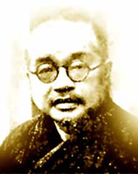

{width=60% fig-align="center"}

清晨，寺院的山门刚刚打开。有人走进大殿，点一炷香，求家人平安；有人在佛像前久久不语，只想暂时躲开生活中的烦恼；也有人望着殿中的出家人，心里生出一个疑问：

佛教讲放下、出离和涅槃，是不是意味着离开现实，远离社会，什么都不再关心？这个疑问并不是今天才有。二十世纪初的中国，社会剧烈动荡，旧有秩序逐渐瓦解，西方科学、教育与政治思想大量传入。寺院也面临前所未有的压力：有人把佛教看成迷信，有人认为僧人只会经忏度亡，还有人批评佛教只谈来世、不问现实。

就在这样的时代里，一位年轻僧人站了出来。1913年，在敬安和尚追悼会上，太虚大师提出“教理革命、教制革命、教产革命”，希望佛教摆脱积弊，重建僧团教育，恢复大乘佛教自利利他的精神。此后，他创办佛学院、组织佛教团体、出版刊物，并多次阐述一种新的佛教方向——人生佛教。

他并不是要把佛教改造成一种时髦的新思想，而是要重新回答一个古老而现实的问题：

佛法究竟应当怎样活在人间？

---

## 一、“看破红尘”，是不是佛教的全部？

在许多人的印象中，佛教似乎总与“看破红尘”联系在一起。一个人遭遇失恋、破产或者事业挫折，旁人可能会说：“想开一点，不如看破红尘。”影视作品里的出家人，也常常是在遭逢重大变故后，万念俱灰，遁入空门。久而久之，佛教便被描绘成一条逃离人生的道路：现实太苦，所以不再面对；世事太乱，所以退到深山；感情令人受伤，所以不再爱任何人。

但这并不是佛陀教法的本意。佛教所说的“出离”，首先是出离贪、嗔、痴的支配，而不只是离开家庭与社会。一个人即使住在深山之中，心里仍然充满欲望、怨恨和分别，也不能算真正出离；另一个人虽然生活在人群中，却能减少自私，保持清醒，帮助他人，同样可以实践佛法。

所谓“红尘”，真正需要看破的，不是人间本身，而是我们对于人间的错误执著。看破无常，不是厌恶生命，而是知道一切都会改变，因此更懂得珍惜。看破名利，不是拒绝工作，而是不让财富和地位决定自己的全部价值。看破感情中的占有，不是不再关心他人，而是学习以更少控制、更少伤害的方式去爱。

佛教并不是叫人从生活中退场，而是希望人不再被生活中的贪欲、恐惧和愤怒牵着走。

---

## 二、佛教为什么必须面对现代社会？

佛教传入中国以后，经历了两千年的发展。隋唐时期，佛教宗派兴盛，译经、讲学、造像和寺院制度都达到高峰。到了近代，中国社会的政治结构、经济制度和知识体系发生巨大变化，佛教原有的生存方式也受到冲击。当时一些寺院过度依赖经忏和超度维持生计，佛教在民众眼中，逐渐与死亡、鬼神和来世紧密联系。佛教中原本丰富的智慧、伦理、禅修和菩萨行，反而不容易被普通人看见。

与此同时，现代学校、医院、慈善机构和报刊出版逐渐发展起来。人们开始用新的标准追问佛教：

佛教能不能帮助活着的人？佛教能不能回应教育、贫困、战争和社会道德问题？佛教除了超度亡者，还能为现实世界做些什么？这些问题并不意味着佛法已经过时，反而迫使佛教重新发掘自身最根本的精神。佛陀成道以后，并没有永远独坐菩提树下，而是走向鹿野苑，开始四十余年的教化。他接触国王、商人、农夫、妇女、病人和贫穷者，也调解僧团纷争，教导弟子如何处理家庭、财富、友谊和社会关系。

佛陀虽然证悟了超越生死的智慧，却始终在人间行走。因此，近现代佛教所面对的，并不是一个全新的选择，而是一次回归：

回到佛陀在人间说法的本怀，回到大乘佛教悲智双运的菩萨道。

---

## 三、太虚大师：先把“人”做好，再走向佛道

太虚大师是近代中国佛教改革最重要的倡导者之一。他所面对的佛教，一方面保存着浩瀚的经论和修行传统，另一方面也积累了制度松弛、教育不足、寺产私有化和过度依赖经忏等问题。因此，太虚提出三方面的改革。第一是教理革命，纠正佛教被鬼神化、消极化的倾向，重新彰显大乘佛教自利利他的精神。

第二是教制革命，改革僧团组织和教育制度，培养真正能够修行、讲学与服务社会的僧才。第三是教产革命，使寺院财产服务于僧团教育、弘法和社会公益，而不成为少数人的私产。太虚认为，其中又以僧制改革和人才培养最为根本。没有具备正见、戒行与现代知识的僧才，再好的制度也难以长期维持。

太虚后来把自己的思想逐渐概括为“人生佛教”。这里的“人生”，并不是追求享乐的人生，也不是把佛教降低为一般的处世哲学，而是强调：成佛的道路，要从现实的人生开始。一个人不能一面幻想成佛，一面忽略最基本的人格。不能口中谈慈悲，却在家庭中刻薄伤人。

不能高谈空性，却没有责任感。不能盼望净土，却任由自己所在的环境变得污浊。因此，太虚特别重视五戒、十善、人格养成、僧伽教育与服务社会。他希望学佛者先成为一个诚实、有责任、能利益他人的人，再由完善人格而深入菩萨行，最终趋向佛果。太虚曾写下一首著名的偈颂：

> 仰止唯佛陀，

> 完就在人格；

> 人圆佛即成，

> 是名真现实。

后世常把第三句转述为“人成即佛成”。这句话通俗易记，也广为流传；但从原颂看，“人圆佛即成”更能准确表达太虚的意思：并不是普通人格一完成，就等于圆满成佛，而是以佛陀为究竟目标，从人格的净化和圆满起步，逐步修习菩萨道。这首偈的重点，不是把佛降低为普通人，而是把普通人的生命提升到可以不断觉悟、不断圆满的道路上。

“仰止唯佛陀”，说明学佛仍以佛陀的觉悟为最高目标。“完就在人格”，说明佛道不能离开现实的道德实践。“人圆佛即成”，说明成佛不是凭空发生，而是慈悲、智慧、戒行和愿力逐渐圆满的结果。人生佛教的核心，不是“只做人，不成佛”，而是“由人生而进趣佛道”。

---

## 四、入世，不等于沉溺世间

人们常把“入世”与“出世”看成彼此矛盾的两条路。入世，似乎就是追逐功名、财富和权力；出世，则似乎必须抛弃一切现实事务。佛教却不这样理解。佛教所说的“出世”，是超越贪嗔痴和自我中心；所说的“入世”，则是以慈悲心进入众生的现实处境。如果一个人投身社会，却只是为了自己的名声、利益和控制欲，这不一定是菩萨行。

如果一个人内心追求清净，却对他人的痛苦无动于衷，也不是完整的大乘精神。真正的菩萨道，是以出世的智慧做入世的事业。因为知道一切因缘和合，所以不固执己见；因为体会无我，所以不只为自己打算；因为明白无常，所以不拖延行善；因为观见众生皆苦，所以愿意伸手帮助。

太虚强调现实人生，并不是鼓励佛教徒沉迷世俗，而是希望人们带着佛法的智慧进入现实。佛教参与教育，不是为了扩张权势，而是为了启发智慧。佛教从事慈善，不是为了炫耀功德，而是为了减轻具体的痛苦。佛教关心社会，不是为了争夺控制权，而是为了减少暴力、贪婪与仇恨。

因此，人生佛教不是对出世精神的否定，而是把出世精神落实到人间。

---

## 五、印顺法师：“佛在人间”

太虚之后，印顺法师进一步发展了“人间佛教”的思想。印顺阅读《阿含经》和各部律藏时，特别注意到早期佛教中真实、朴素而亲切的人间性。他引用《增一阿含经》的话：

> 诸佛皆出人间，终不在天上成佛也。

这句话并不是否认佛陀的伟大，而是提醒人们：释迦牟尼佛不是一位凭空降临、代替人决定命运的神。他在人间出生，在人间修行，在人间成道，也在人间教化众生。印顺认为，佛教长期发展以后，容易出现两种偏向。一种过度关注鬼与死亡，使佛教仿佛只是处理丧葬、超度和死后归宿的宗教。

另一种过度向往天神、神通和永生，使佛教逐渐被神秘化。为纠正这些偏向，他特别提出“人间”二字。人间不是佛法的障碍，而是修行的道场。人的生命有痛苦，也有反省痛苦的能力；有贪嗔痴，也有发展慈悲与智慧的可能。人既不像极端痛苦中的众生那样难以修行，也不像沉醉于享乐中的天人那样缺少出离心，因此最适合听闻佛法、发菩提心和实践菩萨道。

印顺所说的人间佛教，并不是简单地把佛教变成社会伦理。他更强调一种“人菩萨行”：

修行者仍是有烦恼的普通人，却愿意学习菩萨；不假装自己已经圆满，却从当下能够做到的事情开始；不等待拥有神通以后才度众生，而是在日常生活中学习布施、持戒、忍辱、精进、禅定和智慧。菩萨不是远离人群的神秘形象，而是愿意在众生中不断学习慈悲的人。

---

## 六、人间佛教的经典根据

“人生佛教”和“人间佛教”虽然是在近现代受到重视的名称，但它们并不是脱离经典而产生的新宗教。它们的思想根源，可以在早期佛教和大乘经典中找到。《增一阿含经》说：

> 诸佛世尊，皆出人间，非由天而得也。

这句话说明，佛陀的觉悟发生在人类现实生命之中。《维摩诘所说经》说：

> 若菩萨欲得净土，当净其心；随其心净，则佛土净。

净土不仅是遥远世界的庄严，也与人的心行有关。一个充满贪婪、欺骗和仇恨的社会，不可能仅靠建筑和财富成为净土；只有人的内心和行为逐渐净化，人与人的关系才可能改善。《六祖坛经》说：

> 佛法在世间，不离世间觉；

> 离世觅菩提，恰如求兔角。

觉悟不是在世间之外另找一个地方，而是要在面对工作、家庭、得失和人际关系时，看清自己的执著。佛教流传极广的一首偈颂又说：

> 诸恶莫作，众善奉行；

> 自净其意，是诸佛教。

这三句话同时包含三个层面。“诸恶莫作”，是约束伤害他人的行为。“众善奉行”，是主动实践利益众生的善行。“自净其意”，是净化自己的贪嗔痴。如果只讲“自净其意”，却不愿意行善，佛教容易变成只顾个人内心安宁的修行。如果只讲“众善奉行”，却不处理自己的贪欲和我执，行善也可能成为追求名声的工具。

佛法把行为、社会责任与内心净化连在一起，这正是人间佛教的经典基础。

---

## 七、赵朴初：让人间佛教成为现实方向

在中国大陆，赵朴初居士对人间佛教的恢复与推广具有重要作用。二十世纪八十年代，中国佛教逐渐恢复。寺院需要重建，僧才需要培养，经典需要重新整理，佛教与现代社会的关系也需要重新说明。1983年，赵朴初在《中国佛教协会三十年》中提出，在当代中国佛教中，应当提倡人间佛教思想。他把人间佛教的基本内容概括为五戒、十善、四摄、六度等“自利利他的广大行愿”。

这里有两层内容。第一层是五戒、十善。它们帮助人建立基本的道德底线：不杀害、不偷盗、不邪淫、不妄语、不因酒精等使心智昏乱；同时减少贪欲、嗔恨和邪见。第二层是四摄、六度。四摄是布施、爱语、利行、同事，强调怎样与众生相处，怎样用别人能够接受的方式帮助他们。

六度是布施、持戒、忍辱、精进、禅定、般若，代表菩萨由自我净化走向利益众生的完整实践。因此，赵朴初所说的人间佛教，并不只是教人做一个守规矩的好人，而是以五戒十善为基础，进一步实践菩萨道。在赵朴初的推动下，人间佛教不再只是少数思想家的理论，而逐渐成为中国佛教处理自身建设、社会责任与现代转型的重要方向。

佛教由此不再只是寺院内部的修持，也包括文化教育、慈善救济、国际交流、社会伦理与和平事业。但无论事业怎样扩大，根本仍然不能离开戒、定、慧。否则，佛教可能有了许多社会活动，却失去了佛法的内在精神。

---

## 八、圣严法师：从心灵环保到人间净土

圣严法师常以“人间净土”说明佛法与现代生活的关系。他所说的人间净土，并不是要用人工方式在地球上复制佛经中种种宝树、楼阁和七宝池，而是从净化人的思想、生活和心灵开始，逐渐改善社会环境与自然环境。圣严法师说：

> 只要你的一念心净，此一念间，你便在净土。

这并不是说只要心情好，外部问题就不存在。面对战争、贫困、污染和不公，仅仅告诉受苦者“把心放下”，显然是不够的。佛教也不能以“万法唯心”为借口，回避现实责任。圣严法师强调的是：一切改善都必须从人的心念开始。一个制度由人建立，一个家庭由人共同生活，一次伤害往往从一个愤怒或贪婪的念头开始。如果人的内心毫无改变，即使外在条件短暂改善，新的冲突仍可能继续产生。

因此，他提出“心灵环保”。环境污染来自过度消费，过度消费背后是永不满足的欲望。网络暴力来自语言失控，语言失控背后是愤怒和偏见。家庭冲突来自彼此指责，指责背后常常是强烈的自我中心。净化环境，不能只清理垃圾，也要清理贪欲；改善社会，不能只制定规则，也要培养尊重；

建设净土，不能只等待理想世界出现，也要从自己的一念、一句话和一个行为开始。人间净土不是突然完成的宏伟工程，而是无数个人在具体生活中，减少一点伤害，增加一点清净。

---

## 九、星云大师：让佛法走进家家户户

星云大师从教育、文化、慈善和日常生活等方面，广泛实践人间佛教。他用非常通俗的话概括人间佛教：

> 佛说的、人要的、净化的、善美的，凡有助于幸福人生增进的教法，都是人间佛教。

“佛说的”，说明人间佛教必须以佛法为依据，不能为了迎合社会而随意改变根本教义。“人要的”，说明弘法应当回应人的真实需要，使佛法能够帮助人面对烦恼、家庭、工作和生死。“净化的”，说明佛法的作用不是纵容欲望，而是净化身口意。“善美的”，说明佛教应当为人生和社会带来慈悲、和谐与希望。

星云大师还提倡“给人信心、给人欢喜、给人希望、给人方便”，以及“做好事、说好话、存好心”。这些话看似浅白，却可以与传统佛法一一对应。做好事，是身业的净化；说好话，是口业的净化；存好心，是意业的净化。给人信心，不是盲目安慰，而是帮助别人看见改变的可能。

给人欢喜，不是讨好所有人，而是不以冷漠和傲慢伤害他人。给人希望，不是否认痛苦，而是在痛苦中提供方向。给人方便，不是没有原则，而是懂得根据不同人的处境，以适当方式帮助他。星云大师强调，人间佛教虽然“不舍世间”，修行者仍须保持出离心，以出世的思想从事入世的事业。慈善、教育与文化如果脱离了无我、持戒和般若，也可能变成另一种名利事业。

人间佛教的“人间”，不是纵情世间；它的“佛教”，也不能在热闹事业中被遗忘。

---

## 十、几位近现代大德，所说的是同一件事吗？

太虚、印顺、赵朴初、圣严和星云，都重视佛法在人间的实践，但各自侧重点并不完全相同。太虚面对的是近代中国佛教的制度危机。他以人生佛教为纲领，重视僧团改革、佛教教育和人格建设，希望由人生进趣佛道。印顺更重视佛教思想的辨析。他强调“佛在人间”，反对佛教过度鬼神化和天神化，提倡以人菩萨行为实践核心。

赵朴初面对的是中国大陆佛教的恢复与重建。他把人间佛教落实为五戒、十善、四摄、六度，并推动佛教与现代社会相适应。圣严以“心灵环保”和“人间净土”为特色，强调从个人心念的净化，逐步走向社会和环境的净化。星云则以生活化、文化化和国际化的方式传播人间佛教，使佛法进入家庭、学校、社区和公共文化。

他们不是在创造五种彼此无关的佛教，而是在不同历史环境中，回答同一个问题：

怎样既不失去佛法的解脱精神，又能利益现实中的众生？他们共同反对两种极端。一种极端，是只谈出世，不问人间，把佛教缩小为个人逃避痛苦的方法。另一种极端，是只谈社会服务，不修戒定慧，把佛教变成普通的慈善机构或伦理学说。完整的人间佛教，需要把两者结合起来：

以内心觉悟为根本，以利益众生为实践；以出离心摆脱贪著，以菩提心承担责任；以般若智慧看破执著，以慈悲愿行进入人间。

---

## 十一、常见误解：佛教是不是消极避世？

### 1. 佛教讲“苦”，是不是否定人生？

佛教说苦，不是说人生毫无价值，而是诚实指出：衰老、疾病、离别、求不得和内心不安，都是生命中无法完全回避的经验。医生指出病情，并不是悲观；真正的悲观，是认为病无可救药。佛陀说明苦，同时也说明苦的原因、苦的止息与通向止息的道路。四圣谛不仅有“苦谛”，也有“灭谛”和“道谛”。

佛教不是停留在“人生很苦”，而是在追问：

苦从哪里来？哪些痛苦可以减少？怎样不再反复制造同样的痛苦？这种面对现实的态度，不是消极，而是清醒。

### 2. 出家是不是逃避责任？

有人确实可能因为挫折而产生出家的念头，但真正的出家并不是逃避责任，而是承担另一种更严格的责任。出家人要遵守戒律，接受僧团约束，放弃许多个人享受，并承担修学和住持佛法的责任。离开一种生活，并不自动等于逃避；关键在于离开的动机是什么，离开以后又承担了什么。

同样，在家生活也不必然代表积极入世。一个人虽然有工作、家庭和社会身份，却只关心个人利益，也可能是在逃避更深的生命责任。佛教判断一个人是否真正精进，不只看他住在寺院还是城市，而要看他的贪嗔痴是否减少，慈悲和智慧是否增长。

### 3. 佛教是不是只关心来世？

佛教承认生命与行为具有长远影响，但并不因此忽略今生。五戒首先保护的就是现实生活中的生命、财产、家庭关系、社会信任与心智清醒。十善要求人改善当下的身口意。四摄教人怎样与现实中的他人建立善缘。六度更是在具体处境中修习布施、忍辱和智慧。佛教谈来世，是提醒人不要只顾眼前利益；佛教重视当下，则是因为未来正由当下的行为形成。

真正的因果观，不是把希望全部推给来世，而是对现在的每一个选择负责。

### 4. 人间佛教是不是只做慈善？

慈善是人间佛教的重要实践，却不是全部。布施若没有智慧，可能使受助者形成依赖；公益若没有戒律，可能夹杂名利和权力；服务社会若没有禅定与反省，参与者也可能在忙碌中充满烦恼。佛教的特色，不只是帮助外在的贫困，也要认识造成痛苦的贪嗔痴。因此，人间佛教既要“众善奉行”，也要“自净其意”。

### 5. 人间佛教是不是把佛教世俗化？

“世俗化”可以有两种完全不同的含义。一种是让深奥佛法能够用现代语言表达，使普通人在现实生活中实践。这是契机，是佛教历来弘传必须进行的工作。另一种是为了迎合欲望，放弃戒律、解脱和成佛的目标，把佛教变成成功学、情绪安慰或商业文化。这便失去了佛法的根本。

人间佛教不是把佛法降低到世俗欲望，而是用佛法提升现实人生。它不是告诉人怎样得到更多名利，而是教人怎样不被名利奴役；不是保证人生永远顺利，而是帮助人在无常中保持清醒；不是鼓励执著现世，而是在现世中修习超越执著的智慧。

---

## 十二、普通人怎样实践人间佛教？

人间佛教不只属于高僧，也不只体现在大型慈善、学校和文化事业中。普通人每天都可以实践。在家庭里，少一句刻薄的话，多一次耐心倾听，是爱语。面对父母年老时，愿意照顾而不只是抱怨，是报恩。教育孩子时，不把自己的焦虑和虚荣强加给他，是慈悲。在工作中，不欺骗客户，不侵占公共利益，是持戒。

同事犯错时，不急于羞辱，而是帮助解决问题，是利行。自己取得成绩时，知道其中包含许多人的帮助，是缘起观。在网络上，不随意传播未经证实的消息，是不妄语。看到不同意见时，不立刻辱骂，是忍辱。使用消费品时，减少浪费，尊重自然环境，是对众生和未来负责。

遭遇挫折时，先观察自己的情绪，不让愤怒马上变成伤人的语言，是正念。这些事情并不神秘，却比谈论玄妙境界更能检验一个人是否真正学佛。人间佛教不是要求每个人都做惊天动地的大事，而是让佛法进入每一个普通选择。一个人少制造一点恐惧，周围就多一分安定；

少制造一点欺骗，社会就多一分信任；少制造一点仇恨，人间就多一分清凉。净土并不一定从远方开始。它可能就从一句不再伤人的话开始。

---

## 小栏目：人生佛教与人间佛教有什么区别？

“人生佛教”主要与太虚大师的思想联系在一起，强调从现实人生出发，改善人格，建立人乘善行，并进一步修习菩萨道、趋向成佛。“人间佛教”则在印顺、赵朴初、圣严、星云等人的思想与实践中得到不同发展，更突出佛在人间、修行在人间、净化人间和利益人间。二者并不是互相排斥的两个宗派。

简单来说：

人生佛教强调“从怎样的人生走向佛道”；人间佛教强调“佛法怎样在人间落实”。前者以人生为起点，后者以人间为道场。二者共同反对佛教被片面理解为只重死亡、鬼神和来世，也共同强调佛法不能离开戒定慧、菩提心与解脱目标。

---

## 小栏目：“人成即佛成”是不是说做好人就等于成佛？

不是。做好人是学佛的重要基础，却不等于已经成佛。一个诚实、善良、有责任感的人，具备修行所需要的良好人格；但佛陀还圆满了深广的智慧、慈悲、福德和觉悟。太虚原颂作“人圆佛即成”，强调人格、菩萨行与佛果逐步圆满的关系。因此，“人成即佛成”更适合作为通俗的勉励：

学佛不能跳过做人。它不能被理解为：

只要遵守一般社会道德，便已经达到佛陀的觉悟。

---

## 小栏目：人间佛教是不是只适合在家人？

不是。在家人可以在家庭、职业和社会关系中实践五戒、十善、四摄和六度。出家人则要通过持戒、禅修、讲学、教育和弘法，为社会保存并传递佛法。两者承担的方式不同，却都能实践人间佛教。在家人不能因为强调入世，就忽视内心修行；出家人也不能因为重视出世，就远离众生疾苦。

佛教的完整发展，需要出家与在家四众弟子彼此支持。

---

## 十三、人间佛教仍然需要警惕什么？

人间佛教回应了现代社会，却也面临新的风险。第一，是把佛教变成励志成功学。佛法可以帮助人平静、专注和改善关系，却不是保证升职、发财、事事如愿的工具。若只宣传“正能量”，却避开苦、无常、无我与生死问题，佛教便会失去深度。第二，是以社会事业代替个人修行。

寺院可以办教育、文化和公益事业，但参与者仍要反省自己的发心。事业越大，越需要戒律、制度与无我精神，否则也可能产生权力、金钱和名声的执著。第三，是为了现代化而随意解释经典。契机不是迎合，创新也不能离开契理。人间佛教首先仍然是佛教，必须以三宝、四圣谛、八正道、缘起、戒定慧和菩萨行为根本。

第四，是只强调人类利益，忽略其他生命。佛教的慈悲对象不只包括人。现代人间佛教还应关心动物、生态环境和未来世代。人间是修行的中心场域，却不是人类可以任意占有的世界。第五，是在忙碌中失去清净。社会参与越多，越需要禅修和独处；言论越多，越需要正语；组织越庞大，越需要谦卑。

真正的人间佛教，不是用忙碌掩盖内心的空虚，而是在清净心中生起承担，在承担中不断照见自己的执著。

---

## 十四、出世与入世，是一条完整的路

佛教确实有出世的一面。它要人看见生老病死，认识欲望不能带来究竟满足，最终超越无明和生死轮回。佛教也确实有入世的一面。佛陀成道后没有抛弃众生，菩萨也不因世间污浊而拒绝进入世间。如果没有出世的智慧，入世容易变成新的争夺；如果没有入世的慈悲，出世容易变成个人的冷漠。

佛教最可贵的地方，正是在两者之间保持中道：

看破，却不冷漠；放下，却不放弃责任；出离，却不舍众生；寂静，却仍然行动。太虚大师希望人由完善人格而进趣佛道。印顺法师提醒人们，佛在人间成道。赵朴初把五戒、十善、四摄、六度落实为当代佛教方向。圣严法师从一念心净谈到人间净土。星云大师则努力让佛法走进家家户户。

他们共同说明了一件事：

佛教所要离开的，不是人间，而是使人间充满痛苦的贪、嗔、痴。佛教所要建设的，也不只是外在的繁荣，而是一个更清醒、更慈悲、更少伤害的世界。

---

## 本章小结

近现代中国社会的剧烈变化，使佛教必须重新说明自身与现实人生的关系。太虚大师提出人生佛教，以佛陀为究竟目标，以人格完善为现实起点，并从教理、制度与寺产等方面推动佛教改革。印顺法师进一步强调“佛在人间”，主张以人类为本位，实践真实而平实的人菩萨行。

赵朴初把五戒、十善、四摄、六度等自利利他的广大行愿，确立为当代人间佛教的重要内容。圣严法师以心灵环保和人间净土说明：净化社会，应从净化人的心念和行为开始。星云大师则以生活化、文化化和公益实践，使人间佛教进入普通人的日常生活。人间佛教不是否定出世解脱，也不是把佛教简化为慈善和道德教育。

它所强调的是：

以出世的智慧，做入世的事业；以清净自己的心，改善人与人的关系；以成佛为长远方向，从当下能够做到的善行开始。佛教并不叫人逃离现实。它希望人看清现实以后，仍然愿意温柔而坚定地生活在人间。

---

## 佛教常识：本章关键词

### 人生佛教

太虚大师倡导的重要思想。强调以现实人生为起点，完善人格，修习五戒十善，并由人乘善行进一步进入菩萨道。

### 人间佛教

近现代汉传佛教的重要发展方向。强调佛法以人为主要教化对象，在现实人间修行并利益众生，同时保持解脱、成佛和菩萨道的宗教目标。

### 人菩萨行

印顺法师特别重视的菩萨实践方式。修行者以普通人的身份发菩提心，不追求神秘化和速成，在现实生活中逐步实践慈悲与智慧。

### 心灵环保

圣严法师倡导的现代佛教理念。通过减少内心的贪欲、嗔恨、嫉妒和傲慢，改善个人生活、社会关系与自然环境。

### 人间净土

不是简单把经典中的净土景象搬到现实世界，而是通过净化身心、改善社会、保护环境，使现实人间逐渐减少痛苦与污染。

### 四摄

布施、爱语、利行、同事。是菩萨亲近众生、帮助众生的四种方法。

### 六度

布施、持戒、忍辱、精进、禅定、般若。是大乘菩萨道的核心实践。

---

## 本章经典原文选读

### 一、《增一阿含经》

> 诸佛世尊，皆出人间，非由天而得也。

大意是：佛陀在人间修行成道，而不是依靠天神身份自然成为佛。它提醒人们重视人身的修行价值。

### 二、《维摩诘所说经·佛国品》

> 若菩萨欲得净土，当净其心；随其心净，则佛土净。

大意是：菩萨要建设清净国土，必须先净化自己的心。内心清净还要表现为清净的行为，由此影响家庭、社会和环境。

### 三、《六祖坛经》

> 佛法在世间，不离世间觉；

> 离世觅菩提，恰如求兔角。

大意是：觉悟不能离开现实生活。若逃避一切现实处境，另外寻找菩提，就像寻找兔子的角一样不切实际。

### 四、诸佛通诫偈

> 诸恶莫作，众善奉行；

> 自净其意，是诸佛教。

大意是：停止恶行、积极行善、净化内心，三者共同构成佛教修行的基本方向。

### 五、太虚大师《即人成佛的真现实论》

> 仰止唯佛陀，完就在人格；

> 人圆佛即成，是名真现实。

大意是：以佛陀为最高理想，从现实人格的完善开始，逐渐圆满菩萨行与佛果。后世常见“完成在人格，人成即佛成”的转述版本。

---

## 主要参考资料

1. 太虚：《即人成佛的真现实论》《整理僧伽制度论》《佛教革新方案》《志行之自述》等。

2. 印顺：《佛在人间》《契理契机之人间佛教》《人间佛教要略》等。

3. 赵朴初：《佛教常识答问》《中国佛教协会三十年》。

4. 圣严：《净土在人间》及有关“心灵环保”“人间净土”的相关讲演。

5. 星云：《人间佛教佛陀本怀》《人间佛教当代问题座谈会》及相关讲演。

6. 《增一阿含经》《维摩诘所说经》《六祖坛经》等佛教经典。
