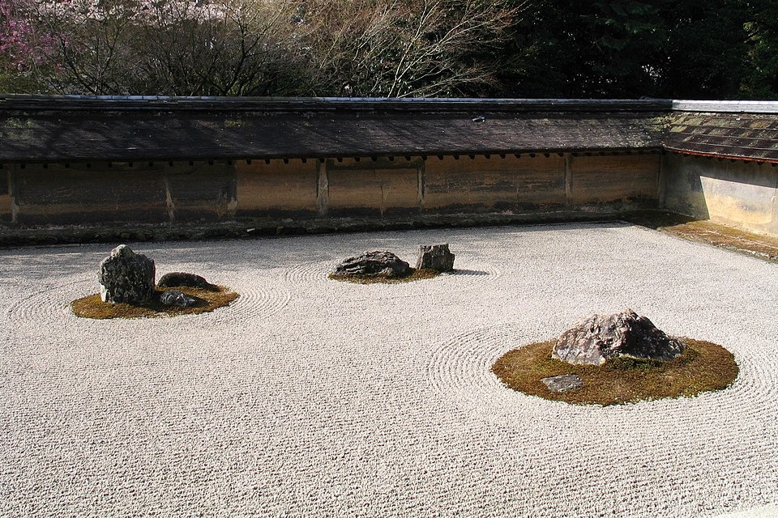

{width=80% fig-align="center"}

> 诸恶莫作，众善奉行，自净其意，是诸佛教。

## 引子：佛法最终要走进一个人的日常

清晨，手机闹铃响起。

一个普通人睁开眼睛，首先看到的不是窗外的阳光，而是屏幕上不断跳出的消息：工作群里有人催问进度，新闻推送着新的冲突和灾难，朋友晒出了更大的房子、更远的旅行和更成功的人生。还没有起床，他的心已经被拉向许多地方。

到了公司，他担心落后，害怕被否定；回到家里，他可能因为一句无心的话与亲人争执；夜深以后，他又想起父母渐老、孩子成长、身体衰退，以及某些再也无法挽回的人和事。

现代人的生活，和两千多年前恒河流域的人当然不同。我们有高楼、网络、飞机和人工智能，佛陀时代的人没有这些。然而，隐藏在烦恼背后的心，却并没有发生根本变化。

我们仍然希望喜欢的事物永远不变，希望不喜欢的事物尽快消失；仍然容易把一次失败理解为“我这一生都失败了”，把一句批评理解为“别人完全否定了我”；仍然会因为得到而害怕失去，因为失去而追问为什么偏偏是自己。

时代变了，贪、瞋、痴的表现形式变了，但人面对得失、爱憎、生死时的困惑并没有消失。

因此，佛教两千多年的历史，不能只停留在鹿野苑的第一次说法、长安城里的译经院、寺庙中的佛像和藏经楼里的经卷。佛法若不能进入一顿饭、一场争执、一次失败、一段关系和一个普通人的内心，它就仍然只是被陈列的知识。

《六祖坛经》说：“佛法在世间，不离世间觉；离世觅菩提，恰如求兔角。”

真正的修行，不是等到生活中的问题全部消失以后才开始。恰恰相反，疾病、工作、家庭、衰老、误解和失去，正是我们认识无常、练习慈悲、学习放下和生起智慧的地方。

这一章不再讲一位遥远的佛陀、一位西行的高僧或一位传奇祖师。这一章的主人公，就是正在生活中的每一个普通人。

---

## 一、佛法不是让生活消失，而是让人看清生活

有人以为，佛教追求的是远离人群、远离欲望、远离一切现实事务。仿佛只有住进深山古寺，放下工作和家庭，才算真正修行。

但佛陀所教导的八正道，并不只属于禅堂。正见，是在纷乱的信息中辨别事实与情绪；正语，是在愤怒时不以恶言继续伤害；正业，是在利益面前守住不伤害他人的底线；正命，是不以损害众生的方式谋取生活；正念，是知道自己此刻在想什么、说什么、做什么；正定，是不让心永远被外境牵着奔跑。这些都发生在现实生活之中。

佛教并不要求人人出家。出家是一种完整而严格的修行生活，在家人则可以在家庭、职业和社会关系中学习五戒、十善、布施、忍辱和智慧。两者生活方式不同，但都要面对自己的贪、瞋、痴。

佛教常用一句极其简洁的话概括全部教法：
> “诸恶莫作，诸善奉行，自净其意，是诸佛教。”

这四句话包含了三个层次。第一是“诸恶莫作”：不因为愤怒、贪婪和恐惧，去伤害别人，也不继续伤害自己。第二是“诸善奉行”：佛教不只是不做坏事，还要主动行善。看见别人困难时愿意帮助，在关系中愿意倾听，在职责面前愿意承担，这些都是修行。第三是“自净其意”：外在行为固然重要，但佛教最终还要回到心。一个人即使表面行善，如果内心充满傲慢、嫉妒和对回报的要求，烦恼仍然会继续生长。

因此，佛法不是要求人逃离生活，而是训练我们在生活中少制造一点伤害，多成就一点善意，并逐渐看清自己的心。寺院可以帮助人安静，经典可以帮助人明理，仪式可以提醒人恭敬，但真正检验修行的地方，往往是离开寺院以后：被误解时，我们怎样说话？利益冲突时，我们怎样选择？亲人衰老时，我们怎样陪伴？事情无法挽回时，我们怎样安顿自己的心？这些问题，才是佛法走入生活之后真正面对的功课。

---

## 二、无常：不是坏消息，而是世界原本的样子

佛教所说的“无常”，常被误解为一种消极的叹息。有人听到无常，想到的是花会凋谢、人会衰老、关系会结束，于是觉得佛教总在提醒人失去和死亡。但无常首先不是一种情绪，也不是一句劝人悲观的话。它只是对现实的观察：凡是由条件聚合而成的事物，都会随着条件变化而变化。

身体会变化，情绪会变化，社会会变化，财富和名声会变化，人与人的关系也会变化。《佛遗教经》说：“一切世间动不动法，皆是败坏不安之相。”这里的“败坏”，不是说世界毫无价值，而是说一切有为法都不能永远保持原状。

### 1. 人为什么会被无常伤害？
变化本身未必就是痛苦。真正让人痛苦的，往往是我们要求变化的事物不要变化。孩子长大，本是自然过程，父母却可能因为不愿接受孩子独立而痛苦；一段关系出现变化，本来有许多复杂因缘，我们却坚持对方必须永远按照过去的方式爱自己；身体衰老是生命规律，我们却把每一根白发都看成对自我价值的否定。

我们常常不是败给变化，而是败给“它不应该变化”的执着。无常告诉我们：世界没有违背承诺，因为世界从来没有承诺一切永远不变。

### 2. 无常也意味着，痛苦不会永远固定
如果一切都是永恒不变的，那么疾病无法治疗，坏习惯无法改变，失败也永远无法翻身。正因为无常，种子才能发芽，伤口才能愈合，误解才有机会解释，一个曾经暴躁的人也可能学会温和。

无常不仅带走我们喜欢的事物，也会带走不喜欢的处境。所以，无常并非只意味着“终将失去”，也意味着“仍有可能”。

佛教的因缘观认为，一件事情不是无缘无故出现的，也不是由单一力量决定的。条件改变，结果就可能改变。承认无常，不是叫人放弃努力，恰恰是提醒人：正因为未来尚未固定，现在的选择才有意义。

### 3. 看见无常，才能真正珍惜
人常常在失去之后才明白珍惜。父母在身边时，我们嫌他们唠叨；孩子依赖我们时，我们觉得疲惫；身体健康时，我们习惯熬夜和透支；一段平静的生活持续太久，我们便误以为这一切理所当然。

无常观不是要人整日想着死亡，而是要人醒来。知道相聚不会永远持续，所以今天的一顿饭值得认真吃；知道父母终会老去，所以一句关心不必等到以后；知道身体并不坚固，所以应当适当休息和照顾；知道自己也会犯错，所以不必永远揪住别人的过失。

真正理解无常的人，不会因此冷漠，反而更懂得珍惜。

### 4. 面对失去，无常不要求人立刻平静
亲人去世、关系结束、事业受挫时，告诉一个正在悲伤的人“这都是无常”，有时并不是智慧，而是一种缺少体谅的说教。佛教承认爱别离苦，也承认人的悲伤需要时间。

理解无常，不等于压抑眼泪，更不是要求自己立刻想通。它只是让我们在悲伤中逐渐明白：失去是生命的一部分，而悲伤也是因缘所生的过程。它会到来，也会变化。我们可以怀念，可以流泪，可以保存一份深厚的感情，但不必要求已经过去的事情重新变回从前。

对逝去的人，真正的放下不是遗忘，而是把“我一定要留住你”，慢慢转化成“谢谢你曾经来过”。

---

## 三、慈悲：不是软弱，而是不再增加痛苦

“慈悲”是佛教中最常被提起，也最容易被误解的词语之一。有些人把慈悲理解为性格温和、不与人争；有些人认为慈悲就是无条件答应别人的要求；还有人担心，一个人太慈悲，就会被欺负、被利用。

佛教所说的慈悲，比一般意义上的“心软”更深。《大智度论》解释：“慈名爱念众生，常求安隐乐事以饶益之；悲名愍念众生受种种身苦、心苦。”“慈”是希望众生得到安乐，“悲”是看见众生的痛苦，并愿意帮助他们离苦。慈悲不是一种软弱的情绪，而是一种面对痛苦的能力。

### 1. 慈悲首先是看见
许多伤害并不是因为人天生残忍，而是因为没有真正看见别人。父母只看见孩子成绩下降，却没有看见他的恐惧；伴侣只听见对方语气不好，却没有看见他一天积累的疲惫；管理者只看见员工犯错，却没有看见制度中长期存在的问题。

慈悲的第一步，是暂时放下“我受到了怎样的冒犯”，看一看对方正在经历什么。这并不表示对方一定正确，也不表示我们必须接受所有行为。只是当一个人看见得更多，他的反应便不必完全由愤怒支配。

### 2. 慈悲不等于纵容
一个人沉迷赌博，家人不断替他还债，这未必是慈悲；孩子犯错，父母因为不忍心而取消所有后果，也未必真正帮助了孩子；面对持续的欺骗和暴力，一味忍耐，甚至可能让伤害继续扩大。

慈悲的目标是减少痛苦，而不是维持表面的和气。有时慈悲表现为安慰，有时表现为制止；有时是陪伴，有时是明确地说“不”；有时要给人第二次机会，有时则必须建立边界。阻止一个人继续伤害别人，也是在阻止他继续造作恶业。从这个意义上说，坚定并不违背慈悲。

真正的慈悲必须与智慧相伴。只有情感而没有智慧，可能变成溺爱和纠缠；只有判断而没有慈悲，又可能变成冷酷和傲慢。《维摩诘经》提醒，若慈悲中夹杂强烈的占有、分别和自我要求，就会成为“爱见悲”，久而久之容易疲惫和厌倦。

有智慧的慈悲，是尽力而为，却承认每个人都有自己的因缘；愿意伸手帮助，却不把自己幻想成能够拯救所有人的人。

### 3. 慈悲也包括对自己
有些人对别人宽容，对自己却极其苛刻。一次失误，便反复责骂自己；工作没有达到预期，就认为自己毫无价值；看到别人成功，便觉得自己的生活一无是处。这种持续的自我攻击，并不能让人真正进步。它只会让心越来越疲惫。

对自己慈悲，不是为错误找借口，也不是放任懒惰，而是承认：我会受伤，会疲倦，会受限，也会犯错。我们可以承担责任，但不必把一次错误扩大成对整个人格的否定；可以努力改善，却不必靠羞辱自己获得动力。

佛教讲“众生”，自己也在众生之中。一个连自己的痛苦都不敢看见的人，很难长久地理解别人的痛苦。适当休息、寻求帮助、承认能力有限，并不自私。有严重身心困扰时，接受必要的医疗和心理专业支持，也不违背佛法。

慈悲不是要求一个人永远独自承受，而是让痛苦得到如实而恰当的照顾。

---

## 四、放下：不是放弃，而是不再被执着捆绑

在佛教词语中，“放下”大概是被使用得最广，也最容易被说得轻巧的一个。别人失恋了，我们说：“放下吧。”别人遭受不公，我们说：“不要计较。”别人失去亲人，我们也说：“看开一点。”可是，真正的放下从来不是一句轻飘飘的劝告。

### 1. 放下的不是责任，而是执着
《金刚经》说：“应无所住而生其心。”这句话不能只读前半句。“无所住”，是心不被名声、利益、成败、爱憎和固定观念牢牢绑住；“生其心”，则是仍然生起布施心、慈悲心、责任心和菩提心。

如果只有“无所住”而没有“生其心”，人可能落入什么都不在乎的冷漠；如果只有“生其心”而处处执着，善行又可能变成新的负担。

真正的放下，是认真做事，但不把自己全部交给结果；真诚爱一个人，但不把爱变成占有；承担应有责任，但不把无法控制的部分也背在身上。《维摩诘经》说，菩萨“虽行于空，而植众德本”。理解空，并不妨碍修善；不执着，反而使人能够更自由、更长久地行动。

### 2. 放下之前，往往要先提起
该道歉的没有道歉，却说自己已经放下；该偿还的责任没有承担，却说一切随缘；问题明明可以解决，却用“看破”来掩饰逃避，这些都不是佛教所说的放下。

放下之前，常常要先把责任提起来。圣严法师把面对困境的过程概括为：“面对它、接受它、处理它、放下它。”这四个步骤有清楚的次序：
* “面对它”，是不否认事情已经发生；
* “接受它”，不是认同伤害，也不是向命运投降，而是承认当下事实确实如此；
* “处理它”，是尽自己的能力解决问题、承担责任、寻求帮助；
* “放下它”，则是在已经尽力之后，不再让事情在心中一遍又一遍重演。

许多人不是没有处理问题，而是在问题结束以后，仍然每天重新审判自己和别人。事情在外部已经过去，在心里却反复发生。放下，就是不再用今天的生命，一遍又一遍惩罚过去的自己。

### 3. 放下不等于没有感情
真正放下一段关系，并不表示从此毫无怀念；放下亲人的离世，也不表示抹掉共同生活的记忆。放下不是强迫自己“不准再想”，而是即使想起，也不再被过去完全带走。

一个人仍然可以记得，但不必继续纠缠；仍然可以感恩，却不再要求时光倒流；仍然可以悲伤，但也允许自己重新生活。佛教并不是把人训练成没有情感的石头，而是让情感不再演变成永无止境的执取。

### 4. 该放下什么？
需要放下的，往往不是一件具体事物，而是心中那个僵硬的要求：“别人必须理解我。”“我不能失败。”“我的孩子必须成为我期待的样子。”“付出了就一定要得到回报。”“过去如果不同，我现在一定会幸福。”

这些想法之所以带来巨大痛苦，是因为它们把复杂而变化的世界，变成了一个必须服从自我意愿的世界。放下，不是说我们不能有愿望，而是不把愿望变成命令世界的圣旨。

可以努力争取，但也有能力面对结果；可以珍惜拥有，却明白拥有并非永恒；可以为正义发声，却不让仇恨吞没自己。这才是“提得起，也放得下”。

---

## 五、正念：把散落在各处的心带回来

现代社会常常谈论“正念”。有人把它理解成一种放松方法，有人用它提高注意力，也有人以为正念就是让头脑一片空白。

佛教所说的正念，并不是不思考，也不是追求某种始终平静的状态。正念是清楚地知道：此刻身上发生了什么，心中生起了什么，我们正在做什么，以及这些身心活动将带来怎样的后果。

《中阿含经·念处经》讲四念处，要求修行者观察身、受、心、法，并说：“行则知行，住则知住，坐则知坐，卧则知卧……行住坐卧、眠寤语默，皆正知之。”这不是要人变得迟缓，而是让人从自动反应中醒来。

### 1. 在情绪与行动之间，留出一点空间
愤怒升起时，普通的反应往往很快。一条令人不快的消息出现，手指立即打出恶言；孩子顶嘴，父母立刻提高音量；在网络上看见不同意见，马上把对方归入某种可憎的群体。

正念不是要求愤怒不能出现，而是让我们知道：“现在，愤怒正在升起。”仅凭这一点觉察，就可能在情绪与行动之间留出一道缝隙。

我们可以感觉到呼吸变急、肩膀紧绷、心中不断组织攻击性的语言。然后问自己：我接下来这句话，是在解决问题，还是只想让对方也痛苦？正念不能保证每一次都做出完美选择，但它让人不必永远被第一个冲动控制。《佛遗教经》说：“若失念者，则失诸功德；若念力坚强，虽入五欲贼中，不为所害。”

### 2. 看见感受，而不是成为感受
我们常说：“我很愤怒”“我很焦虑”“我很失败”。这些说法容易让人把暂时的状态等同于整个自己。

正念可以帮助我们换一种观察方式：“心中有愤怒。”“身体正在紧张。”“此刻有一种害怕被否定的感受。”

愤怒是正在发生的心理现象，但它不是完整的“我”；焦虑会影响我们，却不是永远不变的身份。一旦感受不再等同于自我，我们就有机会观察它的生起、停留和消退。这就是在日常生活中观察无常。

### 3. 正念不是永远不走神，而是走神以后知道回来
许多人开始静坐时，会因为杂念太多而沮丧，认为自己不适合修行。其实，发现自己走神，本身就是正念恢复的一刻。

心跑到过去，知道它跑到了过去；心担忧未来，知道它正在构想未来；然后轻轻回到呼吸、身体和眼前正在做的事。修行不是从此没有杂念，而是不再毫无觉察地跟着每一个念头奔跑。

在办公室写一份报告，心却不断想象别人怎样评价自己；陪家人吃饭，眼睛却始终停留在手机上；躺在床上，身体准备休息，心还在重复白天的争执。正念，就是一次又一次把心带回来。回来吃这一口饭，听完眼前这个人说的话，完成手上的这一件事。人的生命其实只发生在当下，但我们的心常常不在这里。

---

## 六、智慧：不是聪明，而是看清因缘

佛教重视智慧，但佛教所说的智慧并不等于记忆力强、学历高或善于争辩。一个人可以非常聪明，却仍然被嫉妒和傲慢支配；可以懂得许多道理，却在利益面前失去分寸。

佛教的智慧，首先是如实地看见因缘。

### 1. 一件事，不等于我们对它的解释
领导指出一项错误，这是一个事实。“他一直看不起我”，可能是解释。
朋友没有及时回复消息，这是一个事实。“他已经不在乎我了”，可能是解释。
一次考试失败，这是一个事实。“我这一生都不会成功”，则是把一次事件扩大成了整个命运。

人在痛苦时，常常把事实、感受和想象混在一起。智慧不是没有情绪，而是能够分辨：真正发生了什么？我现在感受到什么？我又在这件事上增加了怎样的推测？这种分辨，可以让人从情绪编织的世界中退后一步。

### 2. 没有一件事只由一个原因造成
佛教讲缘起：“此有故彼有，此生故彼生；此无故彼无，此灭故彼灭。”

一段关系破裂，往往不只是某一句话造成的；一个人的坏习惯，也可能与成长经历、环境诱因、压力和长期选择有关；一次事业失败，既有个人判断，也有市场、时机和许多不可控制的因素。

看见因缘，不是逃避个人责任，而是不把一切简单归结为“都是我不好”或“全是别人害我”。过度自责和一味责怪别人，看似相反，其实都把复杂因缘压缩成单一结论。智慧使人既承担自己应承担的部分，也承认自己无法控制全部条件。

### 3. “空”意味着没有固定不变的本质
佛教说“空”，不是说一切都不存在，而是说一切都依因缘而成立，没有一个永恒、孤立、不变的自性。

一个人今天失败，不代表他本质上就是失败者；一个曾经伤害过别人的人，也不意味着他永远没有改变的可能；我们现在拥有的身份、财富和能力，也不是永远牢不可破的。

正因为是空，事物才可以变化。理解空，不会使人否定现实，反而让人不必被现实中暂时的标签完全限定。我们可以承认：“这件事我做错了。”却不必断言：“我是一个永远无可救药的人。”可以承认：“这段关系已经结束。”却不必断言：“从此以后，再也不会有人理解我。”

智慧让人看到，眼前的处境真实存在，却不是全部世界；它有自己的因缘，也会随着因缘继续变化。

### 4. 智慧最终要落实为选择
懂得无常，却依然挥霍时间，不是真懂无常。懂得因果，却仍在愤怒中随意伤人，不是真懂因果。懂得空，却以空为借口逃避责任，也不是真正的般若。

智慧不是头脑中保存的概念，而是在关键时刻能够改变选择的力量。当一句恶言到了嘴边，愿意停下来；当利益与原则冲突，愿意守住底线；当别人痛苦时，愿意多看一眼；当事情无法改变时，愿意不再徒然折磨自己。这些看似平常的选择，正是智慧在生活中的形状。

---

## 七、一个普通人的一天

让我们回到本章开始时的那位普通人。

清晨，他看到工作群里的催促，第一反应是烦躁。他本想立刻回复一句带着敌意的话，但注意到自己呼吸急促、手臂绷紧。这是正念。他没有否认愤怒，只是暂时没有让愤怒替自己说话。

到了公司，他发现项目确实出现了问题。他不再把批评立即解释为“所有人都在针对我”，而是区分哪些意见有事实依据，哪些只是语气问题。这是智慧。他承担自己疏忽的部分，也没有把全部责任都揽到自己身上。

中午，他接到母亲身体不适的消息。过去，他总以为以后还有很多时间。这一次，他忽然意识到，父母的衰老并不会等待自己忙完所有工作。这是无常给予他的提醒。他没有因此陷入恐慌，而是安排检查，抽出时间陪伴，并说出一些过去觉得不好意思说的话。

傍晚，他与家人发生争执。他仍然觉得委屈，却开始看见，对方的尖锐背后也有长期没有被听见的疲惫。这是慈悲。慈悲没有要求他认同所有指责，但使他不再只想着怎样赢得争论。

夜晚，他想起白天的错误，心里仍有不安。他检查需要补救的事项，向相关的人说明情况，做好第二天的计划。能够处理的，他认真处理。处理之后，他提醒自己，不必在床上再把整个过程审判一百遍。这是放下。

他并没有因此成为圣人。第二天，他仍然可能焦虑，仍然可能发怒，仍然会忘记所学的道理。但每一次觉察、每一次减少伤害、每一次从执着中松开一点，都是修行真正发生的地方。

修行不是突然变成一个毫无烦恼的人，而是烦恼生起时，我们越来越能够认出它，不再完全听命于它。

---

## 八、把佛法放进一天

佛法进入生活，不一定要从宏大的计划开始。有时，只需要在一天之中，为自己保留几个清醒的时刻。

### 清晨：记得无常
醒来以后，不必急着抓起手机。先感受一次呼吸，知道自己又拥有了新的一天。想一想：今天与家人、同事和陌生人的相遇，都不是理所当然。无常不是催促人焦虑，而是提醒人不要把生命全部推迟到以后。

### 工作时：记得因果
发出一封邮件、说出一句话、作出一个决定，都可能成为后续结果的条件。在行动之前问一句：这件事是否会给自己和别人带来不必要的伤害？因果不只发生在遥远的来世，也发生在下一分钟。恶言之后，关系立即改变；欺骗之后，信任开始损耗；善意之后，环境也可能因此多一分温和。

### 冲突时：记得正念
感到愤怒时，不必立刻要求自己慈悲。先停一下。感受呼吸，观察身体，知道愤怒正在发生。可以暂缓回复，可以离开几分钟，也可以告诉对方：“我现在情绪很强，稍后再谈。”这不是逃避，而是不让事情在失控中变得更坏。

### 面对他人时：记得慈悲
试着问自己：这个人是否也正在承受某种我没有看见的痛苦？这并不意味着取消原则，而是避免把一个复杂的人简化成“讨厌的人”“没用的人”或“坏人”。慈悲有时是一句话，有时是安静倾听，有时是提供实际帮助，有时则是明确而不带仇恨地拒绝。

### 面对消费和欲望时：记得知足
《佛遗教经》说：“知足之人，虽卧地上犹为安乐；不知足者，虽处天堂亦不称意。不知足者虽富而贫，知足之人虽贫而富。”知足不是拒绝改善生活，也不是赞美贫困，而是不让欲望永远制造“还不够”的感觉。

拥有一件东西以后，欲望很快会寻找下一件；达到一个目标以后，比较又会产生新的不足。知足是知道什么已经足够，也知道生命中有许多重要事物无法用拥有多少来衡量。

### 夜晚：记得反省，也记得放下
睡前可以问自己三个问题：今天，我是否因为贪、瞋、痴伤害了谁？今天，我是否做过一件让别人减少痛苦的事？今天，还有什么是我应当处理，而不是继续逃避的？

需要道歉的，准备道歉；需要补救的，安排补救；已经尽力而无法改变的，允许它暂时停下。反省不是自我羞辱。看清过失，是为了不再重复；看见善行，是为了使善心继续增长。完成反省之后，就让今天成为今天，不必把它全部带进明天。

---

## 九、三个常见误解

### 误解一：放下是不是放弃？
不是。放弃是该做的事情不再做，放下是做了应做的事情以后，不再被结果和执念绑架。
面对疾病，接受治疗是提起责任；不能控制所有结果，是学习放下。面对不公，依法争取是提起责任；不让仇恨占据余生，是学习放下。面对关系，真诚沟通是提起责任；承认有些人最终不能同行，是学习放下。
佛教的放下，从来不是消极地什么都不做，而是“尽人事而不执着”。

### 误解二：慈悲是不是软弱？
不是。软弱是因为恐惧而不敢行动，慈悲则是看见痛苦以后，选择不以仇恨继续制造痛苦。真正的慈悲需要勇气。它可能要求一个人保护弱者、制止伤害、拒绝不合理的要求，也可能要求我们放下报复的快感，以更有效的方式解决问题。慈悲不是没有力量，而是力量不被瞋恨支配。

### 误解三：学佛是不是远离现实生活？
不是。佛教所说的出离，首先是出离贪、瞋、痴的控制，而不是逃离一切人群和责任。《六祖坛经》说“佛法在世间，不离世间觉”。家庭、工作和社会并非修行的障碍；真正的障碍，是在其中不断增长的执着、伤害和无明。
照顾父母、教育孩子、诚实工作、帮助他人、保护环境、遵守责任，都可以成为佛法的实践。离开现实去寻找一个完全没有烦恼的地方，往往只是另一种逃避。佛法不是让人离开世界，而是让人不再以同样迷惑的方式活在世界里。

---

## 结语：从鹿野苑、长安城，回到我们此刻的心

两千多年前，佛陀在鹿野苑向五比丘讲说苦、集、灭、道。此后，佛法经过结集、传播和翻译，越过高山与沙漠，进入西域，来到洛阳和长安；又在中国形成禅宗、净土、天台、华严等丰富传统，融入语言、艺术、伦理和普通人的生死观念。

我们可以记住许多人物和故事：悉达多太子走出王宫，看见生老病死；佛陀在菩提树下觉悟缘起；阿难诵出“如是我闻”；鸠摩罗什在长安译经；玄奘越过流沙求法；慧能听闻《金刚经》而悟；太虚大师提出人生佛教，近现代大德继续思考佛法怎样面对新的时代。

但所有历史最终都指向同一个问题：**今天的我们，怎样生活？**

佛教不能替我们决定每一份工作、每一段关系和每一个现实选择，也不会承诺信佛以后人生便不再遭遇疾病、失败和离别。佛法所能给予的，是另一种面对人生的方式：
* 看见无常，所以懂得珍惜，也不再要求世界永远不变。
* 生起慈悲，所以愿意理解痛苦，却不以纵容代替智慧。
* 学习放下，所以认真承担，又不把自己永远囚禁在成败得失之中。
* 保持正念，所以情绪升起时，不必立即成为情绪的奴隶。
* 增长智慧，所以能够看见因缘，分清事实、感受和执着，在复杂世界里尽量作出减少伤害的选择。

一个人也许终其一生都不能完全做到这些。但他可以从一句话开始。

少说一句伤人的话，多听一次别人的困难；少一次无休止的比较，多一次对已有生活的珍惜；少抓住一件已经过去的事情，多做一件当下真正有益的事。

佛教并不遥远。它可能就在一个人愤怒时停下的那一秒，就在他愿意道歉的那一刻，就在他面对衰老和死亡时仍然选择温柔，就在他经历失去以后，没有让自己变得更加冷酷。

从鹿野苑到长安城，佛法走过了漫长的道路。而它最后的一段路，是从寺院和经卷走进一个人的心里，再从心里走到他如何说一句话、如何做一件事、如何对待眼前的每一个人。

所以，在全书的最后，我们仍然可以回到那句最朴素的教诲：
> 诸恶莫作，众善奉行，自净其意，是诸佛教。

不增加伤害，努力成就善意，时时照看自己的心。这或许就是一个普通人理解佛教之后，可以开始走出的第一步。

---

## 本章主要经典与资料依据

1. 《六祖大师法宝坛经》：“佛法在世间，不离世间觉；离世觅菩提，恰如求兔角。”大正藏第48册，第2008号。
2. 《增壹阿含经》：“诸恶莫作，诸善奉行，自净其意，是诸佛教。”大正藏第2册，第125号。
3. 《佛垂般涅槃略说教诫经》，即《佛遗教经》，有关正念、知足及“一切世间动不动法，皆是败坏不安之相”等教诲。大正藏第12册，第389号。
4. 《中阿含经·念处经》，有关观身、观受、观心、观法以及“行住坐卧……皆正知之”的修习。大正藏第1册，第26号。
5. 《金刚般若波罗蜜经》：“应无所住而生其心。”大正藏第8册，第235号。
6. 《杂阿含经》，有关缘起法“此有故彼有，此生故彼生；此无故彼无，此灭故彼灭”。大正藏第2册，第99号。
7. 《大智度论》卷二十，有关慈、悲、喜、舍四无量心的解释。大正藏第25册，第1509号。
8. 《维摩诘所说经》，有关“爱见悲”以及菩萨“虽行于空，而植众德本”的教导。大正藏第14册，第475号。
9. 圣严法师《人间世》所说“面对它、接受它、处理它、放下它”，可作为现代人理解承担与放下次序的通俗说明。
